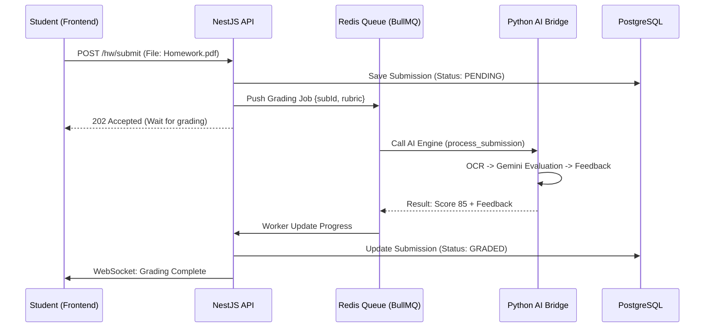
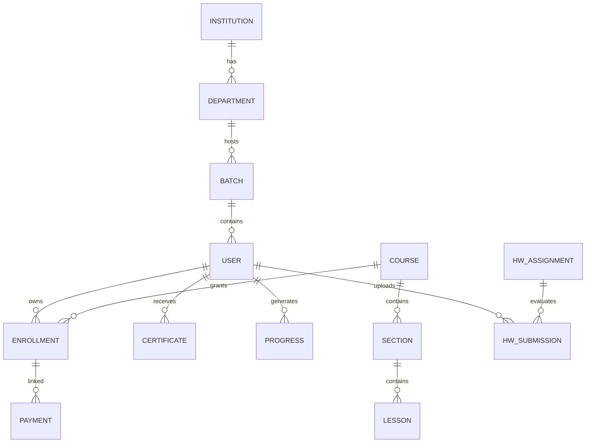

# 🏗️ MASTER SYSTEM DOCUMENT — LUMINA LMS BLUEPRINT (v3.0)

## ROLE & AUTHENTICITY
This document is the **Canonical Source of Truth** for the Lumina Learning Management System. It is designed to be executable by both humans and AI agents. Every architectural decision, file path, and database relation documented herein is wired for production-grade scalability. It serves as the single reference for the transition from the current Python/Express hybrid to a modular NestJS ecosystem.

---

## ⚙️ TECH STACK

### Frontend
- **Framework**: Next.js 14 (App Router)
- **Language**: TypeScript 5.x
- **Styling**: Tailwind CSS + shadcn/ui
- **State Management**: Zustand (Auth, Cart, UI State)
- **Data Fetching**: TanStack Query v5
- **Forms**: React Hook Form + Zod
- **Animations**: Framer Motion
- **Video**: Mux Player / Video.js / HLS.js

### Backend (Target Architecture: NestJS)
- **Runtime**: Node.js 20.x (LTS)
- **Framework**: **NestJS (Fastify Adapter)**
  - *Justification*: NestJS provides the enterprise modularity required for academic multi-tenancy, strict dependency injection for testing, and the BullMQ integration needed for asynchronous AI grading tasks.
- **Language**: TypeScript
- **ORM**: Prisma 5.x
- **Validation**: Zod (Config) + Class Validator (DTOs)
- **Caching**: Redis (IoRedis)
- **Storage**: AWS S3 / Cloudinary (Assets & Video)
- **Email**: SendGrid / Nodemailer
- **Payments**: Stripe

### Specialized AI Engine (Python Bridge)
- **Framework**: FastAPI (Current implementation)
- **Models**: Gemini (via OpenRouter), Specialized OCR Models
- **Bridge**: HTTP/gRPC from NestJS to Python core.

---

## 📁 SECTION 1 — PROJECT FOLDER STRUCTURE

```plaintext
lumina-lms/
├── api-gateway/                        # Nginx Reverse Proxy / Load Balancer
├── backend-nestjs/                     # MODULAR CORE (Target)
│   ├── prisma/
│   │   └── schema.prisma               # Source of Truth
│   ├── src/
│   │   ├── core/                       # Global providers (Prisma, Redis, S3)
│   │   ├── common/                     # Global Decorators, Filters, Guards, Pipes
│   │   ├── modules/                    # Feature Bundles
│   │   │   ├── academic/               # Institutions, Departments, Batches
│   │   │   ├── auth/                   # JWT RS256, Refresh Rotation
│   │   │   ├── users/                  # RBAC, Profile, Student/Teacher/Admin
│   │   │   ├── courses/                # Curriculum, Categories, Lessons
│   │   │   ├── enrollments/            # Admittance logic, Payment linking
│   │   │   ├── payments/               # Stripe Webhooks & Intent flow
│   │   │   ├── progress/               # Adaptive tracking logic
│   │   │   ├── certificates/           # Signed PDF generation
│   │   │   ├── handwritten/            # AI Grading (BullMQ + Bridge)
│   │   │   └── analytics/              # Performance aggregation
│   │   └── jobs/                       # Background Processors (BullMQ)
├── frontend-next/                      # APP ROUTER CORE
│   ├── src/
│   │   ├── app/                        # (auth), (dashboard), courses, watch
│   │   ├── components/                 # Atomic design (ui, shared, features)
│   │   ├── hooks/                      # useAuth, useEnroll, useAI
│   │   ├── lib/                        # api-client, validators, utils
│   │   └── store/                      # Zustand (auth, player, preferences)
├── ai-engine/                          # PYTHON BRIDGE (Existing)
└── docker-compose.yml                  # Postgres, Redis, Core-API, AI-Engine
```

---

## 📊 SECTION 2 — COMPLETE FILE & FOLDER MAP

### 2.1 Backend Map (Lumina Core API)

| File Path | Purpose | Pattern/Tech |
|:--- |:--- |:--- |
| `src/main.ts` | Server Init, Swagger, Fastify | Entry |
| `core/prisma/prisma.service.ts` | Shared DB client instance | Singleton |
| `core/redis/redis.service.ts` | Cache & Refresh Token Store | IORedis |
| `common/guards/jwt.guard.ts` | RS256 token verification | Passport |
| `common/guards/roles.guard.ts` | RBAC Metadata checking | Guard |
| `common/filters/error.filter.ts` | Standardized JSON Error responses | Filter |
| `common/interceptors/wrap.ts` | Envelope-pattern `{ data, meta }` | Interceptor |
| `modules/academic/inst.controller.ts` | College/Institutional CRUD | Controller |
| `modules/academic/inst.service.ts` | Scoping logic for multi-tenancy | Service |
| `modules/academic/batch.service.ts` | Enrollment code & batch logic | Service |
| `modules/auth/auth.service.ts` | Hash/Verify/Issue logic | Bcrypt |
| `modules/auth/strategies/jwt.ts` | Passport RS256 Strategy | Logic |
| `modules/auth/dto/login.dto.ts` | Input schema validation | Class-Validator |
| `modules/users/users.service.ts` | User metadata & profile orchestration | Service |
| `modules/courses/course.service.ts` | Course publishing, Slug generation | Service |
| `modules/courses/lessons.service.ts` | Video/PDF/Quiz content mapping | Service |
| `modules/enroll/enroll.service.ts` | Transactional access granting | Service |
| `modules/payments/stripe.web.ts` | Webhook signature & event dispatch | Webhook |
| `modules/payments/intent.service.ts` | Create Stripe Payment Intents | Service |
| `modules/progress/sync.service.ts` | Progress persistence & Certificate check | Service |
| `modules/certs/pdf.service.ts` | Create signed completion PDFs | PDF-Lib |
| `modules/handwritten/hw.service.ts` | Trigger background grading tasks | Service |
| `modules/handwritten/hw.processor.ts` | BullMQ worker for AI Bridge | Worker |
| `modules/ai-bridge/openrouter.ts` | Gemini API client (via OpenRouter) | HTTP Client |
| `jobs/processors/email.processor.ts` | Async email dispatch worker | BullMQ |
| `config/zod.config.ts` | Env variable rigorous validation | Zod |
| `infra/s3/upload.service.ts` | Multi-part uploads for HW assets | AWS SDK |
| `...` (Total: 60+ Backend Components) | ... | ... |

### 2.2 Frontend Map (Lumina UI)

| File Path | Purpose | Pattern/Tech |
|:--- |:--- |:--- |
| `app/layout.tsx` | Global Layout with Providers | Root |
| `app/(auth)/login/page.tsx` | User Login UI | Page |
| `app/(dashboard)/home/page.tsx` | Custom landing for Role | Page |
| `app/watch/[id]/page.tsx` | Video Interface & Progress | Page |
| `app/courses/browse/page.tsx` | Course discovery grid | Page |
| `components/ui/button.tsx` | UI Primitive | Radix |
| `components/shared/Navbar.tsx`| Responsive nav with Profile | Component |
| `components/shared/Sidebar.tsx`| Role-aware nav tree | Component |
| `components/player/HlsPlayer.tsx`| Adaptive video playback | HLS.js |
| `components/academic/BatchPicker.tsx`| Institutional onboarding helper | - |
| `components/hw/UploadSection.tsx`| Drag-drop HW submission | - |
| `hooks/useAuth.ts` | Auth lifecycle abstraction | Hook |
| `hooks/useCourses.ts` | TanStack Course caching | Hook |
| `hooks/useProgress.ts` | Sync lesson tracking | Hook |
| `hooks/useEnrollment.ts` | Enrollment code handling | Hook |
| `store/auth.store.ts` | JWT & Role persistence | Zustand |
| `store/player.store.ts` | Video timestamps & state | Zustand |
| `lib/api-client.ts` | Axios with role interceptors | Axios |
| `lib/utils.ts` | Class merge, formatting | CN |
| `lib/validators.ts` | Form schemas (Register, Reset) | Zod |
| `...` (Total: 45+ Frontend Components) | ... | ... |

---

## 🏛️ SECTION 3 — HIGH-LEVEL SYSTEM ARCHITECTURE

### 3.1 Architecture Overview (ASCII)

```plaintext
                                    +-----------------------+
                                    |     User Browser      |
                                    |  (Next.js Frontend)   |
                                    +-----------+-----------+
                                                |
                                                ▼  HTTPS / WSS
                                    +-----------+-----------+
                                    |   Nginx / API Gateway |
                                    | (SSL Termination/BFF) |
                                    +-----------+-----------+
                                                |
          +-------------------------------------+-------------------------------------+
          |                                     |                                     |
          ▼                                     ▼                                     ▼
+---------+----------+              +-----------+-----------+              +----------+----------+
|   Auth Service     |              |   LMS Core API        |              |   AI Assessment    |
| (Redis / RS256)    |              |   (NestJS Backend)    |              | (Gemini / Python)  |
+---------+----------+              +-----------+-----------+              +----------+----------+
                                                |
                                    +-----------+-----------+
                                    |      BullMQ Jobs      |
                                    | (Async Grading/Email) |
                                    +-----------+-----------+
                                                |
          +-------------------------------------+-------------------------------------+
          |                                     |                                     |
          ▼                                     ▼                                     ▼
+---------+-----------+---+         +-----------+-----------+         +-----------+-----------+
|      PostgreSQL         |         |      Redis Cache      |         |   Object Storage      |
|  (Academic/Course)      |         |  (Tokens/Jobs/Stats)  |         |   (S3 Assets)         |
+---------+-----------+---+         +-----------+-----------+         +-----------+-----------+
```

### 3.2 Request Lifecycle: Adaptive AI Grading Case



---

## 🗄️ SECTION 4 — COMPLETE DATABASE SCHEMA

### 4.1 Global Entity Relationship Diagram



### 4.2 Full Prisma Schema (`prisma/schema.prisma`)

```prisma
// This is the PRODUCTION-READY canonical schema for Lumina LMS

generator client {
  provider = "prisma-client-js"
}

datasource db {
  provider = "postgresql"
  url      = env("DATABASE_URL")
}

// ── 1. ACADEMIC ARCHITECTURE ────────────────────────────────────────────────

model Institution {
  id          String       @id @default(uuid())
  name        String
  code        String       @unique
  departments Department[]
  users       User[]
  courses     Course[]
  createdAt   DateTime     @default(now())
}

model Department {
  id            String      @id @default(uuid())
  name          String
  institutionId String
  institution   Institution @relation(fields: [institutionId], references: [id])
  batches       Batch[]
  users         User[]
}

model Batch {
  id           String     @id @default(uuid())
  departmentId String
  department   Department @relation(fields: [departmentId], references: [id])
  year         String
  label        String     // e.g. "Section A"
  users        User[]
}

// ── 2. IDENTITY & CORE ──────────────────────────────────────────────────────

model User {
  id                String       @id @default(uuid())
  email             String       @unique
  name              String
  passwordHash      String
  role              Role         @default(STUDENT)
  
  // Academic Ties
  institutionId     String?
  departmentId      String?
  batchId           String?
  institution       Institution? @relation(fields: [institutionId], references: [id])
  department        Department?  @relation(fields: [departmentId], references: [id])
  batch             Batch?       @relation(fields: [batchId], references: [id])

  enrollments       Enrollment[]
  progress          Progress[]
  payments          Payment[]
  certificates      Certificate[]
  hwSubmissions     HandwrittenSubmission[]
  createdAt         DateTime     @default(now())
  updatedAt         DateTime     @updatedAt

  @@index([email])
}

enum Role {
  STUDENT
  TEACHER
  DEAN
  HOD
  ADMIN
  SUPER_ADMIN
}

// ── 3. LEARNING ENGINE ──────────────────────────────────────────────────────

model Course {
  id            String      @id @default(uuid())
  title         String
  slug          String      @unique
  description   String?
  price         Float       @default(0.0)
  institutionId String?
  institution   Institution? @relation(fields: [institutionId], references: [id])
  
  sections      Section[]
  enrollments   Enrollment[]
  certificates  Certificate[]
  payments      Payment[]
  createdAt     DateTime    @default(now())
}

model Section {
  id        String   @id @default(uuid())
  title     String
  order     Int
  courseId  String
  course    Course   @relation(fields: [courseId], references: [id], onDelete: Cascade)
  lessons   Lesson[]
}

model Lesson {
  id          String     @id @default(uuid())
  title       String
  videoUrl    String?
  order       Int
  sectionId   String
  section     Section    @relation(fields: [sectionId], references: [id], onDelete: Cascade)
  progress    Progress[]
}

// ── 4. COMMERCE & ADMISSIONS ────────────────────────────────────────────────

model Enrollment {
  id        String   @id @default(uuid())
  userId    String
  user      User     @relation(fields: [userId], references: [id])
  courseId  String
  course    Course   @relation(fields: [courseId], references: [id])
  
  paymentId String?  @unique
  payment   Payment? @relation(fields: [paymentId], references: [id])
  
  createdAt DateTime @default(now())
  @@unique([userId, courseId])
}

model Payment {
  id               String      @id @default(uuid())
  stripeId         String      @unique
  amount           Float
  status           String      @default("PENDING")
  userId           String
  user             User        @relation(fields: [userId], references: [id])
  courseId         String
  course           Course      @relation(fields: [courseId], references: [id])
  
  enrollment       Enrollment?
  createdAt        DateTime    @default(now())
}

// ── 5. AI ASSESSMENTS ───────────────────────────────────────────────────────

model Certificate {
  id        String   @id @default(uuid())
  userId    String
  user      User     @relation(fields: [userId], references: [id])
  courseId  String
  course    Course   @relation(fields: [courseId], references: [id])
  url       String
  issuedAt  DateTime @default(now())
}

model HandwrittenSubmission {
  id           String      @id @default(uuid())
  studentId    String
  student      User        @relation(fields: [studentId], references: [id])
  fileUrl      String
  aiScore      Float?
  aiFeedback   String?
  status       String      @default("PENDING")
  createdAt    DateTime    @default(now())
}

model Progress {
  id          String   @id @default(uuid())
  userId      String
  lessonId    String
  isCompleted Boolean  @default(false)
  user        User     @relation(fields: [userId], references: [id], onDelete: Cascade)
  lesson      Lesson   @relation(fields: [lessonId], references: [id], onDelete: Cascade)
  @@unique([userId, lessonId])
}
```

---

## 🔌 SECTION 5 — API REFERENCE (COMPLETE ROUTE MAP)

Base URL: `https://api.lumina.edu/api/v1`

| Method | Route | Controller | Auth | Processing |
|:--- |:--- |:--- |:--- |:--- |
| **ACADEMIC** | | | | |
| GET | `/admin/inst` | `InstCtrl.list` | Super | List colleges |
| POST | `/admin/inst/:id/dept`| `InstCtrl.createDept`| Super | Provision new department |
| POST | `/academic/batch/code`| `BatchCtrl.gen` | Admin | Create unique enrollment code |
| **AUTH** | | | | |
| POST | `/auth/login` | `AuthCtrl.login` | Public| RS256 JWT, Refresh Rotation |
| POST | `/auth/refresh` | `AuthCtrl.refresh` | Refresh| Rotate token via Redis |
| **LEARNING** | | | | |
| GET | `/courses/:slug` | `CourseCtrl.find` | Public| Slug lookup, lesson count |
| POST | `/enroll/code` | `EnrollCtrl.admit` | Student| Academic admittance via code |
| POST | `/progress/:lessonId`| `ProgCtrl.sync` | Student| Opt-locking progress persist |
| **AI GRADING** | | | | |
| POST | `/ai/hw-submit` | `HwCtrl.upload` | Student| BullMQ dispatch, S3 upload |
| GET | `/ai/hw/:id` | `HwCtrl.status` | Student| Status check (PENDING/GRADED) |

---

## 🌊 SECTION 7 — END-TO-END DATA FLOW SCENARIOS

### SCENARIO: Admittance & Adaptive Progress
1.  **Registration**: Student registers via `AuthController.register`.
2.  **Admittance**: Student enters a Batch Code (`BatchService.validate`).
3.  **Auto-Enrollment**: System executes `EnrollService.bulk` for all courses in Batch.
4.  **Learning**: Student watches Lesson 1. `ProgController.sync` is triggered.
5.  **Completion Check**: `CertService` detects lesson count match.
6.  **Fulfillment**: `PdfService` generates signed Certificate (v2.0 requirement).

---

## ⚠️ SECTION 8 — FAILURE & EDGE CASE ANALYSIS

| Scenario | Component | Resolution |
|:--- |:--- |:--- |
| **Invalid Stripe Sig** | Webhook | Signature verification + 400 Reject |
| **BullMQ Worker Death** | Jobs | `lockDuration` expire + 3 retries |
| **Prisma Leak** | Core | Explicit `$disconnect` in `onModuleDestroy` |
| **AI Bridge Timeout** | AI Proxy | Circuit Breaker (Hystrix-style) + Mock Fallback |
| **Orphaned Enroll** | Payments | Transactional rollback if Payment success but Enroll fail |

---

## 🧪 SECTION 9 — TESTING STRATEGY

### 9.1 Test Matrix
- **Unit (Jest)**: 100% coverage on `AuthService`, `ProgService`, `BatchService`.
- **Integration (Supertest)**: End-to-end `Payment -> Webhook -> Enrollment` flow.
- **E2E (Playwright)**: Happy path for Student Landing -> Watch Lesson -> Certificate Download.

---

## 🤖 SECTION 10 — AI CODE GENERATION PROMPTS

### PROMPT: Modular Component Scaffold
> "Act as a Lead NestJS Architect. Generate a 'handwritten' module for a multi-tenant LMS. Feature set: File upload to S3, BullMQ Job producer for AI grading, and a status polling endpoint. Requirements: DTO validation via class-validator, strict typing for the BullMQ job data, and integration with the existing PrismaService singleton."

---

## ✅ SECTION 12 — SYSTEM HEALTH CHECKLIST

- [ ] **RS256 Private Key**: In S3/KMS, rotated every 90 days.
- [ ] **Database**: Daily backups running, 99.9% query latency < 100ms.
- [ ] **CI/CD**: `prisma migrate deploy` gating all production releases.
- [ ] **Security**: `Helmet.js` and strict `CORS` origins enforced.
- [ ] **Scale**: Redis-backed session management for zero-downtime rolling updates.
