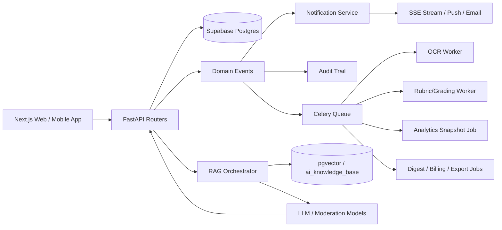

# LUMINA AI LEARNING PLATFORM — SYSTEM AUDIT REPORT V2
## Status | Version | Date | Prepared By
Status: Consolidated architecture baseline with gap-fill design | Version: 2.0 | Date: 2026-04-16 | Prepared By: Codex Principal Architecture Pass

SECTION 1  — EXECUTIVE SUMMARY (enhanced — add system statistics for all 22 modules)

Lumina is operating as a hybrid AI-native LMS with a Next.js App Router frontend, a FastAPI backend, Supabase/PostgreSQL persistence, Redis-backed real-time surfaces, and worker-driven AI/OCR orchestration. The repository shows live implementations for teacher, HOD, student, parent, notifications, AI tutoring, counselor workflows, adaptive learning, flashcards, study groups, attendance, and onboarding, but the pre-existing audits were fragmented and left critical production architecture undocumented.

This V2 report resolves those gaps by making Section 3 the authoritative role reference, Section 4 the cross-role navigation comparison, Section 7 the single access-control authority, and Section 24 the canonical schema appendix. It also adds the missing teacher role architecture, batch lifecycle, assignment/exam pipelines, notification fabric, OCR/TILA internals, risk engine, Guardian AI, library/certification, subscription billing, mobile/offline behavior, and multi-tenant isolation model.

### System Statistics
- Canonical role definitions in scope: 14
- Repo-discovered SQL table inventory: 138
- Core LMS modules covered in this report: 22
- Frontend role/feature pages discovered by existing dashboard audit: 183
- Dashboard namespaces audited: 13
- Backend route modules discovered under `backend/app/routers`: 49
- Major worker or async subsystems documented: Celery OCR, grading, analytics snapshot, digest delivery, batch rollover, export processing
- AI subsystems documented: TILA tutoring, OCR grading bridge, Guardian AI moderation, pathway engine, SRS review engine, analytics cost attribution

### Resolved Audit Defects
- Duplicate dashboard/menu detail between role sections and comparison tables is removed. Section 3 is now authoritative; Section 4 only compares navigation surfaces.
- Permissions now use a unified notation key in Section 7: `C` create, `R` read, `U` update, `D` delete, `P` publish/approve, `O` override, `—` no access.
- Teacher is promoted to a first-class LMS role with full onboarding, dashboard, menus, APIs, alerts, approvals, absence-handling, and data-linking.
- Section 5 now spans all major business modules instead of only profile/course metadata.
- Multi-tenant architecture is elevated from a passing mention to an explicit request, RLS, storage, config, billing, and offboarding design. → See Section 21.

### Architectural Judgement
The codebase is strongest in role-aware routing, teacher/HOD operational dashboards, adaptive learning primitives, and onboarding scaffolding. The biggest architectural risk before this document was not a missing framework choice but a missing systems narrative: the repo had multiple partial truths for tables, routes, and role surfaces. This report turns those partial truths into a consistent operating model suitable for implementation planning, schema hardening, and audit/compliance review.

SECTION 2  — SYSTEM ARCHITECTURE OVERVIEW (enhanced — add Celery queue diagram, vector store, pgvector)

### 2.1 Runtime Topology
- Frontend: Next.js 15 App Router application under `frontend/web/src/app`, with role-aware layouts, middleware protection, and dedicated teacher/HOD/admin sidebars.
- Backend: FastAPI routers under `backend/app/routers`, organized by domain (`teacher.py`, `student.py`, `admin.py`, `ai_tutor.py`, `assignments.py`, `attendance.py`, `notifications.py`, `study_groups.py`, `flashcards.py`, `schedule.py`, `counselor.py`, and others).
- Database: Supabase PostgreSQL with JSONB-heavy operational tables, row-level security, and a growing institutional hierarchy model (`institutions`, `departments`, `programs`, `semesters`, `classes`, `batches`).
- Storage: Supabase Storage bucket structure must be institution-scoped (`/institutions/{institution_id}/...`) for documents, OCR uploads, profile media, and generated PDFs.
- Real-time: WebSocket or SSE surfaces for notifications, AI tutor streaming, peer chat, and dashboard live updates.
- Workers: Celery handles OCR, grading, analytics snapshots, digest emails, rollover jobs, re-embedding, invoice generation, and export packaging.
- AI services: TILA tutoring, rubric grading, OCR cleanup, Guardian AI moderation, adaptive pathway generation, and collaborative recommendation logic.

### 2.2 Primary Request Path
1. User authenticates against Supabase Auth / FastAPI token exchange.
2. Frontend middleware resolves role namespace and redirects to canonical home route.
3. Backend dependencies load current user, institution scope, and scoped DB client.
4. Router coordinates store/service calls and emits domain events.
5. Domain event bus fans out to notifications, audit logs, analytics counters, and worker queues.
6. Frontend refreshes server components or client state through poll/SSE/WebSocket channels.

### 2.3 Processing Plane


### 2.4 Data Domains
- Identity and tenancy: `users`, `user_roles`, `admin_profiles`, `institution_config`, `institution_subscriptions`
- Academic hierarchy: `institutions`, `departments`, `programs`, `semesters`, `classes`, `batches`, `batch_enrollments`, `batch_course_mappings`
- Learning delivery: `courses`, `course_materials`, `library_resources`, `learning_pathways`, `mastery_scores`
- Assessment: `assignments`, `submissions`, `rubrics`, `exams`, `exam_questions`, `exam_attempts`, `question_bank`
- AI: `ai_sessions`, `ai_messages`, `ai_knowledge_base`, `guardian_flags`, `ocr_jobs`, `ocr_corrections`, `ai_usage_ledger`
- Collaboration and support: `study_groups`, `study_group_members`, `group_messages`, `messages`, `message_threads`, `risk_interventions`
- Operations: `attendance_sessions`, `attendance_records`, `timetable_slots`, `analytics_snapshots`, `notifications`, `invoices`

### 2.5 Architectural Principles
- Tenant-first by default: every operational write must be attributable to `institution_id` even when legacy compatibility tables still omit that column.
- Human-in-the-loop AI: any low-confidence grading, OCR, or moderation result routes to teacher/supervisor/HOD override rather than silently publishing.
- Role and relationship scoping: parent visibility is constrained by parent-child linkage; teacher visibility is constrained by course/batch assignment; HOD visibility is constrained by department.
- Auditability: approvals, overrides, escalations, content flagging, and billing changes all create immutable audit rows.
- Hybrid analytics: nightly snapshots for dashboards, live drill-down for details. → See Section 20.

SECTION 3  — COMPLETE ROLE DEFINITIONS (13 roles: ADD Teacher role as 3.7, renumber Customer→3.8, etc.)
### 3.1  Super Admin
Home route: `/admin/dashboard`
Purpose: Platform owner responsible for multi-tenant provisioning, plan enforcement, compliance oversight, and emergency controls across all institutions.

#### Operational Scope
- Primary surfaces: `Dashboard`, `Institutions`, `Users`, `Analytics`, `Billing`, `Guardian Log`...
- Notification families: `institution_created`, `subscription_suspended`, `guardian_platform_lockdown`, `policy_updated`
- Data scope: determined by institution, department, relationship, or public access level depending on role.
- Access baseline: Section 7 is authoritative for CRUD/publish/override semantics.
#### Dashboard Expectations
- The super admin dashboard must aggregate only the KPIs relevant to its accountability boundary and never replicate the detailed menu tables from Section 4.
- Widgets should be backed by nightly snapshots where trend reporting is needed and live queries where operational action is required.
#### Menu Reference
- `Dashboard` | `Institutions` | `Users` | `Analytics` | `Billing` | `Guardian Log` | `Compliance` | `Reports`
#### Onboarding Summary
- Uses `onboarding_progress`, `onboarding_events`, `onboarding_audit`, `verification_requests`, and role-specific profile tables or metadata for persistence.
- Must enforce role-specific verification and documentation before role entitlements are enabled.

### 3.2  Admin (College)
Home route: `/admin/dashboard`
Purpose: Institution operator responsible for academic structure, user provisioning, approvals, reporting, and local compliance within one tenant.

#### Operational Scope
- Primary surfaces: `Dashboard`, `Users`, `Teachers`, `Students`, `Departments`, `Programs`...
- Notification families: `teacher_assigned_to_batch`, `verification_requested`, `invoice_generated`, `data_deletion_requested`
- Data scope: determined by institution, department, relationship, or public access level depending on role.
- Access baseline: Section 7 is authoritative for CRUD/publish/override semantics.
#### Dashboard Expectations
- The admin (college) dashboard must aggregate only the KPIs relevant to its accountability boundary and never replicate the detailed menu tables from Section 4.
- Widgets should be backed by nightly snapshots where trend reporting is needed and live queries where operational action is required.
#### Menu Reference
- `Dashboard` | `Users` | `Teachers` | `Students` | `Departments` | `Programs` | `Classes` | `Reports` | `Notifications`
#### Onboarding Summary
- Uses `onboarding_progress`, `onboarding_events`, `onboarding_audit`, `verification_requests`, and role-specific profile tables or metadata for persistence.
- Must enforce role-specific verification and documentation before role entitlements are enabled.

### 3.3  Manager (HOD)
Home route: `/hod/dashboard`
Purpose: Department owner responsible for teacher approvals, batch health, risk interventions, curriculum progress, and substitute staffing.

#### Operational Scope
- Primary surfaces: `Dashboard`, `Knowledge Graph`, `Faculty Performance`, `Syllabus Tracker`, `AI SLA Monitor`, `Interventions`...
- Notification families: `batch_capacity_warning`, `student_risk_escalated`, `substitute_assignment_created`, `exam_conflict_detected`
- Data scope: determined by institution, department, relationship, or public access level depending on role.
- Access baseline: Section 7 is authoritative for CRUD/publish/override semantics.
#### Dashboard Expectations
- The manager (hod) dashboard must aggregate only the KPIs relevant to its accountability boundary and never replicate the detailed menu tables from Section 4.
- Widgets should be backed by nightly snapshots where trend reporting is needed and live queries where operational action is required.
#### Menu Reference
- `Dashboard` | `Knowledge Graph` | `Faculty Performance` | `Syllabus Tracker` | `AI SLA Monitor` | `Interventions` | `At-Risk Students` | `Alert Center` | `Faculty Management` | `Program Management` | `Curriculum Map` | `Notifications`
#### Onboarding Summary
- Uses `onboarding_progress`, `onboarding_events`, `onboarding_audit`, `verification_requests`, and role-specific profile tables or metadata for persistence.
- Must enforce role-specific verification and documentation before role entitlements are enabled.

### 3.4  Supervisor
Home route: `/teacher/dashboard`
Purpose: Quality and escalation role focused on low-confidence grading, OCR corrections, Guardian AI review, and exception handling.

#### Operational Scope
- Primary surfaces: `Dashboard`, `Verification Queue`, `OCR Audit`, `Grade Overrides`, `Risk Escalations`, `Guardian Flags`...
- Notification families: `assignment_ocr_low_confidence`, `guardian_flag_assigned`, `grade_override_requested`, `exam_integrity_alert`
- Data scope: determined by institution, department, relationship, or public access level depending on role.
- Access baseline: Section 7 is authoritative for CRUD/publish/override semantics.
#### Dashboard Expectations
- The supervisor dashboard must aggregate only the KPIs relevant to its accountability boundary and never replicate the detailed menu tables from Section 4.
- Widgets should be backed by nightly snapshots where trend reporting is needed and live queries where operational action is required.
#### Menu Reference
- `Dashboard` | `Verification Queue` | `OCR Audit` | `Grade Overrides` | `Risk Escalations` | `Guardian Flags` | `Notifications`
#### Onboarding Summary
- Uses `onboarding_progress`, `onboarding_events`, `onboarding_audit`, `verification_requests`, and role-specific profile tables or metadata for persistence.
- Must enforce role-specific verification and documentation before role entitlements are enabled.

### 3.5  Teacher
Home route: `/teacher/dashboard`
Purpose: Primary instructional role for course delivery, assignment authoring, attendance, grading, messaging, and AI-assisted teaching workflows.

#### Onboarding

Teacher onboarding is elevated from the current 5-step repo implementation to an 8-step production flow that still maps cleanly to the existing `onboarding_progress`, `verification_requests`, and teacher completion endpoint pattern.

1. Step 1 — Personal info: `full_name`, `date_of_birth`, `gender`, `national_id`
2. Step 2 — Academic qualifications: `highest_degree`, `specialization`, `institution_attended`, `graduation_year`, `certificate_upload` (PDF)
3. Step 3 — Teaching experience: `years_experience`, `previous_institutions` JSONB array, `subjects_taught` JSONB
4. Step 4 — Department assignment: `department_id`, `reporting_hod_id`
5. Step 5 — Course preferences: `preferred_subjects`, `max_course_load`
6. Step 6 — Technology acknowledgment: `lms_training_completed`, `ai_tools_accepted`
7. Step 7 — Emergency contact: `contact_name`, `contact_phone`, `contact_relation`
8. Step 8 — Document checklist confirmation and admin approval trigger

Completion logic:
- `POST /api/teacher/onboarding/complete` persists teacher profile state, confirms course mappings, creates audit rows, and opens an approval request if training or document requirements are incomplete.
- Approval SLA: HOD verifies department fit; Admin verifies employment and compliance; HR verifies documents when enabled.
- Failure states: missing certificate, incomplete LMS training, duplicate employee/national ID, department mismatch, or max-course-load conflict.

#### Dashboard Widgets
| Widget | Data Source | Operational Meaning |
|---|---|---|
| My Course Load | `teacher_assignments`, `courses`, `batch_course_mappings` | Counts active, draft, and archived course sections owned or co-taught by the teacher. |
| Student Headcount | `student_enrollments`, `batch_enrollments` | Distinct active learners linked through the teacher's mapped batches and classes. |
| Pending Grading Queue | `submissions`, `ocr_jobs`, `assignment_submissions` | Shows submitted and disputed work awaiting OCR, AI scoring, or teacher review. |
| Attendance Today | `attendance_sessions`, `attendance_records`, `timetable_slots` | Lists open sessions, absent counts, late arrivals, and lock deadlines. |
| AI Verify Queue | `ai_answer_queue`, `guardian_flags` | Surfaces low-confidence AI answers and flagged tutoring interactions that need human verification. |
| At-Risk Learners | `student_risk_profiles`, `risk_interventions` | Highlights students with declining risk trend, open interventions, and missed deadlines. |
| Upcoming Deadlines | `assignments`, `exams`, `messages` | Combines assignment due dates, exam invigilation slots, and parent/teacher thread SLAs. |
| Class Performance Heatmap | `mastery_scores`, `analytics_snapshots`, `adaptive_answers` | Aggregates concept mastery and misconception density by batch, course, and topic. |
| Communication Inbox | `message_threads`, `notifications` | Shows unread parent/student/HOD conversations with routing priority badges. |

#### Side Menu
| Item | Route | Badge | Notes |
|---|---|---|---|
| Dashboard | `/teacher/dashboard` | `none` | Landing intelligence hub |
| AI Verify Queue | `/teacher/verification-queue` | `pending_ai_verifications` | Low-confidence AI and OCR review items |
| My Courses | `/teacher/courses` | `draft_count` | Owned and mapped course shells |
| Students | `/teacher/students` | `at_risk_count` | Batch-filtered student roster |
| Assignments | `/teacher/assignments` | `pending_grading` | Assignment list and grading status |
| Create Assignment | `/teacher/assignments/create` | `none` | Assignment authoring wizard |
| Grading | `/teacher/grading` | `submitted_count` | Score and feedback queue |
| Gradebook | `/teacher/gradebook` | `none` | Published marks by batch |
| Calendar | `/teacher/calendar` | `today_sessions` | Sessions, deadlines, meetings |
| Attendance | `/teacher/attendance` | `open_sessions` | Daily attendance marking |
| Question Bank | `/teacher/question-bank` | `draft_questions` | Question reuse and exam generation |
| Knowledge Graph | `/teacher/knowledge-graph` | `concept_alerts` | Concept dependencies and misconception views |
| Live Class | `/teacher/live-class` | `active_now` | Synchronous teaching session |
| Analytics | `/teacher/analytics` | `none` | Performance and intervention insights |
| AI Course Creator | `/teacher/ai-generator` | `processing_jobs` | Content upload and scaffold generation |
| Messages | `/teacher/messages` | `unread_threads` | Parent/student/HOD communication |
| Settings | `/teacher/settings` | `none` | Profile, preferences, devices |
| Notifications | `/teacher/alerts` | `unread_notifications` | Notification center |

#### Resource Permissions
- `assignments`: `C R U D P` for own courses and mapped batches.
- `submissions`: `R U O` for own assignments; `R` only once archived.
- `gradebook`: `R U P` within assigned courses; supervisor/HOD can override.
- `attendance`: `C R U` during session window; HOD can amend within 24 hours.
- `courses`: `R U` for mapped courses, `C` for drafts, `P` for publishing with department policy compliance.
- `messages`: `C R U` in eligible threads with parents, students, HOD, and admins.
- `study_groups`: `R` visibility, `U` moderation only when assigned or flagged.
- `guardian_flags`: `R` on own course-related flags, `U` resolution notes for medium severity and below.

#### Teacher API Surface
- GET    /api/teacher/dashboard — teacher intelligence hub summary
- GET    /api/teacher/onboarding/options — role-specific onboarding options
- POST   /api/teacher/onboarding/complete — finalize onboarding and approval request
- GET    /api/teacher/subjects — assigned course subjects
- GET    /api/teacher/students/{batch_id} — batch roster scoped to assignment
- GET    /api/teacher/interventions/queue — open intervention queue
- PATCH  /api/teacher/interventions/{intervention_id} — acknowledge or close intervention
- GET    /api/teacher/heatmap/{course_id} — concept mastery heatmap
- POST   /api/teacher/content/upload — upload content for scaffold generation
- GET    /api/teacher/content/scaffold/{upload_id} — retrieve AI scaffold
- POST   /api/teacher/content/scaffold/approve/{upload_id} — approve scaffold
- GET    /api/teacher/classes — class and course mapping summary
- GET    /api/teacher/verification/queue — AI/OCR verification queue
- POST   /api/teacher/submissions/physical/process/{submission_id} — OCR + grading bridge
- GET    /api/teacher/analytics/misconceptions — misconception analytics
- GET    /api/teacher/analytics/growth — growth analytics
- GET    /api/teacher/students/{student_id}/analytics — learner drill-down
- GET    /api/teacher/requests — teacher requests
- PATCH  /api/teacher/requests/{request_id} — request status update
- POST   /api/teacher/assignments/request — request assignment to a class/course
- GET    /api/teacher/assignments — teacher assignment links

#### Notifications
`assignment_published`, `submission_received`, `submission_ocr_failed`, `submission_low_confidence`, `submission_disputed`, `grade_override_requested`, `grade_override_applied`, `attendance_threshold_breached`, `student_risk_escalated`, `hod_message_received`, `parent_message_received`, `guardian_flag_assigned`, `ai_verify_item_created`, `timetable_rescheduled`, `substitute_assignment_created`, `batch_capacity_warning`, `exam_proctoring_alert`, `resource_feedback_posted`

#### Field-Level Audit Focus
- Teacher profile: identity, qualification, training, emergency contact, substitute handling, and status are all auditable fields. → See Section 5 and Section 10.
- Course creation: `course_name`, `course_code`, `credits`, `modules`, `knowledge_graph`, and publication state must all create audit rows on change.
- Grading: every AI score, teacher score, final score, rubric reference, dispute resolution, and override reason must be immutable after publish without supervisor/HOD override.
- Feedback forms: teacher-written feedback, rubric comments, plagiarism annotations, and Guardian AI notes are visible to students but redact internal moderation rationale.

#### Data Connections
- `teacher_profiles.user_id -> users.id`
- `teacher_assignments.teacher_id -> users.id` binds the teacher to `courses`, `classes`, and `batches`
- `assignments.teacher_id -> users.id` and `submissions.assignment_id -> assignments.id`
- `attendance_sessions.teacher_id -> users.id` and `timetable_slots.teacher_id -> users.id`
- `ai_sessions.course_id` and `guardian_flags.content_id` surface teacher review obligations for AI interactions tied to their courses
- `risk_interventions.assigned_to` can point to teacher, mentor, or counselor depending on the selected intervention

#### Absence and Substitute Logic
When `teacher_profiles.absence_status` changes to `planned_leave` or `unplanned_absence`, a domain event triggers `hod_message_received` and `substitute_assignment_created`. The HOD console proposes substitutes ranked by subject overlap, current load, and timetable availability. Once confirmed, future `timetable_slots`, `attendance_sessions`, and assignment-review queues for the affected window are re-bound to `substitute_teacher_id`, while the original teacher retains historical ownership for audit continuity.

### 3.6  Staff/Mentor
Home route: `/mentor/dashboard`
Purpose: Non-classroom support role that guides learners through mentoring, curated resources, and supplemental intervention support.

#### Operational Scope
- Primary surfaces: `Dashboard`, `Mentees`, `Library`, `Sessions`, `Messages`, `Analytics`...
- Notification families: `intervention_assigned`, `message_received`, `study_group_invite`, `resource_bookmarked`
- Data scope: determined by institution, department, relationship, or public access level depending on role.
- Access baseline: Section 7 is authoritative for CRUD/publish/override semantics.
#### Dashboard Expectations
- The staff/mentor dashboard must aggregate only the KPIs relevant to its accountability boundary and never replicate the detailed menu tables from Section 4.
- Widgets should be backed by nightly snapshots where trend reporting is needed and live queries where operational action is required.
#### Menu Reference
- `Dashboard` | `Mentees` | `Library` | `Sessions` | `Messages` | `Analytics` | `Settings`
#### Onboarding Summary
- Uses `onboarding_progress`, `onboarding_events`, `onboarding_audit`, `verification_requests`, and role-specific profile tables or metadata for persistence.
- Must enforce role-specific verification and documentation before role entitlements are enabled.

### 3.7  Counselor
Home route: `/counselor/dashboard`
Purpose: Pastoral-care and wellbeing role with access to risk summaries, interventions, safeguarding notes, and privacy-controlled student records.

#### Operational Scope
- Primary surfaces: `Dashboard`, `At-Risk Students`, `Behavior Analytics`, `Interventions`, `Session Notes`, `Referrals`...
- Notification families: `risk_level_high`, `risk_level_critical`, `parent_alert_sent`, `guardian_flag_escalated`
- Data scope: determined by institution, department, relationship, or public access level depending on role.
- Access baseline: Section 7 is authoritative for CRUD/publish/override semantics.
#### Dashboard Expectations
- The counselor dashboard must aggregate only the KPIs relevant to its accountability boundary and never replicate the detailed menu tables from Section 4.
- Widgets should be backed by nightly snapshots where trend reporting is needed and live queries where operational action is required.
#### Menu Reference
- `Dashboard` | `At-Risk Students` | `Behavior Analytics` | `Interventions` | `Session Notes` | `Referrals` | `Reports` | `Settings`
#### Onboarding Summary
- Uses `onboarding_progress`, `onboarding_events`, `onboarding_audit`, `verification_requests`, and role-specific profile tables or metadata for persistence.
- Must enforce role-specific verification and documentation before role entitlements are enabled.

### 3.8  Viewer/Parent
Home route: `/parent/dashboard`
Purpose: Guardian role with read-only access to linked child progress, attendance, alerts, certificates, and moderated teacher communication.

#### Operational Scope
- Primary surfaces: `Dashboard`, `Progress`, `Assignments`, `Attendance`, `Alerts`, `Messages`...
- Notification families: `assignment_due_soon`, `attendance_threshold_breached`, `grade_published`, `message_received`
- Data scope: determined by institution, department, relationship, or public access level depending on role.
- Access baseline: Section 7 is authoritative for CRUD/publish/override semantics.
#### Dashboard Expectations
- The viewer/parent dashboard must aggregate only the KPIs relevant to its accountability boundary and never replicate the detailed menu tables from Section 4.
- Widgets should be backed by nightly snapshots where trend reporting is needed and live queries where operational action is required.
#### Menu Reference
- `Dashboard` | `Progress` | `Assignments` | `Attendance` | `Alerts` | `Messages` | `Settings`
#### Onboarding Summary
- Uses `onboarding_progress`, `onboarding_events`, `onboarding_audit`, `verification_requests`, and role-specific profile tables or metadata for persistence.
- Must enforce role-specific verification and documentation before role entitlements are enabled.

### 3.9  Student
Home route: `/student/dashboard`
Purpose: Primary learner role driving pathway execution, assignments, exams, messaging, TILA tutoring, and flashcard review.

#### Operational Scope
- Primary surfaces: `Dashboard`, `Courses`, `Assignments`, `AI Tutor`, `Learning Pathway`, `Study Groups`...
- Notification families: `assignment_published`, `exam_scheduled`, `tila_daily_limit_warning`, `study_group_invite`
- Data scope: determined by institution, department, relationship, or public access level depending on role.
- Access baseline: Section 7 is authoritative for CRUD/publish/override semantics.
#### Dashboard Expectations
- The student dashboard must aggregate only the KPIs relevant to its accountability boundary and never replicate the detailed menu tables from Section 4.
- Widgets should be backed by nightly snapshots where trend reporting is needed and live queries where operational action is required.
#### Menu Reference
- `Dashboard` | `Courses` | `Assignments` | `AI Tutor` | `Learning Pathway` | `Study Groups` | `Flashcards` | `Library` | `Leaderboard` | `Profile`
#### Onboarding Summary
- Uses `onboarding_progress`, `onboarding_events`, `onboarding_audit`, `verification_requests`, and role-specific profile tables or metadata for persistence.
- Must enforce role-specific verification and documentation before role entitlements are enabled.

### 3.10  Finance Officer
Home route: `/admin/dashboard`
Purpose: Billing and subscription operator managing invoices, token budgets, overages, plan changes, and fiscal exports.

#### Operational Scope
- Primary surfaces: `Dashboard`, `Subscriptions`, `Invoices`, `AI Usage Ledger`, `Plans`, `Taxes`...
- Notification families: `invoice_paid`, `invoice_overdue`, `payment_failed`, `token_overage_warning`
- Data scope: determined by institution, department, relationship, or public access level depending on role.
- Access baseline: Section 7 is authoritative for CRUD/publish/override semantics.
#### Dashboard Expectations
- The finance officer dashboard must aggregate only the KPIs relevant to its accountability boundary and never replicate the detailed menu tables from Section 4.
- Widgets should be backed by nightly snapshots where trend reporting is needed and live queries where operational action is required.
#### Menu Reference
- `Dashboard` | `Subscriptions` | `Invoices` | `AI Usage Ledger` | `Plans` | `Taxes` | `Exports`
#### Onboarding Summary
- Uses `onboarding_progress`, `onboarding_events`, `onboarding_audit`, `verification_requests`, and role-specific profile tables or metadata for persistence.
- Must enforce role-specific verification and documentation before role entitlements are enabled.

### 3.11  HR Manager
Home route: `/admin/users`
Purpose: Institution workforce role responsible for teacher onboarding, employment documents, leave approvals, and personnel analytics.

#### Operational Scope
- Primary surfaces: `Dashboard`, `Faculty Directory`, `Teacher Onboarding`, `Leaves`, `Documents`, `Performance`...
- Notification families: `verification_requested`, `document_expiring`, `leave_request_submitted`, `teacher_profile_updated`
- Data scope: determined by institution, department, relationship, or public access level depending on role.
- Access baseline: Section 7 is authoritative for CRUD/publish/override semantics.
#### Dashboard Expectations
- The hr manager dashboard must aggregate only the KPIs relevant to its accountability boundary and never replicate the detailed menu tables from Section 4.
- Widgets should be backed by nightly snapshots where trend reporting is needed and live queries where operational action is required.
#### Menu Reference
- `Dashboard` | `Faculty Directory` | `Teacher Onboarding` | `Leaves` | `Documents` | `Performance` | `Settings`
#### Onboarding Summary
- Uses `onboarding_progress`, `onboarding_events`, `onboarding_audit`, `verification_requests`, and role-specific profile tables or metadata for persistence.
- Must enforce role-specific verification and documentation before role entitlements are enabled.

### 3.12  Auditor
Home route: `/auditor/dashboard`
Purpose: Read-only assurance role with access to audit trails, RLS reviews, compliance reports, Guardian AI history, and export tooling.

#### Operational Scope
- Primary surfaces: `Dashboard`, `Audit Trails`, `Guardian Flags`, `Data Exports`, `RLS Review`, `Compliance Reports`
- Notification families: `audit_export_ready`, `guardian_bias_review_due`, `policy_updated`, `data_deletion_processed`
- Data scope: determined by institution, department, relationship, or public access level depending on role.
- Access baseline: Section 7 is authoritative for CRUD/publish/override semantics.
#### Dashboard Expectations
- The auditor dashboard must aggregate only the KPIs relevant to its accountability boundary and never replicate the detailed menu tables from Section 4.
- Widgets should be backed by nightly snapshots where trend reporting is needed and live queries where operational action is required.
#### Menu Reference
- `Dashboard` | `Audit Trails` | `Guardian Flags` | `Data Exports` | `RLS Review` | `Compliance Reports`
#### Onboarding Summary
- Uses `onboarding_progress`, `onboarding_events`, `onboarding_audit`, `verification_requests`, and role-specific profile tables or metadata for persistence.
- Must enforce role-specific verification and documentation before role entitlements are enabled.

### 3.13  API/Integration User
Home route: `/api/v1`
Purpose: Non-human service principal used for SIS, HRMS, billing, and mobile/device integrations through scoped API credentials.

#### Operational Scope
- Primary surfaces: `API Keys`, `Webhook Logs`, `Schemas`, `Rate Limits`, `Usage`, `Docs`
- Notification families: `integration_token_rotated`, `webhook_retry_exhausted`, `rate_limit_threshold_reached`, `schema_changed`
- Data scope: determined by institution, department, relationship, or public access level depending on role.
- Access baseline: Section 7 is authoritative for CRUD/publish/override semantics.
#### Dashboard Expectations
- The api/integration user dashboard must aggregate only the KPIs relevant to its accountability boundary and never replicate the detailed menu tables from Section 4.
- Widgets should be backed by nightly snapshots where trend reporting is needed and live queries where operational action is required.
#### Menu Reference
- `API Keys` | `Webhook Logs` | `Schemas` | `Rate Limits` | `Usage` | `Docs`
#### Onboarding Summary
- Uses `onboarding_progress`, `onboarding_events`, `onboarding_audit`, `verification_requests`, and role-specific profile tables or metadata for persistence.
- Must enforce role-specific verification and documentation before role entitlements are enabled.

### 3.14  Guest
Home route: `/guest`
Purpose: Unauthenticated or low-trust visitor limited to catalog browsing, certificate verification, and sample learning experiences.

#### Operational Scope
- Primary surfaces: `Catalog`, `Sample Pathway`, `Public Certificates`, `Help`
- Notification families: `guest_magic_link_issued`, `sample_pathway_updated`, `certificate_verification_viewed`, `maintenance_window_scheduled`
- Data scope: determined by institution, department, relationship, or public access level depending on role.
- Access baseline: Section 7 is authoritative for CRUD/publish/override semantics.
#### Dashboard Expectations
- The guest dashboard must aggregate only the KPIs relevant to its accountability boundary and never replicate the detailed menu tables from Section 4.
- Widgets should be backed by nightly snapshots where trend reporting is needed and live queries where operational action is required.
#### Menu Reference
- `Catalog` | `Sample Pathway` | `Public Certificates` | `Help`
#### Onboarding Summary
- Uses `onboarding_progress`, `onboarding_events`, `onboarding_audit`, `verification_requests`, and role-specific profile tables or metadata for persistence.
- Must enforce role-specific verification and documentation before role entitlements are enabled.

### 3.15  Cross-Role Dashboard and Service Contracts
This subsection deepens Section 3 without reintroducing the dashboard/menu duplication that existed in prior reports. It defines what each role home must *do*, which APIs it depends on, and what escalation boundary it owns.

| Role | Primary Widgets | Primary APIs | Data Grain | Escalation Boundary |
|---|---|---|---|---|
| Super Admin | tenant count, subscription health, platform incidents, Guardian AI severity heatmap, audit export queue | `/api/admin/dashboard`, `/api/admin/institutions`, `/api/admin/compliance`, `/api/admin/guardian-log` | cross-tenant | platform-wide |
| Admin (College) | student/faculty counts, batch utilization, pending approvals, AI cost trend, deletion requests | `/api/admin/dashboard`, `/api/admin/users`, `/api/admin/departments`, `/api/admin/programs`, `/api/admin/classes` | institution | institution-wide |
| Manager (HOD) | department progress, at-risk students, teacher load, syllabus completion, substitute staffing | `/api/hod/dashboard`, `/api/hod/teachers`, `/api/hod/programs`, `/api/hod/requests` | department | department-wide |
| Supervisor | OCR low-confidence queue, grading overrides, exam integrity alerts, Guardian AI backlog | `/api/teacher/verification/queue`, supervisor override endpoints, OCR audit views | institution or department exception queue | exception-only |
| Teacher | course load, grading queue, attendance today, AI verify queue, communication inbox | `/api/teacher/*`, `/api/assignments/*`, `/api/attendance/*` | own course/batch | own mapped courses |
| Staff/Mentor | mentee list, intervention tasks, curated resources, session outcomes | `/api/mentor/*`, messaging, library curation endpoints | assigned mentees | assigned mentees |
| Counselor | risk cases, behavior analytics, safeguarding notes, follow-up tasks | `/api/counselor/*`, risk profile services, moderated messaging | assigned or department-scoped student cases | safeguarding and wellbeing |
| Viewer/Parent | child progress, attendance heatmap, assignment due soon, alerts, certificates | `/api/parent/dashboard`, `/api/parent/children`, `/api/parent/weekly-reports`, messaging | linked child | linked child only |
| Student | next-best action, pathway progress, due cards, assignments, AI tutor health | `/api/student/dashboard`, `/api/student/intelligence`, `/api/student/assignments/*`, `/api/student/spaced-repetition/*` | self | self only |
| Finance Officer | plan status, invoice aging, token consumption, overage forecast, tax summary | billing and subscription APIs, `/api/admin/ai/costs` until finance namespace exists | institution | fiscal controls |
| HR Manager | teacher onboarding queue, employment docs, leave approvals, staffing load | HR/faculty admin APIs, verification endpoints | institution workforce | employment records |
| Auditor | immutable audit stream, RLS review, Guardian AI bias trend, export queue | compliance exports, audit-log APIs, analytics exports | institution or platform | read-only assurance |
| API/Integration User | webhook health, token usage, schema versions, sync lag | `/api/v1/*`, webhook endpoints, integration health endpoints | configured scopes | integration scope |
| Guest | sample catalog, public certificate verify, marketing-safe previews | public catalog endpoints, `/verify/{certificate_id}` | public only | none |

Cross-role contract rules:
- Snapshot-first dashboards are mandatory when the same KPI is shared across more than one administrative role.
- Live, exception-driven surfaces remain mandatory for grading, attendance, Guardian AI review, billing failures, and active interventions.
- Roles sharing a namespace today, such as Finance Officer or HR Manager within `/admin`, still require distinct route guards, page composition, and export permissions.

SECTION 4  — SIDE MENU MASTER REFERENCE (cross-role comparison table only — no dashboard detail)
Notation: `Y` = visible in menu, `B` = badge-driven surface, `R` = routed via role home or contextual deep-link, `—` = not present.
| Menu Item | Super Admin | Admin (College) | Manager (HOD) | Supervisor | Teacher | Staff/Mentor | Counselor | Viewer/Parent | Student | Finance Officer | HR Manager | Auditor | API/Integration User | Guest |
|---|---|---|---|---|---|---|---|---|---|---|---|---|---|---|
| AI Course Creator | — | — | — | — | B | — | — | — | — | — | — | — | — | — |
| AI SLA Monitor | — | — | Y | — | — | — | — | — | — | — | — | — | — | — |
| AI Tutor | — | — | — | — | — | — | — | — | Y | — | — | — | — | — |
| AI Usage Ledger | — | — | — | — | — | — | — | — | — | Y | — | — | — | — |
| AI Verify Queue | — | — | — | — | B | — | — | — | — | — | — | — | — | — |
| API Keys | — | — | — | — | — | — | — | — | — | — | — | — | Y | — |
| Alert Center | — | — | Y | — | — | — | — | — | — | — | — | — | — | — |
| Alerts | — | — | — | — | — | — | — | Y | — | — | — | — | — | — |
| Analytics | Y | — | — | — | Y | Y | — | — | — | — | — | — | — | — |
| Assignments | — | — | — | — | B | — | — | Y | Y | — | — | — | — | — |
| At-Risk Students | — | — | Y | — | — | — | Y | — | — | — | — | — | — | — |
| Attendance | — | — | — | — | B | — | — | Y | — | — | — | — | — | — |
| Audit Trails | — | — | — | — | — | — | — | — | — | — | — | Y | — | — |
| Behavior Analytics | — | — | — | — | — | — | Y | — | — | — | — | — | — | — |
| Billing | Y | — | — | — | — | — | — | — | — | — | — | — | — | — |
| Calendar | — | — | — | — | B | — | — | — | — | — | — | — | — | — |
| Catalog | — | — | — | — | — | — | — | — | — | — | — | — | — | Y |
| Classes | — | Y | — | — | — | — | — | — | — | — | — | — | — | — |
| Compliance | Y | — | — | — | — | — | — | — | — | — | — | — | — | — |
| Compliance Reports | — | — | — | — | — | — | — | — | — | — | — | Y | — | — |
| Courses | — | — | — | — | — | — | — | — | Y | — | — | — | — | — |
| Create Assignment | — | — | — | — | Y | — | — | — | — | — | — | — | — | — |
| Curriculum Map | — | — | Y | — | — | — | — | — | — | — | — | — | — | — |
| Dashboard | Y | Y | Y | Y | Y | Y | Y | Y | Y | Y | Y | Y | — | — |
| Data Exports | — | — | — | — | — | — | — | — | — | — | — | Y | — | — |
| Departments | — | Y | — | — | — | — | — | — | — | — | — | — | — | — |
| Docs | — | — | — | — | — | — | — | — | — | — | — | — | Y | — |
| Documents | — | — | — | — | — | — | — | — | — | — | Y | — | — | — |
| Exports | — | — | — | — | — | — | — | — | — | Y | — | — | — | — |
| Faculty Directory | — | — | — | — | — | — | — | — | — | — | Y | — | — | — |
| Faculty Management | — | — | Y | — | — | — | — | — | — | — | — | — | — | — |
| Faculty Performance | — | — | Y | — | — | — | — | — | — | — | — | — | — | — |
| Flashcards | — | — | — | — | — | — | — | — | Y | — | — | — | — | — |
| Grade Overrides | — | — | — | Y | — | — | — | — | — | — | — | — | — | — |
| Gradebook | — | — | — | — | Y | — | — | — | — | — | — | — | — | — |
| Grading | — | — | — | — | B | — | — | — | — | — | — | — | — | — |
| Guardian Flags | — | — | — | Y | — | — | — | — | — | — | — | Y | — | — |
| Guardian Log | Y | — | — | — | — | — | — | — | — | — | — | — | — | — |
| Help | — | — | — | — | — | — | — | — | — | — | — | — | — | Y |
| Institutions | Y | — | — | — | — | — | — | — | — | — | — | — | — | — |
| Interventions | — | — | Y | — | — | — | Y | — | — | — | — | — | — | — |
| Invoices | — | — | — | — | — | — | — | — | — | Y | — | — | — | — |
| Knowledge Graph | — | — | Y | — | B | — | — | — | — | — | — | — | — | — |
| Leaderboard | — | — | — | — | — | — | — | — | Y | — | — | — | — | — |
| Learning Pathway | — | — | — | — | — | — | — | — | Y | — | — | — | — | — |
| Leaves | — | — | — | — | — | — | — | — | — | — | Y | — | — | — |
| Library | — | — | — | — | — | Y | — | — | Y | — | — | — | — | — |
| Live Class | — | — | — | — | B | — | — | — | — | — | — | — | — | — |
| Mentees | — | — | — | — | — | Y | — | — | — | — | — | — | — | — |
| Messages | — | — | — | — | B | Y | — | Y | — | — | — | — | — | — |
| My Courses | — | — | — | — | B | — | — | — | — | — | — | — | — | — |
| Notifications | — | Y | Y | Y | B | — | — | — | — | — | — | — | — | — |
| OCR Audit | — | — | — | Y | — | — | — | — | — | — | — | — | — | — |
| Performance | — | — | — | — | — | — | — | — | — | — | Y | — | — | — |
| Plans | — | — | — | — | — | — | — | — | — | Y | — | — | — | — |
| Profile | — | — | — | — | — | — | — | — | Y | — | — | — | — | — |
| Program Management | — | — | Y | — | — | — | — | — | — | — | — | — | — | — |
| Programs | — | Y | — | — | — | — | — | — | — | — | — | — | — | — |
| Progress | — | — | — | — | — | — | — | Y | — | — | — | — | — | — |
| Public Certificates | — | — | — | — | — | — | — | — | — | — | — | — | — | Y |
| Question Bank | — | — | — | — | B | — | — | — | — | — | — | — | — | — |
| RLS Review | — | — | — | — | — | — | — | — | — | — | — | Y | — | — |
| Rate Limits | — | — | — | — | — | — | — | — | — | — | — | — | Y | — |
| Referrals | — | — | — | — | — | — | Y | — | — | — | — | — | — | — |
| Reports | Y | Y | — | — | — | — | Y | — | — | — | — | — | — | — |
| Risk Escalations | — | — | — | Y | — | — | — | — | — | — | — | — | — | — |
| Sample Pathway | — | — | — | — | — | — | — | — | — | — | — | — | — | Y |
| Schemas | — | — | — | — | — | — | — | — | — | — | — | — | Y | — |
| Session Notes | — | — | — | — | — | — | Y | — | — | — | — | — | — | — |
| Sessions | — | — | — | — | — | Y | — | — | — | — | — | — | — | — |
| Settings | — | — | — | — | Y | Y | Y | Y | — | — | Y | — | — | — |
| Students | — | Y | — | — | B | — | — | — | — | — | — | — | — | — |
| Study Groups | — | — | — | — | — | — | — | — | Y | — | — | — | — | — |
| Subscriptions | — | — | — | — | — | — | — | — | — | Y | — | — | — | — |
| Syllabus Tracker | — | — | Y | — | — | — | — | — | — | — | — | — | — | — |
| Taxes | — | — | — | — | — | — | — | — | — | Y | — | — | — | — |
| Teacher Onboarding | — | — | — | — | — | — | — | — | — | — | Y | — | — | — |
| Teachers | — | Y | — | — | — | — | — | — | — | — | — | — | — | — |
| Usage | — | — | — | — | — | — | — | — | — | — | — | — | Y | — |
| Users | Y | Y | — | — | — | — | — | — | — | — | — | — | — | — |
| Verification Queue | — | — | — | Y | — | — | — | — | — | — | — | — | — | — |
| Webhook Logs | — | — | — | — | — | — | — | — | — | — | — | — | Y | — |

Section 4 intentionally omits dashboard widget content so it cannot contradict Section 3. Use this section only for cross-role navigation comparison.
SECTION 5  — FIELD-LEVEL AUDIT (all 22 modules, full tables)
### Identity and User Profile
| Field Name | Type | Required | Editable By | Visible To | DB Table | DB Column | Validation | Notes |
|---|---|---|---|---|---|---|---|---|
| full_name | TEXT | Y | Self/Admin | Self, Admin, HOD | users | full_name | 1-150 chars | Canonical display name across dashboards |
| role | TEXT | Y | Admin only | Self, Admin | users | role | enum role set | Drives routing and RLS |
| institution_id | UUID | Y | System/Admin | Admin, Auditor | users | college_id | FK institutions(id) | Tenant scope root |
| department_id | UUID | N | Admin/HOD | Self, Admin, HOD | users | dept_id | FK departments(id) | Departmental scope |
| profile_photo_url | TEXT | N | Self | Self, permitted viewers | users | profile_photo_url | HTTPS URL | Stored in scoped storage path |
| language_code | TEXT | N | Self | Self | users | language_code | ISO 639-1 | Mobile and accessibility preference |

### Teacher Profile
| Field Name | Type | Required | Editable By | Visible To | DB Table | DB Column | Validation | Notes |
|---|---|---|---|---|---|---|---|---|
| highest_degree | TEXT | Y | Teacher/Admin | Teacher, Admin, HOD | teacher_profiles | highest_degree | 1-120 chars | Onboarding step 2 |
| specialization | TEXT | Y | Teacher/Admin | Teacher, Admin, HOD | teacher_profiles | specialization | 1-120 chars | Primary academic specialization |
| years_experience | INT | Y | Teacher/Admin | Teacher, Admin, HOD | teacher_profiles | years_experience | 0-60 | Used in workload and quality matching |
| preferred_subjects | JSONB | N | Teacher | Teacher, HOD | teacher_profiles | preferred_subjects | array of course codes | Course preference ranking |
| lms_training_completed | BOOLEAN | Y | Teacher/Admin | Teacher, Admin, HOD | teacher_profiles | lms_training_completed | true/false | Must be true before assignment publishing |
| emergency_contact_phone | TEXT | Y | Teacher/Admin | Teacher, Admin | teacher_profiles | emergency_contact_phone | E.164 | Restricted from students and parents |

### Batch/Cohort
| Field Name | Type | Required | Editable By | Visible To | DB Table | DB Column | Validation | Notes |
|---|---|---|---|---|---|---|---|---|
| academic_year | TEXT | Y | Admin/HOD | Admin, HOD, Teacher | batches | academic_year | YYYY-YYYY | Rollover grouping key |
| semester | INT | Y | Admin/HOD | Admin, HOD, Teacher, Student | batches | semester | 1-12 | Active academic phase |
| section_name | TEXT | Y | Admin/HOD | Admin, HOD, Teacher, Student | batches | section_name | A-Z / alnum | Human-friendly cohort section |
| capacity | INT | Y | Admin/HOD | Admin, HOD | batches | capacity | > 0 | Triggers 90% warning |
| current_enrollment | INT | Y | System | Admin, HOD | batches | current_enrollment | >=0 | Maintained by enrollment jobs |
| status | TEXT | Y | Admin/HOD | All scoped roles | batches | status | upcoming|active|completed|archived | Lifecycle state |

### Assignment
| Field Name | Type | Required | Editable By | Visible To | DB Table | DB Column | Validation | Notes |
|---|---|---|---|---|---|---|---|---|
| title | TEXT | Y | Teacher | Teacher, Student, HOD | assignments | title | 1-255 chars | Short assignment name |
| type | TEXT | Y | Teacher | Teacher, Student, HOD | assignments | type | written|mcq|project|lab | Controls submission UX |
| due_date | TIMESTAMPTZ | Y | Teacher | Teacher, Student, HOD, Parent | assignments | due_date | future timestamp | Deadline for submissions |
| max_marks | DECIMAL | Y | Teacher | Teacher, Student, HOD | assignments | max_marks | >0 | Total possible score |
| rubric_id | UUID | N | Teacher | Teacher, HOD | assignments | rubric_id | FK rubrics(id) | Required for AI grading |
| late_submission_policy | JSONB | N | Teacher/HOD | Teacher, HOD, Student | assignments | late_submission_policy | JSON policy schema | Penalty and grace config |

### Submission
| Field Name | Type | Required | Editable By | Visible To | DB Table | DB Column | Validation | Notes |
|---|---|---|---|---|---|---|---|---|
| file_urls | JSONB | N | Student | Student, Teacher, Supervisor | submissions | file_urls | array of scoped URLs | Multiple file attachments |
| ocr_processed | BOOLEAN | Y | System | Student, Teacher, Supervisor | submissions | ocr_processed | true/false | Set by OCR worker |
| ai_score | DECIMAL | N | System | Teacher, Supervisor, Student | submissions | ai_score | 0-max_marks | Provisional score |
| teacher_score | DECIMAL | N | Teacher | Teacher, Supervisor, Student | submissions | teacher_score | 0-max_marks | Human score |
| final_score | DECIMAL | N | Teacher/Supervisor | Teacher, Student, Parent, HOD | submissions | final_score | 0-max_marks | Published grade |
| status | TEXT | Y | System/Teacher | Teacher, Student, Supervisor | submissions | status | draft|submitted|graded|disputed | Submission lifecycle |

### Rubric
| Field Name | Type | Required | Editable By | Visible To | DB Table | DB Column | Validation | Notes |
|---|---|---|---|---|---|---|---|---|
| name | TEXT | Y | Teacher/HOD | Teacher, HOD | rubrics | name | 1-255 chars | Rubric title |
| criteria | JSONB | Y | Teacher/HOD | Teacher, HOD | rubrics | criteria | criterion array | Criterion, max_marks, description |
| department_id | UUID | Y | Teacher/HOD | Teacher, HOD, Admin | rubrics | department_id | FK departments(id) | Department-scoped reuse |

### Exam
| Field Name | Type | Required | Editable By | Visible To | DB Table | DB Column | Validation | Notes |
|---|---|---|---|---|---|---|---|---|
| scheduled_at | TIMESTAMPTZ | Y | Teacher/HOD | Teacher, Student, HOD, Parent | exams | scheduled_at | future timestamp | Calendar anchor |
| duration_minutes | INT | Y | Teacher/HOD | Teacher, Student, HOD | exams | duration_minutes | >0 | Exam duration |
| proctoring_enabled | BOOLEAN | N | Teacher/HOD | Teacher, Supervisor, HOD | exams | proctoring_enabled | true/false | Webcam/tab monitoring |
| ai_monitoring | BOOLEAN | N | Teacher/HOD | Supervisor, HOD, Admin | exams | ai_monitoring | true/false | Guardian AI exam mode |

### AI Session
| Field Name | Type | Required | Editable By | Visible To | DB Table | DB Column | Validation | Notes |
|---|---|---|---|---|---|---|---|---|
| session_type | TEXT | Y | System | Student, Teacher, HOD | ai_sessions | session_type | tutor|quiz|explain|summarize | Conversation intent |
| token_count | INT | Y | System | Admin, Finance, HOD, Student | ai_sessions | token_count | >=0 | Cost attribution base |
| cost_usd | NUMERIC | Y | System | Admin, Finance, HOD | ai_sessions | cost_usd | >=0 | Billed AI cost |
| satisfaction_rating | SMALLINT | N | Student | Student, Admin, HOD | ai_sessions | satisfaction_rating | 1-5 | Feedback loop |

### OCR Job
| Field Name | Type | Required | Editable By | Visible To | DB Table | DB Column | Validation | Notes |
|---|---|---|---|---|---|---|---|---|
| file_url | TEXT | Y | System | Student, Teacher, Supervisor | ocr_jobs | file_url | scoped storage URL | Input artifact |
| confidence_score | NUMERIC | N | System/Supervisor | Teacher, Supervisor, Student | ocr_jobs | confidence_score | 0-1 | Manual review threshold at 0.70 |
| processing_time_ms | INT | N | System | Admin, Teacher, Supervisor | ocr_jobs | processing_time_ms | >=0 | Worker latency |
| error_log | TEXT | N | System | Admin, Supervisor | ocr_jobs | error_log | free text | Dead-letter diagnosis |

### Notification
| Field Name | Type | Required | Editable By | Visible To | DB Table | DB Column | Validation | Notes |
|---|---|---|---|---|---|---|---|---|
| type | TEXT | Y | System | Recipient, Admin, Auditor | notifications | type | enum catalog | Typed event code |
| delivery_channels | JSONB | Y | System/User pref | Recipient, Admin | notifications | delivery_channels | channel array | in_app/email/sms/push |
| read_at | TIMESTAMPTZ | N | Recipient | Recipient, Admin | notifications | read_at | timestamp | Read tracking |

### Learning Pathway
| Field Name | Type | Required | Editable By | Visible To | DB Table | DB Column | Validation | Notes |
|---|---|---|---|---|---|---|---|---|
| pathway_json | JSONB | Y | System/HOD override | Student, Teacher, HOD | learning_pathways | pathway_json | lesson sequence array | Personalized route graph |
| completion_pct | NUMERIC | Y | System | Student, Teacher, HOD, Parent | learning_pathways | completion_pct | 0-100 | Progress overview |
| last_updated | TIMESTAMPTZ | Y | System | Student, Teacher, HOD | learning_pathways | last_updated | timestamp | Adaptive reroute marker |

### Mastery
| Field Name | Type | Required | Editable By | Visible To | DB Table | DB Column | Validation | Notes |
|---|---|---|---|---|---|---|---|---|
| score | NUMERIC | Y | System/Teacher | Student, Teacher, HOD, Parent | mastery_scores | score | 0-1 | Topic mastery score |
| attempts | INT | Y | System | Student, Teacher, HOD | mastery_scores | attempts | >=0 | Number of graded evidence items |
| last_assessed_at | TIMESTAMPTZ | Y | System/Teacher | Student, Teacher, HOD | mastery_scores | last_assessed_at | timestamp | Recency weighting |

### Study Group
| Field Name | Type | Required | Editable By | Visible To | DB Table | DB Column | Validation | Notes |
|---|---|---|---|---|---|---|---|---|
| is_private | BOOLEAN | Y | Creator | Members, Teacher, HOD | study_groups | is_private | true/false | Private unless invite accepted |
| max_members | INT | Y | Creator/Teacher | Members, Teacher, HOD | study_groups | max_members | 2-50 | Capacity control |
| invite_code | TEXT | N | Creator/System | Members only | study_groups | invite_code | short secure code | Cross-batch invite exception |

### Group Message
| Field Name | Type | Required | Editable By | Visible To | DB Table | DB Column | Validation | Notes |
|---|---|---|---|---|---|---|---|---|
| content | TEXT | Y | Sender | Group members, Teacher, HOD | group_messages | content | <=4000 chars | Guardian-scanned content |
| type | TEXT | Y | Sender/System | Group members, Teacher, HOD | group_messages | type | text|file|ai_summary | Rendering and retention rules |
| deleted_at | TIMESTAMPTZ | N | Moderator/System | Moderators, Auditor | group_messages | deleted_at | timestamp | Soft-delete for moderation |

### Flashcard
| Field Name | Type | Required | Editable By | Visible To | DB Table | DB Column | Validation | Notes |
|---|---|---|---|---|---|---|---|---|
| front_content | TEXT | Y | Owner/System | Owner, batch peers if public | flashcards | front_content | <=2000 chars | Prompt side |
| back_content | TEXT | Y | Owner/System | Owner, batch peers if public | flashcards | back_content | <=4000 chars | Answer side |
| ai_generated | BOOLEAN | Y | System/User | Owner, Admin | flashcards | ai_generated | true/false | Generated from highlighted content |

### SRS Review
| Field Name | Type | Required | Editable By | Visible To | DB Table | DB Column | Validation | Notes |
|---|---|---|---|---|---|---|---|---|
| interval_days | INT | Y | System | Student, Teacher | srs_reviews | interval_days | >=1 | SM-2 review gap |
| ease_factor | NUMERIC | Y | System | Student, Teacher | srs_reviews | ease_factor | >=1.3 | SM-2 ease factor floor |
| quality_response | SMALLINT | Y | Student | Student, Teacher | srs_reviews | quality_response | 0-5 | Review self-rating |

### Guardian Flag
| Field Name | Type | Required | Editable By | Visible To | DB Table | DB Column | Validation | Notes |
|---|---|---|---|---|---|---|---|---|
| flag_type | TEXT | Y | System/Reporter | Supervisor, Admin, Auditor | guardian_flags | flag_type | controlled enum | Academic integrity or safety reason |
| severity | TEXT | Y | System/Admin | Supervisor, Admin, Auditor | guardian_flags | severity | low|medium|high|critical | Escalation tier |
| status | TEXT | Y | Supervisor/Admin | Supervisor, Admin, Auditor | guardian_flags | status | open|reviewed|dismissed|escalated | Flag workflow |

### Risk Profile
| Field Name | Type | Required | Editable By | Visible To | DB Table | DB Column | Validation | Notes |
|---|---|---|---|---|---|---|---|---|
| risk_score | NUMERIC | Y | System/HOD override | Teacher, HOD, Counselor, Parent(summary) | student_risk_profiles | risk_score | 0-1 | Weighted risk score |
| contributing_factors | JSONB | Y | System/HOD | Teacher, HOD, Counselor | student_risk_profiles | contributing_factors | weighted factor array | Model explanation |
| trend | TEXT | Y | System | Teacher, HOD, Counselor | student_risk_profiles | trend | improving|stable|declining | 13-week movement |

### Message Thread
| Field Name | Type | Required | Editable By | Visible To | DB Table | DB Column | Validation | Notes |
|---|---|---|---|---|---|---|---|---|
| participants | JSONB | Y | System | Participants, Auditor | message_threads | participants | user-role objects | Thread ACL basis |
| context_type | TEXT | Y | System | Participants, Auditor | message_threads | context_type | parent_teacher|student_teacher|admin_faculty | Limits routing |
| status | TEXT | Y | Participants/Admin | Participants, Auditor | message_threads | status | open|closed|archived | Archive after 1 year |

### Attendance
| Field Name | Type | Required | Editable By | Visible To | DB Table | DB Column | Validation | Notes |
|---|---|---|---|---|---|---|---|---|
| session_date | DATE | Y | System/Teacher | Teacher, Student, Parent, HOD | attendance_records | session_date | date | Attendance grain |
| status | TEXT | Y | Teacher/HOD | Teacher, Student, Parent, HOD | attendance_records | status | present|absent|late|excused | Academic attendance state |
| notes | TEXT | N | Teacher/HOD | Teacher, HOD, Parent(summary) | attendance_records | notes | <=1000 chars | Private academic note |

### Library Resource
| Field Name | Type | Required | Editable By | Visible To | DB Table | DB Column | Validation | Notes |
|---|---|---|---|---|---|---|---|---|
| type | TEXT | Y | Uploader | Per access level | library_resources | type | video|pdf|link|interactive|flashcard_deck | Renderer selection |
| access_level | TEXT | Y | Uploader/Admin | Public, enrolled, restricted | library_resources | access_level | public|enrolled|restricted | RLS and UI gating |
| rating_avg | NUMERIC | N | System | All allowed users | library_resources | rating_avg | 0-5 | Engagement quality signal |

### Certificate and Achievement
| Field Name | Type | Required | Editable By | Visible To | DB Table | DB Column | Validation | Notes |
|---|---|---|---|---|---|---|---|---|
| certificate_type | TEXT | Y | System/Admin | Student, Admin, HOD, Employer(public verify) | certificates | certificate_type | completion|distinction|participation | Award category |
| blockchain_hash | TEXT | N | System | Public verify, Admin | certificates | blockchain_hash | hex string | Tamper-evident verification hash |
| achievement_type | TEXT | Y | System | Student, Teacher, HOD | achievements | achievement_type | controlled enum | Badge/achievement family |

SECTION 6  — DATA CONNECTION ARCHITECTURE (ERD prose + all 22 GAP tables fully documented)

### 6.1 ERD Prose
The canonical academic chain is:
`institution -> department -> program -> semester -> batch -> batch_course_mapping -> course -> assignment/exam -> submission/attempt -> mastery/risk/analytics`.

User-centric chains overlay that academic graph:
- Teacher chain: `users -> teacher_profiles -> teacher_assignments -> courses/classes/batches -> assignments -> submissions -> grades`
- Student chain: `users -> batch_enrollments -> learning_pathways -> mastery_scores -> submissions/exam_attempts -> certificates`
- Parent chain: `users -> parent_student_links -> student record projections -> notifications/messages`
- Governance chain: `ai_sessions/ai_messages/group_messages/submissions -> guardian_flags -> risk_interventions -> audit logs`

### 6.2 Gap Table Connections

#### Batch / Cohort
Admin or HOD creates a batch, maps it to department/program/semester, assigns teachers through `batch_course_mappings`, enrolls students into `batch_enrollments`, and the student dashboard hydrates the visible schedule and roster through scoped joins. Capacity warnings are emitted at 90% occupancy and promotion jobs rollover eligible learners at year end. → See Section 18 and Section 21.

#### Assignments
Teacher authors an assignment, publishes it to a mapped batch, the notification service fans out due-date events, students submit files or text, OCR and grading jobs enrich the submission record, teacher or supervisor finalizes the score, and gradebook plus parent views update from the published `final_score`. → See Section 13.

#### Notifications
Domain events create notification envelopes, channel routing consults `notification_preferences`, in-app rows stream over SSE, push payloads go to FCM/APNs, and digest jobs collapse low-priority items into batched delivery. → See Section 11.

#### TILA AI
A student query creates an `ai_session`, the RAG layer retrieves course chunks from pgvector, Guardian AI scans the prompt and draft response, streamed output reaches web or mobile clients, token cost writes to the AI usage ledger, and unresolved issues are surfaced to teacher/HOD analytics. → See Section 12.

#### OCR
File uploads are stored under institution-scoped buckets, `ocr_jobs` are queued through Celery, extraction confidence is written back to `submissions`, low-confidence jobs enter supervisor audit, and corrected text can be re-submitted to the rubric scorer without changing the original artifact. → See Section 12.

#### Exams
Teachers or HOD assemble exams from question bank items or adaptive selectors, timetable conflict detection blocks double booking, attempts capture answer payloads and integrity events, and publication is gated through HOD review before student and parent notification. → See Section 13 and Section 18.

#### Learning Pathway
Mastery scores plus dependency graph edges select the next best lesson, remedial insertions happen when mastery drops below thresholds, and XP plus SRS cadence keep the student dashboard focused on the highest-value next action. → See Section 14.

#### Study Groups and Messaging
Students create or join scoped groups, Guardian AI moderates messages, teacher and HOD can observe activity for integrity, and shared AI sessions can summarize conversations back into study artifacts. Parent-teacher and teacher-student direct messaging uses moderated threads. → See Section 15.

#### Risk and Interventions
Weekly jobs compute weighted risk, threshold breaches trigger alerts, HOD or counselor assigns interventions, outcomes are tracked on 13-week trends, and privacy-safe parent alerts are issued only when policy permits. → See Section 16.

#### Attendance and Timetable
Timetable slots create attendance sessions, teachers mark or auto-close sessions, leave approvals convert absences to excused status, and below-threshold attendance triggers student, parent, teacher, and HOD workflows. → See Section 18.

### 6.3 Referential Rules
- Every tenant-scoped operational table should carry `institution_id`; compatibility tables that currently do not must inherit scope through FK traversal or be migrated in the next schema normalization pass.
- Deletion policy is `CASCADE` for dependent academic artifacts, `SET NULL` for people references that must preserve history, and soft delete for user-visible records that affect compliance or grade history.
- JSONB is reserved for variable policy/configuration payloads, not for high-cardinality join keys.
SECTION 7  — ACCESS CONTROL MATRIX (unified notation, all resources including new modules)
Notation key: `C` create, `R` read, `U` update, `D` delete, `P` publish/approve, `O` override, `—` no access.
| Resource | Super Admin | Admin (College) | Manager (HOD) | Supervisor | Teacher | Staff/Mentor | Counselor | Viewer/Parent | Student | Finance Officer | HR Manager | Auditor | API/Integration User | Guest |
|---|---|---|---|---|---|---|---|---|---|---|---|---|---|---|
| users | C R U D | C R U D | R U | R | R | R | R | — | — | R U | C R U D | R | R | — |
| teacher_profiles | C R U D | C R U D | R U | R | R U | R | R | — | — | R | C R U D | R | R | — |
| students | C R U D | C R U D | R U | R | R U | R U | R U | R | — | R | R | R | R | — |
| departments | C R U D | C R U D | R U | R | R | R | R | — | — | R | R | R | R | — |
| programs | C R U D | C R U D | R U | R | R | R | R | — | — | R | R | R | R | — |
| batches | C R U D | C R U D | R U | R | R | R | R | R | R | R | R | R | R | — |
| courses | C R U D | C R U D | R U | R | R U | R | R | R | R | R | R | R | R | R |
| assignments | C R U D | C R U D | R U | R | C R U D | R | R | R | R | R | R | R | R | — |
| submissions | C R U D | C R U D | R U | R U | R U | R | R | R | C R U | R | R | R | R | — |
| rubrics | C R U D | C R U D | R U | R | C R U D | R | R | — | — | R | R | R | R | — |
| attendance | C R U D | C R U D | R U | R U | C R U D | R | R U | R | R | R | R | R | R | — |
| messages | C R U D | C R U D | R U | R U | C R U D | R U | R U | R | C R U | R | R | R | R | — |
| study_groups | C R U D | C R U D | R U | R | C R U D | R U | R | — | C R U | R | R | R | R | — |
| flashcards | C R U D | C R U D | R U | R | R U | R U | R | R | C R U | R | R | R | R | — |
| exams | C R U D | C R U D | R U | R U | R U | R | R | — | R | R | R | R | R | — |
| question_bank | C R U D | C R U D | R U | R | C R U D | R | R | — | R | R | R | R | R | — |
| ai_sessions | C R U D | C R U D | R U | R U | R U | R U | R U | — | C R U | R U | R | R | R | — |
| guardian_flags | C R U D | R U | R U | R U | R U | R | R U | — | — | R | R | R | — | — |
| risk_profiles | C R U D | C R U D | R U | R U | R U | R U | R U | R | R | R | R | R | — | — |
| library_resources | C R U D | C R U D | R U | R | C R U D | R U | R | R | R | R | R | R | R | R |
| certificates | C R U D | C R U D | R U | R | R U | R | R | R | R | R | R | R | R | R |
| invoices | C R U D | R U | R | R | R | R | R | — | — | R U | R | R | — | — |
| institution_config | C R U D | C R U D | R U | R | R | R | R | — | — | R U | R | R | R | — |

Matrix precedence: Section 7 overrides shorthand checkmarks from legacy reports and must be read together with Section 21 RLS rules and Section 3 role semantics.
SECTION 8  — SECURITY AUDIT (enhance + add FERPA/GDPR compliance notes)

### 8.1 Identity and Session Controls
- JWT claims must include `sub`, `role`, `institution_id`, and where appropriate `department_id` or service scopes.
- Mobile bearer tokens are stored in secure keychain/keystore only; web tokens must avoid localStorage for privileged sessions where possible.
- MFA is mandatory for Super Admin, Admin, Finance Officer, HR Manager, and Auditor.
- Session anomaly detection should emit `auth_new_device_detected` and optionally freeze high-risk accounts.

### 8.2 Data Isolation and RLS
- Tenant boundary is enforced by JWT-derived `institution_id` plus relationship checks for cross-role cases.
- Parent access requires active child link; teacher access requires assignment or mapped course ownership; HOD access requires department membership.
- RLS must be enabled for all learner, grade, AI, message, and billing tables. Representative policies are detailed in Section 21 and Section 24.

### 8.3 Application Security Findings
- Current repo `ScopedSupabase` uses manual filtering for many tables and explicitly exempts a set of global tables. That is operationally useful, but it increases the chance of accidental under-scoping if a new table is added and not classified. The V2 recommendation is to move from allowlist-style global exemptions to deny-by-default tenant scoping with explicit exception decorators. → See Section 21.
- OCR and grading artifacts must be stored in institution-scoped storage paths with signed URL access only.
- Message attachments need MIME/type validation, virus scan, and Guardian AI light scan before availability.
- Rate limiting should differentiate high-frequency learner submission endpoints from privileged administrative list views.

### 8.4 FERPA / COPPA / GDPR Notes
- FERPA: educational records, attendance, grades, interventions, counselor notes, and AI tutoring transcripts are education records and must be disclosed only to roles with legitimate educational interest.
- COPPA: if under-13 learners are supported, parent/guardian consent and restricted tracking defaults are mandatory; voice/video AI features require explicit opt-in.
- GDPR: lawful basis, purpose limitation, retention schedules, export/delete flows, and model-training exclusions must be configurable per institution.
- Sensitive categories: counselor notes, wellbeing signals, risk profiles, and Guardian AI bias labels require restricted visibility and audit access.

SECTION 9  — ONBOARDING CHECKLISTS (all 14 roles, 20+ items each)
### Super Admin
- [ ] Confirm role routing, dashboard access, and namespace for super admin.
- [ ] Validate institutional or public scope for super admin access.
- [ ] Capture legal name and identity attributes required by policy.
- [ ] Record communication preferences for in-app, email, push, and digest delivery.
- [ ] Bind user to institution, department, and program where applicable.
- [ ] Attach required documents and verification artifacts.
- [ ] Validate consent to privacy, conduct, and acceptable-use policies.
- [ ] Persist onboarding progress and audit events for every step transition.
- [ ] Provision default dashboard widgets and notification subscriptions.
- [ ] Seed menu shortcuts and quick actions for the role home page.
- [ ] Register device/session security controls including MFA where required.
- [ ] Apply RLS claims or API scopes before marking onboarding complete.
- [ ] Link cross-role relationships such as teacher-student or parent-child.
- [ ] Create or verify messaging eligibility and moderation rules.
- [ ] Create analytics baselines for activity, retention, and risk if applicable.
- [ ] Initialize AI feature entitlements and institution budget controls.
- [ ] Create audit trail entries for approval, rejection, and override actions.
- [ ] Issue completion notification and next-step guidance.
- [ ] Reconcile required fields against the role-specific profile table.
- [ ] Confirm post-onboarding redirect and empty-state handling.
- [ ] Verify export, retention, and deletion policies for the role's data.

### Admin (College)
- [ ] Confirm role routing, dashboard access, and namespace for admin (college).
- [ ] Validate institutional or public scope for admin (college) access.
- [ ] Capture legal name and identity attributes required by policy.
- [ ] Record communication preferences for in-app, email, push, and digest delivery.
- [ ] Bind user to institution, department, and program where applicable.
- [ ] Attach required documents and verification artifacts.
- [ ] Validate consent to privacy, conduct, and acceptable-use policies.
- [ ] Persist onboarding progress and audit events for every step transition.
- [ ] Provision default dashboard widgets and notification subscriptions.
- [ ] Seed menu shortcuts and quick actions for the role home page.
- [ ] Register device/session security controls including MFA where required.
- [ ] Apply RLS claims or API scopes before marking onboarding complete.
- [ ] Link cross-role relationships such as teacher-student or parent-child.
- [ ] Create or verify messaging eligibility and moderation rules.
- [ ] Create analytics baselines for activity, retention, and risk if applicable.
- [ ] Initialize AI feature entitlements and institution budget controls.
- [ ] Create audit trail entries for approval, rejection, and override actions.
- [ ] Issue completion notification and next-step guidance.
- [ ] Reconcile required fields against the role-specific profile table.
- [ ] Confirm post-onboarding redirect and empty-state handling.
- [ ] Verify export, retention, and deletion policies for the role's data.

### Manager (HOD)
- [ ] Confirm role routing, dashboard access, and namespace for manager (hod).
- [ ] Validate institutional or public scope for manager (hod) access.
- [ ] Capture legal name and identity attributes required by policy.
- [ ] Record communication preferences for in-app, email, push, and digest delivery.
- [ ] Bind user to institution, department, and program where applicable.
- [ ] Attach required documents and verification artifacts.
- [ ] Validate consent to privacy, conduct, and acceptable-use policies.
- [ ] Persist onboarding progress and audit events for every step transition.
- [ ] Provision default dashboard widgets and notification subscriptions.
- [ ] Seed menu shortcuts and quick actions for the role home page.
- [ ] Register device/session security controls including MFA where required.
- [ ] Apply RLS claims or API scopes before marking onboarding complete.
- [ ] Link cross-role relationships such as teacher-student or parent-child.
- [ ] Create or verify messaging eligibility and moderation rules.
- [ ] Create analytics baselines for activity, retention, and risk if applicable.
- [ ] Initialize AI feature entitlements and institution budget controls.
- [ ] Create audit trail entries for approval, rejection, and override actions.
- [ ] Issue completion notification and next-step guidance.
- [ ] Reconcile required fields against the role-specific profile table.
- [ ] Confirm post-onboarding redirect and empty-state handling.
- [ ] Verify export, retention, and deletion policies for the role's data.

### Supervisor
- [ ] Confirm role routing, dashboard access, and namespace for supervisor.
- [ ] Validate institutional or public scope for supervisor access.
- [ ] Capture legal name and identity attributes required by policy.
- [ ] Record communication preferences for in-app, email, push, and digest delivery.
- [ ] Bind user to institution, department, and program where applicable.
- [ ] Attach required documents and verification artifacts.
- [ ] Validate consent to privacy, conduct, and acceptable-use policies.
- [ ] Persist onboarding progress and audit events for every step transition.
- [ ] Provision default dashboard widgets and notification subscriptions.
- [ ] Seed menu shortcuts and quick actions for the role home page.
- [ ] Register device/session security controls including MFA where required.
- [ ] Apply RLS claims or API scopes before marking onboarding complete.
- [ ] Link cross-role relationships such as teacher-student or parent-child.
- [ ] Create or verify messaging eligibility and moderation rules.
- [ ] Create analytics baselines for activity, retention, and risk if applicable.
- [ ] Initialize AI feature entitlements and institution budget controls.
- [ ] Create audit trail entries for approval, rejection, and override actions.
- [ ] Issue completion notification and next-step guidance.
- [ ] Reconcile required fields against the role-specific profile table.
- [ ] Confirm post-onboarding redirect and empty-state handling.
- [ ] Verify export, retention, and deletion policies for the role's data.

### Teacher
- [ ] Confirm role routing, dashboard access, and namespace for teacher.
- [ ] Validate institutional or public scope for teacher access.
- [ ] Capture legal name and identity attributes required by policy.
- [ ] Record communication preferences for in-app, email, push, and digest delivery.
- [ ] Bind user to institution, department, and program where applicable.
- [ ] Attach required documents and verification artifacts.
- [ ] Validate consent to privacy, conduct, and acceptable-use policies.
- [ ] Persist onboarding progress and audit events for every step transition.
- [ ] Provision default dashboard widgets and notification subscriptions.
- [ ] Seed menu shortcuts and quick actions for the role home page.
- [ ] Register device/session security controls including MFA where required.
- [ ] Apply RLS claims or API scopes before marking onboarding complete.
- [ ] Link cross-role relationships such as teacher-student or parent-child.
- [ ] Create or verify messaging eligibility and moderation rules.
- [ ] Create analytics baselines for activity, retention, and risk if applicable.
- [ ] Initialize AI feature entitlements and institution budget controls.
- [ ] Create audit trail entries for approval, rejection, and override actions.
- [ ] Issue completion notification and next-step guidance.
- [ ] Reconcile required fields against the role-specific profile table.
- [ ] Confirm post-onboarding redirect and empty-state handling.
- [ ] Verify export, retention, and deletion policies for the role's data.
- [ ] Capture all 8 teacher onboarding steps including emergency contact and technology acknowledgments.
- [ ] Validate degree certificate upload and graduation year consistency.
- [ ] Confirm reporting HOD and department assignment before course mapping.
- [ ] Verify max course load and substitute teacher settings.

### Staff/Mentor
- [ ] Confirm role routing, dashboard access, and namespace for staff/mentor.
- [ ] Validate institutional or public scope for staff/mentor access.
- [ ] Capture legal name and identity attributes required by policy.
- [ ] Record communication preferences for in-app, email, push, and digest delivery.
- [ ] Bind user to institution, department, and program where applicable.
- [ ] Attach required documents and verification artifacts.
- [ ] Validate consent to privacy, conduct, and acceptable-use policies.
- [ ] Persist onboarding progress and audit events for every step transition.
- [ ] Provision default dashboard widgets and notification subscriptions.
- [ ] Seed menu shortcuts and quick actions for the role home page.
- [ ] Register device/session security controls including MFA where required.
- [ ] Apply RLS claims or API scopes before marking onboarding complete.
- [ ] Link cross-role relationships such as teacher-student or parent-child.
- [ ] Create or verify messaging eligibility and moderation rules.
- [ ] Create analytics baselines for activity, retention, and risk if applicable.
- [ ] Initialize AI feature entitlements and institution budget controls.
- [ ] Create audit trail entries for approval, rejection, and override actions.
- [ ] Issue completion notification and next-step guidance.
- [ ] Reconcile required fields against the role-specific profile table.
- [ ] Confirm post-onboarding redirect and empty-state handling.
- [ ] Verify export, retention, and deletion policies for the role's data.

### Counselor
- [ ] Confirm role routing, dashboard access, and namespace for counselor.
- [ ] Validate institutional or public scope for counselor access.
- [ ] Capture legal name and identity attributes required by policy.
- [ ] Record communication preferences for in-app, email, push, and digest delivery.
- [ ] Bind user to institution, department, and program where applicable.
- [ ] Attach required documents and verification artifacts.
- [ ] Validate consent to privacy, conduct, and acceptable-use policies.
- [ ] Persist onboarding progress and audit events for every step transition.
- [ ] Provision default dashboard widgets and notification subscriptions.
- [ ] Seed menu shortcuts and quick actions for the role home page.
- [ ] Register device/session security controls including MFA where required.
- [ ] Apply RLS claims or API scopes before marking onboarding complete.
- [ ] Link cross-role relationships such as teacher-student or parent-child.
- [ ] Create or verify messaging eligibility and moderation rules.
- [ ] Create analytics baselines for activity, retention, and risk if applicable.
- [ ] Initialize AI feature entitlements and institution budget controls.
- [ ] Create audit trail entries for approval, rejection, and override actions.
- [ ] Issue completion notification and next-step guidance.
- [ ] Reconcile required fields against the role-specific profile table.
- [ ] Confirm post-onboarding redirect and empty-state handling.
- [ ] Verify export, retention, and deletion policies for the role's data.

### Viewer/Parent
- [ ] Confirm role routing, dashboard access, and namespace for viewer/parent.
- [ ] Validate institutional or public scope for viewer/parent access.
- [ ] Capture legal name and identity attributes required by policy.
- [ ] Record communication preferences for in-app, email, push, and digest delivery.
- [ ] Bind user to institution, department, and program where applicable.
- [ ] Attach required documents and verification artifacts.
- [ ] Validate consent to privacy, conduct, and acceptable-use policies.
- [ ] Persist onboarding progress and audit events for every step transition.
- [ ] Provision default dashboard widgets and notification subscriptions.
- [ ] Seed menu shortcuts and quick actions for the role home page.
- [ ] Register device/session security controls including MFA where required.
- [ ] Apply RLS claims or API scopes before marking onboarding complete.
- [ ] Link cross-role relationships such as teacher-student or parent-child.
- [ ] Create or verify messaging eligibility and moderation rules.
- [ ] Create analytics baselines for activity, retention, and risk if applicable.
- [ ] Initialize AI feature entitlements and institution budget controls.
- [ ] Create audit trail entries for approval, rejection, and override actions.
- [ ] Issue completion notification and next-step guidance.
- [ ] Reconcile required fields against the role-specific profile table.
- [ ] Confirm post-onboarding redirect and empty-state handling.
- [ ] Verify export, retention, and deletion policies for the role's data.
- [ ] Verify child linkage, privacy-safe visibility, and digest preferences.
- [ ] Enforce parent-to-child communication and course visibility restrictions.

### Student
- [ ] Confirm role routing, dashboard access, and namespace for student.
- [ ] Validate institutional or public scope for student access.
- [ ] Capture legal name and identity attributes required by policy.
- [ ] Record communication preferences for in-app, email, push, and digest delivery.
- [ ] Bind user to institution, department, and program where applicable.
- [ ] Attach required documents and verification artifacts.
- [ ] Validate consent to privacy, conduct, and acceptable-use policies.
- [ ] Persist onboarding progress and audit events for every step transition.
- [ ] Provision default dashboard widgets and notification subscriptions.
- [ ] Seed menu shortcuts and quick actions for the role home page.
- [ ] Register device/session security controls including MFA where required.
- [ ] Apply RLS claims or API scopes before marking onboarding complete.
- [ ] Link cross-role relationships such as teacher-student or parent-child.
- [ ] Create or verify messaging eligibility and moderation rules.
- [ ] Create analytics baselines for activity, retention, and risk if applicable.
- [ ] Initialize AI feature entitlements and institution budget controls.
- [ ] Create audit trail entries for approval, rejection, and override actions.
- [ ] Issue completion notification and next-step guidance.
- [ ] Reconcile required fields against the role-specific profile table.
- [ ] Confirm post-onboarding redirect and empty-state handling.
- [ ] Verify export, retention, and deletion policies for the role's data.
- [ ] Generate initial learning pathway and mastery baseline.
- [ ] Seed flashcard review queue and AI tutor profile.
- [ ] Link parent code if guardian access is requested.

### Finance Officer
- [ ] Confirm role routing, dashboard access, and namespace for finance officer.
- [ ] Validate institutional or public scope for finance officer access.
- [ ] Capture legal name and identity attributes required by policy.
- [ ] Record communication preferences for in-app, email, push, and digest delivery.
- [ ] Bind user to institution, department, and program where applicable.
- [ ] Attach required documents and verification artifacts.
- [ ] Validate consent to privacy, conduct, and acceptable-use policies.
- [ ] Persist onboarding progress and audit events for every step transition.
- [ ] Provision default dashboard widgets and notification subscriptions.
- [ ] Seed menu shortcuts and quick actions for the role home page.
- [ ] Register device/session security controls including MFA where required.
- [ ] Apply RLS claims or API scopes before marking onboarding complete.
- [ ] Link cross-role relationships such as teacher-student or parent-child.
- [ ] Create or verify messaging eligibility and moderation rules.
- [ ] Create analytics baselines for activity, retention, and risk if applicable.
- [ ] Initialize AI feature entitlements and institution budget controls.
- [ ] Create audit trail entries for approval, rejection, and override actions.
- [ ] Issue completion notification and next-step guidance.
- [ ] Reconcile required fields against the role-specific profile table.
- [ ] Confirm post-onboarding redirect and empty-state handling.
- [ ] Verify export, retention, and deletion policies for the role's data.
- [ ] Load current subscription, invoice history, and token usage ledger widgets.
- [ ] Confirm tax jurisdiction and billing contacts.

### HR Manager
- [ ] Confirm role routing, dashboard access, and namespace for hr manager.
- [ ] Validate institutional or public scope for hr manager access.
- [ ] Capture legal name and identity attributes required by policy.
- [ ] Record communication preferences for in-app, email, push, and digest delivery.
- [ ] Bind user to institution, department, and program where applicable.
- [ ] Attach required documents and verification artifacts.
- [ ] Validate consent to privacy, conduct, and acceptable-use policies.
- [ ] Persist onboarding progress and audit events for every step transition.
- [ ] Provision default dashboard widgets and notification subscriptions.
- [ ] Seed menu shortcuts and quick actions for the role home page.
- [ ] Register device/session security controls including MFA where required.
- [ ] Apply RLS claims or API scopes before marking onboarding complete.
- [ ] Link cross-role relationships such as teacher-student or parent-child.
- [ ] Create or verify messaging eligibility and moderation rules.
- [ ] Create analytics baselines for activity, retention, and risk if applicable.
- [ ] Initialize AI feature entitlements and institution budget controls.
- [ ] Create audit trail entries for approval, rejection, and override actions.
- [ ] Issue completion notification and next-step guidance.
- [ ] Reconcile required fields against the role-specific profile table.
- [ ] Confirm post-onboarding redirect and empty-state handling.
- [ ] Verify export, retention, and deletion policies for the role's data.

### Auditor
- [ ] Confirm role routing, dashboard access, and namespace for auditor.
- [ ] Validate institutional or public scope for auditor access.
- [ ] Capture legal name and identity attributes required by policy.
- [ ] Record communication preferences for in-app, email, push, and digest delivery.
- [ ] Bind user to institution, department, and program where applicable.
- [ ] Attach required documents and verification artifacts.
- [ ] Validate consent to privacy, conduct, and acceptable-use policies.
- [ ] Persist onboarding progress and audit events for every step transition.
- [ ] Provision default dashboard widgets and notification subscriptions.
- [ ] Seed menu shortcuts and quick actions for the role home page.
- [ ] Register device/session security controls including MFA where required.
- [ ] Apply RLS claims or API scopes before marking onboarding complete.
- [ ] Link cross-role relationships such as teacher-student or parent-child.
- [ ] Create or verify messaging eligibility and moderation rules.
- [ ] Create analytics baselines for activity, retention, and risk if applicable.
- [ ] Initialize AI feature entitlements and institution budget controls.
- [ ] Create audit trail entries for approval, rejection, and override actions.
- [ ] Issue completion notification and next-step guidance.
- [ ] Reconcile required fields against the role-specific profile table.
- [ ] Confirm post-onboarding redirect and empty-state handling.
- [ ] Verify export, retention, and deletion policies for the role's data.

### API/Integration User
- [ ] Confirm role routing, dashboard access, and namespace for api/integration user.
- [ ] Validate institutional or public scope for api/integration user access.
- [ ] Capture legal name and identity attributes required by policy.
- [ ] Record communication preferences for in-app, email, push, and digest delivery.
- [ ] Bind user to institution, department, and program where applicable.
- [ ] Attach required documents and verification artifacts.
- [ ] Validate consent to privacy, conduct, and acceptable-use policies.
- [ ] Persist onboarding progress and audit events for every step transition.
- [ ] Provision default dashboard widgets and notification subscriptions.
- [ ] Seed menu shortcuts and quick actions for the role home page.
- [ ] Register device/session security controls including MFA where required.
- [ ] Apply RLS claims or API scopes before marking onboarding complete.
- [ ] Link cross-role relationships such as teacher-student or parent-child.
- [ ] Create or verify messaging eligibility and moderation rules.
- [ ] Create analytics baselines for activity, retention, and risk if applicable.
- [ ] Initialize AI feature entitlements and institution budget controls.
- [ ] Create audit trail entries for approval, rejection, and override actions.
- [ ] Issue completion notification and next-step guidance.
- [ ] Reconcile required fields against the role-specific profile table.
- [ ] Confirm post-onboarding redirect and empty-state handling.
- [ ] Verify export, retention, and deletion policies for the role's data.

### Guest
- [ ] Confirm role routing, dashboard access, and namespace for guest.
- [ ] Validate institutional or public scope for guest access.
- [ ] Capture legal name and identity attributes required by policy.
- [ ] Record communication preferences for in-app, email, push, and digest delivery.
- [ ] Bind user to institution, department, and program where applicable.
- [ ] Attach required documents and verification artifacts.
- [ ] Validate consent to privacy, conduct, and acceptable-use policies.
- [ ] Persist onboarding progress and audit events for every step transition.
- [ ] Provision default dashboard widgets and notification subscriptions.
- [ ] Seed menu shortcuts and quick actions for the role home page.
- [ ] Register device/session security controls including MFA where required.
- [ ] Apply RLS claims or API scopes before marking onboarding complete.
- [ ] Link cross-role relationships such as teacher-student or parent-child.
- [ ] Create or verify messaging eligibility and moderation rules.
- [ ] Create analytics baselines for activity, retention, and risk if applicable.
- [ ] Initialize AI feature entitlements and institution budget controls.
- [ ] Create audit trail entries for approval, rejection, and override actions.
- [ ] Issue completion notification and next-step guidance.
- [ ] Reconcile required fields against the role-specific profile table.
- [ ] Confirm post-onboarding redirect and empty-state handling.
- [ ] Verify export, retention, and deletion policies for the role's data.

SECTION 10 — AUDIT TRAIL AND LOGGING (enhance + guardian AI flag logs)

### 10.1 Audit Domains
- Authentication and session lifecycle
- Onboarding and verification
- Academic structure changes (department, program, batch, timetable)
- Assignment, grading, override, and dispute actions
- Attendance changes and leave approvals
- Guardian AI flags, dismissals, escalations, and bias reviews
- Messaging moderation, attachment rejections, and archival events
- Subscription, invoice, payment, refund, and overage controls
- Data export, deletion, anonymization, and legal hold operations

### 10.2 Canonical Audit Event Shape
```json
{
  "event_id": "uuid",
  "institution_id": "uuid",
  "actor_id": "uuid",
  "actor_role": "teacher",
  "action": "grade_override_applied",
  "resource_type": "submission",
  "resource_id": "uuid",
  "before": {"final_score": 68},
  "after": {"final_score": 74},
  "reason": "Supervisor override due to OCR correction",
  "ip": "203.0.113.10",
  "user_agent": "Mozilla/...",
  "created_at": "2026-04-16T08:30:00Z"
}
```

### 10.3 Logging Tiers
- Immutable compliance log: grade changes, deletions, privacy actions, billing mutations, Guardian AI escalations
- Operational event log: dashboard events, worker retries, sync state changes
- Analytics event stream: behavior and product telemetry with privacy-safe minimization
- Security log: auth failures, token rotation, admin impersonation, RLS denials

### 10.4 Retention
- Compliance and grade logs: 7 years or institution-specific retention override
- Messaging and notification history: 1 year default, longer when legally required
- AI transcripts: configurable per institution; default 180 days for raw content and 13 months for aggregates
- OCR raw artifacts: 90 days unless tied to dispute or audit hold

SECTION 11 — NOTIFICATION SYSTEM ARCHITECTURE (NEW — GAP 4)

### 11.1 Persistence Model
- `notifications`: immutable delivery records for in-app visibility and audit.
- `notification_preferences`: per-user preference overrides by notification type.
- `mobile_devices`: push-token registry for device delivery.

### 11.2 Service Design
`NotificationService` receives domain events, enriches templates, resolves recipients, filters by preferences, writes in-app rows, and fans out to email, SMS, and push channels. Priority queues:
- `critical`: safety, Guardian AI, billing suspension, platform lockdown
- `high`: risk escalation, parent alerts, exam integrity
- `normal`: new messages, submissions, due reminders
- `digest`: low-priority informational rollups

### 11.3 SSE and Reconnection
`GET /api/notifications/stream`
- Auth: bearer token required; server validates `user_id`, `role`, and `institution_id`.
- Transport: SSE with `Last-Event-ID` support.
- Reconnect: client retries with exponential backoff and `last_seen_notification_id`.
- Payload: `{id,type,title,body,metadata,created_at}`.

### 11.4 Email Templates
- `assignment_due_reminder`: variables `student_name`, `assignment_title`, `due_date`, `course_name`
- `grade_published`: `student_name`, `course_name`, `final_score`, `feedback_excerpt`
- `risk_parent_alert`: `student_name`, `risk_level`, `recommended_action`, `contact_url`
- `invoice_generated`: `institution_name`, `invoice_number`, `due_date`, `total_usd`
- `subscription_overage_warning`: `token_budget`, `tokens_consumed`, `upgrade_url`
- `teacher_absence_substitute_notice`: `course_name`, `batch_label`, `substitute_teacher_name`, `effective_dates`

### 11.5 In-App Center
- Bell badge count based on unread rows.
- Bulk mark-as-read and per-notification read actions.
- Filters by module, priority, and unread state.
- Admin/Auditor export surfaces with PII-safe masking where required.

### 11.6 Push Notification Routing
- Mobile clients register FCM/APNs tokens in `mobile_devices`.
- Each device can disable specific groups even when the user-level default is enabled.
- Deep links resolve to role-specific screens such as `/student/assignments/{id}`, `/teacher/grading`, or `/admin/billing/invoices/{id}`.

### 11.7 Digest Mode
A daily digest job groups low-priority rows by module and thread, deduplicates repeated alerts, and renders one summary email per user per day. Critical and legal/compliance events are never digested.

### 11.8 Notification Catalog (100+ Types Grouped by Module)

#### Authentication
- `auth_login_success`, `auth_login_failed`, `auth_password_reset_requested`, `auth_password_reset_completed`, `auth_new_device_detected`, `auth_mfa_enabled`, `auth_mfa_disabled`, `auth_session_revoked`

#### Onboarding
- `onboarding_started`, `onboarding_step_saved`, `onboarding_completed`, `verification_requested`, `verification_approved`, `verification_rejected`, `document_missing`, `document_expiring`

#### Institution and Batch
- `institution_created`, `department_created`, `program_created`, `batch_created`, `batch_capacity_warning`, `batch_promoted`, `batch_archived`, `teacher_assigned_to_batch`, `student_enrolled_to_batch`

#### Course and Content
- `course_created`, `course_published`, `course_archived`, `course_material_uploaded`, `course_material_versioned`, `resource_bookmarked`, `resource_low_engagement`, `content_scaffold_ready`, `content_scaffold_approved`

#### Assignment Lifecycle
- `assignment_created`, `assignment_published`, `assignment_due_soon`, `assignment_submitted`, `assignment_late_submitted`, `assignment_ocr_failed`, `assignment_ocr_low_confidence`, `assignment_ai_graded`, `assignment_teacher_review_needed`, `assignment_graded`, `assignment_dispute_opened`, `assignment_dispute_resolved`

#### Exam Lifecycle
- `exam_scheduled`, `exam_conflict_detected`, `exam_attempt_started`, `exam_attempt_submitted`, `exam_integrity_alert`, `exam_result_ready`, `exam_result_published`, `reexam_requested`, `reexam_approved`

#### AI and TILA
- `tila_session_started`, `tila_daily_limit_warning`, `tila_daily_limit_reached`, `tila_flagged_message`, `tila_feedback_requested`, `tila_feedback_received`, `rag_index_completed`, `rag_source_outdated`, `ai_cost_threshold_warning`, `ai_budget_exceeded`, `ai_unanswered_pattern_detected`

#### Guardian AI
- `guardian_flag_created`, `guardian_flag_assigned`, `guardian_flag_escalated`, `guardian_flag_dismissed`, `guardian_bias_review_due`, `guardian_platform_lockdown`, `guardian_integrity_match_detected`

#### Risk and Intervention
- `risk_score_increased`, `risk_level_high`, `risk_level_critical`, `intervention_planned`, `intervention_assigned`, `intervention_completed`, `intervention_ineffective`, `parent_alert_sent`

#### Attendance and Timetable
- `attendance_marking_open`, `attendance_threshold_breached`, `attendance_excused`, `leave_request_submitted`, `leave_request_approved`, `leave_request_rejected`, `timetable_changed`, `reschedule_requested`, `reschedule_approved`

#### Communication
- `message_received`, `message_digest_ready`, `message_attachment_rejected`, `announcement_broadcasted`, `study_group_invite`, `study_group_joined`, `study_group_ai_session_started`, `group_message_flagged`

#### Billing and Subscription
- `trial_ending`, `invoice_generated`, `invoice_paid`, `invoice_overdue`, `payment_failed`, `subscription_upgraded`, `subscription_downgraded`, `subscription_suspended`, `token_overage_warning`, `token_overage_enforced`

#### System and Compliance
- `export_ready`, `data_deletion_requested`, `data_deletion_processed`, `audit_export_ready`, `policy_updated`, `integration_token_rotated`, `sso_mapping_failed`, `maintenance_window_scheduled`

Catalog size enumerated here: 116 named notification types. Institutions may add tenant-local variants in `institution_config.feature_flags.notifications` without changing the core routing table.

### 11.9 Role-Based Notification Routing Table
| Event Type | Recipients | Delivery Default | Notes |
|---|---|---|---|
| `assignment_published` | student, parent(opt-in), teacher | in-app + email digest | parent gets summary only |
| `assignment_submitted` | teacher, student | in-app | teacher badge increments immediately |
| `assignment_ocr_low_confidence` | supervisor, teacher | in-app + email | opens OCR/manual-review queue |
| `assignment_dispute_opened` | teacher, supervisor, HOD | in-app | HOD included on repeat disputes |
| `grade_published` | student, parent(opt-in), teacher | in-app + email | student sees rubric + feedback |
| `exam_scheduled` | student, teacher, parent(opt-in), HOD | in-app + email | timetable refresh follows |
| `exam_integrity_alert` | supervisor, HOD, admin | in-app + email | critical alerts bypass digest |
| `batch_capacity_warning` | HOD, admin | in-app + email | triggers at >90% capacity |
| `student_risk_escalated` | HOD, counselor, teacher | in-app | parent handled separately |
| `risk_level_high` | parent, counselor, HOD, teacher | in-app + email | privacy-safe wording for parent |
| `guardian_flag_created` | supervisor | in-app | queue grouping supported |
| `guardian_flag_escalated` | admin, super admin for critical | in-app + email + SMS for critical | may trigger lockdown flow |
| `message_received` | thread participants | in-app + digest email | unread counter updates live |
| `announcement_broadcasted` | all scoped users | in-app + email | one-way delivery |
| `invoice_generated` | finance officer, admin billing contact | in-app + email | PDF link included |
| `invoice_overdue` | finance officer, admin, super admin(optional) | in-app + email | escalates after retry ladder |
| `token_overage_warning` | finance officer, admin, HOD summary | in-app + email | HOD sees summary-only view |
| `teacher_absence_substitute_notice` | affected students, parents(opt-in), HOD, substitute teacher | in-app + email | timetable and attendance update |
| `timetable_changed` | affected students, teacher, parent(opt-in) | in-app | grouped by day |
| `leave_request_approved` | student, parent(opt-in), teacher | in-app + email | attendance denominator may change |

Routing rules:
- Critical safety, compliance, and billing-suspension events ignore digest preferences.
- Parent delivery is always derived from the linked child relationship and is suppressed for private counselor-only information.
- API/Integration users never receive human-facing notifications; they receive webhook and token-rotation notices only.
SECTION 12 — AI PIPELINE ARCHITECTURE (NEW — GAP 5 + GAP 6)

### 12.1 TILA Session Lifecycle
`session_create -> context_load -> query_embed -> rag_retrieve -> llm_generate -> stream_response -> session_save`

Detailed round-trip:
1. Student opens TILA from dashboard or learning surface.
2. Backend creates `ai_sessions` row and writes initial `ai_messages` system prompt skeleton.
3. Query embedding is generated with `text-embedding-3-large`.
4. pgvector search on `ai_knowledge_base` returns top-k course chunks and optionally prior session context.
5. Context assembler injects student mastery, recent mistakes, course materials, and allowed policy fragments.
6. Guardian AI scans prompt and draft response before streaming.
7. Response streams to web or mobile client.
8. Session is finalized with token count, cost, topic tags, and satisfaction request.

### 12.2 Context Window Management
System prompt assembly order:
- Institutional safety policy
- Course-level instructional constraints
- Student mastery summary and recent misconceptions
- Relevant pathway nodes and next required competency
- Top-k retrieved course chunks
- Previous session turns within token budget

### 12.3 Token Budget Management
- Per-student daily soft cap enforced from `institution_config` plus student plan policy.
- Per-institution monthly cap enforced from `institution_subscriptions.ai_token_budget_monthly`.
- Grace behaviors: warning at 80%, teacher/HOD dashboard alert at 90%, throttle or summarize-only mode after 100% depending on plan.
- All token usage writes to `ai_usage_ledger` with `institution_id` for billing attribution.

### 12.4 Guardian AI in TILA
- Triggered on every inbound and outbound AI message.
- Checks for inappropriate content, academic dishonesty, bias, PII, and off-topic usage.
- Medium flags notify supervisor; high flags notify admin; critical flags can pause session delivery and alert super admin.

### 12.5 Adaptive Difficulty
TILA increases or decreases difficulty based on:
- recent correctness streak
- response latency
- concept mastery percentile
- number of hints requested
- prior exam/assignment performance on the same topic

### 12.6 OCR Pipeline
1. Student uploads image/PDF to scoped storage.
2. `ocr_jobs` row is created with status `queued`.
3. Celery task `process_ocr_job` pulls the artifact, runs Tesseract or handwriting OCR, then optionally an LLM cleanup pass.
4. If `confidence_score < 0.70`, status is `completed` plus `manual_review_required` flag, routed to supervisor queue.
5. Corrected text can be stored in `ocr_corrections` and re-run through grading.
6. Student sees extracted text preview and can confirm or request re-upload guidance.

### 12.7 Celery Worker Contract
- Task: `process_ocr_job(job_id)`
- Retries: 3 attempts with exponential backoff
- Dead-letter queue: failed jobs after third attempt
- Metrics: processing time, retry count, model version, confidence distribution

### 12.8 AI Analytics, Topic Mining, and Cost Attribution
HOD and Admin analytics should not stop at token totals. The TILA pipeline must continuously derive:
- top question topics by course and batch
- unresolved or low-satisfaction topics
- concept clusters that drive repeated tutoring demand
- correlation between TILA usage and downstream mastery gains
- token cost per answered concept, per student, and per course

Recommended derived datasets:
- `ai_topic_rollups_daily`: `institution_id`, `course_id`, `topic_tag`, `question_count`, `avg_satisfaction`, `avg_tokens`, `unanswered_count`
- `ai_unanswered_patterns`: normalized prompt cluster, frequency, affected courses, latest review status
- `ai_cost_allocations`: institution, department, batch, course, day, tokens, cost, overage attribution

Operational use:
- Teachers use the dataset to identify which concepts need better teaching materials or class-time remediation.
- HOD uses it to compare sections and identify whether a department-level syllabus gap exists.
- Finance uses it to forecast monthly token burn and distinguish high-value tutoring use from wasteful exploratory traffic.
- Admin uses it to identify institutions that require plan upgrades or knowledge-base improvements.

Governance note:
Topic mining datasets must store normalized topic tags and aggregate prompt clusters, not raw personally revealing student text, unless an explicit audit or safety need requires raw transcript inspection.

SECTION 13 — ASSESSMENT LIFECYCLE (NEW — GAP 3 + GAP 7)

### 13.1 Assignment Lifecycle
1. Teacher drafts assignment with title, type, batch, rubric, due date, max marks, and late policy.
2. Teacher publishes assignment to mapped batches.
3. Notification service alerts students and parents (if enabled by policy).
4. Student submits text or files.
5. OCR runs if needed.
6. Rubric-scoring model produces AI score and confidence.
7. If confidence < 0.85, item goes to supervisor verify queue.
8. Teacher reviews, edits feedback, and publishes final score.
9. Student may open dispute; supervisor can override with mandatory reason.

### 13.2 Late Submission Handling
- Default policy: grace window + penalty percent.
- Teacher can override within allowed HOD policy envelope.
- HOD can waive penalty for excused circumstances.
- All overrides must capture `reason` and appear in audit logs.

### 13.3 Plagiarism Integration
- Text is compared to internal answer banks, prior submissions, and optionally external corpora.
- Thresholds: `0.25` informational, `0.40` review required, `0.60` Guardian AI high-severity flag.
- Flags do not auto-fail the student; they trigger teacher/supervisor review.

### 13.4 Assignment APIs
- `POST /api/teacher/assignments` — create assignment
- `GET /api/teacher/assignments` — list teacher assignments
- `GET /api/teacher/assignments/{id}` — fetch assignment detail
- `PATCH /api/teacher/assignments/{id}` — update unpublished or policy-safe fields
- `DELETE /api/teacher/assignments/{id}` — soft delete
- `POST /api/teacher/assignments/{id}/publish` — publish to mapped batches
- `GET /api/teacher/assignments/{id}/submissions` — grading queue
- `POST /api/student/assignments/{id}/submit` — student submission
- `POST /api/student/submissions/{id}/dispute` — grade dispute
- `POST /api/supervisor/submissions/{id}/override` — supervisor override with audit reason

### 13.5 Exam and Assessment Module
- `exams` stores assessment shells for internal, external, mock, and competitive modes.
- `exam_questions` captures Bloom level, difficulty, topic tags, and answer payloads.
- `exam_attempts` stores progress, scoring, proctoring flags, and re-exam references.
- Adaptive exam mode selects the next question from mastery gaps and prerequisite satisfaction.
- Result publication is gated: graded -> HOD review -> admin publish -> student notification -> parent notification.

### 13.6 Re-examination Flow
Student dispute -> HOD review -> approval/rejection -> if approved, new exam window created -> timetable and notifications update -> prior result retained for audit but marked superseded.

### 13.7 Assignment Creation and Submission UX Contract
Teacher authoring wizard:
1. Select course and mapped batch.
2. Enter title, description, type, rubric, max marks, due date, and allowed file types.
3. Configure AI grading toggle, plagiarism threshold, late policy, and visibility date.
4. Preview student-facing instructions and parent summary.
5. Save draft or publish.

Required teacher form fields:
- `course_id`
- `batch_id`
- `title`
- `description`
- `type`
- `due_date`
- `max_marks`
- `rubric_id` when `ai_grading_enabled = true`
- `late_submission_policy`

Student submission flow:
1. Open assignment detail.
2. Review rubric and late policy.
3. Upload files or enter text.
4. Receive client-side validation for file size, MIME type, and deadline state.
5. Submission row is created as `draft`.
6. Final submit transitions row to `submitted`, locks checksum metadata, and emits domain events.
7. OCR preview appears once extraction completes.
8. Student can open a dispute only after final score publication.

### 13.8 Assessment API Contracts
Common response envelope:
```json
{
  "status": "success",
  "data": {},
  "meta": {
    "institution_id": "uuid",
    "request_id": "uuid"
  },
  "errors": []
}
```

Assignment management:
- `POST /api/teacher/assignments`
- `GET /api/teacher/assignments`
- `GET /api/teacher/assignments/{id}`
- `PATCH /api/teacher/assignments/{id}`
- `DELETE /api/teacher/assignments/{id}`
- `POST /api/teacher/assignments/{id}/publish`
- `GET /api/teacher/assignments/{id}/submissions`
- `POST /api/student/assignments/{id}/submit`
- `GET /api/student/assignments`
- `GET /api/student/assignments/{id}`
- `POST /api/student/submissions/{id}/dispute`
- `POST /api/supervisor/submissions/{id}/override`

Exam management:
- `POST /api/teacher/exams`
- `GET /api/teacher/exams`
- `GET /api/teacher/exams/{id}`
- `PATCH /api/teacher/exams/{id}`
- `POST /api/teacher/exams/{id}/questions`
- `POST /api/student/exams/{id}/start`
- `POST /api/student/exams/{id}/submit`
- `GET /api/student/exams/{id}/result`
- `POST /api/hod/exams/{id}/publish`
- `POST /api/hod/exams/{id}/reexam`

Rate limit guidance:
- student submit: `100/min`
- student exam answer save: `300/min`
- teacher list endpoints: `1000/min`
- supervisor override endpoints: `60/min`

SECTION 14 — LEARNING ENGINE (NEW — GAP 8 + GAP 10)

### 14.1 Pathway Generation Algorithm
Inputs:
- concept dependency graph (`concept_dependencies`)
- current mastery (`mastery_scores`)
- recency and streak data
- assignment/exam outcomes
- AI tutor confusion patterns

Selection logic:
1. lock unmet prerequisite nodes;
2. rank unlocked nodes by expected learning gain and urgency;
3. inject remedial nodes when mastery < threshold;
4. rebalance cognitive load to avoid repeated hard nodes;
5. write updated `learning_pathways.pathway_json`.

### 14.2 Dependency Enforcement Example
A student cannot unlock Calculus 2 until Calculus 1 mastery exceeds `0.75`; if mastery later falls below `0.65`, the pathway inserts a refresher node and pauses higher-order derivation tasks.

### 14.3 Gamification Layer
- XP formula: `base_xp * difficulty_multiplier * streak_multiplier * completion_quality`
- Streak tracking: increments on qualifying active-learning days, pauses rather than resets for excused leave
- Badge criteria examples: `first_login`, `7_day_streak`, `perfect_score`, `course_champion`, `ai_tutor_power_user`
- Leaderboards are batch-level only to preserve privacy

### 14.4 Flashcard and SRS
SM-2 update summary:
- quality < 3 -> repetition reset, interval = 1
- quality >= 3 -> interval grows by ease factor and repetition count
- ease factor floor = 1.3
- due cards appear in daily review queue from `srs_reviews.next_review_at`

### 14.5 AI Flashcard Generation
Student highlights text in library or course content -> TILA generates front/back pairs -> owner edits or accepts -> deck saved to `flashcard_decks` -> SRS reviews created on first study.

SECTION 15 — COLLABORATION SYSTEMS (NEW — GAP 9 + GAP 13)

### 15.1 Study Groups
- `study_groups` are batch-scoped by default.
- `study_group_members` controls owner/moderator/member permissions.
- Shared TILA sessions can summarize a group discussion into action points or flashcards.
- Teachers and HOD have observability rights for academic integrity and safeguarding only; they are not silent participants in private content unless a policy trigger or flag exists.

### 15.2 Real-Time Group Messaging
- Transport: WebSocket channels keyed by `group_id`
- Persistence: `group_messages`
- Message types: text, file, ai_summary
- Moderation: Guardian AI light scan before persistence, with post-hoc escalation when model confidence is borderline

### 15.3 Direct Messaging Rules
- Parent -> only teachers of linked child
- Student -> own enrolled-course teachers, mentors, counselor where enabled
- Teacher -> own students, linked parents, HOD, admin
- HOD -> all teachers in department
- Admin broadcast -> one-way announcement thread or notification fan-out

### 15.4 Attachment Policy
- Max 10 MB per message
- Types: PDF, DOC/DOCX, JPG, PNG
- Virus scanning and MIME enforcement before availability
- Retention: archive after 1 year; auditor can retrieve archived threads

SECTION 16 — RISK AND INTERVENTION ENGINE (NEW — GAP 12)

### 16.1 Risk Score Model
`risk_score = 0.30*attendance_score + 0.25*assignment_completion + 0.20*quiz_performance + 0.15*ai_engagement + 0.10*peer_interaction`

Implementation notes:
- Scores are normalized to 0-1 where lower values indicate higher risk contribution.
- Weekly recompute writes the latest row and archives the prior 13 weeks for trend charts.
- Immediate indicators can short-circuit the weekly cycle, e.g. 3 consecutive missed assignments raises at least medium risk.

### 16.2 Intervention Recommendation Engine
The engine recommends the top intervention type using contributing factors:
- attendance + disengagement -> parent alert or mentor assignment
- poor grades + concept confusion -> teacher/HOD review or remedial plan
- wellbeing + communication anomalies -> counseling
- mixed issues -> HOD review with composite plan

### 16.3 Workflow
Risk alert -> HOD review -> assign intervention -> owner tracks notes and outcome -> engine recalculates -> close or escalate.

### 16.4 Parent Notifications
When `risk_level = high`, parents receive a privacy-safe summary focused on attendance, deadlines, or support recommendation; counselor-only details are excluded.

SECTION 17 — GUARDIAN AI GOVERNANCE (NEW — GAP 11)

### 17.1 Trigger Classes
- keywords and regexes for disallowed acts or PII
- semantic similarity to prohibited academic-integrity prompts
- toxicity/inappropriateness classifier
- bias consistency checks for generated explanations
- similarity checks between student submissions and known answer banks

### 17.2 Escalation Ladder
- low: log only, no immediate routing
- medium: supervisor notified
- high: admin notified and content hidden until review where appropriate
- critical: super admin notified; optional platform or tenant lockdown for severe abuse patterns

### 17.3 False Positive Handling
Dismissed flags are tagged with review outcome and fed into model-evaluation datasets. Institutions can whitelist local phrasing or policy exceptions without disabling core safety classes.

### 17.4 Auditor Workflow
Auditors can query flags by content type, severity, model version, demographic slice, resolution status, and reviewer. Exports are limited to masked content unless legal hold or institution policy allows full-text export.

SECTION 18 — ATTENDANCE AND SCHEDULING (NEW — GAP 14 + GAP 17)

### 18.1 Attendance
- Teacher opens attendance session from timetable or live class.
- Teacher marks present/absent/late/excused per learner.
- Closing the session auto-marks unmarked students absent.
- Teacher edits are allowed until close; HOD can amend within 24 hours.
- Below-75% threshold alerts notify teacher, HOD, student, and parent.
- Medical or official leave changes the effective status to `excused` and removes it from denominator calculations if policy allows.

### 18.2 Scheduling and Timetable
- `timetable_slots` stores recurrence and effective dates.
- Conflict detection checks teacher, batch, room/link, and exam windows.
- Student timetable view merges all batch slots and approved reschedules.
- Holiday entries in `academic_calendar` are excluded from generated attendance sessions.
- Reschedule flow: teacher request -> HOD approve -> new slot saved -> notifications emitted -> future attendance session re-generated.

### 18.3 Attendance Alert Playbook
Thresholds and actions:
- `below_90_pct`: notify teacher only, surface advisory on student dashboard
- `below_80_pct`: notify teacher and HOD, require remediation note on next review cycle
- `below_75_pct`: notify teacher, HOD, parent, and student; intervention record auto-suggested
- `below_65_pct`: escalate to counselor/HOD review and exam eligibility review if institution policy requires it

Late-arrival rule:
- students joining more than 15 minutes after scheduled start are marked `late`
- repeated late entries count toward risk factor computation but are reported separately from absences

Operational safeguards:
- attendance records are locked after session close and HOD amendment window expiry
- system-generated absences must be visually distinguishable from teacher-entered absences
- excused status requires either approved leave or documented institutional event
- bulk edits require reason text and create audit rows

Parent-facing view:
- monthly heatmap calendar
- course-wise attendance percentage
- excused versus unexcused breakdown
- threshold warnings with next recommended action

SECTION 19 — LIBRARY AND CERTIFICATION (NEW — GAP 15 + GAP 16)

### 19.1 Library and Resource Management
Teachers upload resources directly into course modules or the shared library. Search facets include topic, course, type, and difficulty. Version updates increment `library_resources.version`, preserve prior versions for audit, and retain engagement statistics per version.

Mentors can assemble curated playlists for mentees from `library_resources` and linked `flashcard_decks`. Student bookmarks are stored separately so institutional library state and personal curation do not conflict.

### 19.2 Certification and Achievements
Certificates are generated automatically when course completion and passing-score requirements are satisfied. The PDF is stored in scoped storage, a verification hash is written, and a public verification route `/verify/{certificate_id}` exposes only the minimally necessary proof payload.

Revocation and reissue are privileged actions that must preserve prior issue history in audit logs. Typical achievements include first login, 7-day streak, perfect score, course champion, AI tutor power user, and community contributor.

### 19.3 Library Governance and Certificate Verification Lifecycle
Library governance rules:
- every uploaded asset inherits an access level at creation time and cannot silently become public through version updates
- external-link resources must store source URL, copyright owner, and review date
- hosted files must record checksum, uploader, and replacement lineage
- low-engagement resources should trigger review tasks rather than automatic removal, because poor engagement can reflect timetable timing rather than poor content quality
- mentor playlists and teacher-curated reading lists must reference immutable resource versions so that historic interventions remain explainable

Verification lifecycle for certificates:
1. completion service validates course completion, passing threshold, and any attendance requirements
2. certificate payload is assembled from `student_id`, `course_id`, `score`, `issued_at`, and issuer metadata
3. PDF is rendered and saved to institution-scoped storage
4. public verification hash is generated and written to `certificates.blockchain_hash`
5. student receives notification and optional email with verification URL
6. employer or verifier hits `/verify/{certificate_id}` and sees only public fields
7. if certificate is revoked, public verification view shows revoked status and audit-safe reason code

Public verification response shape:
```json
{
  "certificate_id": "uuid",
  "student_name": "masked or full according to issuer policy",
  "course_name": "Applied Machine Learning",
  "certificate_type": "distinction",
  "issued_at": "2026-04-16T00:00:00Z",
  "verification_status": "valid",
  "issuer": "Lumina Demo Institution",
  "hash": "0xabc123..."
}
```

Achievement governance:
- achievements can be recalculated from source events but badge issuance remains historically visible
- batch-level leaderboards should never leak cross-batch rank positions to preserve student privacy
- parent views should show achievement summaries without exposing competitive peer identifiers
- auditors can export achievement criteria, source events, and revocation history when institutions require proof of fairness

SECTION 20 — ANALYTICS AND REPORTING (NEW — GAP 18)

### 20.1 Admin Analytics
- Institution performance scorecard: mastery, completion, risk, attendance, AI usage, and billing health
- Teacher effectiveness index: student rating average, turnaround time, engagement rate, and remediation outcomes
- Content quality report: low-engagement resources, completion drop-offs, average quiz scores by course
- AI usage report: tokens, cost, top query topics, unanswered patterns, moderation load
- Export: PDF, CSV, scheduled email delivery

### 20.2 HOD Analytics
- Department progress dashboard with batch/course/student drill-down
- Teacher performance comparison using anonymized benchmarking
- Risk cohort analysis over 13 weeks
- Intervention effectiveness by type and owning role
- Attendance and timetable exception density

### 20.3 Snapshot Pipeline
- Source of truth: `analytics_snapshots`
- Nightly job: Celery beat at `02:00 UTC`
- Pattern: dashboard summary loads from snapshot; clicking a tile runs live detail query within the user's scope

### 20.4 Metric Dictionary
| Metric | Definition | Owner | Refresh Pattern | Notes |
|---|---|---|---|---|
| `avg_mastery` | mean of latest topic mastery across active students | analytics job | nightly + on-demand detail | course and department rollups supported |
| `completion_rate` | completed pathways / active pathways | analytics job | nightly | excludes archived batches |
| `at_risk_pct` | active students with risk level high or critical / active students | analytics job | nightly + urgent recompute | privacy-safe for parent views |
| `teacher_turnaround_hours` | mean hours from submission to published final score | teacher analytics | nightly | excludes disputes still open |
| `resource_engagement_rate` | completed or meaningful view / total assigned viewers | library analytics | nightly | low values trigger content alert |
| `ai_cost_per_active_student` | monthly AI cost / active student count | finance analytics | nightly | plan and overage planning input |
| `ocr_manual_review_rate` | low-confidence OCR jobs / all OCR jobs | operations analytics | nightly | measures handwriting/OCR quality |
| `intervention_effectiveness` | post-intervention risk delta by type | risk analytics | weekly | used in HOD and counselor reports |
| `attendance_breach_pct` | students below threshold / active students in cohort | attendance analytics | nightly | threshold defaults to 75% |
| `message_response_sla` | median first-response time per thread category | communication analytics | hourly | parent-teacher and counselor threads highest priority |

SECTION 21 — MULTI-TENANT ARCHITECTURE (NEW — GAP 19)

### 21.1 Tenant Resolution
Every authenticated request resolves `institution_id` from JWT claim. Missing tenant context for tenant-scoped roles is a hard failure, not a soft fallback. Public endpoints (`/verify/{certificate_id}`, guest catalog) must use public/resource-specific policies instead.

### 21.2 Isolation Layers
- Database: every tenant-scoped table carries `institution_id` or is reachable only through tenant-scoped foreign keys.
- Storage: `/institutions/{institution_id}/profiles/`, `/ocr/`, `/assignments/`, `/certificates/`, `/exports/`
- Config: `institution_config`
- Analytics: snapshots partition by institution
- Billing: `institution_subscriptions`, `ai_usage_ledger`, `invoices`

### 21.3 Representative RLS Templates
```sql
CREATE POLICY users_same_institution ON public.users
FOR SELECT USING (
  college_id = (auth.jwt() ->> 'institution_id')::uuid
  OR auth.jwt() ->> 'role' = 'super_admin'
);

CREATE POLICY courses_same_institution ON public.courses
FOR SELECT USING (
  college_id = (auth.jwt() ->> 'institution_id')::uuid
  OR auth.jwt() ->> 'role' = 'super_admin'
);

CREATE POLICY assignments_scoped ON public.assignments
FOR SELECT USING (
  institution_id = (auth.jwt() ->> 'institution_id')::uuid
  OR teacher_id = auth.uid()
);

CREATE POLICY ai_sessions_scoped ON public.ai_sessions
FOR SELECT USING (
  institution_id = (auth.jwt() ->> 'institution_id')::uuid
  OR student_id = auth.uid()
);

CREATE POLICY grades_scoped ON public.submissions
FOR SELECT USING (
  institution_id = (auth.jwt() ->> 'institution_id')::uuid
  OR student_id = auth.uid()
);
```

### 21.4 Scoped Client Pattern
The repo already includes `backend/app/database/scoped_db.py`. V2 recommends a stricter pattern where global-table exceptions are explicit and reviewed:
```python
class ScopedSupabaseV2:
    def __init__(self, user: dict, client):
        self.user = user
        self.client = client
        self.institution_id = user.get("institution_id") or user.get("college_id")
        self.role = user.get("role")
        self.is_super_admin = self.role == "super_admin"

    def table(self, name: str):
        qb = self.client.table(name)
        if self.is_super_admin:
            return qb
        if name in {"guest_sessions", "academic_calendar_public"}:
            return qb
        return qb.eq("institution_id", self.institution_id)
```

### 21.5 Tenant Onboarding and Offboarding

Onboarding provisions:
- institution row
- default `institution_config`
- storage prefixes and policy templates
- base admin profile and optional HOD seed
- default academic calendar shell
- baseline subscription and billing contact

Offboarding sequence:
1. freeze write access
2. generate export bundle
3. anonymize retained analytics if contract requires retention
4. schedule deletion after 30-day grace period
5. revoke integration tokens and storage access

SECTION 22 — BILLING AND SUBSCRIPTION (NEW — GAP 21)

### 22.1 Subscription States
- trial
- active
- suspended
- cancelled

### 22.2 Overage Policy
When token budget is exceeded:
1. notify Finance Officer and Admin
2. allow 7-day grace period
3. shift TILA to throttled or summarize-only mode
4. require plan upgrade or overage approval
5. log all throttling decisions in audit trail

### 22.3 Upgrade / Downgrade Handling
- Upgrade: immediate entitlement uplift with prorated invoice line item
- Downgrade: takes effect end-of-cycle unless institution explicitly waives unused capacity
- Finance dashboard widgets: MRR/ARR, current plan, invoice aging, tokens used this month, overage forecast, payment failures, tax exposure by jurisdiction

### 22.4 Payments and Tax
- Stripe webhook handling for `invoice.paid`, `invoice.payment_failed`, `customer.subscription.updated`, and refund events
- Retry ladder for failed payments with escalating notifications
- VAT/GST applied using institution country and tax-exemption metadata

### 22.5 Invoice Lifecycle and Finance Controls
Invoice lifecycle:
1. subscription cycle closes or plan change triggers invoice draft
2. AI overage line items and taxes are calculated
3. finance preview or automatic send occurs depending on plan
4. `invoice.generated` notification is delivered
5. payment succeeds, retries, or fails based on gateway state
6. invoice moves to `paid` or `overdue`
7. all transitions are written to audit trail and ledger snapshots

Required line-item classes:
- base subscription fee
- prorated upgrade charge or downgrade credit
- AI token overage
- optional implementation or premium support fee
- jurisdictional tax

Finance controls:
- only Finance Officer and Admin billing contact can mark manual payment reconciliation
- refund creation requires reason code and optional supervisor approval
- tax exemptions require document attachment and effective date
- suspended subscriptions immediately affect feature flags in `institution_config`

Payment failure ladder:
- first failure: notify finance and admin, retry automatically
- second failure: send overdue warning and banner in admin dashboard
- third failure: move plan to suspended pending manual resolution
- enterprise exception: super admin may extend grace period with audited justification

SECTION 23 — MOBILE AND INTEGRATION (NEW — GAP 20)

### 23.1 Mobile API Contract
Mobile clients consume the same domain APIs where practical, with additional sync endpoints:
- `GET /api/mobile/offline-bundle` — pathway, due cards, downloaded resources manifest, message previews
- `POST /api/mobile/sync` — push local review results, note drafts, and read-state changes
- `POST /api/mobile/device/register` — register push token and device metadata

### 23.2 Offline Scope
Cached locally:
- current learning pathway
- due flashcards and review queue
- downloaded PDFs/video manifests
- lightweight assignment metadata
- recently opened message threads

### 23.3 Deep Linking
Push payload includes `screen`, `entity_id`, `role_namespace`, and optional `thread_id`. The mobile router resolves to the proper screen, e.g. `lumina://student/assignments/{id}` or `lumina://teacher/grading?submission={id}`.

### 23.4 API / Integration User
Service principals authenticate with scoped API keys or OAuth client credentials. Integrations are limited by per-scope resource grants, webhook signature validation, and rate limits distinct from human user traffic.

### 23.5 Mobile Sync Conflict Resolution and Device Lifecycle
Mobile sync must treat the device as a first-class operational actor rather than a passive bearer-token holder.

Conflict resolution rules:
- Read-state changes use last-write-wins because they are idempotent and low risk.
- Flashcard review results merge by review timestamp; duplicate submissions with the same client UUID are ignored.
- Offline note drafts use optimistic version numbers and require manual merge only when server and client both changed the same draft body.
- Assignment uploads are never merged. If an offline submission conflicts with a published newer submission, the server preserves both artifacts and opens a review note for the student.
- Pathway state is server authoritative; clients cache projections only.

Device lifecycle:
1. App installs and obtains secure keypair / platform token.
2. `POST /api/mobile/device/register` saves `platform`, `push_token`, `app_version`, and locale.
3. `GET /api/mobile/offline-bundle` returns the scoped bootstrap package.
4. Client replays review events, notification read-state changes, and lightweight drafts on `POST /api/mobile/sync`.
5. Server returns per-entity cursors and rejected items with reasons.
6. Stale devices are disabled after repeated token failures or long inactivity.

Security notes:
- Refresh tokens must be rotated and stored in platform-secure storage only.
- Jailbroken/rooted device signals should degrade trust and can disable offline storage for sensitive artifacts.
- Device-specific push preferences override the user default but cannot suppress critical safety or billing events.

### 23.6 REST Module Contract Matrix
| Module | Representative Endpoints | Auth Model | Rate-Limit Guidance | Notes |
|---|---|---|---|---|
| Identity/Auth | `POST /api/auth/token`, `GET /api/auth/me`, `POST /api/auth/logout` | bearer / session | strict on login failures | issues tenant and role claims |
| Onboarding | `GET /api/onboarding/status`, `POST /api/onboarding/complete`, role-specific onboarding endpoints | bearer | moderate | writes progress, events, audit |
| Institutions | `GET/POST /api/admin/institutions` | admin/super-admin | low | tenant provisioning only |
| Departments and Programs | `GET/POST /api/admin/departments`, `GET/POST /api/admin/programs` | admin/HOD | low | affects academic hierarchy |
| Batches | `GET /api/batches`, `POST /api/batches`, `POST /api/admin/students/{id}/promote` | admin/HOD | moderate | drives rollover and capacity alerts |
| Courses | `GET /api/courses`, `POST /api/courses`, publish/update endpoints | teacher/admin | moderate | course shells and materials |
| Assignments | `POST /api/teacher/assignments`, `GET /api/student/assignments`, `POST /api/student/assignments/{id}/submit` | teacher/student | high on submit | rubric and OCR aware |
| Submissions | `GET /api/teacher/assignments/{id}/submissions`, `POST /api/student/submissions/{id}/dispute` | teacher/student/supervisor | moderate | score publication and overrides |
| Exams | `POST /api/teacher/exams`, `POST /api/student/exams/{id}/start`, `POST /api/student/exams/{id}/submit` | teacher/student | high during exam windows | proctoring and integrity flags |
| Attendance | `POST /api/attendance/mark`, attendance summary/detail endpoints | teacher/student/parent/HOD | high during session close | auto-absent and threshold alerts |
| Timetable | schedule, class, and academic-year endpoints in `schedule.py` | teacher/student/admin/HOD | moderate | conflict detection required |
| Messages | thread list, send, archive, broadcast endpoints | scoped bearer | moderate | Guardian AI light scan first |
| Notifications | `GET /api/notifications`, mark-read endpoints, stream endpoint | scoped bearer | high on stream but lightweight | SSE plus push/email |
| TILA AI | `POST /api/ai_tutor/chat`, `POST /api/student/tutor/ask` | scoped bearer | token-budget governed | streams and writes usage ledger |
| OCR | physical submission processing and OCR job retrieval | teacher/supervisor/system | worker-driven | confidence thresholds enforced |
| Risk Engine | counselor and HOD intervention endpoints | teacher/HOD/counselor | low | writes intervention outcomes |
| Guardian AI | admin guardian log, supervisor queues, moderation review endpoints | supervisor/admin/auditor | low | escalation ladder applies |
| Flashcards/SRS | `GET /api/flashcards/deck/{course_id}`, review and generate endpoints | student/teacher | moderate | due-queue optimized |
| Study Groups | `POST /api/study-groups/match`, group detail, chat endpoints | student/teacher/HOD | moderate | batch privacy rules |
| Library | resource listing, bookmark, version, analytics endpoints | teacher/student/mentor/admin | moderate | access-level gating |
| Analytics | dashboard, health, queue-health, report export endpoints | role-scoped | low for exports | snapshot plus live drill-down |
| Billing | subscription, invoice, tax, overage, payment webhook endpoints | finance/admin/system | low human, high webhook | missing dedicated namespace today |
| Mobile Sync | `POST /api/mobile/device/register`, `GET /api/mobile/offline-bundle`, `POST /api/mobile/sync` | bearer + device | moderate bursts | offline replay and cursor sync |

Contract conventions:
- All endpoints should return the common envelope defined in Section 13.8.
- Mutating endpoints must include audit metadata and domain-event emission.
- Service-principal endpoints should use narrower rate limits and explicit scopes rather than inheriting human user defaults.

SECTION 24 — DATABASE SCHEMA REFERENCE (complete table catalog — all 114 tables + 22 new ones)

### 24.1 Repo Table Inventory
The current repository exposes 138 distinct `CREATE TABLE` declarations across migrations, compatibility layers, and technical-spec SQL artifacts. The canonical operational set for V2 is the union of those repo tables plus the normalized gap tables introduced in this report. Where legacy compatibility or staging tables exist, they should be documented but progressively folded into the canonical institution-scoped model.

| Table | Source Migration / Spec | Notes |
|---|---|---|

| `adaptive_answers` | `backend/app/database/migrations/024_adaptive_lms_core.sql` | Repo-discovered table in current schema inventory |
| `admin_profiles` | `backend/app/migrations/onboarding_schema.sql, backend/migrations/012_onboarding_profiles_schema.sql` | Repo-discovered table in current schema inventory |
| `agent_memory` | `backend/app/database/migrations/004_missing_lumina_tables.sql, vault/02_Technical_Specs/COMPLETE_SCHEMA.sql` | Repo-discovered table in current schema inventory |
| `ai_answer_queue` | `backend/app/database/migrations/006_institution_hierarchy.sql, backend/app/database/migrations/029_tila_ai_answer_queue.sql` | Repo-discovered table in current schema inventory |
| `ai_jobs` | `backend/app/database/migrations/030_ai_jobs_table.sql` | Repo-discovered table in current schema inventory |
| `ai_logs` | `vault/02_Technical_Specs/COMPLETE_SCHEMA.sql` | Repo-discovered table in current schema inventory |
| `alumni_profiles` | `backend/app/migrations/onboarding_schema.sql, backend/migrations/012_onboarding_profiles_schema.sql` | Repo-discovered table in current schema inventory |
| `analytics_events` | `backend/app/database/migrations/004_missing_lumina_tables.sql, vault/02_Technical_Specs/COMPLETE_SCHEMA.sql` | Repo-discovered table in current schema inventory |
| `assessment_sessions` | `backend/app/database/migrations/001_init_schema.sql, backend/app/database/migrations/014_assessment_sessions_table.sql` | Repo-discovered table in current schema inventory |
| `assignment_rubrics` | `backend/app/database/migrations/001_init_schema.sql, backend/app/database/sql/001_personal_lms_foundation.sql` | Repo-discovered table in current schema inventory |
| `assignment_submissions` | `backend/app/database/migrations/001_init_schema.sql` | Repo-discovered table in current schema inventory |
| `assignments` | `backend/app/database/migrations/004_missing_lumina_tables.sql, backend/app/database/migrations/013_academic_core_tables.sql` | Repo-discovered table in current schema inventory |
| `attendance` | `backend/app/database/migrations/004_missing_lumina_tables.sql, backend/app/database/migrations/013_academic_core_tables.sql` | Repo-discovered table in current schema inventory |
| `automation_job_logs` | `backend/app/database/migrations/001_init_schema.sql, backend/app/database/migrations/020_rls_and_support_tables_hardening.sql` | Repo-discovered table in current schema inventory |
| `badges` | `backend/app/database/migrations/025_student_app_tables.sql` | Repo-discovered table in current schema inventory |
| `batches` | `backend/app/database/migrations/010_compat_spec.sql` | Repo-discovered table in current schema inventory |
| `behavior_logs` | `backend/app/database/migrations/004_missing_lumina_tables.sql, vault/02_Technical_Specs/COMPLETE_SCHEMA.sql` | Repo-discovered table in current schema inventory |
| `certificates` | `backend/app/database/migrations/004_missing_lumina_tables.sql, vault/02_Technical_Specs/COMPLETE_SCHEMA.sql` | Repo-discovered table in current schema inventory |
| `classes` | `backend/app/database/migrations/006_institution_hierarchy.sql` | Repo-discovered table in current schema inventory |
| `collection_metadata` | `backend/.venv/lib/python3.11/site-packages/chromadb/migrations/sysdb/00001-collections.sqlite.sql` | Repo-discovered table in current schema inventory |
| `collections` | `backend/.venv/lib/python3.11/site-packages/chromadb/migrations/sysdb/00001-collections.sqlite.sql` | Repo-discovered table in current schema inventory |
| `collections_tmp` | `backend/.venv/lib/python3.11/site-packages/chromadb/migrations/sysdb/00004-tenants-databases.sqlite.sql` | Repo-discovered table in current schema inventory |
| `community_channels` | `backend/app/database/migrations/004_missing_lumina_tables.sql` | Repo-discovered table in current schema inventory |
| `community_messages` | `backend/app/database/migrations/004_missing_lumina_tables.sql, vault/02_Technical_Specs/COMPLETE_SCHEMA.sql` | Repo-discovered table in current schema inventory |
| `concept_dependencies` | `backend/app/database/migrations/024_adaptive_lms_core.sql` | Repo-discovered table in current schema inventory |
| `concepts` | `backend/app/database/migrations/024_adaptive_lms_core.sql` | Repo-discovered table in current schema inventory |
| `content_creator_profiles` | `backend/app/migrations/onboarding_schema.sql, backend/migrations/012_onboarding_profiles_schema.sql` | Repo-discovered table in current schema inventory |
| `content_uploads` | `backend/app/database/migrations/006_institution_hierarchy.sql` | Repo-discovered table in current schema inventory |
| `conversations` | `backend/app/database/migrations/003_advanced_features.sql, vault/02_Technical_Specs/COMPLETE_SCHEMA.sql` | Repo-discovered table in current schema inventory |
| `correction_requests` | `backend/app/database/migrations/014_student_support_tables.sql` | Repo-discovered table in current schema inventory |
| `counselor_notes` | `backend/migrations/010_counselor_tables.sql` | Repo-discovered table in current schema inventory |
| `counselor_profiles` | `backend/app/migrations/onboarding_schema.sql, backend/migrations/012_onboarding_profiles_schema.sql` | Repo-discovered table in current schema inventory |
| `course_concepts` | `backend/app/database/migrations/006_institution_hierarchy.sql` | Repo-discovered table in current schema inventory |
| `course_materials` | `backend/app/database/migrations/013_academic_core_tables.sql` | Repo-discovered table in current schema inventory |
| `courses` | `backend/app/database/migrations/001_init_schema.sql, vault/02_Technical_Specs/COMPLETE_SCHEMA.sql` | Repo-discovered table in current schema inventory |
| `databases` | `backend/.venv/lib/python3.11/site-packages/chromadb/migrations/sysdb/00004-tenants-databases.sqlite.sql` | Repo-discovered table in current schema inventory |
| `departments` | `backend/app/database/migrations/006_institution_hierarchy.sql` | Repo-discovered table in current schema inventory |
| `dkt_states` | `backend/app/database/migrations/024_adaptive_lms_core.sql` | Repo-discovered table in current schema inventory |
| `embedding_metadata` | `backend/.venv/lib/python3.11/site-packages/chromadb/migrations/metadb/00001-embedding-metadata.sqlite.sql` | Repo-discovered table in current schema inventory |
| `embeddings` | `backend/.venv/lib/python3.11/site-packages/chromadb/migrations/metadb/00001-embedding-metadata.sqlite.sql` | Repo-discovered table in current schema inventory |
| `embeddings_queue` | `backend/.venv/lib/python3.11/site-packages/chromadb/migrations/embeddings_queue/00001-embeddings.sqlite.sql` | Repo-discovered table in current schema inventory |
| `embeddings_queue_config` | `backend/.venv/lib/python3.11/site-packages/chromadb/migrations/embeddings_queue/00002-embeddings-queue-config.sqlite.sql` | Repo-discovered table in current schema inventory |
| `emotion_logs` | `backend/app/database/migrations/025_student_app_tables.sql` | Repo-discovered table in current schema inventory |
| `enrollment_codes` | `backend/app/database/migrations/010_compat_spec.sql` | Repo-discovered table in current schema inventory |
| `enrollments` | `backend/app/database/migrations/001_init_schema.sql` | Repo-discovered table in current schema inventory |
| `exam_syllabuses` | `backend/app/database/migrations/025_student_app_tables.sql` | Repo-discovered table in current schema inventory |
| `feedback` | `backend/app/database/migrations/004_missing_lumina_tables.sql, vault/02_Technical_Specs/COMPLETE_SCHEMA.sql` | Repo-discovered table in current schema inventory |
| `flashcards` | `backend/app/database/migrations/015_remaining_modules.sql` | Repo-discovered table in current schema inventory |
| `follow_up_tasks` | `backend/migrations/010_counselor_tables.sql` | Repo-discovered table in current schema inventory |
| `fsrs_cards` | `backend/app/database/migrations/025_student_app_tables.sql` | Repo-discovered table in current schema inventory |
| `guest_sessions` | `backend/app/database/migrations/028_guest_session_tracking.sql` | Repo-discovered table in current schema inventory |
| `hod_profiles` | `backend/app/migrations/onboarding_schema.sql` | Repo-discovered table in current schema inventory |
| `inactivity_alerts` | `backend/app/database/migrations/004_missing_lumina_tables.sql` | Repo-discovered table in current schema inventory |
| `institution_details` | `backend/app/database/migrations/006_institution_hierarchy.sql` | Repo-discovered table in current schema inventory |
| `institutions` | `backend/app/database/migrations/006_institution_hierarchy.sql, vault/02_Technical_Specs/COMPLETE_SCHEMA.sql` | Repo-discovered table in current schema inventory |
| `intervention_logs` | `backend/app/database/migrations/004_missing_lumina_tables.sql, vault/02_Technical_Specs/COMPLETE_SCHEMA.sql` | Repo-discovered table in current schema inventory |
| `intervention_queue` | `backend/app/database/migrations/024_adaptive_lms_core.sql` | Repo-discovered table in current schema inventory |
| `intervention_recommendations` | `backend/app/database/migrations/001_init_schema.sql, backend/app/database/migrations/020_rls_and_support_tables_hardening.sql` | Repo-discovered table in current schema inventory |
| `invite_tokens` | `backend/app/database/migrations/010_compat_spec.sql` | Repo-discovered table in current schema inventory |
| `jwt_blocklist` | `backend/app/database/migrations/004_missing_lumina_tables.sql` | Repo-discovered table in current schema inventory |
| `knowledge_nodes` | `backend/app/database/migrations/001_init_schema.sql, backend/app/database/sql/001_personal_lms_foundation.sql` | Repo-discovered table in current schema inventory |
| `leaderboard_entries` | `backend/app/database/migrations/004_missing_lumina_tables.sql, vault/02_Technical_Specs/COMPLETE_SCHEMA.sql` | Repo-discovered table in current schema inventory |
| `learner_profiles` | `backend/app/database/migrations/001_init_schema.sql, backend/app/database/migrations/020_rls_and_support_tables_hardening.sql` | Repo-discovered table in current schema inventory |
| `learning_events` | `backend/app/database/migrations/001_init_schema.sql, backend/app/database/sql/001_personal_lms_foundation.sql` | Repo-discovered table in current schema inventory |
| `login_attempts` | `backend/app/database/migrations/017_missing_auth_and_subjects_tables.sql, vault/02_Technical_Specs/COMPLETE_SCHEMA.sql` | Repo-discovered table in current schema inventory |
| `login_history` | `backend/app/database/migrations/017_missing_auth_and_subjects_tables.sql, vault/02_Technical_Specs/COMPLETE_SCHEMA.sql` | Repo-discovered table in current schema inventory |
| `maintenance_log` | `backend/.venv/lib/python3.11/site-packages/chromadb/migrations/sysdb/00008-maintenance-log.sqlite.sql` | Repo-discovered table in current schema inventory |
| `max_seq_id` | `backend/.venv/lib/python3.11/site-packages/chromadb/migrations/metadb/00001-embedding-metadata.sqlite.sql` | Repo-discovered table in current schema inventory |
| `mentor_profiles` | `backend/app/migrations/onboarding_schema.sql, backend/migrations/012_onboarding_profiles_schema.sql` | Repo-discovered table in current schema inventory |
| `misconception_bank` | `backend/migrations/009_misconception_bank.sql` | Repo-discovered table in current schema inventory |
| `notifications` | `vault/02_Technical_Specs/COMPLETE_SCHEMA.sql` | Repo-discovered table in current schema inventory |
| `onboarding_audit` | `backend/app/migrations/onboarding_schema.sql, backend/migrations/011_onboarding_core_schema.sql` | Repo-discovered table in current schema inventory |
| `onboarding_events` | `backend/app/migrations/onboarding_schema.sql, backend/migrations/011_onboarding_core_schema.sql` | Repo-discovered table in current schema inventory |
| `onboarding_profiles` | `backend/app/database/migrations/019_role_based_adaptive_onboarding.sql` | Repo-discovered table in current schema inventory |
| `onboarding_progress` | `backend/app/migrations/onboarding_schema.sql, backend/migrations/011_onboarding_core_schema.sql` | Repo-discovered table in current schema inventory |
| `onboarding_sessions` | `backend/app/database/migrations/019_role_based_adaptive_onboarding.sql` | Repo-discovered table in current schema inventory |
| `parent_guardian` | `backend/app/database/migrations/004_missing_lumina_tables.sql` | Repo-discovered table in current schema inventory |
| `parent_student` | `backend/app/database/migrations/022_parent_student_link_system.sql` | Repo-discovered table in current schema inventory |
| `parent_student_links` | `vault/02_Technical_Specs/COMPLETE_SCHEMA.sql` | Repo-discovered table in current schema inventory |
| `pathway_nodes` | `vault/02_Technical_Specs/COMPLETE_SCHEMA.sql` | Repo-discovered table in current schema inventory |
| `peer_coaching_logs` | `backend/migrations/009_peer_tutor_sessions.sql` | Repo-discovered table in current schema inventory |
| `peer_session_messages` | `backend/migrations/009_peer_tutor_sessions.sql` | Repo-discovered table in current schema inventory |
| `peer_tutor_profiles` | `backend/app/migrations/onboarding_schema.sql, backend/migrations/012_onboarding_profiles_schema.sql` | Repo-discovered table in current schema inventory |
| `peer_tutor_sessions` | `backend/migrations/009_peer_tutor_sessions.sql` | Repo-discovered table in current schema inventory |
| `physical_submissions` | `backend/app/database/migrations/006_institution_hierarchy.sql` | Repo-discovered table in current schema inventory |
| `ppt_generations` | `backend/app/database/migrations/004_missing_lumina_tables.sql, vault/02_Technical_Specs/COMPLETE_SCHEMA.sql` | Repo-discovered table in current schema inventory |
| `programs` | `backend/app/database/migrations/006_institution_hierarchy.sql` | Repo-discovered table in current schema inventory |
| `progress` | `backend/app/database/migrations/004_missing_lumina_tables.sql, vault/02_Technical_Specs/COMPLETE_SCHEMA.sql` | Repo-discovered table in current schema inventory |
| `question_bank` | `backend/app/database/migrations/004_missing_lumina_tables.sql, vault/02_Technical_Specs/COMPLETE_SCHEMA.sql` | Repo-discovered table in current schema inventory |
| `quiz_attempts` | `backend/app/database/migrations/003_advanced_features.sql, vault/02_Technical_Specs/COMPLETE_SCHEMA.sql` | Repo-discovered table in current schema inventory |
| `quizzes` | `backend/app/database/migrations/003_advanced_features.sql, vault/02_Technical_Specs/COMPLETE_SCHEMA.sql` | Repo-discovered table in current schema inventory |
| `remediation_plans` | `backend/app/database/migrations/004_missing_lumina_tables.sql` | Repo-discovered table in current schema inventory |
| `researcher_profiles` | `backend/app/migrations/onboarding_schema.sql, backend/migrations/012_onboarding_profiles_schema.sql` | Repo-discovered table in current schema inventory |
| `risk_alerts` | `backend/migrations/010_counselor_tables.sql` | Repo-discovered table in current schema inventory |
| `risk_reveal_logs` | `backend/migrations/010_counselor_tables.sql` | Repo-discovered table in current schema inventory |
| `role_permissions` | `backend/app/migrations/onboarding_schema.sql` | Repo-discovered table in current schema inventory |
| `segment_metadata` | `backend/.venv/lib/python3.11/site-packages/chromadb/migrations/sysdb/00002-segments.sqlite.sql` | Repo-discovered table in current schema inventory |
| `segments` | `backend/.venv/lib/python3.11/site-packages/chromadb/migrations/sysdb/00002-segments.sqlite.sql` | Repo-discovered table in current schema inventory |
| `segments_temp` | `backend/.venv/lib/python3.11/site-packages/chromadb/migrations/sysdb/00009-segment-collection-not-null.sqlite.sql` | Repo-discovered table in current schema inventory |
| `semesters` | `backend/app/database/migrations/006_institution_hierarchy.sql` | Repo-discovered table in current schema inventory |
| `sessions` | `backend/app/database/migrations/004_missing_lumina_tables.sql, vault/02_Technical_Specs/COMPLETE_SCHEMA.sql` | Repo-discovered table in current schema inventory |
| `skill_mastery` | `backend/app/database/migrations/003_advanced_features.sql, vault/02_Technical_Specs/COMPLETE_SCHEMA.sql` | Repo-discovered table in current schema inventory |
| `stakeholders` | `backend/app/database/migrations/006_institution_hierarchy.sql` | Repo-discovered table in current schema inventory |
| `student_adaptive_profiles` | `backend/app/database/migrations/024_adaptive_lms_core.sql` | Repo-discovered table in current schema inventory |
| `student_badges` | `backend/app/database/migrations/025_student_app_tables.sql` | Repo-discovered table in current schema inventory |
| `student_credits` | `backend/app/database/migrations/006_institution_hierarchy.sql` | Repo-discovered table in current schema inventory |
| `student_enrollments` | `backend/app/database/migrations/006_institution_hierarchy.sql` | Repo-discovered table in current schema inventory |
| `student_flashcard_progress` | `backend/app/database/migrations/015_remaining_modules.sql` | Repo-discovered table in current schema inventory |
| `student_gamification` | `backend/app/database/migrations/025_student_app_tables.sql` | Repo-discovered table in current schema inventory |
| `student_pathways` | `backend/app/database/migrations/003_advanced_features.sql, vault/02_Technical_Specs/COMPLETE_SCHEMA.sql` | Repo-discovered table in current schema inventory |
| `student_risk_scores` | `backend/app/database/migrations/015_remaining_modules.sql, backend/migrations/010_counselor_tables.sql` | Repo-discovered table in current schema inventory |
| `student_stats` | `backend/app/database/migrations/004_missing_lumina_tables.sql, vault/02_Technical_Specs/COMPLETE_SCHEMA.sql` | Repo-discovered table in current schema inventory |
| `student_subjects` | `backend/app/database/migrations/017_missing_auth_and_subjects_tables.sql, backend/app/database/migrations/020_rls_and_support_tables_hardening.sql` | Repo-discovered table in current schema inventory |
| `study_group_members` | `backend/app/database/migrations/004_missing_lumina_tables.sql, backend/app/database/migrations/025_student_app_tables.sql` | Repo-discovered table in current schema inventory |
| `study_groups` | `backend/app/database/migrations/004_missing_lumina_tables.sql, backend/app/database/migrations/025_student_app_tables.sql` | Repo-discovered table in current schema inventory |
| `submission_scorecards` | `backend/app/database/migrations/001_init_schema.sql, backend/app/database/sql/001_personal_lms_foundation.sql` | Repo-discovered table in current schema inventory |
| `submissions` | `backend/app/database/migrations/004_missing_lumina_tables.sql, vault/02_Technical_Specs/COMPLETE_SCHEMA.sql` | Repo-discovered table in current schema inventory |
| `super_audit_log` | `backend/app/database/migrations/032_super_audit_log.sql` | Repo-discovered table in current schema inventory |
| `support_tickets` | `backend/app/database/migrations/015_remaining_modules.sql` | Repo-discovered table in current schema inventory |
| `teacher_assignments` | `backend/app/database/migrations/006_institution_hierarchy.sql` | Repo-discovered table in current schema inventory |
| `teacher_requests` | `backend/app/database/migrations/006_institution_hierarchy.sql` | Repo-discovered table in current schema inventory |
| `teacher_stats` | `backend/app/database/migrations/004_missing_lumina_tables.sql, vault/02_Technical_Specs/COMPLETE_SCHEMA.sql` | Repo-discovered table in current schema inventory |
| `tenants` | `backend/.venv/lib/python3.11/site-packages/chromadb/migrations/sysdb/00004-tenants-databases.sqlite.sql` | Repo-discovered table in current schema inventory |
| `topic_assets` | `backend/app/database/migrations/008_unit_pdf_pipeline.sql` | Repo-discovered table in current schema inventory |
| `tutor_eligibility_cache` | `backend/migrations/009_tutor_eligibility_cache.sql` | Repo-discovered table in current schema inventory |
| `tutor_sessions` | `backend/app/database/migrations/004_missing_lumina_tables.sql, vault/02_Technical_Specs/COMPLETE_SCHEMA.sql` | Repo-discovered table in current schema inventory |
| `unit_modules` | `backend/app/database/migrations/008_unit_pdf_pipeline.sql` | Repo-discovered table in current schema inventory |
| `unit_processing_jobs` | `backend/app/database/migrations/008_unit_pdf_pipeline.sql` | Repo-discovered table in current schema inventory |
| `unit_topics` | `backend/app/database/migrations/008_unit_pdf_pipeline.sql` | Repo-discovered table in current schema inventory |
| `units` | `backend/app/database/migrations/008_unit_pdf_pipeline.sql` | Repo-discovered table in current schema inventory |
| `user_data` | `backend/app/database/migrations/003_advanced_features.sql, backend/app/database/migrations/014_assessment_sessions_table.sql` | Repo-discovered table in current schema inventory |
| `user_permissions` | `backend/app/migrations/onboarding_schema.sql` | Repo-discovered table in current schema inventory |
| `user_roles` | `backend/app/migrations/onboarding_schema.sql` | Repo-discovered table in current schema inventory |
| `users` | `backend/app/database/migrations/001_init_schema.sql, vault/02_Technical_Specs/COMPLETE_SCHEMA.sql` | Repo-discovered table in current schema inventory |
| `verification_documents` | `backend/migrations/011_onboarding_core_schema.sql` | Repo-discovered table in current schema inventory |
| `verification_requests` | `backend/app/migrations/onboarding_schema.sql, backend/migrations/011_onboarding_core_schema.sql` | Repo-discovered table in current schema inventory |
| `video_analyses` | `backend/app/database/migrations/015_remaining_modules.sql` | Repo-discovered table in current schema inventory |
| `xp_events` | `backend/app/database/migrations/025_student_app_tables.sql` | Repo-discovered table in current schema inventory |

### 24.2 Canonical DDL Blocks for New and Corrected Operational Tables
#### `teacher_profiles`

```sql
CREATE TABLE public.teacher_profiles (
  id UUID PRIMARY KEY DEFAULT gen_random_uuid(),
  user_id UUID NOT NULL UNIQUE REFERENCES public.users(id) ON DELETE CASCADE,
  institution_id UUID NOT NULL REFERENCES public.institutions(id) ON DELETE CASCADE,
  department_id UUID REFERENCES public.departments(id) ON DELETE SET NULL,
  reporting_hod_id UUID REFERENCES public.users(id) ON DELETE SET NULL,
  full_name TEXT NOT NULL,
  date_of_birth DATE,
  gender TEXT CHECK (gender IN ('male','female','non_binary','prefer_not_to_say')),
  national_id TEXT,
  highest_degree TEXT NOT NULL,
  specialization TEXT NOT NULL,
  institution_attended TEXT NOT NULL,
  graduation_year INTEGER CHECK (graduation_year >= 1950 AND graduation_year <= EXTRACT(YEAR FROM NOW())::INT + 1),
  certificate_upload_url TEXT,
  years_experience INTEGER NOT NULL DEFAULT 0 CHECK (years_experience BETWEEN 0 AND 60),
  previous_institutions JSONB NOT NULL DEFAULT '[]'::jsonb,
  subjects_taught JSONB NOT NULL DEFAULT '[]'::jsonb,
  preferred_subjects JSONB NOT NULL DEFAULT '[]'::jsonb,
  max_course_load INTEGER NOT NULL DEFAULT 4 CHECK (max_course_load BETWEEN 1 AND 12),
  lms_training_completed BOOLEAN NOT NULL DEFAULT FALSE,
  ai_tools_accepted BOOLEAN NOT NULL DEFAULT FALSE,
  emergency_contact_name TEXT,
  emergency_contact_phone TEXT,
  emergency_contact_relation TEXT,
  absence_status TEXT NOT NULL DEFAULT 'active' CHECK (absence_status IN ('active','planned_leave','unplanned_absence')),
  substitute_teacher_id UUID REFERENCES public.users(id) ON DELETE SET NULL,
  status TEXT NOT NULL DEFAULT 'pending_approval' CHECK (status IN ('pending_approval','active','suspended','inactive')),
  created_at TIMESTAMPTZ NOT NULL DEFAULT NOW(),
  updated_at TIMESTAMPTZ NOT NULL DEFAULT NOW()
);
CREATE INDEX idx_teacher_profiles_institution ON public.teacher_profiles(institution_id);
CREATE INDEX idx_teacher_profiles_department ON public.teacher_profiles(department_id);
ALTER TABLE public.teacher_profiles ENABLE ROW LEVEL SECURITY;
CREATE POLICY teacher_profiles_self_or_admin ON public.teacher_profiles
FOR SELECT USING (
  user_id = auth.uid()
  OR institution_id = COALESCE((auth.jwt() ->> 'institution_id')::uuid, institution_id)
);
```

#### `batches`

```sql
CREATE TABLE public.batches (
  id UUID PRIMARY KEY DEFAULT gen_random_uuid(),
  institution_id UUID NOT NULL REFERENCES public.institutions(id) ON DELETE CASCADE,
  department_id UUID NOT NULL REFERENCES public.departments(id) ON DELETE CASCADE,
  program_id UUID NOT NULL REFERENCES public.programs(id) ON DELETE CASCADE,
  academic_year TEXT NOT NULL,
  semester INTEGER NOT NULL CHECK (semester BETWEEN 1 AND 12),
  section_name TEXT NOT NULL,
  capacity INTEGER NOT NULL CHECK (capacity > 0),
  current_enrollment INTEGER NOT NULL DEFAULT 0 CHECK (current_enrollment >= 0),
  start_date DATE NOT NULL,
  end_date DATE NOT NULL,
  status TEXT NOT NULL CHECK (status IN ('upcoming','active','completed','archived')),
  created_by UUID NOT NULL REFERENCES public.users(id) ON DELETE SET NULL,
  created_at TIMESTAMPTZ NOT NULL DEFAULT NOW(),
  updated_at TIMESTAMPTZ NOT NULL DEFAULT NOW()
);
CREATE INDEX idx_batches_institution ON public.batches(institution_id);
CREATE INDEX idx_batches_department ON public.batches(department_id);
CREATE INDEX idx_batches_program ON public.batches(program_id);
```

#### `batch_enrollments`

```sql
CREATE TABLE public.batch_enrollments (
  id UUID PRIMARY KEY DEFAULT gen_random_uuid(),
  institution_id UUID NOT NULL REFERENCES public.institutions(id) ON DELETE CASCADE,
  batch_id UUID NOT NULL REFERENCES public.batches(id) ON DELETE CASCADE,
  student_id UUID NOT NULL REFERENCES public.users(id) ON DELETE CASCADE,
  enrolled_at TIMESTAMPTZ NOT NULL DEFAULT NOW(),
  enrollment_status TEXT NOT NULL CHECK (enrollment_status IN ('active','dropped','completed')),
  grade_status TEXT NOT NULL DEFAULT 'in_progress' CHECK (grade_status IN ('in_progress','pass','fail','promoted','repeat')),
  UNIQUE(batch_id, student_id)
);
CREATE INDEX idx_batch_enrollments_batch ON public.batch_enrollments(batch_id);
CREATE INDEX idx_batch_enrollments_student ON public.batch_enrollments(student_id);
```

#### `batch_course_mappings`

```sql
CREATE TABLE public.batch_course_mappings (
  id UUID PRIMARY KEY DEFAULT gen_random_uuid(),
  institution_id UUID NOT NULL REFERENCES public.institutions(id) ON DELETE CASCADE,
  batch_id UUID NOT NULL REFERENCES public.batches(id) ON DELETE CASCADE,
  course_id UUID NOT NULL REFERENCES public.courses(id) ON DELETE CASCADE,
  teacher_id UUID NOT NULL REFERENCES public.users(id) ON DELETE SET NULL,
  schedule_json JSONB NOT NULL DEFAULT '{}'::jsonb,
  status TEXT NOT NULL DEFAULT 'active' CHECK (status IN ('active','completed','archived')),
  created_at TIMESTAMPTZ NOT NULL DEFAULT NOW(),
  UNIQUE(batch_id, course_id, teacher_id)
);
CREATE INDEX idx_batch_course_mappings_batch ON public.batch_course_mappings(batch_id);
CREATE INDEX idx_batch_course_mappings_course ON public.batch_course_mappings(course_id);
```

#### `assignments`

```sql
CREATE TABLE public.assignments (
  id UUID DEFAULT gen_random_uuid() PRIMARY KEY,
  course_id UUID NOT NULL REFERENCES public.courses(id) ON DELETE CASCADE,
  teacher_id UUID NOT NULL REFERENCES public.users(id) ON DELETE SET NULL,
  batch_id UUID NOT NULL REFERENCES public.batches(id) ON DELETE CASCADE,
  institution_id UUID NOT NULL REFERENCES public.institutions(id) ON DELETE CASCADE,
  title VARCHAR(255) NOT NULL,
  description TEXT,
  type VARCHAR(50) NOT NULL CHECK (type IN ('written','mcq','project','lab','presentation')),
  due_date TIMESTAMPTZ NOT NULL,
  max_marks DECIMAL(6,2) NOT NULL,
  rubric_id UUID REFERENCES public.rubrics(id) ON DELETE SET NULL,
  ai_grading_enabled BOOLEAN DEFAULT TRUE,
  late_submission_policy JSONB DEFAULT '{"mode":"grace","grace_hours":24,"penalty_pct":10}'::jsonb,
  created_at TIMESTAMPTZ DEFAULT NOW(),
  updated_at TIMESTAMPTZ DEFAULT NOW(),
  deleted_at TIMESTAMPTZ
);
CREATE INDEX idx_assignments_course ON public.assignments(course_id);
CREATE INDEX idx_assignments_batch ON public.assignments(batch_id);
CREATE INDEX idx_assignments_institution ON public.assignments(institution_id);
ALTER TABLE public.assignments ENABLE ROW LEVEL SECURITY;
CREATE POLICY teacher_sees_own_assignments ON public.assignments
FOR SELECT USING (
  teacher_id = auth.uid()
  OR institution_id = COALESCE((auth.jwt() ->> 'institution_id')::uuid, institution_id)
);
```

#### `submissions`

```sql
CREATE TABLE public.submissions (
  id UUID PRIMARY KEY DEFAULT gen_random_uuid(),
  assignment_id UUID NOT NULL REFERENCES public.assignments(id) ON DELETE CASCADE,
  student_id UUID NOT NULL REFERENCES public.users(id) ON DELETE CASCADE,
  institution_id UUID NOT NULL REFERENCES public.institutions(id) ON DELETE CASCADE,
  submitted_at TIMESTAMPTZ,
  file_urls JSONB NOT NULL DEFAULT '[]'::jsonb,
  ocr_processed BOOLEAN NOT NULL DEFAULT FALSE,
  ai_score DECIMAL(6,2),
  teacher_score DECIMAL(6,2),
  final_score DECIMAL(6,2),
  feedback_text TEXT,
  confidence_score NUMERIC(4,3),
  status TEXT NOT NULL CHECK (status IN ('draft','submitted','graded','disputed')),
  created_at TIMESTAMPTZ NOT NULL DEFAULT NOW(),
  updated_at TIMESTAMPTZ NOT NULL DEFAULT NOW(),
  UNIQUE(assignment_id, student_id)
);
CREATE INDEX idx_submissions_assignment ON public.submissions(assignment_id);
CREATE INDEX idx_submissions_student ON public.submissions(student_id);
ALTER TABLE public.submissions ENABLE ROW LEVEL SECURITY;
CREATE POLICY submissions_owner_teacher_admin ON public.submissions
FOR SELECT USING (
  student_id = auth.uid()
  OR EXISTS (SELECT 1 FROM public.assignments a WHERE a.id = assignment_id AND a.teacher_id = auth.uid())
  OR institution_id = COALESCE((auth.jwt() ->> 'institution_id')::uuid, institution_id)
);
```

#### `rubrics`

```sql
CREATE TABLE public.rubrics (
  id UUID PRIMARY KEY DEFAULT gen_random_uuid(),
  institution_id UUID NOT NULL REFERENCES public.institutions(id) ON DELETE CASCADE,
  department_id UUID NOT NULL REFERENCES public.departments(id) ON DELETE CASCADE,
  created_by UUID NOT NULL REFERENCES public.users(id) ON DELETE SET NULL,
  name TEXT NOT NULL,
  criteria JSONB NOT NULL,
  created_at TIMESTAMPTZ NOT NULL DEFAULT NOW(),
  updated_at TIMESTAMPTZ NOT NULL DEFAULT NOW()
);
CREATE INDEX idx_rubrics_department ON public.rubrics(department_id);
```

#### `notifications`

```sql
CREATE TABLE public.notifications (
  id UUID PRIMARY KEY DEFAULT gen_random_uuid(),
  recipient_id UUID NOT NULL REFERENCES public.users(id) ON DELETE CASCADE,
  recipient_role TEXT NOT NULL,
  institution_id UUID REFERENCES public.institutions(id) ON DELETE CASCADE,
  type TEXT NOT NULL,
  title TEXT NOT NULL,
  body TEXT NOT NULL,
  metadata JSONB NOT NULL DEFAULT '{}'::jsonb,
  read_at TIMESTAMPTZ,
  created_at TIMESTAMPTZ NOT NULL DEFAULT NOW(),
  delivery_channels JSONB NOT NULL DEFAULT '["in_app"]'::jsonb
);
CREATE INDEX idx_notifications_recipient ON public.notifications(recipient_id, read_at);
ALTER TABLE public.notifications ENABLE ROW LEVEL SECURITY;
CREATE POLICY notifications_owned_by_recipient ON public.notifications
FOR SELECT USING (recipient_id = auth.uid());
```

#### `notification_preferences`

```sql
CREATE TABLE public.notification_preferences (
  id UUID PRIMARY KEY DEFAULT gen_random_uuid(),
  user_id UUID NOT NULL REFERENCES public.users(id) ON DELETE CASCADE,
  notification_type TEXT NOT NULL,
  email_enabled BOOLEAN NOT NULL DEFAULT TRUE,
  sms_enabled BOOLEAN NOT NULL DEFAULT FALSE,
  push_enabled BOOLEAN NOT NULL DEFAULT TRUE,
  in_app_enabled BOOLEAN NOT NULL DEFAULT TRUE,
  frequency TEXT NOT NULL DEFAULT 'instant' CHECK (frequency IN ('instant','hourly','daily_digest')),
  UNIQUE(user_id, notification_type)
);
CREATE INDEX idx_notification_preferences_user ON public.notification_preferences(user_id);
```

#### `ai_sessions`

```sql
CREATE TABLE public.ai_sessions (
  id UUID PRIMARY KEY DEFAULT gen_random_uuid(),
  institution_id UUID NOT NULL REFERENCES public.institutions(id) ON DELETE CASCADE,
  student_id UUID NOT NULL REFERENCES public.users(id) ON DELETE CASCADE,
  course_id UUID REFERENCES public.courses(id) ON DELETE SET NULL,
  session_type TEXT NOT NULL CHECK (session_type IN ('tutor','quiz','explain','summarize')),
  started_at TIMESTAMPTZ NOT NULL DEFAULT NOW(),
  ended_at TIMESTAMPTZ,
  token_count INTEGER NOT NULL DEFAULT 0,
  cost_usd NUMERIC(10,4) NOT NULL DEFAULT 0,
  context_ids JSONB NOT NULL DEFAULT '[]'::jsonb,
  satisfaction_rating SMALLINT CHECK (satisfaction_rating BETWEEN 1 AND 5)
);
CREATE INDEX idx_ai_sessions_student ON public.ai_sessions(student_id, started_at DESC);
CREATE INDEX idx_ai_sessions_institution ON public.ai_sessions(institution_id, started_at DESC);
```

#### `ai_messages`

```sql
CREATE TABLE public.ai_messages (
  id UUID PRIMARY KEY DEFAULT gen_random_uuid(),
  session_id UUID NOT NULL REFERENCES public.ai_sessions(id) ON DELETE CASCADE,
  role TEXT NOT NULL CHECK (role IN ('user','assistant','system')),
  content TEXT NOT NULL,
  tokens INTEGER NOT NULL DEFAULT 0,
  created_at TIMESTAMPTZ NOT NULL DEFAULT NOW(),
  flagged BOOLEAN NOT NULL DEFAULT FALSE,
  flag_reason TEXT
);
CREATE INDEX idx_ai_messages_session ON public.ai_messages(session_id, created_at);
```

#### `ai_knowledge_base`

```sql
CREATE EXTENSION IF NOT EXISTS vector;
CREATE TABLE public.ai_knowledge_base (
  id UUID PRIMARY KEY DEFAULT gen_random_uuid(),
  institution_id UUID NOT NULL REFERENCES public.institutions(id) ON DELETE CASCADE,
  course_id UUID NOT NULL REFERENCES public.courses(id) ON DELETE CASCADE,
  chunk_text TEXT NOT NULL,
  chunk_embedding vector(1536) NOT NULL,
  source_doc_id UUID,
  page_number INTEGER,
  created_at TIMESTAMPTZ NOT NULL DEFAULT NOW()
);
CREATE INDEX idx_ai_knowledge_base_course ON public.ai_knowledge_base(course_id);
```

#### `ocr_jobs`

```sql
CREATE TABLE public.ocr_jobs (
  id UUID PRIMARY KEY DEFAULT gen_random_uuid(),
  submission_id UUID NOT NULL REFERENCES public.submissions(id) ON DELETE CASCADE,
  student_id UUID NOT NULL REFERENCES public.users(id) ON DELETE CASCADE,
  file_url TEXT NOT NULL,
  status TEXT NOT NULL CHECK (status IN ('queued','processing','completed','failed')),
  raw_text TEXT,
  confidence_score NUMERIC(4,3),
  processing_time_ms INTEGER,
  model_used TEXT,
  error_log TEXT,
  created_at TIMESTAMPTZ NOT NULL DEFAULT NOW(),
  updated_at TIMESTAMPTZ NOT NULL DEFAULT NOW()
);
CREATE INDEX idx_ocr_jobs_submission ON public.ocr_jobs(submission_id);
```

#### `ocr_corrections`

```sql
CREATE TABLE public.ocr_corrections (
  id UUID PRIMARY KEY DEFAULT gen_random_uuid(),
  job_id UUID NOT NULL REFERENCES public.ocr_jobs(id) ON DELETE CASCADE,
  original_text TEXT NOT NULL,
  corrected_text TEXT NOT NULL,
  corrected_by UUID NOT NULL REFERENCES public.users(id) ON DELETE SET NULL,
  corrected_at TIMESTAMPTZ NOT NULL DEFAULT NOW()
);
CREATE INDEX idx_ocr_corrections_job ON public.ocr_corrections(job_id);
```

#### `exams`

```sql
CREATE TABLE public.exams (
  id UUID PRIMARY KEY DEFAULT gen_random_uuid(),
  institution_id UUID NOT NULL REFERENCES public.institutions(id) ON DELETE CASCADE,
  course_id UUID NOT NULL REFERENCES public.courses(id) ON DELETE CASCADE,
  batch_id UUID NOT NULL REFERENCES public.batches(id) ON DELETE CASCADE,
  title TEXT NOT NULL,
  type TEXT NOT NULL CHECK (type IN ('internal','external','mock','competitive')),
  scheduled_at TIMESTAMPTZ NOT NULL,
  duration_minutes INTEGER NOT NULL,
  total_marks NUMERIC(6,2) NOT NULL,
  passing_marks NUMERIC(6,2) NOT NULL,
  instructions TEXT,
  proctoring_enabled BOOLEAN NOT NULL DEFAULT FALSE,
  ai_monitoring BOOLEAN NOT NULL DEFAULT FALSE,
  created_by UUID NOT NULL REFERENCES public.users(id) ON DELETE SET NULL,
  created_at TIMESTAMPTZ NOT NULL DEFAULT NOW()
);
CREATE INDEX idx_exams_batch ON public.exams(batch_id, scheduled_at);
```

#### `exam_questions`

```sql
CREATE TABLE public.exam_questions (
  id UUID PRIMARY KEY DEFAULT gen_random_uuid(),
  exam_id UUID NOT NULL REFERENCES public.exams(id) ON DELETE CASCADE,
  question_text TEXT NOT NULL,
  question_type TEXT NOT NULL CHECK (question_type IN ('mcq','short','long','coding')),
  options JSONB DEFAULT '[]'::jsonb,
  correct_answer TEXT,
  marks NUMERIC(6,2) NOT NULL,
  difficulty_level TEXT NOT NULL CHECK (difficulty_level IN ('easy','medium','hard')),
  bloom_level TEXT NOT NULL CHECK (bloom_level IN ('remember','understand','apply','analyze','evaluate','create')),
  topic_tag TEXT,
  created_at TIMESTAMPTZ NOT NULL DEFAULT NOW()
);
CREATE INDEX idx_exam_questions_exam ON public.exam_questions(exam_id);
```

#### `exam_attempts`

```sql
CREATE TABLE public.exam_attempts (
  id UUID PRIMARY KEY DEFAULT gen_random_uuid(),
  exam_id UUID NOT NULL REFERENCES public.exams(id) ON DELETE CASCADE,
  student_id UUID NOT NULL REFERENCES public.users(id) ON DELETE CASCADE,
  started_at TIMESTAMPTZ,
  submitted_at TIMESTAMPTZ,
  answers JSONB NOT NULL DEFAULT '{}'::jsonb,
  ai_score NUMERIC(6,2),
  teacher_score NUMERIC(6,2),
  status TEXT NOT NULL CHECK (status IN ('not_started','in_progress','submitted','graded')),
  proctoring_flags JSONB NOT NULL DEFAULT '[]'::jsonb,
  UNIQUE(exam_id, student_id)
);
CREATE INDEX idx_exam_attempts_exam ON public.exam_attempts(exam_id);
```

#### `learning_pathways`

```sql
CREATE TABLE public.learning_pathways (
  id UUID PRIMARY KEY DEFAULT gen_random_uuid(),
  student_id UUID NOT NULL REFERENCES public.users(id) ON DELETE CASCADE,
  course_id UUID NOT NULL REFERENCES public.courses(id) ON DELETE CASCADE,
  generated_at TIMESTAMPTZ NOT NULL DEFAULT NOW(),
  pathway_json JSONB NOT NULL,
  completion_pct NUMERIC(5,2) NOT NULL DEFAULT 0,
  last_updated TIMESTAMPTZ NOT NULL DEFAULT NOW(),
  UNIQUE(student_id, course_id)
);
CREATE INDEX idx_learning_pathways_student ON public.learning_pathways(student_id);
```

#### `mastery_scores`

```sql
CREATE TABLE public.mastery_scores (
  id UUID PRIMARY KEY DEFAULT gen_random_uuid(),
  student_id UUID NOT NULL REFERENCES public.users(id) ON DELETE CASCADE,
  topic_id UUID NOT NULL REFERENCES public.concepts(id) ON DELETE CASCADE,
  score NUMERIC(4,3) NOT NULL CHECK (score BETWEEN 0 AND 1),
  attempts INTEGER NOT NULL DEFAULT 0,
  last_assessed_at TIMESTAMPTZ NOT NULL DEFAULT NOW(),
  UNIQUE(student_id, topic_id)
);
CREATE INDEX idx_mastery_scores_student ON public.mastery_scores(student_id);
```

#### `flashcard_decks`

```sql
CREATE TABLE public.flashcard_decks (
  id UUID PRIMARY KEY DEFAULT gen_random_uuid(),
  owner_id UUID NOT NULL REFERENCES public.users(id) ON DELETE CASCADE,
  course_id UUID REFERENCES public.courses(id) ON DELETE SET NULL,
  topic_id UUID REFERENCES public.concepts(id) ON DELETE SET NULL,
  title TEXT NOT NULL,
  is_public BOOLEAN NOT NULL DEFAULT FALSE,
  created_at TIMESTAMPTZ NOT NULL DEFAULT NOW()
);
CREATE INDEX idx_flashcard_decks_owner ON public.flashcard_decks(owner_id);
```

#### `flashcards`

```sql
CREATE TABLE public.flashcards (
  id UUID PRIMARY KEY DEFAULT gen_random_uuid(),
  deck_id UUID NOT NULL REFERENCES public.flashcard_decks(id) ON DELETE CASCADE,
  front_content TEXT NOT NULL,
  back_content TEXT NOT NULL,
  ai_generated BOOLEAN NOT NULL DEFAULT FALSE,
  created_at TIMESTAMPTZ NOT NULL DEFAULT NOW()
);
CREATE INDEX idx_flashcards_deck ON public.flashcards(deck_id);
```

#### `srs_reviews`

```sql
CREATE TABLE public.srs_reviews (
  id UUID PRIMARY KEY DEFAULT gen_random_uuid(),
  student_id UUID NOT NULL REFERENCES public.users(id) ON DELETE CASCADE,
  flashcard_id UUID NOT NULL REFERENCES public.flashcards(id) ON DELETE CASCADE,
  interval_days INTEGER NOT NULL,
  ease_factor NUMERIC(4,2) NOT NULL,
  next_review_at TIMESTAMPTZ NOT NULL,
  last_reviewed_at TIMESTAMPTZ,
  repetition_count INTEGER NOT NULL DEFAULT 0,
  quality_response SMALLINT NOT NULL CHECK (quality_response BETWEEN 0 AND 5)
);
CREATE INDEX idx_srs_reviews_student_due ON public.srs_reviews(student_id, next_review_at);
```

#### `guardian_flags`

```sql
CREATE TABLE public.guardian_flags (
  id UUID PRIMARY KEY DEFAULT gen_random_uuid(),
  institution_id UUID NOT NULL REFERENCES public.institutions(id) ON DELETE CASCADE,
  content_type TEXT NOT NULL CHECK (content_type IN ('ai_message','group_message','assignment','ocr_text')),
  content_id UUID NOT NULL,
  flag_type TEXT NOT NULL CHECK (flag_type IN ('academic_integrity','inappropriate_content','bias_detected','pii_exposed','off_topic')),
  severity TEXT NOT NULL CHECK (severity IN ('low','medium','high','critical')),
  flagged_by TEXT NOT NULL CHECK (flagged_by IN ('system','report')),
  status TEXT NOT NULL CHECK (status IN ('open','reviewed','dismissed','escalated')),
  assigned_to UUID REFERENCES public.users(id) ON DELETE SET NULL,
  resolution_notes TEXT,
  created_at TIMESTAMPTZ NOT NULL DEFAULT NOW(),
  updated_at TIMESTAMPTZ NOT NULL DEFAULT NOW()
);
CREATE INDEX idx_guardian_flags_institution ON public.guardian_flags(institution_id, severity, status);
```

#### `student_risk_profiles`

```sql
CREATE TABLE public.student_risk_profiles (
  id UUID PRIMARY KEY DEFAULT gen_random_uuid(),
  student_id UUID NOT NULL UNIQUE REFERENCES public.users(id) ON DELETE CASCADE,
  risk_score NUMERIC(4,3) NOT NULL CHECK (risk_score BETWEEN 0 AND 1),
  risk_level TEXT NOT NULL CHECK (risk_level IN ('low','medium','high','critical')),
  contributing_factors JSONB NOT NULL DEFAULT '[]'::jsonb,
  last_computed_at TIMESTAMPTZ NOT NULL DEFAULT NOW(),
  trend TEXT NOT NULL CHECK (trend IN ('improving','stable','declining'))
);
CREATE INDEX idx_student_risk_profiles_level ON public.student_risk_profiles(risk_level, last_computed_at DESC);
```

#### `risk_interventions`

```sql
CREATE TABLE public.risk_interventions (
  id UUID PRIMARY KEY DEFAULT gen_random_uuid(),
  student_id UUID NOT NULL REFERENCES public.users(id) ON DELETE CASCADE,
  risk_profile_id UUID NOT NULL REFERENCES public.student_risk_profiles(id) ON DELETE CASCADE,
  intervention_type TEXT NOT NULL CHECK (intervention_type IN ('counseling','mentor_assignment','parent_alert','hod_review')),
  status TEXT NOT NULL CHECK (status IN ('planned','active','completed','ineffective')),
  assigned_to UUID REFERENCES public.users(id) ON DELETE SET NULL,
  notes TEXT,
  outcome_score NUMERIC(4,3),
  created_at TIMESTAMPTZ NOT NULL DEFAULT NOW(),
  updated_at TIMESTAMPTZ NOT NULL DEFAULT NOW()
);
CREATE INDEX idx_risk_interventions_student ON public.risk_interventions(student_id, status);
```

#### `message_threads`

```sql
CREATE TABLE public.message_threads (
  id UUID PRIMARY KEY DEFAULT gen_random_uuid(),
  institution_id UUID REFERENCES public.institutions(id) ON DELETE CASCADE,
  participants JSONB NOT NULL,
  context_type TEXT NOT NULL CHECK (context_type IN ('parent_teacher','student_teacher','admin_faculty')),
  context_id UUID,
  last_message_at TIMESTAMPTZ NOT NULL DEFAULT NOW(),
  status TEXT NOT NULL CHECK (status IN ('open','closed','archived'))
);
CREATE INDEX idx_message_threads_context ON public.message_threads(context_type, context_id);
```

#### `messages`

```sql
CREATE TABLE public.messages (
  id UUID PRIMARY KEY DEFAULT gen_random_uuid(),
  thread_id UUID NOT NULL REFERENCES public.message_threads(id) ON DELETE CASCADE,
  sender_id UUID NOT NULL REFERENCES public.users(id) ON DELETE CASCADE,
  sender_role TEXT NOT NULL,
  recipient_id UUID NOT NULL REFERENCES public.users(id) ON DELETE CASCADE,
  recipient_role TEXT NOT NULL,
  subject TEXT,
  body TEXT NOT NULL,
  attachments JSONB NOT NULL DEFAULT '[]'::jsonb,
  read_at TIMESTAMPTZ,
  created_at TIMESTAMPTZ NOT NULL DEFAULT NOW()
);
CREATE INDEX idx_messages_thread ON public.messages(thread_id, created_at);
```

#### `attendance_sessions`

```sql
CREATE TABLE public.attendance_sessions (
  id UUID PRIMARY KEY DEFAULT gen_random_uuid(),
  course_id UUID NOT NULL REFERENCES public.courses(id) ON DELETE CASCADE,
  batch_id UUID NOT NULL REFERENCES public.batches(id) ON DELETE CASCADE,
  teacher_id UUID NOT NULL REFERENCES public.users(id) ON DELETE SET NULL,
  session_date DATE NOT NULL,
  start_time TIME NOT NULL,
  end_time TIME NOT NULL,
  topic_covered TEXT,
  attendance_status TEXT NOT NULL CHECK (attendance_status IN ('open','closed')),
  UNIQUE(course_id, batch_id, session_date, start_time)
);
CREATE INDEX idx_attendance_sessions_batch ON public.attendance_sessions(batch_id, session_date);
```

#### `attendance_records`

```sql
CREATE TABLE public.attendance_records (
  id UUID PRIMARY KEY DEFAULT gen_random_uuid(),
  student_id UUID NOT NULL REFERENCES public.users(id) ON DELETE CASCADE,
  batch_id UUID NOT NULL REFERENCES public.batches(id) ON DELETE CASCADE,
  course_id UUID NOT NULL REFERENCES public.courses(id) ON DELETE CASCADE,
  session_id UUID NOT NULL REFERENCES public.attendance_sessions(id) ON DELETE CASCADE,
  session_date DATE NOT NULL,
  status TEXT NOT NULL CHECK (status IN ('present','absent','late','excused')),
  marked_by UUID REFERENCES public.users(id) ON DELETE SET NULL,
  marked_at TIMESTAMPTZ NOT NULL DEFAULT NOW(),
  notes TEXT,
  UNIQUE(student_id, session_id)
);
CREATE INDEX idx_attendance_records_student ON public.attendance_records(student_id, session_date DESC);
```

#### `leave_requests`

```sql
CREATE TABLE public.leave_requests (
  id UUID PRIMARY KEY DEFAULT gen_random_uuid(),
  student_id UUID NOT NULL REFERENCES public.users(id) ON DELETE CASCADE,
  course_id UUID REFERENCES public.courses(id) ON DELETE SET NULL,
  batch_id UUID REFERENCES public.batches(id) ON DELETE SET NULL,
  start_date DATE NOT NULL,
  end_date DATE NOT NULL,
  leave_type TEXT NOT NULL CHECK (leave_type IN ('personal','medical','official')),
  reason TEXT,
  supporting_document_url TEXT,
  status TEXT NOT NULL CHECK (status IN ('submitted','teacher_approved','hod_approved','rejected')),
  created_at TIMESTAMPTZ NOT NULL DEFAULT NOW(),
  updated_at TIMESTAMPTZ NOT NULL DEFAULT NOW()
);
CREATE INDEX idx_leave_requests_student ON public.leave_requests(student_id, status);
```

#### `library_resources`

```sql
CREATE TABLE public.library_resources (
  id UUID PRIMARY KEY DEFAULT gen_random_uuid(),
  institution_id UUID NOT NULL REFERENCES public.institutions(id) ON DELETE CASCADE,
  title TEXT NOT NULL,
  type TEXT NOT NULL CHECK (type IN ('video','pdf','link','interactive','flashcard_deck')),
  course_id UUID REFERENCES public.courses(id) ON DELETE SET NULL,
  topic_id UUID REFERENCES public.concepts(id) ON DELETE SET NULL,
  uploaded_by UUID REFERENCES public.users(id) ON DELETE SET NULL,
  file_url TEXT,
  duration_seconds INTEGER,
  thumbnail_url TEXT,
  access_level TEXT NOT NULL CHECK (access_level IN ('public','enrolled','restricted')),
  view_count INTEGER NOT NULL DEFAULT 0,
  rating_avg NUMERIC(3,2) NOT NULL DEFAULT 0,
  version INTEGER NOT NULL DEFAULT 1,
  created_at TIMESTAMPTZ NOT NULL DEFAULT NOW()
);
CREATE INDEX idx_library_resources_course ON public.library_resources(course_id);
```

#### `resource_views`

```sql
CREATE TABLE public.resource_views (
  id UUID PRIMARY KEY DEFAULT gen_random_uuid(),
  resource_id UUID NOT NULL REFERENCES public.library_resources(id) ON DELETE CASCADE,
  student_id UUID NOT NULL REFERENCES public.users(id) ON DELETE CASCADE,
  viewed_at TIMESTAMPTZ NOT NULL DEFAULT NOW(),
  duration_watched_seconds INTEGER NOT NULL DEFAULT 0,
  completed BOOLEAN NOT NULL DEFAULT FALSE
);
CREATE INDEX idx_resource_views_student ON public.resource_views(student_id, viewed_at DESC);
```

#### `resource_bookmarks`

```sql
CREATE TABLE public.resource_bookmarks (
  id UUID PRIMARY KEY DEFAULT gen_random_uuid(),
  resource_id UUID NOT NULL REFERENCES public.library_resources(id) ON DELETE CASCADE,
  student_id UUID NOT NULL REFERENCES public.users(id) ON DELETE CASCADE,
  created_at TIMESTAMPTZ NOT NULL DEFAULT NOW(),
  UNIQUE(resource_id, student_id)
);
CREATE INDEX idx_resource_bookmarks_student ON public.resource_bookmarks(student_id);
```

#### `certificates`

```sql
CREATE TABLE public.certificates (
  id UUID PRIMARY KEY DEFAULT gen_random_uuid(),
  student_id UUID NOT NULL REFERENCES public.users(id) ON DELETE CASCADE,
  course_id UUID NOT NULL REFERENCES public.courses(id) ON DELETE CASCADE,
  certificate_type TEXT NOT NULL CHECK (certificate_type IN ('completion','distinction','participation')),
  issued_at TIMESTAMPTZ NOT NULL DEFAULT NOW(),
  issued_by UUID REFERENCES public.users(id) ON DELETE SET NULL,
  blockchain_hash TEXT,
  pdf_url TEXT NOT NULL,
  is_public BOOLEAN NOT NULL DEFAULT FALSE,
  revoked_at TIMESTAMPTZ,
  revoke_reason TEXT
);
CREATE INDEX idx_certificates_student ON public.certificates(student_id, issued_at DESC);
```

#### `achievements`

```sql
CREATE TABLE public.achievements (
  id UUID PRIMARY KEY DEFAULT gen_random_uuid(),
  student_id UUID NOT NULL REFERENCES public.users(id) ON DELETE CASCADE,
  achievement_type TEXT NOT NULL,
  criteria_met JSONB NOT NULL DEFAULT '{}'::jsonb,
  earned_at TIMESTAMPTZ NOT NULL DEFAULT NOW(),
  badge_url TEXT
);
CREATE INDEX idx_achievements_student ON public.achievements(student_id, earned_at DESC);
```

#### `timetable_slots`

```sql
CREATE TABLE public.timetable_slots (
  id UUID PRIMARY KEY DEFAULT gen_random_uuid(),
  batch_id UUID NOT NULL REFERENCES public.batches(id) ON DELETE CASCADE,
  course_id UUID NOT NULL REFERENCES public.courses(id) ON DELETE CASCADE,
  teacher_id UUID NOT NULL REFERENCES public.users(id) ON DELETE SET NULL,
  day_of_week SMALLINT NOT NULL CHECK (day_of_week BETWEEN 0 AND 6),
  start_time TIME NOT NULL,
  end_time TIME NOT NULL,
  room_or_link TEXT,
  recurrence_type TEXT NOT NULL CHECK (recurrence_type IN ('weekly','biweekly','custom')),
  effective_from DATE NOT NULL,
  effective_until DATE,
  created_at TIMESTAMPTZ NOT NULL DEFAULT NOW()
);
CREATE INDEX idx_timetable_slots_batch_day ON public.timetable_slots(batch_id, day_of_week, start_time);
```

#### `academic_calendar`

```sql
CREATE TABLE public.academic_calendar (
  id UUID PRIMARY KEY DEFAULT gen_random_uuid(),
  institution_id UUID NOT NULL REFERENCES public.institutions(id) ON DELETE CASCADE,
  event_name TEXT NOT NULL,
  event_type TEXT NOT NULL CHECK (event_type IN ('holiday','exam_window','registration','result_publish','closure')),
  start_date DATE NOT NULL,
  end_date DATE NOT NULL,
  is_teaching_day BOOLEAN NOT NULL DEFAULT FALSE,
  created_at TIMESTAMPTZ NOT NULL DEFAULT NOW()
);
CREATE INDEX idx_academic_calendar_institution ON public.academic_calendar(institution_id, start_date);
```

#### `analytics_snapshots`

```sql
CREATE TABLE public.analytics_snapshots (
  id UUID PRIMARY KEY DEFAULT gen_random_uuid(),
  institution_id UUID NOT NULL REFERENCES public.institutions(id) ON DELETE CASCADE,
  snapshot_date DATE NOT NULL,
  module_name TEXT NOT NULL,
  metric_payload JSONB NOT NULL,
  created_at TIMESTAMPTZ NOT NULL DEFAULT NOW(),
  UNIQUE(institution_id, snapshot_date, module_name)
);
CREATE INDEX idx_analytics_snapshots_date ON public.analytics_snapshots(snapshot_date DESC);
```

#### `institution_config`

```sql
CREATE TABLE public.institution_config (
  institution_id UUID PRIMARY KEY REFERENCES public.institutions(id) ON DELETE CASCADE,
  feature_flags JSONB NOT NULL DEFAULT '{}'::jsonb,
  ai_features_enabled JSONB NOT NULL DEFAULT '{"tila":true,"ocr":true,"flashcards":true}'::jsonb,
  max_students INTEGER NOT NULL DEFAULT 1000,
  max_teachers INTEGER NOT NULL DEFAULT 100,
  ai_token_budget_monthly BIGINT NOT NULL DEFAULT 0,
  storage_quota_gb INTEGER NOT NULL DEFAULT 100,
  created_at TIMESTAMPTZ NOT NULL DEFAULT NOW(),
  updated_at TIMESTAMPTZ NOT NULL DEFAULT NOW()
);
```

#### `institution_subscriptions`

```sql
CREATE TABLE public.institution_subscriptions (
  id UUID PRIMARY KEY DEFAULT gen_random_uuid(),
  institution_id UUID NOT NULL REFERENCES public.institutions(id) ON DELETE CASCADE,
  plan_type TEXT NOT NULL CHECK (plan_type IN ('starter','growth','enterprise')),
  billing_cycle TEXT NOT NULL CHECK (billing_cycle IN ('monthly','annual')),
  price_usd NUMERIC(10,2) NOT NULL,
  ai_token_budget_monthly BIGINT NOT NULL,
  max_students INTEGER NOT NULL,
  max_teachers INTEGER NOT NULL,
  features_enabled JSONB NOT NULL DEFAULT '{}'::jsonb,
  status TEXT NOT NULL CHECK (status IN ('active','trial','suspended','cancelled')),
  started_at TIMESTAMPTZ NOT NULL,
  renewal_at TIMESTAMPTZ NOT NULL,
  created_at TIMESTAMPTZ NOT NULL DEFAULT NOW()
);
CREATE INDEX idx_institution_subscriptions_institution ON public.institution_subscriptions(institution_id, status);
```

#### `ai_usage_ledger`

```sql
CREATE TABLE public.ai_usage_ledger (
  id UUID PRIMARY KEY DEFAULT gen_random_uuid(),
  institution_id UUID NOT NULL REFERENCES public.institutions(id) ON DELETE CASCADE,
  month_year DATE NOT NULL,
  tokens_consumed BIGINT NOT NULL DEFAULT 0,
  cost_usd NUMERIC(12,4) NOT NULL DEFAULT 0,
  overage_tokens BIGINT NOT NULL DEFAULT 0,
  overage_cost_usd NUMERIC(12,4) NOT NULL DEFAULT 0,
  snapshot_at TIMESTAMPTZ NOT NULL DEFAULT NOW(),
  UNIQUE(institution_id, month_year)
);
CREATE INDEX idx_ai_usage_ledger_institution_month ON public.ai_usage_ledger(institution_id, month_year DESC);
```

#### `invoices`

```sql
CREATE TABLE public.invoices (
  id UUID PRIMARY KEY DEFAULT gen_random_uuid(),
  institution_id UUID NOT NULL REFERENCES public.institutions(id) ON DELETE CASCADE,
  subscription_id UUID NOT NULL REFERENCES public.institution_subscriptions(id) ON DELETE CASCADE,
  billing_period TEXT NOT NULL,
  line_items JSONB NOT NULL DEFAULT '[]'::jsonb,
  total_usd NUMERIC(10,2) NOT NULL,
  status TEXT NOT NULL CHECK (status IN ('draft','sent','paid','overdue')),
  due_date DATE NOT NULL,
  paid_at TIMESTAMPTZ,
  pdf_url TEXT,
  created_at TIMESTAMPTZ NOT NULL DEFAULT NOW()
);
CREATE INDEX idx_invoices_institution ON public.invoices(institution_id, status, due_date);
```

#### `mobile_devices`

```sql
CREATE TABLE public.mobile_devices (
  id UUID PRIMARY KEY DEFAULT gen_random_uuid(),
  user_id UUID NOT NULL REFERENCES public.users(id) ON DELETE CASCADE,
  platform TEXT NOT NULL CHECK (platform IN ('ios','android')),
  push_token TEXT NOT NULL,
  app_version TEXT,
  locale TEXT,
  last_synced_at TIMESTAMPTZ,
  created_at TIMESTAMPTZ NOT NULL DEFAULT NOW(),
  UNIQUE(user_id, push_token)
);
CREATE INDEX idx_mobile_devices_user ON public.mobile_devices(user_id);
```

#### `mobile_sync_cursors`

```sql
CREATE TABLE public.mobile_sync_cursors (
  id UUID PRIMARY KEY DEFAULT gen_random_uuid(),
  user_id UUID NOT NULL REFERENCES public.users(id) ON DELETE CASCADE,
  device_id UUID NOT NULL REFERENCES public.mobile_devices(id) ON DELETE CASCADE,
  entity_name TEXT NOT NULL,
  last_cursor TEXT,
  synced_at TIMESTAMPTZ NOT NULL DEFAULT NOW(),
  UNIQUE(device_id, entity_name)
);
CREATE INDEX idx_mobile_sync_cursors_user ON public.mobile_sync_cursors(user_id);
```

#### `users`

```sql
CREATE TABLE public.users (
  id UUID PRIMARY KEY DEFAULT gen_random_uuid(),
  email TEXT NOT NULL UNIQUE,
  role TEXT NOT NULL,
  college_id UUID REFERENCES public.institutions(id) ON DELETE SET NULL,
  dept_id UUID REFERENCES public.departments(id) ON DELETE SET NULL,
  batch_id UUID REFERENCES public.batches(id) ON DELETE SET NULL,
  full_name TEXT NOT NULL,
  employee_id TEXT,
  student_roll TEXT,
  profile_photo_url TEXT,
  language_code TEXT DEFAULT 'en',
  onboarding_step INTEGER NOT NULL DEFAULT 0,
  last_login_at TIMESTAMPTZ,
  created_at TIMESTAMPTZ NOT NULL DEFAULT NOW(),
  updated_at TIMESTAMPTZ NOT NULL DEFAULT NOW()
);
CREATE INDEX idx_users_role ON public.users(role);
CREATE INDEX idx_users_college ON public.users(college_id);
ALTER TABLE public.users ENABLE ROW LEVEL SECURITY;
CREATE POLICY users_tenant_scope ON public.users
FOR SELECT USING (
  college_id = (auth.jwt() ->> 'institution_id')::uuid
  OR auth.jwt() ->> 'role' = 'super_admin'
);
```

#### `institutions`

```sql
CREATE TABLE public.institutions (
  id UUID PRIMARY KEY DEFAULT gen_random_uuid(),
  institution_name TEXT NOT NULL,
  code TEXT UNIQUE,
  email TEXT,
  logo_url TEXT,
  academic_year TEXT,
  login_policy TEXT DEFAULT 'email_only',
  is_active BOOLEAN NOT NULL DEFAULT TRUE,
  created_at TIMESTAMPTZ NOT NULL DEFAULT NOW(),
  updated_at TIMESTAMPTZ NOT NULL DEFAULT NOW()
);
CREATE INDEX idx_institutions_active ON public.institutions(is_active);
```

#### `departments`

```sql
CREATE TABLE public.departments (
  id UUID PRIMARY KEY DEFAULT gen_random_uuid(),
  institution_id UUID NOT NULL REFERENCES public.institutions(id) ON DELETE CASCADE,
  department_name TEXT NOT NULL,
  abbreviation TEXT,
  hod_id UUID REFERENCES public.users(id) ON DELETE SET NULL,
  intake_strength INTEGER,
  established_year INTEGER,
  created_at TIMESTAMPTZ NOT NULL DEFAULT NOW(),
  updated_at TIMESTAMPTZ NOT NULL DEFAULT NOW()
);
CREATE INDEX idx_departments_institution ON public.departments(institution_id);
```

#### `programs`

```sql
CREATE TABLE public.programs (
  id UUID PRIMARY KEY DEFAULT gen_random_uuid(),
  institution_id UUID NOT NULL REFERENCES public.institutions(id) ON DELETE CASCADE,
  department_id UUID NOT NULL REFERENCES public.departments(id) ON DELETE CASCADE,
  program_name TEXT NOT NULL,
  degree TEXT,
  level TEXT,
  intake INTEGER,
  status TEXT NOT NULL DEFAULT 'active',
  created_at TIMESTAMPTZ NOT NULL DEFAULT NOW(),
  updated_at TIMESTAMPTZ NOT NULL DEFAULT NOW()
);
CREATE INDEX idx_programs_department ON public.programs(department_id);
```

#### `courses`

```sql
CREATE TABLE public.courses (
  id UUID PRIMARY KEY DEFAULT gen_random_uuid(),
  college_id UUID REFERENCES public.institutions(id) ON DELETE CASCADE,
  department_id UUID REFERENCES public.departments(id) ON DELETE SET NULL,
  program_id UUID REFERENCES public.programs(id) ON DELETE SET NULL,
  teacher_id UUID REFERENCES public.users(id) ON DELETE SET NULL,
  course_code TEXT,
  course_name TEXT NOT NULL,
  description TEXT,
  subject TEXT,
  credits INTEGER DEFAULT 3,
  modules JSONB NOT NULL DEFAULT '[]'::jsonb,
  knowledge_graph JSONB NOT NULL DEFAULT '{}'::jsonb,
  is_published BOOLEAN NOT NULL DEFAULT FALSE,
  created_at TIMESTAMPTZ NOT NULL DEFAULT NOW(),
  updated_at TIMESTAMPTZ NOT NULL DEFAULT NOW()
);
CREATE INDEX idx_courses_college ON public.courses(college_id);
CREATE INDEX idx_courses_teacher ON public.courses(teacher_id);
```

#### `teacher_assignments`

```sql
CREATE TABLE public.teacher_assignments (
  id UUID PRIMARY KEY DEFAULT gen_random_uuid(),
  teacher_id UUID NOT NULL REFERENCES public.users(id) ON DELETE CASCADE,
  course_id UUID REFERENCES public.courses(id) ON DELETE SET NULL,
  class_id UUID REFERENCES public.classes(id) ON DELETE SET NULL,
  batch_id UUID REFERENCES public.batches(id) ON DELETE SET NULL,
  section TEXT,
  academic_year TEXT,
  is_primary BOOLEAN NOT NULL DEFAULT TRUE,
  is_co_teacher BOOLEAN NOT NULL DEFAULT FALSE,
  created_at TIMESTAMPTZ NOT NULL DEFAULT NOW(),
  UNIQUE(teacher_id, course_id, class_id)
);
CREATE INDEX idx_teacher_assignments_teacher ON public.teacher_assignments(teacher_id);
CREATE INDEX idx_teacher_assignments_class ON public.teacher_assignments(class_id);
```

#### `student_enrollments`

```sql
CREATE TABLE public.student_enrollments (
  id UUID PRIMARY KEY DEFAULT gen_random_uuid(),
  student_id UUID NOT NULL REFERENCES public.users(id) ON DELETE CASCADE,
  program_id UUID NOT NULL REFERENCES public.programs(id) ON DELETE CASCADE,
  current_semester_id UUID REFERENCES public.semesters(id) ON DELETE SET NULL,
  class_id UUID REFERENCES public.classes(id) ON DELETE SET NULL,
  year_of_study INTEGER NOT NULL DEFAULT 1,
  status TEXT NOT NULL DEFAULT 'active',
  enrolled_at TIMESTAMPTZ NOT NULL DEFAULT NOW(),
  updated_at TIMESTAMPTZ NOT NULL DEFAULT NOW(),
  UNIQUE(student_id, program_id)
);
CREATE INDEX idx_student_enrollments_student ON public.student_enrollments(student_id);
CREATE INDEX idx_student_enrollments_class ON public.student_enrollments(class_id);
```

#### `question_bank`

```sql
CREATE TABLE public.question_bank (
  id UUID PRIMARY KEY DEFAULT gen_random_uuid(),
  institution_id UUID REFERENCES public.institutions(id) ON DELETE CASCADE,
  course_id UUID REFERENCES public.courses(id) ON DELETE CASCADE,
  teacher_id UUID REFERENCES public.users(id) ON DELETE SET NULL,
  question_text TEXT NOT NULL,
  question_type TEXT NOT NULL,
  options JSONB DEFAULT '[]'::jsonb,
  correct_answer TEXT,
  difficulty_level TEXT,
  bloom_level TEXT,
  topic_tag TEXT,
  created_at TIMESTAMPTZ NOT NULL DEFAULT NOW()
);
CREATE INDEX idx_question_bank_course ON public.question_bank(course_id);
```

#### `study_groups`

```sql
CREATE TABLE public.study_groups (
  id UUID PRIMARY KEY DEFAULT gen_random_uuid(),
  institution_id UUID REFERENCES public.institutions(id) ON DELETE CASCADE,
  name TEXT NOT NULL,
  course_id UUID REFERENCES public.courses(id) ON DELETE SET NULL,
  batch_id UUID REFERENCES public.batches(id) ON DELETE SET NULL,
  created_by UUID REFERENCES public.users(id) ON DELETE SET NULL,
  is_private BOOLEAN NOT NULL DEFAULT FALSE,
  max_members INTEGER NOT NULL DEFAULT 5,
  invite_code TEXT,
  created_at TIMESTAMPTZ NOT NULL DEFAULT NOW()
);
CREATE INDEX idx_study_groups_batch ON public.study_groups(batch_id);
```

#### `group_messages`

```sql
CREATE TABLE public.group_messages (
  id UUID PRIMARY KEY DEFAULT gen_random_uuid(),
  group_id UUID NOT NULL REFERENCES public.study_groups(id) ON DELETE CASCADE,
  sender_id UUID NOT NULL REFERENCES public.users(id) ON DELETE CASCADE,
  content TEXT NOT NULL,
  type TEXT NOT NULL CHECK (type IN ('text','file','ai_summary')),
  created_at TIMESTAMPTZ NOT NULL DEFAULT NOW(),
  deleted_at TIMESTAMPTZ
);
CREATE INDEX idx_group_messages_group ON public.group_messages(group_id, created_at);
```

#### `onboarding_progress`

```sql
CREATE TABLE public.onboarding_progress (
  id UUID PRIMARY KEY DEFAULT gen_random_uuid(),
  user_id UUID NOT NULL REFERENCES auth.users(id) ON DELETE CASCADE,
  role TEXT NOT NULL,
  current_step INT NOT NULL DEFAULT 1,
  completed_steps INT[] DEFAULT ARRAY[]::INT[],
  total_steps INT NOT NULL,
  step_data JSONB DEFAULT '{}'::jsonb,
  status TEXT NOT NULL DEFAULT 'in_progress',
  started_at TIMESTAMPTZ NOT NULL DEFAULT NOW(),
  last_saved_at TIMESTAMPTZ NOT NULL DEFAULT NOW(),
  completed_at TIMESTAMPTZ,
  created_at TIMESTAMPTZ NOT NULL DEFAULT NOW(),
  updated_at TIMESTAMPTZ NOT NULL DEFAULT NOW(),
  UNIQUE(user_id, role)
);
CREATE INDEX idx_onboarding_progress_user ON public.onboarding_progress(user_id);
```

#### `user_roles`

```sql
CREATE TABLE public.user_roles (
  id UUID PRIMARY KEY DEFAULT gen_random_uuid(),
  user_id UUID NOT NULL REFERENCES auth.users(id) ON DELETE CASCADE,
  role TEXT NOT NULL,
  institution_id UUID REFERENCES public.institutions(id) ON DELETE CASCADE,
  is_active BOOLEAN NOT NULL DEFAULT TRUE,
  assigned_at TIMESTAMPTZ NOT NULL DEFAULT NOW(),
  UNIQUE(user_id, role, institution_id)
);
CREATE INDEX idx_user_roles_user ON public.user_roles(user_id);
```

#### `verification_requests`

```sql
CREATE TABLE public.verification_requests (
  id UUID PRIMARY KEY DEFAULT gen_random_uuid(),
  user_id UUID NOT NULL REFERENCES auth.users(id) ON DELETE CASCADE,
  role TEXT NOT NULL,
  verification_type TEXT NOT NULL,
  status TEXT NOT NULL DEFAULT 'pending',
  submission_data JSONB NOT NULL,
  verification_notes TEXT,
  reviewed_by_user_id UUID REFERENCES auth.users(id) ON DELETE SET NULL,
  reviewed_at TIMESTAMPTZ,
  expires_at TIMESTAMPTZ,
  created_at TIMESTAMPTZ NOT NULL DEFAULT NOW(),
  updated_at TIMESTAMPTZ NOT NULL DEFAULT NOW()
);
CREATE INDEX idx_verification_requests_user ON public.verification_requests(user_id);
```

#### `support_tickets`

```sql
CREATE TABLE public.support_tickets (
  id UUID PRIMARY KEY DEFAULT gen_random_uuid(),
  institution_id UUID REFERENCES public.institutions(id) ON DELETE CASCADE,
  opened_by UUID REFERENCES public.users(id) ON DELETE SET NULL,
  ticket_type TEXT NOT NULL,
  priority TEXT NOT NULL,
  subject TEXT NOT NULL,
  body TEXT NOT NULL,
  status TEXT NOT NULL DEFAULT 'open',
  assigned_to UUID REFERENCES public.users(id) ON DELETE SET NULL,
  created_at TIMESTAMPTZ NOT NULL DEFAULT NOW(),
  updated_at TIMESTAMPTZ NOT NULL DEFAULT NOW()
);
CREATE INDEX idx_support_tickets_institution ON public.support_tickets(institution_id, status);
```

#### `super_audit_log`

```sql
CREATE TABLE public.super_audit_log (
  id UUID PRIMARY KEY DEFAULT gen_random_uuid(),
  institution_id UUID REFERENCES public.institutions(id) ON DELETE CASCADE,
  actor_id UUID REFERENCES public.users(id) ON DELETE SET NULL,
  actor_role TEXT,
  action TEXT NOT NULL,
  resource_type TEXT NOT NULL,
  resource_id UUID,
  payload JSONB NOT NULL DEFAULT '{}'::jsonb,
  created_at TIMESTAMPTZ NOT NULL DEFAULT NOW()
);
CREATE INDEX idx_super_audit_log_created ON public.super_audit_log(created_at DESC);
```

### 24.2B Compatibility and Auxiliary Table Catalog

| Table | Category | Operational Purpose | Scope Pattern | Retention Class |
|---|---|---|---|---|
| `adaptive_answers` | `platform_support` | Supports adaptive answers workloads in the canonical V2 architecture, including scoped reads, approval or workflow state, and export-safe retention behavior where applicable. | platform or infrastructure scoped with restricted operational access | policy-based retention aligned to tenant settings |
| `admin_profiles` | `platform_support` | Supports admin profiles workloads in the canonical V2 architecture, including scoped reads, approval or workflow state, and export-safe retention behavior where applicable. | platform or infrastructure scoped with restricted operational access | policy-based retention aligned to tenant settings |
| `agent_memory` | `platform_support` | Supports agent memory workloads in the canonical V2 architecture, including scoped reads, approval or workflow state, and export-safe retention behavior where applicable. | platform or infrastructure scoped with restricted operational access | policy-based retention aligned to tenant settings |
| `ai_answer_queue` | `ai_and_automation` | Supports ai answer queue workloads in the canonical V2 architecture, including scoped reads, approval or workflow state, and export-safe retention behavior where applicable. | institution scoped with worker and supervisor/admin exception access | operational retention and rebuildability |
| `ai_jobs` | `ai_and_automation` | Supports ai jobs workloads in the canonical V2 architecture, including scoped reads, approval or workflow state, and export-safe retention behavior where applicable. | institution scoped with worker and supervisor/admin exception access | policy-based retention aligned to tenant settings |
| `ai_logs` | `ai_and_automation` | Supports ai logs workloads in the canonical V2 architecture, including scoped reads, approval or workflow state, and export-safe retention behavior where applicable. | institution scoped with worker and supervisor/admin exception access | policy-based retention aligned to tenant settings |
| `alumni_profiles` | `platform_support` | Supports alumni profiles workloads in the canonical V2 architecture, including scoped reads, approval or workflow state, and export-safe retention behavior where applicable. | platform or infrastructure scoped with restricted operational access | policy-based retention aligned to tenant settings |
| `analytics_events` | `platform_support` | Supports analytics events workloads in the canonical V2 architecture, including scoped reads, approval or workflow state, and export-safe retention behavior where applicable. | platform or infrastructure scoped with restricted operational access | policy-based retention aligned to tenant settings |
| `assessment_sessions` | `identity_access` | Supports assessment sessions workloads in the canonical V2 architecture, including scoped reads, approval or workflow state, and export-safe retention behavior where applicable. | user, tenant, or service-principal scoped with strict verification rules | medium retention with archive or replay needs |
| `assignment_rubrics` | `assessment` | Supports assignment rubrics workloads in the canonical V2 architecture, including scoped reads, approval or workflow state, and export-safe retention behavior where applicable. | institution scoped plus teacher/student relationship checks | policy-based retention aligned to tenant settings |
| `assignment_submissions` | `assessment` | Supports assignment submissions workloads in the canonical V2 architecture, including scoped reads, approval or workflow state, and export-safe retention behavior where applicable. | institution scoped plus teacher/student relationship checks | policy-based retention aligned to tenant settings |
| `assignments` | `assessment` | Supports assignments workloads in the canonical V2 architecture, including scoped reads, approval or workflow state, and export-safe retention behavior where applicable. | institution scoped plus teacher/student relationship checks | policy-based retention aligned to tenant settings |
| `attendance` | `platform_support` | Supports attendance workloads in the canonical V2 architecture, including scoped reads, approval or workflow state, and export-safe retention behavior where applicable. | platform or infrastructure scoped with restricted operational access | policy-based retention aligned to tenant settings |
| `automation_job_logs` | `governance_finance` | Supports automation job logs workloads in the canonical V2 architecture, including scoped reads, approval or workflow state, and export-safe retention behavior where applicable. | institution or platform scoped, strongly audited and exportable | policy-based retention aligned to tenant settings |
| `badges` | `learning_intelligence` | Supports badges workloads in the canonical V2 architecture, including scoped reads, approval or workflow state, and export-safe retention behavior where applicable. | student, course, and institution scoped depending on aggregation level | policy-based retention aligned to tenant settings |
| `batches` | `academic_hierarchy` | Supports batches workloads in the canonical V2 architecture, including scoped reads, approval or workflow state, and export-safe retention behavior where applicable. | institution and department scoped with HOD/admin write ownership | policy-based retention aligned to tenant settings |
| `behavior_logs` | `risk_support` | Supports behavior logs workloads in the canonical V2 architecture, including scoped reads, approval or workflow state, and export-safe retention behavior where applicable. | institution scoped with counselor/HOD privacy filtering | policy-based retention aligned to tenant settings |
| `certificates` | `platform_support` | Supports certificates workloads in the canonical V2 architecture, including scoped reads, approval or workflow state, and export-safe retention behavior where applicable. | platform or infrastructure scoped with restricted operational access | long-term retention with compliance export |
| `classes` | `academic_hierarchy` | Supports classes workloads in the canonical V2 architecture, including scoped reads, approval or workflow state, and export-safe retention behavior where applicable. | institution and department scoped with HOD/admin write ownership | policy-based retention aligned to tenant settings |
| `collection_metadata` | `ai_and_automation` | Supports collection metadata workloads in the canonical V2 architecture, including scoped reads, approval or workflow state, and export-safe retention behavior where applicable. | institution scoped with worker and supervisor/admin exception access | policy-based retention aligned to tenant settings |
| `collections` | `ai_and_automation` | Supports collections workloads in the canonical V2 architecture, including scoped reads, approval or workflow state, and export-safe retention behavior where applicable. | institution scoped with worker and supervisor/admin exception access | policy-based retention aligned to tenant settings |
| `collections_tmp` | `ai_and_automation` | Supports collections tmp workloads in the canonical V2 architecture, including scoped reads, approval or workflow state, and export-safe retention behavior where applicable. | institution scoped with worker and supervisor/admin exception access | operational retention and rebuildability |
| `community_channels` | `communication` | Supports community channels workloads in the canonical V2 architecture, including scoped reads, approval or workflow state, and export-safe retention behavior where applicable. | relationship scoped with moderation and auditor read paths | policy-based retention aligned to tenant settings |
| `community_messages` | `communication` | Supports community messages workloads in the canonical V2 architecture, including scoped reads, approval or workflow state, and export-safe retention behavior where applicable. | relationship scoped with moderation and auditor read paths | medium retention with archive or replay needs |
| `concept_dependencies` | `learning_intelligence` | Supports concept dependencies workloads in the canonical V2 architecture, including scoped reads, approval or workflow state, and export-safe retention behavior where applicable. | student, course, and institution scoped depending on aggregation level | policy-based retention aligned to tenant settings |
| `concepts` | `learning_intelligence` | Supports concepts workloads in the canonical V2 architecture, including scoped reads, approval or workflow state, and export-safe retention behavior where applicable. | student, course, and institution scoped depending on aggregation level | policy-based retention aligned to tenant settings |
| `content_creator_profiles` | `platform_support` | Supports content creator profiles workloads in the canonical V2 architecture, including scoped reads, approval or workflow state, and export-safe retention behavior where applicable. | platform or infrastructure scoped with restricted operational access | policy-based retention aligned to tenant settings |
| `content_uploads` | `platform_support` | Supports content uploads workloads in the canonical V2 architecture, including scoped reads, approval or workflow state, and export-safe retention behavior where applicable. | platform or infrastructure scoped with restricted operational access | policy-based retention aligned to tenant settings |
| `conversations` | `ai_and_automation` | Supports conversations workloads in the canonical V2 architecture, including scoped reads, approval or workflow state, and export-safe retention behavior where applicable. | institution scoped with worker and supervisor/admin exception access | policy-based retention aligned to tenant settings |
| `correction_requests` | `platform_support` | Supports correction requests workloads in the canonical V2 architecture, including scoped reads, approval or workflow state, and export-safe retention behavior where applicable. | platform or infrastructure scoped with restricted operational access | policy-based retention aligned to tenant settings |
| `counselor_notes` | `risk_support` | Supports counselor notes workloads in the canonical V2 architecture, including scoped reads, approval or workflow state, and export-safe retention behavior where applicable. | institution scoped with counselor/HOD privacy filtering | policy-based retention aligned to tenant settings |
| `counselor_profiles` | `risk_support` | Supports counselor profiles workloads in the canonical V2 architecture, including scoped reads, approval or workflow state, and export-safe retention behavior where applicable. | institution scoped with counselor/HOD privacy filtering | policy-based retention aligned to tenant settings |
| `course_concepts` | `learning_intelligence` | Supports course concepts workloads in the canonical V2 architecture, including scoped reads, approval or workflow state, and export-safe retention behavior where applicable. | student, course, and institution scoped depending on aggregation level | policy-based retention aligned to tenant settings |
| `course_materials` | `platform_support` | Supports course materials workloads in the canonical V2 architecture, including scoped reads, approval or workflow state, and export-safe retention behavior where applicable. | platform or infrastructure scoped with restricted operational access | policy-based retention aligned to tenant settings |
| `courses` | `platform_support` | Supports courses workloads in the canonical V2 architecture, including scoped reads, approval or workflow state, and export-safe retention behavior where applicable. | platform or infrastructure scoped with restricted operational access | policy-based retention aligned to tenant settings |
| `databases` | `platform_support` | Supports databases workloads in the canonical V2 architecture, including scoped reads, approval or workflow state, and export-safe retention behavior where applicable. | platform or infrastructure scoped with restricted operational access | policy-based retention aligned to tenant settings |
| `departments` | `academic_hierarchy` | Supports departments workloads in the canonical V2 architecture, including scoped reads, approval or workflow state, and export-safe retention behavior where applicable. | institution and department scoped with HOD/admin write ownership | policy-based retention aligned to tenant settings |
| `dkt_states` | `platform_support` | Supports dkt states workloads in the canonical V2 architecture, including scoped reads, approval or workflow state, and export-safe retention behavior where applicable. | platform or infrastructure scoped with restricted operational access | policy-based retention aligned to tenant settings |
| `embedding_metadata` | `ai_and_automation` | Supports embedding metadata workloads in the canonical V2 architecture, including scoped reads, approval or workflow state, and export-safe retention behavior where applicable. | institution scoped with worker and supervisor/admin exception access | operational retention and rebuildability |
| `embeddings` | `ai_and_automation` | Supports embeddings workloads in the canonical V2 architecture, including scoped reads, approval or workflow state, and export-safe retention behavior where applicable. | institution scoped with worker and supervisor/admin exception access | operational retention and rebuildability |
| `embeddings_queue` | `ai_and_automation` | Supports embeddings queue workloads in the canonical V2 architecture, including scoped reads, approval or workflow state, and export-safe retention behavior where applicable. | institution scoped with worker and supervisor/admin exception access | operational retention and rebuildability |
| `embeddings_queue_config` | `ai_and_automation` | Supports embeddings queue config workloads in the canonical V2 architecture, including scoped reads, approval or workflow state, and export-safe retention behavior where applicable. | institution scoped with worker and supervisor/admin exception access | operational retention and rebuildability |
| `emotion_logs` | `risk_support` | Supports emotion logs workloads in the canonical V2 architecture, including scoped reads, approval or workflow state, and export-safe retention behavior where applicable. | institution scoped with counselor/HOD privacy filtering | policy-based retention aligned to tenant settings |
| `enrollment_codes` | `platform_support` | Supports enrollment codes workloads in the canonical V2 architecture, including scoped reads, approval or workflow state, and export-safe retention behavior where applicable. | platform or infrastructure scoped with restricted operational access | policy-based retention aligned to tenant settings |
| `enrollments` | `platform_support` | Supports enrollments workloads in the canonical V2 architecture, including scoped reads, approval or workflow state, and export-safe retention behavior where applicable. | platform or infrastructure scoped with restricted operational access | policy-based retention aligned to tenant settings |
| `exam_syllabuses` | `assessment` | Supports exam syllabuses workloads in the canonical V2 architecture, including scoped reads, approval or workflow state, and export-safe retention behavior where applicable. | institution scoped plus teacher/student relationship checks | policy-based retention aligned to tenant settings |
| `feedback` | `platform_support` | Supports feedback workloads in the canonical V2 architecture, including scoped reads, approval or workflow state, and export-safe retention behavior where applicable. | platform or infrastructure scoped with restricted operational access | policy-based retention aligned to tenant settings |
| `flashcards` | `learning_intelligence` | Supports flashcards workloads in the canonical V2 architecture, including scoped reads, approval or workflow state, and export-safe retention behavior where applicable. | student, course, and institution scoped depending on aggregation level | policy-based retention aligned to tenant settings |
| `follow_up_tasks` | `platform_support` | Supports follow up tasks workloads in the canonical V2 architecture, including scoped reads, approval or workflow state, and export-safe retention behavior where applicable. | platform or infrastructure scoped with restricted operational access | policy-based retention aligned to tenant settings |
| `fsrs_cards` | `learning_intelligence` | Supports fsrs cards workloads in the canonical V2 architecture, including scoped reads, approval or workflow state, and export-safe retention behavior where applicable. | student, course, and institution scoped depending on aggregation level | policy-based retention aligned to tenant settings |
| `guest_sessions` | `identity_access` | Supports guest sessions workloads in the canonical V2 architecture, including scoped reads, approval or workflow state, and export-safe retention behavior where applicable. | user, tenant, or service-principal scoped with strict verification rules | medium retention with archive or replay needs |
| `hod_profiles` | `platform_support` | Supports hod profiles workloads in the canonical V2 architecture, including scoped reads, approval or workflow state, and export-safe retention behavior where applicable. | platform or infrastructure scoped with restricted operational access | policy-based retention aligned to tenant settings |
| `inactivity_alerts` | `platform_support` | Supports inactivity alerts workloads in the canonical V2 architecture, including scoped reads, approval or workflow state, and export-safe retention behavior where applicable. | platform or infrastructure scoped with restricted operational access | policy-based retention aligned to tenant settings |
| `institution_details` | `academic_hierarchy` | Supports institution details workloads in the canonical V2 architecture, including scoped reads, approval or workflow state, and export-safe retention behavior where applicable. | institution and department scoped with HOD/admin write ownership | policy-based retention aligned to tenant settings |
| `institutions` | `academic_hierarchy` | Supports institutions workloads in the canonical V2 architecture, including scoped reads, approval or workflow state, and export-safe retention behavior where applicable. | institution and department scoped with HOD/admin write ownership | policy-based retention aligned to tenant settings |
| `intervention_logs` | `risk_support` | Supports intervention logs workloads in the canonical V2 architecture, including scoped reads, approval or workflow state, and export-safe retention behavior where applicable. | institution scoped with counselor/HOD privacy filtering | policy-based retention aligned to tenant settings |
| `intervention_queue` | `risk_support` | Supports intervention queue workloads in the canonical V2 architecture, including scoped reads, approval or workflow state, and export-safe retention behavior where applicable. | institution scoped with counselor/HOD privacy filtering | operational retention and rebuildability |
| `intervention_recommendations` | `risk_support` | Supports intervention recommendations workloads in the canonical V2 architecture, including scoped reads, approval or workflow state, and export-safe retention behavior where applicable. | institution scoped with counselor/HOD privacy filtering | policy-based retention aligned to tenant settings |
| `invite_tokens` | `platform_support` | Supports invite tokens workloads in the canonical V2 architecture, including scoped reads, approval or workflow state, and export-safe retention behavior where applicable. | platform or infrastructure scoped with restricted operational access | policy-based retention aligned to tenant settings |
| `jwt_blocklist` | `platform_support` | Supports jwt blocklist workloads in the canonical V2 architecture, including scoped reads, approval or workflow state, and export-safe retention behavior where applicable. | platform or infrastructure scoped with restricted operational access | policy-based retention aligned to tenant settings |
| `knowledge_nodes` | `learning_intelligence` | Supports knowledge nodes workloads in the canonical V2 architecture, including scoped reads, approval or workflow state, and export-safe retention behavior where applicable. | student, course, and institution scoped depending on aggregation level | policy-based retention aligned to tenant settings |
| `leaderboard_entries` | `platform_support` | Supports leaderboard entries workloads in the canonical V2 architecture, including scoped reads, approval or workflow state, and export-safe retention behavior where applicable. | platform or infrastructure scoped with restricted operational access | policy-based retention aligned to tenant settings |
| `learner_profiles` | `learning_intelligence` | Supports learner profiles workloads in the canonical V2 architecture, including scoped reads, approval or workflow state, and export-safe retention behavior where applicable. | student, course, and institution scoped depending on aggregation level | policy-based retention aligned to tenant settings |
| `learning_events` | `platform_support` | Supports learning events workloads in the canonical V2 architecture, including scoped reads, approval or workflow state, and export-safe retention behavior where applicable. | platform or infrastructure scoped with restricted operational access | policy-based retention aligned to tenant settings |
| `login_attempts` | `governance_finance` | Supports login attempts workloads in the canonical V2 architecture, including scoped reads, approval or workflow state, and export-safe retention behavior where applicable. | institution or platform scoped, strongly audited and exportable | operational retention and rebuildability |
| `login_history` | `governance_finance` | Supports login history workloads in the canonical V2 architecture, including scoped reads, approval or workflow state, and export-safe retention behavior where applicable. | institution or platform scoped, strongly audited and exportable | policy-based retention aligned to tenant settings |
| `maintenance_log` | `governance_finance` | Supports maintenance log workloads in the canonical V2 architecture, including scoped reads, approval or workflow state, and export-safe retention behavior where applicable. | institution or platform scoped, strongly audited and exportable | policy-based retention aligned to tenant settings |
| `max_seq_id` | `platform_support` | Supports max seq id workloads in the canonical V2 architecture, including scoped reads, approval or workflow state, and export-safe retention behavior where applicable. | platform or infrastructure scoped with restricted operational access | policy-based retention aligned to tenant settings |
| `mentor_profiles` | `platform_support` | Supports mentor profiles workloads in the canonical V2 architecture, including scoped reads, approval or workflow state, and export-safe retention behavior where applicable. | platform or infrastructure scoped with restricted operational access | policy-based retention aligned to tenant settings |
| `misconception_bank` | `learning_intelligence` | Supports misconception bank workloads in the canonical V2 architecture, including scoped reads, approval or workflow state, and export-safe retention behavior where applicable. | student, course, and institution scoped depending on aggregation level | policy-based retention aligned to tenant settings |
| `notifications` | `communication` | Supports notifications workloads in the canonical V2 architecture, including scoped reads, approval or workflow state, and export-safe retention behavior where applicable. | relationship scoped with moderation and auditor read paths | medium retention with archive or replay needs |
| `onboarding_audit` | `governance_finance` | Supports onboarding audit workloads in the canonical V2 architecture, including scoped reads, approval or workflow state, and export-safe retention behavior where applicable. | institution or platform scoped, strongly audited and exportable | long-term retention with compliance export |
| `onboarding_events` | `identity_access` | Supports onboarding events workloads in the canonical V2 architecture, including scoped reads, approval or workflow state, and export-safe retention behavior where applicable. | user, tenant, or service-principal scoped with strict verification rules | policy-based retention aligned to tenant settings |
| `onboarding_profiles` | `identity_access` | Supports onboarding profiles workloads in the canonical V2 architecture, including scoped reads, approval or workflow state, and export-safe retention behavior where applicable. | user, tenant, or service-principal scoped with strict verification rules | policy-based retention aligned to tenant settings |
| `onboarding_progress` | `learning_intelligence` | Supports onboarding progress workloads in the canonical V2 architecture, including scoped reads, approval or workflow state, and export-safe retention behavior where applicable. | student, course, and institution scoped depending on aggregation level | policy-based retention aligned to tenant settings |
| `onboarding_sessions` | `identity_access` | Supports onboarding sessions workloads in the canonical V2 architecture, including scoped reads, approval or workflow state, and export-safe retention behavior where applicable. | user, tenant, or service-principal scoped with strict verification rules | medium retention with archive or replay needs |
| `parent_guardian` | `ai_and_automation` | Supports parent guardian workloads in the canonical V2 architecture, including scoped reads, approval or workflow state, and export-safe retention behavior where applicable. | institution scoped with worker and supervisor/admin exception access | policy-based retention aligned to tenant settings |
| `parent_student` | `platform_support` | Supports parent student workloads in the canonical V2 architecture, including scoped reads, approval or workflow state, and export-safe retention behavior where applicable. | platform or infrastructure scoped with restricted operational access | policy-based retention aligned to tenant settings |
| `parent_student_links` | `platform_support` | Supports parent student links workloads in the canonical V2 architecture, including scoped reads, approval or workflow state, and export-safe retention behavior where applicable. | platform or infrastructure scoped with restricted operational access | policy-based retention aligned to tenant settings |
| `pathway_nodes` | `learning_intelligence` | Supports pathway nodes workloads in the canonical V2 architecture, including scoped reads, approval or workflow state, and export-safe retention behavior where applicable. | student, course, and institution scoped depending on aggregation level | policy-based retention aligned to tenant settings |
| `peer_coaching_logs` | `governance_finance` | Supports peer coaching logs workloads in the canonical V2 architecture, including scoped reads, approval or workflow state, and export-safe retention behavior where applicable. | institution or platform scoped, strongly audited and exportable | policy-based retention aligned to tenant settings |
| `peer_session_messages` | `communication` | Supports peer session messages workloads in the canonical V2 architecture, including scoped reads, approval or workflow state, and export-safe retention behavior where applicable. | relationship scoped with moderation and auditor read paths | medium retention with archive or replay needs |
| `peer_tutor_profiles` | `ai_and_automation` | Supports peer tutor profiles workloads in the canonical V2 architecture, including scoped reads, approval or workflow state, and export-safe retention behavior where applicable. | institution scoped with worker and supervisor/admin exception access | policy-based retention aligned to tenant settings |
| `peer_tutor_sessions` | `ai_and_automation` | Supports peer tutor sessions workloads in the canonical V2 architecture, including scoped reads, approval or workflow state, and export-safe retention behavior where applicable. | institution scoped with worker and supervisor/admin exception access | medium retention with archive or replay needs |
| `physical_submissions` | `assessment` | Supports physical submissions workloads in the canonical V2 architecture, including scoped reads, approval or workflow state, and export-safe retention behavior where applicable. | institution scoped plus teacher/student relationship checks | policy-based retention aligned to tenant settings |
| `ppt_generations` | `platform_support` | Supports ppt generations workloads in the canonical V2 architecture, including scoped reads, approval or workflow state, and export-safe retention behavior where applicable. | platform or infrastructure scoped with restricted operational access | policy-based retention aligned to tenant settings |
| `programs` | `academic_hierarchy` | Supports programs workloads in the canonical V2 architecture, including scoped reads, approval or workflow state, and export-safe retention behavior where applicable. | institution and department scoped with HOD/admin write ownership | policy-based retention aligned to tenant settings |
| `progress` | `learning_intelligence` | Supports progress workloads in the canonical V2 architecture, including scoped reads, approval or workflow state, and export-safe retention behavior where applicable. | student, course, and institution scoped depending on aggregation level | policy-based retention aligned to tenant settings |
| `question_bank` | `assessment` | Supports question bank workloads in the canonical V2 architecture, including scoped reads, approval or workflow state, and export-safe retention behavior where applicable. | institution scoped plus teacher/student relationship checks | policy-based retention aligned to tenant settings |
| `quiz_attempts` | `assessment` | Supports quiz attempts workloads in the canonical V2 architecture, including scoped reads, approval or workflow state, and export-safe retention behavior where applicable. | institution scoped plus teacher/student relationship checks | operational retention and rebuildability |
| `quizzes` | `assessment` | Supports quizzes workloads in the canonical V2 architecture, including scoped reads, approval or workflow state, and export-safe retention behavior where applicable. | institution scoped plus teacher/student relationship checks | policy-based retention aligned to tenant settings |
| `remediation_plans` | `platform_support` | Supports remediation plans workloads in the canonical V2 architecture, including scoped reads, approval or workflow state, and export-safe retention behavior where applicable. | platform or infrastructure scoped with restricted operational access | policy-based retention aligned to tenant settings |
| `researcher_profiles` | `platform_support` | Supports researcher profiles workloads in the canonical V2 architecture, including scoped reads, approval or workflow state, and export-safe retention behavior where applicable. | platform or infrastructure scoped with restricted operational access | policy-based retention aligned to tenant settings |
| `risk_alerts` | `risk_support` | Supports risk alerts workloads in the canonical V2 architecture, including scoped reads, approval or workflow state, and export-safe retention behavior where applicable. | institution scoped with counselor/HOD privacy filtering | policy-based retention aligned to tenant settings |
| `risk_reveal_logs` | `risk_support` | Supports risk reveal logs workloads in the canonical V2 architecture, including scoped reads, approval or workflow state, and export-safe retention behavior where applicable. | institution scoped with counselor/HOD privacy filtering | policy-based retention aligned to tenant settings |
| `role_permissions` | `identity_access` | Supports role permissions workloads in the canonical V2 architecture, including scoped reads, approval or workflow state, and export-safe retention behavior where applicable. | user, tenant, or service-principal scoped with strict verification rules | policy-based retention aligned to tenant settings |
| `segment_metadata` | `ai_and_automation` | Supports segment metadata workloads in the canonical V2 architecture, including scoped reads, approval or workflow state, and export-safe retention behavior where applicable. | institution scoped with worker and supervisor/admin exception access | operational retention and rebuildability |
| `segments` | `ai_and_automation` | Supports segments workloads in the canonical V2 architecture, including scoped reads, approval or workflow state, and export-safe retention behavior where applicable. | institution scoped with worker and supervisor/admin exception access | operational retention and rebuildability |
| `segments_temp` | `ai_and_automation` | Supports segments temp workloads in the canonical V2 architecture, including scoped reads, approval or workflow state, and export-safe retention behavior where applicable. | institution scoped with worker and supervisor/admin exception access | operational retention and rebuildability |
| `semesters` | `academic_hierarchy` | Supports semesters workloads in the canonical V2 architecture, including scoped reads, approval or workflow state, and export-safe retention behavior where applicable. | institution and department scoped with HOD/admin write ownership | policy-based retention aligned to tenant settings |
| `sessions` | `identity_access` | Supports sessions workloads in the canonical V2 architecture, including scoped reads, approval or workflow state, and export-safe retention behavior where applicable. | user, tenant, or service-principal scoped with strict verification rules | medium retention with archive or replay needs |
| `skill_mastery` | `learning_intelligence` | Supports skill mastery workloads in the canonical V2 architecture, including scoped reads, approval or workflow state, and export-safe retention behavior where applicable. | student, course, and institution scoped depending on aggregation level | policy-based retention aligned to tenant settings |
| `stakeholders` | `platform_support` | Supports stakeholders workloads in the canonical V2 architecture, including scoped reads, approval or workflow state, and export-safe retention behavior where applicable. | platform or infrastructure scoped with restricted operational access | policy-based retention aligned to tenant settings |
| `student_adaptive_profiles` | `platform_support` | Supports student adaptive profiles workloads in the canonical V2 architecture, including scoped reads, approval or workflow state, and export-safe retention behavior where applicable. | platform or infrastructure scoped with restricted operational access | policy-based retention aligned to tenant settings |
| `student_badges` | `learning_intelligence` | Supports student badges workloads in the canonical V2 architecture, including scoped reads, approval or workflow state, and export-safe retention behavior where applicable. | student, course, and institution scoped depending on aggregation level | policy-based retention aligned to tenant settings |
| `student_credits` | `platform_support` | Supports student credits workloads in the canonical V2 architecture, including scoped reads, approval or workflow state, and export-safe retention behavior where applicable. | platform or infrastructure scoped with restricted operational access | policy-based retention aligned to tenant settings |
| `student_enrollments` | `platform_support` | Supports student enrollments workloads in the canonical V2 architecture, including scoped reads, approval or workflow state, and export-safe retention behavior where applicable. | platform or infrastructure scoped with restricted operational access | policy-based retention aligned to tenant settings |
| `student_flashcard_progress` | `learning_intelligence` | Supports student flashcard progress workloads in the canonical V2 architecture, including scoped reads, approval or workflow state, and export-safe retention behavior where applicable. | student, course, and institution scoped depending on aggregation level | policy-based retention aligned to tenant settings |
| `student_gamification` | `platform_support` | Supports student gamification workloads in the canonical V2 architecture, including scoped reads, approval or workflow state, and export-safe retention behavior where applicable. | platform or infrastructure scoped with restricted operational access | policy-based retention aligned to tenant settings |
| `student_pathways` | `learning_intelligence` | Supports student pathways workloads in the canonical V2 architecture, including scoped reads, approval or workflow state, and export-safe retention behavior where applicable. | student, course, and institution scoped depending on aggregation level | policy-based retention aligned to tenant settings |
| `student_risk_scores` | `risk_support` | Supports student risk scores workloads in the canonical V2 architecture, including scoped reads, approval or workflow state, and export-safe retention behavior where applicable. | institution scoped with counselor/HOD privacy filtering | policy-based retention aligned to tenant settings |
| `student_stats` | `platform_support` | Supports student stats workloads in the canonical V2 architecture, including scoped reads, approval or workflow state, and export-safe retention behavior where applicable. | platform or infrastructure scoped with restricted operational access | policy-based retention aligned to tenant settings |
| `student_subjects` | `platform_support` | Supports student subjects workloads in the canonical V2 architecture, including scoped reads, approval or workflow state, and export-safe retention behavior where applicable. | platform or infrastructure scoped with restricted operational access | policy-based retention aligned to tenant settings |
| `study_group_members` | `communication` | Supports study group members workloads in the canonical V2 architecture, including scoped reads, approval or workflow state, and export-safe retention behavior where applicable. | relationship scoped with moderation and auditor read paths | policy-based retention aligned to tenant settings |
| `study_groups` | `communication` | Supports study groups workloads in the canonical V2 architecture, including scoped reads, approval or workflow state, and export-safe retention behavior where applicable. | relationship scoped with moderation and auditor read paths | policy-based retention aligned to tenant settings |
| `submission_scorecards` | `assessment` | Supports submission scorecards workloads in the canonical V2 architecture, including scoped reads, approval or workflow state, and export-safe retention behavior where applicable. | institution scoped plus teacher/student relationship checks | policy-based retention aligned to tenant settings |
| `submissions` | `assessment` | Supports submissions workloads in the canonical V2 architecture, including scoped reads, approval or workflow state, and export-safe retention behavior where applicable. | institution scoped plus teacher/student relationship checks | policy-based retention aligned to tenant settings |
| `super_audit_log` | `governance_finance` | Supports super audit log workloads in the canonical V2 architecture, including scoped reads, approval or workflow state, and export-safe retention behavior where applicable. | institution or platform scoped, strongly audited and exportable | long-term retention with compliance export |
| `support_tickets` | `communication` | Supports support tickets workloads in the canonical V2 architecture, including scoped reads, approval or workflow state, and export-safe retention behavior where applicable. | relationship scoped with moderation and auditor read paths | medium retention with archive or replay needs |
| `teacher_assignments` | `assessment` | Supports teacher assignments workloads in the canonical V2 architecture, including scoped reads, approval or workflow state, and export-safe retention behavior where applicable. | institution scoped plus teacher/student relationship checks | policy-based retention aligned to tenant settings |
| `teacher_requests` | `platform_support` | Supports teacher requests workloads in the canonical V2 architecture, including scoped reads, approval or workflow state, and export-safe retention behavior where applicable. | platform or infrastructure scoped with restricted operational access | policy-based retention aligned to tenant settings |
| `teacher_stats` | `platform_support` | Supports teacher stats workloads in the canonical V2 architecture, including scoped reads, approval or workflow state, and export-safe retention behavior where applicable. | platform or infrastructure scoped with restricted operational access | policy-based retention aligned to tenant settings |
| `tenants` | `platform_support` | Supports tenants workloads in the canonical V2 architecture, including scoped reads, approval or workflow state, and export-safe retention behavior where applicable. | platform or infrastructure scoped with restricted operational access | policy-based retention aligned to tenant settings |
| `topic_assets` | `platform_support` | Supports topic assets workloads in the canonical V2 architecture, including scoped reads, approval or workflow state, and export-safe retention behavior where applicable. | platform or infrastructure scoped with restricted operational access | policy-based retention aligned to tenant settings |
| `tutor_eligibility_cache` | `ai_and_automation` | Supports tutor eligibility cache workloads in the canonical V2 architecture, including scoped reads, approval or workflow state, and export-safe retention behavior where applicable. | institution scoped with worker and supervisor/admin exception access | policy-based retention aligned to tenant settings |
| `tutor_sessions` | `ai_and_automation` | Supports tutor sessions workloads in the canonical V2 architecture, including scoped reads, approval or workflow state, and export-safe retention behavior where applicable. | institution scoped with worker and supervisor/admin exception access | medium retention with archive or replay needs |
| `unit_modules` | `platform_support` | Supports unit modules workloads in the canonical V2 architecture, including scoped reads, approval or workflow state, and export-safe retention behavior where applicable. | platform or infrastructure scoped with restricted operational access | policy-based retention aligned to tenant settings |
| `unit_processing_jobs` | `platform_support` | Supports unit processing jobs workloads in the canonical V2 architecture, including scoped reads, approval or workflow state, and export-safe retention behavior where applicable. | platform or infrastructure scoped with restricted operational access | policy-based retention aligned to tenant settings |
| `unit_topics` | `platform_support` | Supports unit topics workloads in the canonical V2 architecture, including scoped reads, approval or workflow state, and export-safe retention behavior where applicable. | platform or infrastructure scoped with restricted operational access | policy-based retention aligned to tenant settings |
| `units` | `platform_support` | Supports units workloads in the canonical V2 architecture, including scoped reads, approval or workflow state, and export-safe retention behavior where applicable. | platform or infrastructure scoped with restricted operational access | policy-based retention aligned to tenant settings |
| `user_data` | `identity_access` | Supports user data workloads in the canonical V2 architecture, including scoped reads, approval or workflow state, and export-safe retention behavior where applicable. | user, tenant, or service-principal scoped with strict verification rules | policy-based retention aligned to tenant settings |
| `user_permissions` | `identity_access` | Supports user permissions workloads in the canonical V2 architecture, including scoped reads, approval or workflow state, and export-safe retention behavior where applicable. | user, tenant, or service-principal scoped with strict verification rules | policy-based retention aligned to tenant settings |
| `user_roles` | `identity_access` | Supports user roles workloads in the canonical V2 architecture, including scoped reads, approval or workflow state, and export-safe retention behavior where applicable. | user, tenant, or service-principal scoped with strict verification rules | policy-based retention aligned to tenant settings |
| `users` | `identity_access` | Supports users workloads in the canonical V2 architecture, including scoped reads, approval or workflow state, and export-safe retention behavior where applicable. | user, tenant, or service-principal scoped with strict verification rules | policy-based retention aligned to tenant settings |
| `verification_documents` | `identity_access` | Supports verification documents workloads in the canonical V2 architecture, including scoped reads, approval or workflow state, and export-safe retention behavior where applicable. | user, tenant, or service-principal scoped with strict verification rules | policy-based retention aligned to tenant settings |
| `verification_requests` | `identity_access` | Supports verification requests workloads in the canonical V2 architecture, including scoped reads, approval or workflow state, and export-safe retention behavior where applicable. | user, tenant, or service-principal scoped with strict verification rules | policy-based retention aligned to tenant settings |
| `video_analyses` | `platform_support` | Supports video analyses workloads in the canonical V2 architecture, including scoped reads, approval or workflow state, and export-safe retention behavior where applicable. | platform or infrastructure scoped with restricted operational access | policy-based retention aligned to tenant settings |
| `xp_events` | `learning_intelligence` | Supports xp events workloads in the canonical V2 architecture, including scoped reads, approval or workflow state, and export-safe retention behavior where applicable. | student, course, and institution scoped depending on aggregation level | policy-based retention aligned to tenant settings |

### 24.2C Category Control Notes

- `identity_access`: strongest verification, MFA, token rotation, and deletion-certificate requirements.
- `academic_hierarchy`: write access limited to admin/HOD; changes ripple to routing, visibility, and snapshot recomputation.
- `learning_intelligence`: mixes learner-private records with aggregate read models; parent and mentor access must use projections rather than raw records.
- `assessment`: requires immutable grade history, override reasons, and publication-state controls.
- `ai_and_automation`: worker-owned tables are rebuildable but still tenant scoped; moderation outputs require human-review traces.
- `communication`: archive, moderation, and relationship rules matter more than raw CRUD volume.
- `risk_support`: privacy and minimum necessary disclosure override convenience; parent access is summary-only for sensitive cases.
- `governance_finance`: exportable, audit-heavy, and usually retained the longest.
- `platform_support`: infrastructure and staging tables are monitored for drift and can often be rebuilt from canonical sources.

### 24.3 Canonicalization Notes

- Legacy `enrollments` and `sections` are compatibility views and should not be extended further.
- Existing `teacher_assignments`, `student_enrollments`, `attendance`, `courses`, `users`, and onboarding tables remain valid input sources but should be migrated toward the normalized `institution_id`-first model where missing.
- Temporary or vector side tables such as `collections_tmp` and `segments_temp` are infrastructure support objects and should remain outside user-facing audit narratives except for backup and recovery controls.

SECTION 25 — KNOWN GAPS AND RECOMMENDATIONS (updated — mark original gaps as resolved, add new ones found)

### 25.1 Original Gap Status
- Gap 1 Teacher role: resolved in this report
- Gap 2 Batch / cohort architecture: resolved in this report
- Gap 3 Assignment and submission lifecycle: resolved in this report
- Gap 4 Notification system architecture: resolved in this report
- Gap 5 AI / TILA pipeline: resolved in this report
- Gap 6 OCR processing: resolved in this report
- Gap 7 Exam and assessment module: resolved in this report
- Gap 8 Learning pathway engine: resolved in this report
- Gap 9 Study groups and collaboration: resolved in this report
- Gap 10 Flashcard and SRS: resolved in this report
- Gap 11 Guardian AI governance: resolved in this report
- Gap 12 Risk and intervention engine: resolved in this report
- Gap 13 Communication and messaging: resolved in this report
- Gap 14 Attendance management: resolved in this report
- Gap 15 Library and resource management: resolved in this report
- Gap 16 Certification and achievement: resolved in this report
- Gap 17 Scheduling and timetable: resolved in this report
- Gap 18 Reporting and analytics: resolved in this report
- Gap 19 Multi-tenant isolation: resolved in this report
- Gap 20 Mobile considerations: resolved in this report
- Gap 21 Subscription and billing: resolved in this report
- Gap 22 Data migration and versioning: partially resolved below

### 25.2 New Gaps Identified During V2 Consolidation
1. `ScopedSupabase` still relies on a manually maintained global-table allowlist; this is a latent tenant-isolation risk if new tables are added without review.
2. Repo schema naming remains mixed between `college_id`, `institution_id`, `dept_id`, `department_id`, `assignment_submissions`, and `submissions`; a normalization migration plan is still required.
3. Some roles in frontend routing (`finance`, `auditor`, `supervisor`) do not yet have fully distinct namespaces or dedicated dashboards matching their accountability boundary.
4. Billing and tax workflows are not yet visible as concrete backend routes in the current repo and should be implemented before finance go-live.
5. Public certificate verification and blockchain hash anchoring are designed here but not yet present in route inventory.
6. Notification catalog is now defined, but template inventory and channel failure telemetry need implementation proof.
7. Counselor, HR Manager, and API/Integration User need dedicated frontend shells if they are expected to operate independently rather than through admin surfaces.
8. Migration/versioning governance needs a formal promotion checklist across dev, staging, and production, including rollback drills.

### 25.3 Migration and Versioning Architecture
- Development: `prisma migrate dev` or SQL migration authoring in feature branches with idempotent guards where needed
- Staging: apply migrations to shadow/staging environment, run data backfill verification, run smoke tests, then snapshot
- Production: expand-contract pattern for breaking changes, dual-write period where necessary, then contract old columns/views
- Rollback: restore from pre-migration snapshot, disable incompatible app code path, replay only verified non-breaking migrations
- API versioning: `/api/v1/` remains stable while breaking behavior ships behind `/api/v2/`; deprecations receive 90-day warning and response headers

### 25.4 Final Recommendation
The next engineering milestone should be a schema-convergence sprint: align tenant columns, unify naming, add missing finance/mobile/public verification routes, and backfill RLS to the normalized model. With that work, the architecture documented here can move from audit-grade blueprint to implementation-grade platform contract.
### 25.5 Implementation Priority Ladder
1. Tenant safety and schema normalization
   - unify `college_id` / `institution_id`, `dept_id` / `department_id`, and legacy submission naming
   - remove unsafe global-table exceptions from scoped DB access
2. Assessment hardening
   - implement full assignment/exam publication, dispute, proctoring, and override APIs
   - add rubric versioning and plagiarism review states
3. Operational messaging and notifications
   - ship SSE stream with replay, digest worker, device-level preferences, and delivery telemetry
4. Finance and mobile completion
   - add subscription, invoice, tax, and overage APIs
   - add mobile sync, device registry, and deep-link routing
5. Public trust surfaces
   - ship certificate verification, export controls, and auditor dashboards
6. Analytics convergence
   - wire all executive and HOD scorecards to `analytics_snapshots` plus live drill-down queries

### 25.6 Delivery Validation Checklist
- confirm all 25 sections render correctly on GitHub and preserve heading order
- reconcile Section 3 role semantics with Section 7 access matrix before implementation begins
- review Section 24 DDL against existing migrations and prepare an expand-contract migration plan for naming normalization
- create engineering tickets for every route family missing from the current backend inventory, especially billing, mobile sync, certificate verification, and richer assignment/exam APIs
- verify that notification, Guardian AI, and risk-event names are reused consistently in backend event emitters, analytics jobs, and frontend badge counters
- test sample tenant onboarding and offboarding against the runbooks in Section 21 before enabling multi-tenant self-service provisioning
- define institution-level retention defaults for AI transcripts, counselor notes, message archives, and billing records before production rollout
- run at least one end-to-end teacher -> student -> parent -> HOD -> finance scenario using seeded demo data so the cross-role assumptions in this report are exercised against a realistic lifecycle
- produce a schema-diff appendix between current migrations and the canonical V2 DDL before any production database change window is scheduled
- require sign-off from engineering, academic operations, privacy/compliance, and finance because this architecture intentionally crosses all four responsibility domains
- validate one high-risk failure scenario per major subsystem: failed OCR retry exhaustion, AI budget overage, parent-link privacy misconfiguration, exam conflict detection, notification stream reconnect, and invoice payment failure recovery
- document the exact seed institution, demo roles, sample batches, sample assignments, and sample AI usage traces used for validation so future regression audits compare like-for-like system behavior instead of mixing fixtures from different generations of the platform
- keep this report versioned with every schema-breaking release.
