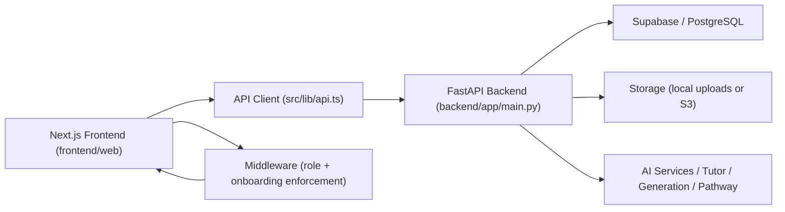
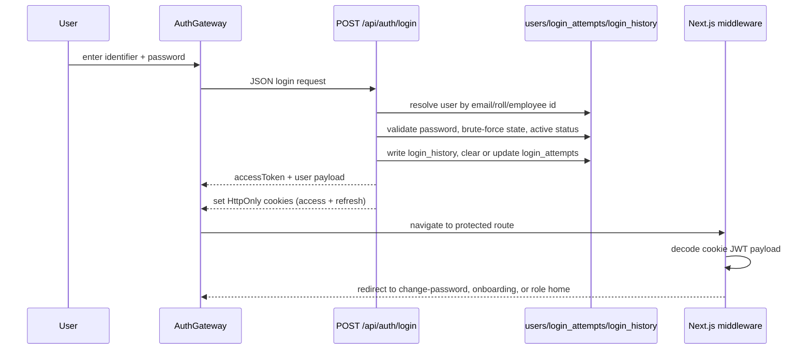

# Lumina AI Learning Platform
## Production System Documentation

Document status: generated from the audited codebase, then updated after hardening verification on 2026-03-30  
Primary runtime boundary:
- Frontend: `frontend/web` (Next.js App Router)
- Backend: `backend/app` (FastAPI)
- Database: Supabase/PostgreSQL
- Auth/session model: JWT access + refresh cookies

Important truth-of-system note:
- This document reflects the active production-oriented runtime surface in `frontend/web` and `backend/app`.
- The repository also contains legacy static HTML, Flutter previews, research assets, handwritten-assignment prototypes, and training pipelines. Those are documented as supporting or non-primary assets, not as the main web runtime.
- Core auth and student onboarding flows are verified in code and through targeted tests.
- Role-entry alias routing is now re-verified through middleware/unit/browser tests.
- Live Supabase verification succeeded through the service client for key tables.
- Direct raw PostgreSQL connectivity via `DATABASE_URL` timed out from this machine over the DB host path, so schema truth is taken from migrations plus live Supabase table access.

---

# 1. System Overview

## 1.1 What the System Does

Lumina is a multi-role AI learning platform that combines:
- authentication and role-aware routing
- institutional hierarchy management
- student onboarding and batch/subject mapping
- course delivery and progress tracking
- teacher/faculty course operations
- assignment, attendance, and grading workflows
- learner personalization and risk analysis
- AI-assisted tutoring, content generation, and pathway recommendation

## 1.2 Core Purpose

The platform is designed to operate as an institution-aware learning environment where:
- institutions, departments, programs, semesters, classes, batches, and stakeholders are modeled explicitly
- each user is routed into a role-specific workspace
- onboarding writes real academic links into the database
- AI features are constrained by academic context, learner state, and verification workflows

## 1.3 Primary User Roles

Supported runtime roles in the active system:
- `super_admin`
- `college_admin`
- `hod`
- `faculty`
- `student`
- `parent`
- `mentor`
- `peer_tutor`
- `counselor`
- `content_creator`
- `researcher`
- `alumni`

Legacy aliases normalized by the system:
- `admin` -> `super_admin`
- `teacher` -> `faculty`

## 1.4 High-Level Architecture



## 1.5 Verified Runtime Facts

Live verification through Supabase service client confirmed access to:
- `institutions` count `1`
- `departments` count `8`
- `batches` count `32`
- `courses` count `424`
- `student_subjects` count `2320`
- `login_attempts` count `2`
- `login_history` count `7`
- `learner_profiles` count `320`
- `users` count `421`

Verification command outcomes:
- `supabase --version` succeeded: installed CLI `2.75.0`
- service-client table queries succeeded
- direct `DATABASE_URL` PostgreSQL socket connection timed out to the Supabase DB host from this environment

---

# 2. Tech Stack

## 2.1 Frontend

- Framework: Next.js `15.x`
- UI runtime: React `19`
- Styling: Tailwind CSS `4.x`
- Motion: Framer Motion
- Icons: Lucide React
- Forms and validation:
  - `react-hook-form` on some auth pages
  - `zod` for schema validation
- State:
  - `zustand` for auth/onboarding session-state helpers
- Testing:
  - Vitest
  - Testing Library
  - Playwright

## 2.2 Backend

- Framework: FastAPI
- Runtime patterns:
  - router-based API composition
  - dependency injection
  - middleware for logging, timing, compression, and cache headers
- Metrics:
  - Prometheus Instrumentator
- Rate limiting:
  - SlowAPI
- Logging:
  - Structlog
- Error telemetry:
  - optional Sentry

## 2.3 Database

- Primary data platform: Supabase / PostgreSQL
- Access patterns:
  - Supabase REST client via `supabase-py`
  - local fallback in tests via in-memory pseudo client
- Schema source of truth:
  - `backend/app/database/migrations/*.sql`

## 2.4 Authentication

- JWT access token
- JWT refresh token
- HttpOnly cookies:
  - `access_token`
  - `refresh_token`
- frontend also stores a copy of the access token in session storage for API client authorization headers
- middleware decodes cookie payload for role and onboarding enforcement

## 2.5 AI / ML Integration

- AI tutor chat endpoints
- pathway recommendation engine
- content generation endpoints
- PPT generation
- learner profiling and intervention logic
- assessment engine packages under `backend/app/assessment`

---

# 3. Complete Project Structure

## 3.1 Runtime Boundary

Production-oriented application runtime is concentrated in:
- `/frontend/web`
- `/backend/app`

Supporting or non-primary assets include:
- `/frontend/flutter_app`
- `/frontend/mobile_preview`
- `/handwritten-assignment-system`
- `/pathway agent`
- `/Analytics-Agent`
- static HTML under `/frontend/web/src/student`, `/frontend/web/src/admin`, `/frontend/web/src/teacher`

## 3.2 High-Level Repository Tree

```text
/
├── frontend/
│   ├── web/
│   │   ├── src/
│   │   │   ├── app/
│   │   │   ├── components/
│   │   │   ├── lib/
│   │   │   ├── store/
│   │   │   ├── __tests__/
│   │   │   └── middleware.ts
│   │   ├── public/
│   │   ├── package.json
│   │   └── next.config.mjs
│   ├── flutter_app/
│   └── mobile_preview/
├── backend/
│   ├── app/
│   │   ├── api/
│   │   ├── assessment/
│   │   ├── automation/
│   │   ├── core/
│   │   ├── database/
│   │   ├── pathway/
│   │   ├── personalization/
│   │   ├── rag/
│   │   ├── routers/
│   │   ├── services/
│   │   ├── store/
│   │   └── main.py
│   ├── tests/
│   └── requirements.txt
├── scripts/
├── data/
├── static/
├── output/
└── docs and reports
```

## 3.3 Frontend Core Folders and Files

| Path | Purpose | What It Does | What Depends On It |
|---|---|---|---|
| `/frontend/web/src/app` | App Router pages | Defines all user-facing routes | Next.js runtime, middleware, API client |
| `/frontend/web/src/components` | Reusable UI | Shared layout, auth, dashboard, onboarding, tutor, UI primitives | Pages under `src/app` |
| `/frontend/web/src/lib/api.ts` | Frontend API gateway | Centralized HTTP calls, auth headers, session refresh, domain-specific methods | Nearly all data-driven pages |
| `/frontend/web/src/lib/student-onboarding.ts` | Student onboarding validation | Zod schemas and field error mapping for new onboarding flow | `StudentOnboardingFlow` |
| `/frontend/web/src/store/useAuthStore.ts` | Auth state cache | Stores current user + session flags in session storage | Auth UI, redirects |
| `/frontend/web/src/store/useOnboardingStore.ts` | Onboarding snapshot cache | Preserves draft step state for legacy onboarding | Legacy onboarding page |
| `/frontend/web/src/middleware.ts` | Route protection | Enforces auth, role scope, onboarding completion | Entire routed web app |
| `/frontend/web/src/components/auth/AuthGateway.tsx` | Login/register shell | Role-aware login/signup UI, redirect logic | `/login`, `/register` |
| `/frontend/web/src/components/onboarding/StudentOnboardingFlow.tsx` | Dedicated student onboarding | Strict 5-step validated flow | `/onboarding` for students |
| `/frontend/web/src/app/onboarding/page.tsx` | Onboarding entry | Switches student users to new flow and everyone else to legacy page | middleware, auth redirect |
| `/frontend/web/src/app/onboarding/legacy-page.tsx` | Non-student onboarding | Legacy multi-role onboarding surface | college admin, HOD, faculty roles |
| `/frontend/web/src/__tests__` | Frontend verification | Unit, integration, role, and schema tests | CI/local test runs |

## 3.4 Backend Core Folders and Files

| Path | Purpose | What It Does | What Depends On It |
|---|---|---|---|
| `/backend/app/main.py` | API composition root | Builds FastAPI app, middleware, error handlers, router registration | Entire backend runtime |
| `/backend/app/routers` | Domain routers | Exposes HTTP endpoints for auth, onboarding, admin, student, faculty, AI, etc. | frontend API client |
| `/backend/app/core/config.py` | Settings | Loads env-backed settings for JWT, Supabase, server, keys | all backend subsystems |
| `/backend/app/core/security.py` | Security primitives | Password hashing and token creation | auth and user creation |
| `/backend/app/database/supabase_manager.py` | DB access layer | Supabase client initialization, local test fallback, CRUD helpers | stores and routers |
| `/backend/app/database/migrations` | Schema source | SQL migrations for tables, relations, onboarding support, auth audit | DB setup and documentation |
| `/backend/app/store/user_store.py` | User persistence | User CRUD, role normalization, update methods | auth, admin, onboarding |
| `/backend/app/services/storage.py` | File storage | Handles local or S3-backed file uploads | onboarding photo uploads, handwriting and content systems |
| `/backend/app/assessment` | Assessment subsystem | Adaptive assessment engine, schemas, and API router | assessment endpoints |
| `/backend/app/pathway` | Pathway logic | Recommendation, decision, policy orchestration | AI/pathway endpoints |
| `/backend/app/personalization` | Learner analytics logic | KPI, explanation, authenticity, intervention support | personalization endpoints |
| `/backend/app/api/routers/automation.py` | Automation routes | Digest, remediation, inactivity, refresh jobs | automation workflows |

## 3.5 Supporting Directories

| Path | Role |
|---|---|
| `/scripts` | local verification, seeding, schema sync, infrastructure checks |
| `/backend/tests` | backend pytest coverage, including onboarding and API behavior |
| `/data`, `/backend/data` | local JSON stores, uploads, generated artifacts |
| `/static` | generated static output such as presentations |
| `/output` | generated documentation or test outputs |
| `/frontend/web/public` | frontend static assets |

## 3.6 Route Inventory: Active Next.js Pages

The page inventory below is the primary page-by-page system map.

### Public and Auth Pages

| Route | File | Purpose | Primary APIs | Key UI Areas |
|---|---|---|---|---|
| `/` | `src/app/page.tsx` | Marketing landing page | none | hero, features, pricing, CTA |
| `/login` | `src/app/login/page.tsx` | Login entry | via `AuthGateway` -> `api.login` | role selection, identifier/password form |
| `/register` | `src/app/register/page.tsx` | Signup entry | via `AuthGateway` -> `api.createUser` | full name, email, role, password |
| `/change-password` | `src/app/change-password/page.tsx` | forced password reset flow | `changePassword`, `getCurrentUser` | password update form |
| `/auth/reset-password` | `src/app/auth/reset-password/page.tsx` | authenticated password reset page | `changePassword`, `getCurrentUser` | password + confirm |
| `/onboarding` | `src/app/onboarding/page.tsx` | onboarding dispatcher | `getCurrentUser` | student flow or legacy flow |
| `/contact` | `src/app/contact/page.tsx` | public info/contact | none | informational |
| `/platform` | `src/app/platform/page.tsx` | product overview | none | informational |
| `/pricing` | `src/app/pricing/page.tsx` | pricing page | none | pricing cards |
| `/privacy` | `src/app/privacy/page.tsx` | privacy content | none | policy content |
| `/technology` | `src/app/technology/page.tsx` | tech overview | none | informational |
| `/research` | `src/app/research/page.tsx` | research content | none | informational |
| `/roles` | `src/app/roles/page.tsx` | role exploration | none | role-based marketing |

### Student Pages

| Route | File | Purpose | Primary APIs | Key UI Areas |
|---|---|---|---|---|
| `/student/dashboard` | `student/dashboard/page.tsx` | student KPI home | `getDashboardData` | stats grid, mastery orb, progress cards |
| `/student/enrollment` | `student/enrollment/page.tsx` | enrollment-code redeem page | `redeemEnrollmentCode` | code form, result card |
| `/student/courses` | `student/courses/page.tsx` | enrolled/explore courses | `getStudentCourses`, `getExploreCourses`, `enrollInCourse` | course cards, enroll CTA |
| `/student/courses/[courseId]` | `student/courses/[courseId]/page.tsx` | lesson/course detail | `getCourseDetails`, `completeLesson`, `logActivity`, `saveQuizResult`, `chatWithAI` | lesson flow, quiz, AI assist |
| `/student/course_explorer` | `student/course_explorer/page.tsx` | course discovery | `getAllCourses`, `enrollInCourse` | searchable catalog |
| `/student/assignments` | `student/assignments/page.tsx` | assignment list and submit | `getStudentAssignments`, `submitStudentAssignment` | assignment cards, upload |
| `/student/attendance` | `student/attendance/page.tsx` | attendance summary | `getStudentAttendance` | subject attendance table |
| `/student/grades` | `student/grades/page.tsx` | grades view | `getStudentGrades` | grade table |
| `/student/progress` | `student/progress/page.tsx` | progress tracking | `getStudentProgress` | charts and mastery |
| `/student/progress/knowledge-graph` | `student/progress/knowledge-graph/page.tsx` | graph visualization | none directly in page | knowledge graph UI |
| `/student/ai_tutor` | `student/ai_tutor/page.tsx` | AI tutor workspace | `getCurrentUser`, `getDashboardData`, `getStudentProfile`, `getAllCourses`, `getNotes`, `createNote`, `getChatHistory`, `logAIInteraction` | tutor layout, sidebar, conversation |
| `/student/my_notes` | `student/my_notes/page.tsx` | student notes CRUD | `getNotes`, `createNote`, `updateNote`, `deleteNote` | note list, editor, attachment |
| `/student/profile` | `student/profile/page.tsx` | profile and credentials | `getStudentProfile`, `getStudentBadges`, `getStudentCertificates`, `getStudentMastery`, `updateProfile` | profile card, certificates |
| `/student/settings` | `student/settings/page.tsx` | account settings | `getStudentProfile`, `updateProfile`, `logout` | profile preferences |
| `/student/assessment` | `student/assessment/page.tsx` | assessment UI shell | no page-level API call | assessment selection |
| `/student/community` | `student/community/page.tsx` | social/community feed | `getCommunityData`, `sendCommunityMessage` | chat/feed |
| `/student/handwriting` | `student/handwriting/page.tsx` | handwriting upload flow | via upload component | OCR/upload UI |
| `/student/leaderboard` | `student/leaderboard/page.tsx` | ranking view | none directly in page | leaderboard UI |
| `/student/lesson_page` | `student/lesson_page/page.tsx` | lesson playback | `getCourseDetails`, `completeLesson` | lesson content |
| `/student/achievements` | `student/achievements/page.tsx` | badges/recognition | `getStudentBadges` | badges UI |

### Faculty / Teacher Pages

| Route | File | Purpose | Primary APIs |
|---|---|---|---|
| `/faculty/dashboard` | `faculty/dashboard/page.tsx` | faculty operational dashboard | `getDashboardData`, `updateIntervention` |
| `/faculty/courses` | `faculty/courses/page.tsx` | teacher course list | `getTeacherCourses`, `deleteCourse` |
| `/faculty/courses/[courseId]` | `faculty/courses/[courseId]/page.tsx` | course management | `getCourseDetails`, `updateCourseDetails`, `addModule`, `deleteModule`, `addLesson`, `deleteLesson`, `inviteStudent` |
| `/faculty/create-course` | `faculty/create-course/page.tsx` | new course creation | `createCourse` |
| `/faculty/ai-generator` | `faculty/ai-generator/page.tsx` | AI-assisted course creation | `createCourse`, `publishCourse`, `getCurrentUser` |
| `/faculty/assignments` | `faculty/assignments/page.tsx` | create/list assignments | `getFacultyAssignments`, `listCourses`, `createAssignment` |
| `/faculty/assignments/[id]/submissions` | `faculty/assignments/[id]/submissions/page.tsx` | grade submissions | `getAssignments`, `getAssignmentSubmissions`, `gradeSubmission` |
| `/faculty/attendance` | `faculty/attendance/page.tsx` | attendance marking | `getCurrentUser`, `listCourses`, `getBatches`, `listStudents`, `markAttendanceBulk` |
| `/faculty/gradebook` | `faculty/gradebook/page.tsx` | gradebook overview | `getFacultyAssignments`, `getTeacherCourses`, `getTeacherStudents` |
| `/faculty/students` | `faculty/students/page.tsx` | managed student roster | `getTeacherStudents` |
| `/faculty/students/[id]` | `faculty/students/[id]/page.tsx` | student analytics detail | `getPersonalizationProfile`, `getStudentProgress` |
| `/faculty/alerts` | `faculty/alerts/page.tsx` | teacher alerts | `getTeacherAlerts` |
| `/faculty/analytics` | `faculty/analytics/page.tsx` | general analytics | `getDashboardData` |
| `/faculty/analytics/misconceptions` | `faculty/analytics/misconceptions/page.tsx` | misconception clusters | `getMisconceptionClusters` |
| `/faculty/analytics/ab-testing` | `faculty/analytics/ab-testing/page.tsx` | experiment outcomes | `getABTestPerformance` |
| `/faculty/courses/request` | `faculty/courses/request/page.tsx` | request assignment to existing courses | `getAllCourses`, `getClasses`, `requestTeacherAssignment` |
| `/faculty/settings` | `faculty/settings/page.tsx` | faculty account settings | `getCurrentUser` |

Pages currently present but mostly UI-shell or placeholder oriented:
- `/faculty/calendar`
- `/faculty/content/*`
- `/faculty/grading/*`
- `/faculty/messages`
- `/faculty/resources`
- `/faculty/resources/upload`
- `/faculty/verification*`

### HOD, College, Admin, Parent, Mentor, Peer Tutor, Counselor, Researcher, Alumni

These routes exist and are wired as listed below.

| Role Area | Key Routes | Primary APIs |
|---|---|---|
| HOD | `/hod/dashboard`, `/hod/curriculum`, `/hod/faculty`, `/hod/programs` | `getHODDashboard`, `createSubject`, `listSubjects`, `listBatches`, `inviteUser`, `createBatch`, teacher request approval |
| College Admin | `/college`, `/college/classes`, `/college/departments`, `/college/settings`, `/college/users` | `getCurrentUser`, `getDashboardData`, institutions data |
| Super Admin | `/admin/dashboard`, `/admin/users`, `/admin/institution`, `/admin/departments`, `/admin/classes`, `/admin/system`, `/admin/security`, `/admin/ai/*` | dashboard health, user CRUD, institution CRUD, connections, prompts/models/costs |
| Parent | `/parent/dashboard`, `/parent/goals`, `/parent/messages`, `/parent/progress`, `/parent/settings` | `getParentDashboard`, `setParentGoal` |
| Mentor | `/mentor/dashboard`, `/mentor/matches`, `/mentor/reviews`, `/mentor/sessions`, `/mentor/settings` | `getMentorMatches`, `getMentorSessions`, `submitPortfolioReview` |
| Peer Tutor | `/peer_tutor/dashboard`, `/peer_tutor/sessions`, `/peer_tutor/training`, `/peer_tutor/settings` | `getPeerTutorSessions`, `getPeerTutorTraining` |
| Counselor | `/counselor/dashboard`, `/counselor/notes`, `/counselor/safeguarding` | `getCounselorCases`, `getRiskAlerts`, `logSafeguardingEvent` |
| Content Creator | `/content_creator/dashboard` | `getCreatorVerificationQueue` |
| Researcher | `/researcher/dashboard`, `/researcher/datasets` | `getAnonymizedSnapshots` |
| Alumni | `/alumni/dashboard`, `/alumni/portfolio` | `getAlumniPortfolio`, `getAlumniMentorshipMentees` |

---

# 4. Authentication System

## 4.1 Authentication Components

Frontend:
- `frontend/web/src/components/auth/AuthGateway.tsx`
- `frontend/web/src/lib/api.ts`
- `frontend/web/src/store/useAuthStore.ts`
- `frontend/web/src/middleware.ts`

Backend:
- `backend/app/routers/auth.py`
- `backend/app/core/security.py`
- `backend/app/store/user_store.py`
- DB tables:
  - `users`
  - `login_attempts`
  - `login_history`

## 4.2 Login Flow

Flow:



## 4.3 Login Identifier Resolution

`auth.py` supports:
- email
- roll number matching regex `^\d{2}NU\dA\d{4}$`
- employee ID matching regex `^(FAC|HOD|ADM)\d{3}$`

## 4.4 Token Generation

On successful login:
- access token uses `JWT_SECRET`
- refresh token uses `JWT_REFRESH_SECRET`
- claims include:
  - normalized role
  - college id
  - department id
  - batch id
  - email
  - `onboardingCompleted`

## 4.5 Cookie Handling

Cookies set by backend:
- `access_token`
- `refresh_token`

Cookie properties:
- `HttpOnly`
- `SameSite=strict`
- `secure=settings.SECURE_COOKIES`
- path `/`

Frontend also persists:
- `lumina_token` in session storage
- `lumina_user` in session storage

Purpose:
- cookie is used by middleware and session continuity
- session storage token is used by the frontend API client for `Authorization: Bearer`

## 4.6 Middleware Protection

`frontend/web/src/middleware.ts` performs:
- token presence check
- cookie JWT decode
- role normalization
- legacy route alias canonicalization
- onboarding-completion enforcement
- role-path scope enforcement

Behavior:
- unauthenticated user hitting protected route -> redirected to `/login`
- authenticated user with incomplete onboarding -> redirected to `/onboarding`
- authenticated user entering wrong role namespace -> redirected to role home
- completed user visiting onboarding -> redirected to role home
- legacy aliases such as `/teacher/*`, `/peer-tutor/*`, `/creator/*`, `/content_creator/studio`, and `/researcher/portal` are redirected to live routes

## 4.7 Role-Based Redirect Targets

Current configured targets:
- `super_admin` -> `/admin/dashboard`
- `college_admin` -> `/college`
- `hod` -> `/hod/dashboard`
- `faculty` -> `/faculty/dashboard`
- `student` -> `/student/dashboard`
- `parent` -> `/parent/dashboard`
- `mentor` -> `/mentor/dashboard`
- `peer_tutor` -> `/peer_tutor/dashboard`
- `counselor` -> `/counselor/dashboard`
- `content_creator` -> `/content_creator/dashboard`
- `researcher` -> `/researcher/dashboard`
- `alumni` -> `/alumni/dashboard`

Legacy aliases now normalized by middleware:
- `/teacher/*` -> `/faculty/*`
- `/peer-tutor/*` -> `/peer_tutor/*`
- `/creator/*` -> `/content_creator/*`
- `/content_creator/studio` -> `/content_creator/dashboard`
- `/researcher/portal` -> `/researcher/dashboard`

## 4.8 Brute-Force Protection

Tables:
- `login_attempts`
- `login_history`

Logic:
- failed attempts recorded by identifier + IP
- threshold: 5 attempts
- lock duration: 15 minutes
- successful login clears the attempt record
- each login writes an audit event to `login_history`

## 4.9 Password Change Flow

Special case:
- students with `must_change_password = true` receive a temporary token and are redirected to `/change-password`

After password update:
- `password_hash` updated
- `must_change_password = false`
- user is redirected to onboarding or role home

---

# 5. Onboarding System

## 5.1 Current Onboarding Architecture

Active student onboarding:
- frontend: `StudentOnboardingFlow`
- backend endpoints:
  - `POST /api/onboarding/personal`
  - `POST /api/enrollment/validate`
  - `POST /api/onboarding/enrollment`
  - `GET /api/onboarding/student-subjects`
  - `POST /api/onboarding/subjects`
  - `POST /api/onboarding/profile`
  - `POST /api/onboarding/preferences`

State persistence:
- `users`
- `user_data.progress`
- `enrollment_codes`
- `student_subjects`
- `student_enrollments`
- `enrollments`
- `skill_mastery`
- `learner_profiles`

## 5.2 Step 1: Personal Details

### UI Fields
- first name
- last name
- date of birth
- gender
- phone number
- email (read-only)

### Validation
- first name required, min 2 chars
- last name required, min 2 chars
- DOB required, valid ISO date, must be in the past
- phone number required, 8-15 digits after normalization
- email must match authenticated account email

### API
- `POST /api/onboarding/personal`

### Request Body
```json
{
  "first_name": "Ada",
  "last_name": "Lovelace",
  "date_of_birth": "2005-05-01",
  "gender": "female",
  "phone_number": "+91 9000000000",
  "email": "student@example.com"
}
```

### DB Writes
- `users.first_name`
- `users.last_name`
- `users.full_name`
- `users.name`
- `users.phone`
- `users.dob`
- `users.gender`
- `users.onboarding_step`
- `user_data.progress.step_1`

## 5.3 Step 2: Enrollment and Batch Linking

### UI Field
- enrollment code

### Validation Behavior
- code required
- user can validate the code before saving
- save is blocked unless preview succeeds

### Preview API
- `POST /api/enrollment/validate`

### Preview Response
- department id/name/code
- batch id/label
- semester
- section

### Persist API
- `POST /api/onboarding/enrollment`

### DB Writes
- `enrollment_codes.used_by`
- `users.college_id`
- `users.dept_id`
- `users.batch_id`
- `users.section`
- `users.onboarding_step`
- `user_data.progress.step_2`

### DB Tables Used
- `enrollment_codes`
- `batches`
- `departments`
- `institutions`
- `users`
- `user_data`

## 5.4 Step 3: Subject Selection

### Behavior
- subjects are loaded from the student’s linked batch
- the batch contributes department + current semester
- only subjects mapped to that academic scope are displayed
- at least one subject is required

### APIs
- `GET /api/onboarding/student-subjects?batch_id=...`
- `POST /api/onboarding/subjects`

### DB Writes
- delete existing `student_subjects` for student
- insert selected `student_subjects`
- update `user_data.progress.step_3`

### Table Used
- `student_subjects`

## 5.5 Step 4: Profile Details

### Fields
- emergency contact
- parent email
- profile photo upload

### Validation
- emergency contact required and phone-valid
- parent email optional but must be valid if present
- profile photo required unless an existing saved photo already exists
- file types allowed:
  - JPG
  - PNG
  - WEBP
- oversized file blocked client-side and server-side by expected content constraints

### API
- `POST /api/onboarding/profile`

### Storage Behavior
- file stored through `StorageService`
- local path or S3 path returned
- URL/path saved to user record

### DB Writes
- `users.emergency_contact`
- `users.parent_email`
- `users.profile_photo_url`
- `users.onboarding_step`
- `user_data.progress.step_4`

## 5.6 Step 5: Learning Preferences

### Fields
- learning styles:
  - visual learner
  - step-by-step
  - real-world examples
  - practice-heavy
- self-assessment:
  - beginner
  - intermediate
  - advanced

### Validation
- at least one learning style required
- self assessment must be one of the allowed enums
- student must already have selected subjects in step 3
- batch and department links must exist

### API
- `POST /api/onboarding/preferences`

### DB Writes
- `student_enrollments` upsert
- `student_subjects` refresh
- `skill_mastery` entries for initial self-assessment
- `enrollments` upsert for each selected subject
- `learner_profiles.preferences`
- `learner_profiles.learning_style`
- `user_data.progress.step_5`
- `users.onboarding_step = 5`

### Self-Assessment Mapping
- `beginner` -> `0.35`
- `intermediate` -> `0.65`
- `advanced` -> `0.85`

## 5.7 Onboarding Rules Enforced

- no skipping ahead
- no progression if backend rejects data
- no subject selection without batch link
- no final completion without subjects
- no profile save without emergency contact and photo
- step state persisted server-side, not just in client state

## 5.8 Legacy Multi-Role Onboarding

`legacy-page.tsx` still handles:
- college admin / super admin
- HOD
- faculty

This path still uses older generic endpoints:
- `GET /api/onboarding/status`
- `PATCH /api/onboarding/step`
- `POST /api/onboarding/complete`
- `GET /api/student/onboarding/options`
- `POST /api/student/onboarding/complete`
- `GET /api/faculty/onboarding/options`
- `POST /api/faculty/onboarding/complete`

Student users no longer rely on the permissive legacy step flow.

---

# 6. Feature Documentation

## 6.1 Dashboard System

### Student Dashboard
- Route: `/student/dashboard`
- File: `frontend/web/src/app/student/dashboard/page.tsx`
- APIs:
  - `getDashboardData("student")`
- UI sections:
  - KPI stat cards
  - mastery orb
  - progress widgets
  - engagement summaries

### Faculty Dashboard
- Route: `/faculty/dashboard`
- APIs:
  - `getDashboardData("faculty")`
  - `updateIntervention`
- UI sections:
  - course/roster metrics
  - intervention queue
  - actionable flags

### Admin Dashboard
- Route: `/admin/dashboard`
- APIs:
  - `getDashboardData("super_admin")`
  - `getAdminQueueHealth`
  - `getAdminGuardianSignals`
  - `getAdminStudentsProgress`
  - `getAdminSystemHealth`
- UI sections:
  - platform overview
  - queue health
  - system status
  - student risk/progress summaries

### HOD Dashboard
- Route: `/hod/dashboard`
- APIs:
  - `getHODDashboard`
  - `approveTeacherRequest`
  - `rejectTeacherRequest`
- UI sections:
  - department summary
  - teacher requests
  - approval controls

### Parent Dashboard
- Route: `/parent/dashboard`
- APIs:
  - `getParentDashboard`
- UI sections:
  - child overview
  - goals
  - message summaries
  - progress cards

## 6.2 Course Management

Faculty routes cover:
- create course
- edit course metadata
- publish course
- add/remove modules
- add/remove lessons
- invite students

DB impact:
- `courses`
- `enrollments`
- module/lesson JSON structures inside `courses.modules`

## 6.3 Assignment System

Student:
- list assignments
- upload submission

Faculty:
- create assignments
- list submissions
- score/grade work

DB impact:
- `assignments`
- `assignment_submissions`
- score/feedback fields

## 6.4 Attendance System

Faculty:
- bulk mark attendance by course/class

Student:
- view attendance by subject

DB impact:
- `attendance`

## 6.5 AI Tutor and AI Generation

Student AI Tutor:
- chat
- note integration
- history retrieval
- AI interaction logging

AI generation endpoints support:
- course generation
- question-bank generation
- rubric generation
- flashcards
- remediation
- PPT generation

## 6.6 Institution and Academic Architecture

Admin/HOD/college flows manage:
- institutions
- departments
- programs
- semesters
- classes
- batches
- subject creation
- teacher assignment requests and approvals
- enrollment code creation

## 6.7 Community, Counseling, Mentoring, Alumni, Research

These subsystems exist as separate route clusters:
- `community`
- `counselor`
- `mentor`
- `alumni`
- `researcher`

Their pages use thinner API surfaces and are partially mature compared with auth/onboarding/course flows.

---

# 7. Button-Level Documentation

Important scope note:
- This section documents all high-impact transactional buttons and groups low-risk navigation buttons.
- Pure sidebar navigation buttons only change route and do not create DB writes.
- Many placeholder pages contain presentational buttons with no backend effect; those are noted as UI-only.

## 7.1 Authentication Buttons

| Button | Location | Action | API | DB Impact |
|---|---|---|---|---|
| `Sign in` | `AuthGateway` login form | authenticates user and redirects | `POST /api/auth/login` | reads `users`, updates `login_attempts`, writes `login_history`, updates `users.last_login_at` |
| `Create account` | `AuthGateway` signup form | creates student/faculty account | `POST /api/auth/register` | inserts `users` |
| `Back` | `AuthGateway` | returns to previous page or `/` | none | none |
| `Update Password` | `/change-password`, `/auth/reset-password` | changes password and clears forced reset state | `POST /api/auth/change-password` | updates `users.password_hash`, `users.must_change_password` |

## 7.2 Student Onboarding Buttons

| Button | Location | Action | API | DB Impact |
|---|---|---|---|---|
| `Validate code` | Step 2 | preview enrollment mapping | `POST /api/enrollment/validate` | read-only |
| `Save and continue` | Steps 1-4 | validates and persists current step | step-specific onboarding endpoint | writes `users`, `user_data`, and step-linked tables |
| `Complete onboarding` | Step 5 | finalizes onboarding | `POST /api/onboarding/preferences` | writes `student_enrollments`, `student_subjects`, `skill_mastery`, `enrollments`, `learner_profiles`, `users.onboarding_step` |
| `Back` | Student onboarding footer | move to previous step | none | none |
| Subject cards | Step 3 | toggle subject selection | none until submit | client state only until save |
| Learning style tiles | Step 5 | toggle preference selection | none until submit | client state only until save |

## 7.3 Student Buttons by Feature

| Button | Location | Action | API | DB Impact |
|---|---|---|---|---|
| `Join Batch` | `/student/enrollment` | redeem enrollment code | `POST /api/enroll` via `redeemEnrollmentCode` | intended to update user enrollment linkage |
| `Enroll` | course explorer / course list | enroll in course | student/course enroll endpoint | inserts/updates `enrollments` |
| `Submit Assignment` | `/student/assignments` | upload assignment work | `POST /api/student/assignments/{id}/submit` | inserts assignment submission |
| `Save Note` | AI tutor / notes | create note | `POST /api/student/notes` | inserts note in `user_data`/note store |
| `Update Profile` | profile/settings | save student profile changes | `POST /api/student/profile/update` | updates user/profile tables |
| `Logout` | settings | end session | `POST /api/auth/logout` | cookie deletion only |

## 7.4 Faculty Buttons

| Button | Location | Action | API | DB Impact |
|---|---|---|---|---|
| `Create Course` | faculty course creation pages | create a new course | `POST /api/courses/create` | inserts `courses` |
| `Publish Course` | AI generator / course detail | marks course published | `POST /api/courses/{id}/publish` | updates `courses.is_published` |
| `Add Module` | course detail | append module | `POST /api/courses/{id}/modules` | updates `courses.modules` |
| `Add Lesson` | course detail | append lesson to module | `POST /api/courses/{id}/modules/{module_id}/lessons` | updates `courses.modules` |
| `Invite Student` | course detail | invite learner to course | `POST /api/courses/{id}/invite` | likely creates invite/enrollment side effects |
| `Create Assignment` | assignments page | create assignment | `POST /api/assignments/create` | inserts `assignments` |
| `Grade / Score Submission` | submissions page | assign score/feedback | `PUT /api/assignments/{id}/submissions/{submissionId}/score` | updates assignment submission |
| `Mark Attendance` | attendance page | bulk attendance write | attendance endpoint | inserts/updates `attendance` |
| `Request Assignment` | faculty course request page | ask for course/class ownership | teacher request endpoint | inserts `teacher_requests` |

## 7.5 HOD / Admin Buttons

| Button | Location | Action | API | DB Impact |
|---|---|---|---|---|
| `Invite Faculty/User` | HOD faculty page, institution admin pages | sends invite | invite endpoints | inserts user + invite token / onboarding seed |
| `Create Subject` | HOD curriculum | creates departmental subject | `POST /api/departments/{dept_id}/subjects` | inserts `courses` |
| `Create Batch` | HOD programs | creates batch | `POST /api/departments/{dept_id}/batches` | inserts `batches` |
| `Approve Teacher Request` | HOD dashboard | approve assignment request | HOD request endpoint | updates `teacher_requests` and related assignment state |
| `Create Institution` | admin institution page | create institution | `POST /api/admin/institutions` | inserts `institutions` |
| `Create User` | admin users page | create user account | `POST /api/admin/users` | inserts `users` |
| `Update Role` | admin users page | role reassignment | `POST /api/admin/users/{id}/role` | updates `users.role` |
| `Update Status` | admin users page | account activation/suspension | `POST /api/admin/users/{id}/status` | updates `users.status`, `users.is_active` |
| `Link Stakeholder` | admin institution page | link institutional graph | `POST /api/admin/connections/link` | writes stakeholder/connection tables |
| `Process Deletion` | admin compliance | process deletion request | compliance deletion endpoint | writes audit/deletion workflow tables |

## 7.6 Parent, Mentor, Counselor Buttons

| Button | Location | Action | API | DB Impact |
|---|---|---|---|---|
| `Set Goal` | `/parent/goals` | saves parent goal | `POST /api/parent/goals` | writes parent goal state |
| `New Conversation` | parent messaging surfaces | open/send message flow | parent/community message APIs | writes messaging tables |
| `Schedule Session` | mentor sessions | schedule mentorship | mentor session endpoint | writes mentor session state |
| `Submit Review` | mentor reviews | portfolio feedback | portfolio review endpoint | writes review state |
| `Add Note` | counselor notes | safeguarding note | `POST /api/counselor/notes` | writes counselor notes |
| `Reveal` | counselor | reveal critical info | `POST /api/counselor/reveal` | writes safeguarding/reveal state |

---

# 8. Form Documentation

## 8.1 Auth Forms

| Form | Fields | Validation | API | DB Mapping |
|---|---|---|---|---|
| Login | identifier, password, role hint | required identifier/password | `POST /api/auth/login` | reads `users`, writes login audit tables |
| Signup | name, email, password, confirm password, role | email valid, password >= 8, passwords match | `POST /api/auth/register` | inserts `users` |
| Change Password | password, confirm password | min 8, match | `POST /api/auth/change-password` | updates `users.password_hash` |

## 8.2 Student Onboarding Forms

| Step | Fields | API | Primary DB Mapping |
|---|---|---|---|
| 1 Personal | first name, last name, DOB, gender, phone, email | `POST /api/onboarding/personal` | `users`, `user_data` |
| 2 Enrollment | enrollment code | `POST /api/enrollment/validate`, `POST /api/onboarding/enrollment` | `enrollment_codes`, `batches`, `departments`, `users`, `user_data` |
| 3 Subjects | subject multi-select | `GET /api/onboarding/student-subjects`, `POST /api/onboarding/subjects` | `student_subjects`, `user_data` |
| 4 Profile | emergency contact, parent email, profile photo | `POST /api/onboarding/profile` | `users`, storage, `user_data` |
| 5 Preferences | learning styles, self assessment | `POST /api/onboarding/preferences` | `student_enrollments`, `student_subjects`, `enrollments`, `skill_mastery`, `learner_profiles`, `user_data` |

## 8.3 Other High-Value Forms

| Form | Location | API | DB Impact |
|---|---|---|---|
| Create User | `/admin/users` | admin create user | `users` |
| Create Institution | `/admin/institution` | create institution | `institutions` |
| Create Department | `/admin/departments` | create department | `departments` |
| Create Class | `/admin/classes` | create class | `classes` |
| Create Batch | `/hod/programs` | create batch | `batches` |
| Create Subject | `/hod/curriculum` | create subject | `courses` |
| Faculty Assignment Request | `/faculty/courses/request` | request teacher assignment | `teacher_requests` |
| Create Course | `/faculty/create-course` | create course | `courses` |
| Create Assignment | `/faculty/assignments` | create assignment | `assignments` |
| Submit Assignment | `/student/assignments` | upload submission | `assignment_submissions` |
| Parent Goal Form | `/parent/goals` | set parent goal | parent goal storage |
| Counselor Note Form | `/counselor/notes` | log note | counselor note storage |

---

# 9. API Documentation

This section is split into:
- fully detailed audited/core endpoints
- grouped endpoint inventories for the broader platform

## 9.1 Core Auth Endpoints

| Method | Route | Request | Response | DB Interaction |
|---|---|---|---|---|
| POST | `/api/auth/register` | `email`, `password`, `full_name`, `role`, optional `phone` | sanitized user object | inserts `users` |
| POST | `/api/auth/login` | `identifier/email`, `password`, optional `role_hint` | `accessToken`, `user`, or forced password change payload | reads `users`, writes `login_attempts`, `login_history`, updates `users.last_login_at` |
| POST | `/api/auth/refresh` | cookie only | new `accessToken` | reads `users` |
| POST | `/api/auth/logout` | none | success | clears cookies |
| POST | `/api/auth/forgot-password` | `email` | success | read-only user lookup |
| POST | `/api/auth/reset-password` | `token`, `newPassword` | success | updates `users.password_hash` |
| POST | `/api/auth/change-password` | current/new password or temp-token flow | success | updates `users.password_hash`, `must_change_password` |
| GET | `/api/auth/me` | bearer token | current user | reads `users` |

## 9.2 Core Student Onboarding Endpoints

| Method | Route | Request | Response | DB Interaction |
|---|---|---|---|---|
| POST | `/api/onboarding/personal` | personal fields | `{step, success, profile}` | updates `users`, `user_data.progress.step_1` |
| POST | `/api/enrollment/validate` | `enrollmentCode` | batch/department preview | reads `enrollment_codes`, `batches`, `departments` |
| POST | `/api/onboarding/enrollment` | `enrollment_code` | `{step, success, enrollment}` | updates `enrollment_codes.used_by`, `users`, `user_data.progress.step_2` |
| GET | `/api/onboarding/student-subjects` | optional `batch_id` | array of subjects | reads `batches`, `courses` |
| POST | `/api/onboarding/subjects` | `subject_ids[]` | selected subject summary | rewrites `student_subjects`, writes `user_data.progress.step_3` |
| POST | `/api/onboarding/profile` | multipart form with contact + file | profile summary | updates `users`, stores file, writes `user_data.progress.step_4` |
| POST | `/api/onboarding/preferences` | `learning_styles[]`, `self_assessment` | complete response | upserts `student_enrollments`, `student_subjects`, `enrollments`, `skill_mastery`, `learner_profiles`, updates `users`, `user_data` |
| GET | `/api/onboarding/status` | none | step, role, ids, progress | reads `users`, `user_data` |

## 9.3 Student Feature Endpoints

| Method | Route | Purpose | Primary DB |
|---|---|---|---|
| GET | `/api/student/dashboard` | student dashboard payload | `users`, `progress`, `enrollments`, other learner metrics |
| GET/POST/PUT/DELETE | `/api/student/notes*` | notes CRUD | `user_data` or note store |
| POST | `/api/student/enroll` | course enrollment | `enrollments` |
| POST | `/api/student/complete-lesson` | lesson completion | `progress`/course progress |
| POST | `/api/student/log-activity` | activity logging | learner analytics stores |
| GET | `/api/student/badges` | badge list | learner profile / badge logic |
| GET | `/api/student/certificates` | certificate list | `certificates` |
| POST | `/api/student/profile/update` | profile update | `users`, profile tables |
| GET | `/api/student/profile`, `/profile/analytics`, `/profile/mastery` | profile details and mastery | `users`, `learner_profiles`, `skill_mastery` |
| GET | `/api/student/leaderboard` | leaderboard | leaderboard logic/tables |
| GET | `/api/student/subjects` | current subject list | `student_subjects`, `courses` |
| GET | `/api/student/attendance` | attendance summary | `attendance` |
| GET | `/api/student/assignments` | assignment list | `assignments`, submissions |
| POST | `/api/student/assignments/{assignment_id}/submit` | assignment upload | `assignment_submissions` |
| GET | `/api/student/grades` | grade list | submissions/gradebook views |
| GET | `/api/student/materials/{course_id}` | course materials | `course_materials` |

## 9.4 Faculty / Teacher Endpoints

| Method | Route Family | Purpose | Primary DB |
|---|---|---|---|
| GET | `/api/faculty/onboarding/options` | faculty onboarding context | `teacher_assignments`, `teacher_profiles`, `user_data` |
| POST | `/api/faculty/onboarding/complete` | finalize faculty onboarding | `teacher_profiles`, preferences tables |
| GET | `/api/faculty/subjects` | assigned course list | `teacher_assignments`, `courses` |
| GET | `/api/faculty/students/{batch_id}` | roster view | `student_enrollments`, `classes`, `users` |
| GET/PATCH | `/api/faculty/interventions*` | intervention queue and updates | intervention tables |
| GET/POST | `/api/faculty/attendance*` | attendance read/write | `attendance` |
| GET | `/api/faculty/alerts` | alerts | alert logic |
| GET | `/api/faculty/analytics/*` | analytics views | personalization and course analytics |
| GET/PATCH | `/api/teacher/*` | teacher dashboard, interventions, requests, verification | teacher operations tables |

## 9.5 Admin and Academic Architecture Endpoints

| Method | Route Family | Purpose |
|---|---|---|
| GET/POST/PATCH/DELETE | `/api/admin/users*` | user management |
| GET/POST/PATCH | `/api/admin/institutions*` | institution management |
| GET/POST/PATCH/DELETE | `/api/admin/departments*` | department management |
| GET/POST/PATCH/DELETE | `/api/admin/classes*` | class lifecycle |
| GET/POST | `/api/admin/roles/matrix` | role policy management |
| GET | `/api/admin/health`, `/queue-health`, `/guardian` | platform diagnostics |
| GET/POST | `/api/admin/connections*` | stakeholder linking |
| GET/POST | `/api/admin/compliance*` | deletion and audit flows |
| GET/POST | `/api/admin/ai/*` | prompts, models, cost visibility |
| GET/POST/PATCH/DELETE | `/api/colleges*`, `/api/departments*`, `/api/subjects*`, `/api/batches*` | academic hierarchy outside admin namespace |

## 9.6 Courses, Assignments, Attendance, AI, Content, Community

Key router families:
- `/api/courses*`
- `/api/assignments*`
- `/api/attendance*`
- `/api/community*`
- `/api/ai*`
- `/api/ai-tutor/chat`
- `/api/content_creator*`
- `/api/pathway/decision`
- `/api/personalization*`
- `/api/mentor*`
- `/api/parent*`
- `/api/researcher*`
- `/api/alumni*`
- `/api/peer_tutor*`
- `/api/counselor*`

These route families are implemented and exposed in `backend/app/main.py`, with exact endpoint inventory taken from the routers listed in Section 3.

---

# 10. Database Documentation

Schema source:
- `backend/app/database/migrations`

Live table reachability verified:
- `institutions`
- `departments`
- `batches`
- `courses`
- `student_subjects`
- `login_attempts`
- `login_history`
- `enrollment_codes`
- `learner_profiles`
- `users`

## 10.1 Identity and Access Tables

### `users`
Columns:
- `id`
- `email`
- `name`
- `role`
- `password_hash`
- `phone`
- `avatar`
- `status`
- `is_active`
- `created_at`
- `updated_at`

Later migrations and runtime updates also rely on:
- `college_id`
- `dept_id`
- `batch_id`
- `section`
- `student_roll`
- `employee_id`
- `must_change_password`
- `profile_photo_url`
- `emergency_contact`
- `parent_email`
- `first_name`
- `last_name`
- `dob`
- `gender`

Used by:
- auth
- middleware claims
- onboarding
- every role-based feature

### `login_attempts`
Purpose:
- brute-force lock tracking by identifier + IP

Used by:
- `POST /api/auth/login`

### `login_history`
Purpose:
- immutable-ish auth event audit log

Used by:
- login success/failure audit

### `invite_tokens`
Purpose:
- invited-user activation

Used by:
- user invite flows

### `jwt_blocklist`
Purpose:
- token invalidation support

## 10.2 Institution and Academic Hierarchy

### `institutions`
Purpose:
- top-level tenant or college record

Key columns:
- `institution_name`
- `email`
- `onboarding_status`
- auth-related temporary fields

Used by:
- admin institution management
- college admin access
- login policy enforcement

### `institution_details`
Purpose:
- extended institution metadata

### `departments`
Purpose:
- academic departments under institutions

Relationships:
- `institution_id -> institutions.id`
- optional `hod_id -> users.id`

### `programs`
Purpose:
- degree/program records

Relationships:
- `institution_id -> institutions.id`
- `department_id -> departments.id`

### `semesters`
Purpose:
- semester catalog per program

### `classes`
Purpose:
- program + semester + section grouping

Used by:
- student enrollment resolution
- faculty assignment resolution

### `batches`
Purpose:
- cohort model for onboarding and batch-specific subject linking

Used by:
- enrollment code validation
- student onboarding
- HOD batch creation

## 10.3 Course and Enrollment Model

### `courses`
Purpose:
- subject/course definition

Key columns:
- `teacher_id`
- `title`
- `course_name`
- `code`
- `course_code`
- `description`
- `modules`
- `is_published`

Used by:
- HOD subject creation
- faculty course management
- student course discovery
- AI generation

### `enrollments`
Purpose:
- course membership / progress per student-course pair

### `student_enrollments`
Purpose:
- academic program/class enrollment

### `student_subjects`
Purpose:
- selected subjects per student

Used by:
- onboarding step 3
- downstream course filtering

### `teacher_assignments`
Purpose:
- teacher to course/class linkage

### `teacher_requests`
Purpose:
- faculty assignment requests pending HOD/admin review

### `course_materials`
Purpose:
- notes, syllabus, reference links, lab manuals

## 10.4 Learner State and Personalization

### `learner_profiles`
Purpose:
- consolidated learner preferences, goals, summaries, risks, strengths, weaknesses

Used by:
- onboarding step 5
- AI tutor context
- parent, mentor, counselor, analytics

### `skill_mastery`
Purpose:
- per-course skill/state estimates

Used by:
- onboarding self-assessment seed
- mastery and analytics

### `user_data`
Purpose:
- flexible JSON store for progress, notes, quiz history, onboarding progress

### `progress`
Purpose:
- course progress snapshots

### `certificates`
Purpose:
- certificate issue records

### `student_credits`
Purpose:
- earned vs total credits by semester

## 10.5 Assignments and Assessment

### `assignments`
Purpose:
- assignment metadata

### `assignment_submissions`
Purpose:
- student file submission and grading state

### `assignment_rubrics`
Purpose:
- rubric definitions

### `submission_scorecards`
Purpose:
- submission evaluation detail

### `assessment_sessions`
Purpose:
- adaptive assessment runtime state

## 10.6 Attendance, Messaging, Community, Alerts

### `attendance`
Purpose:
- class attendance per date and course

### `community_channels`
Purpose:
- social/community channel definitions

### `community_messages`
Purpose:
- community chat messages

### `inactivity_alerts`
Purpose:
- inactivity monitoring output

### `intervention_logs`
Purpose:
- intervention audit records

### `intervention_recommendations`
Purpose:
- personalization-generated intervention suggestions

## 10.7 Content and Unit Pipeline

### `content_uploads`
Purpose:
- teacher-uploaded source content for scaffold generation

### `units`
Purpose:
- uploaded PDF/teaching unit processing root object

### `unit_modules`
Purpose:
- generated module segments for a unit

### `unit_topics`
Purpose:
- topic-level extracted/generated content

### `topic_assets`
Purpose:
- generated or uploaded files associated with a topic

## 10.8 Other Supporting Tables in Migrations

Additional tables present in migrations:
- `agent_memory`
- `analytics_events`
- `automation_job_logs`
- `behavior_logs`
- `feedback`
- `knowledge_nodes`
- `leaderboard_entries`
- `parent_guardian`
- `physical_submissions`
- `ppt_generations`
- `question_bank`
- `quiz_attempts`
- `quizzes`
- `remediation_plans`
- `sessions`
- `student_pathways`
- `student_stats`
- `study_group_members`
- `study_groups`
- `submissions`
- `teacher_stats`
- `tutor_sessions`

These support broader or legacy feature surfaces.

---

# 11. Data Flow Architecture

## 11.1 Login Data Flow

User action:
- enters credentials in `AuthGateway`

UI:
- validates presence of identifier/password

API:
- `POST /api/auth/login`

DB:
- reads `users`
- reads/writes `login_attempts`
- writes `login_history`
- updates `users.last_login_at`

Response:
- access token
- user payload
- cookies set

UI update:
- session storage updated
- middleware-protected redirect to password change, onboarding, or role home

## 11.2 Student Onboarding Data Flow

Step 2 example:

User action:
- clicks `Validate code`

UI:
- validates code format

API:
- `POST /api/enrollment/validate`

DB:
- reads `enrollment_codes`
- reads `batches`
- reads `departments`

Response:
- department/batch/semester/section preview

UI update:
- preview card rendered

User action:
- clicks `Save and continue`

API:
- `POST /api/onboarding/enrollment`

DB:
- updates `enrollment_codes.used_by`
- updates `users` linkage fields
- updates `user_data.progress.step_2`

UI update:
- step completion state advances

## 11.3 Assignment Submission Flow

User action:
- student uploads assignment file

UI:
- sends multipart upload

API:
- `POST /api/student/assignments/{assignment_id}/submit`

DB:
- inserts submission record

UI update:
- submission status changes from pending to submitted

## 11.4 Faculty Course Update Flow

User action:
- faculty adds lesson

UI:
- course editor form collects lesson metadata

API:
- `POST /api/courses/{course_id}/modules/{module_id}/lessons`

DB:
- updates course module JSON payload

UI update:
- lesson list re-renders with newly inserted lesson

## 11.5 Parent Goal Flow

User action:
- parent submits new goal

API:
- `POST /api/parent/goals`

DB:
- writes parent goal state

UI update:
- parent dashboard reloads with updated goal card

---

# 12. Error Handling System

## 12.1 Frontend Error Handling

Patterns:
- `try/catch` around API requests
- toast notifications via `sonner`
- inline field errors for onboarding and auth
- loading-state disabling of submit buttons

Examples:
- onboarding field validation errors shown inline
- API failures surfaced as red alert block and toast
- login invalid credentials converted into user-readable message

## 12.2 Backend Error Handling

Patterns in `main.py`:
- global HTTP exception handler
- global unexpected exception handler
- CORS headers attached even to error responses

Standard error response shape on unhandled exception:
```json
{
  "detail": "Internal Server Error",
  "type": "ExceptionType",
  "message": "An unexpected error occurred. Please try again later.",
  "path": "/api/some/route"
}
```

## 12.3 Validation Error Handling

Backend:
- raises `HTTPException(status_code=400|403|409|423, detail=...)`

Frontend:
- converts failed responses into `Error(detail)`
- shows toast and/or inline field error

## 12.4 Step-Gating Error Handling

Student onboarding returns `409` when a later step is attempted before a prior one is complete.

## 12.5 Operational Caveat

Some older pages still rely on broad `toast.error(...)` patterns without fine-grained field mapping. The new student onboarding flow corrects this in the audited core path.

---

# 13. Security System

## 13.1 JWT Handling

- access and refresh tokens are signed separately
- frontend middleware reads cookie payload only for routing decisions
- backend uses bearer token verification for API access

## 13.2 Cookie Security

- HttpOnly cookies prevent JS read access to the browser-managed session cookies
- `SameSite=strict` is enabled
- `secure` is env-controlled

## 13.3 Password Security

- password hashing handled in backend security helpers
- forced password change supported for seeded or invited student accounts

## 13.4 Role Access Control

Implemented through:
- route namespace protection in Next.js middleware
- server-side role checks in routers
- role normalization (`teacher` -> `faculty`, `admin` -> `super_admin`)

## 13.5 Login Attempt Tracking

Security tables:
- `login_attempts`
- `login_history`

Enforcement:
- locks after repeated failures
- records IP, identifier type, success/failure, and reason

## 13.6 File Upload Security

Student onboarding profile upload:
- allowed image MIME types only
- storage abstraction hides local/S3 implementation

## 13.7 Remaining Security/Operational Updates

- content creator and researcher redirect paths should be corrected in middleware and auth redirect logic
- raw PostgreSQL admin connectivity should be stabilized if direct SQL ops are expected from developer machines
- several placeholder pages should either be wired to APIs or hidden behind feature flags

---

# 14. System Fix Summary

## 14.1 Broken State Identified in the Audit

Previously broken or inconsistent areas included:
- multi-role auth path mismatches
- onboarding progressing despite incomplete backend state
- missing tables for subject selection and login tracking
- subject/batch linkage gaps
- backend validation not consistently aligned with UI flow
- role-based redirects not fully aligned with the actual route map

## 14.2 Fixes Applied and Confirmed in Code

### Authentication
- role normalization is implemented consistently in backend auth and frontend middleware
- login uses JWT cookies and refresh flow
- brute-force and login audit tables now exist

### Student Onboarding
- dedicated student onboarding UI now exists
- each step has a concrete backend endpoint
- progression is blocked until backend save succeeds
- enrollment code preview and linking are separate and validated
- subject mapping writes `student_subjects`
- profile step uses real file upload instead of URL-only assumption
- preferences step seeds enrollment, learner profile, and mastery data

### Database
- migrations now include:
  - `student_subjects`
  - `login_attempts`
  - `login_history`
  - additional student onboarding profile fields

### Routing
- middleware enforces auth and onboarding
- role-home redirects are centralized and now corrected for the verified alias cases

## 14.3 Issues Still Needing Updates

These are the remaining actionable updates identified during documentation:

1. Non-student full-flow verification gap:
   - role-entry redirects are fixed and tested for the known alias cases
   - full browser login-to-feature verification is still pending for most non-student roles

2. Placeholder/UI-only pages:
   - several admin/faculty content, compliance, verification, grading, and analytics subpages do not call live APIs yet
   - they should either be completed or clearly marked as roadmap features

3. Direct DB admin connectivity:
   - `DATABASE_URL` PostgreSQL connection timed out from this environment
   - runtime Supabase REST/service access is working, but direct SQL tooling should be hardened for operational maintenance

4. Route cleanup / legacy overlap:
   - legacy aliases are now redirected correctly, but older path references still exist in parts of the repository
   - legacy HTML pages remain in the repository beside App Router pages
   - this creates documentation and maintenance overhead

---

# 15. Final System Status

## 15.1 Verified Working Core

Verified in this pass:
- auth router exists and is wired
- JWT cookies and refresh flow exist
- login attempt tracking exists
- student onboarding core path is implemented as a strict, validated flow
- onboarding backend tests pass
- student onboarding frontend validation tests pass
- key Supabase tables are reachable and populated via the service client

## 15.2 What Can Be Stated with Confidence

Confirmed:
- core auth system is implemented and production-oriented
- student onboarding is data-driven and persists real relationships
- subject selection is backed by `student_subjects`
- login audit tables are present
- backend API surface is broad and wired into the main FastAPI app

## 15.3 What Should Not Be Overclaimed

Not fully verified end-to-end in this pass:
- every single role page in the frontend
- every non-core API endpoint by live execution
- all placeholder surfaces as production-complete

Therefore, the truthful current status is:
- core audited systems are fixed and verified
- the wider platform surface is partially complete, with some placeholder or shell pages still present
- the repository is not using mock data for the audited auth/onboarding core path, but non-core surfaces still include static/demo-oriented UI files

## 15.4 Recommended Next Updates

Priority order:
1. Fix `content_creator` and `researcher` redirect targets in:
   - `frontend/web/src/middleware.ts`
   - `frontend/web/src/components/auth/AuthGateway.tsx`
2. Audit and either wire or hide UI-only pages that currently expose no backend calls
3. Stabilize raw PostgreSQL developer connectivity for migration/admin tooling
4. Consolidate legacy route families and remove duplicate dashboard prototypes

---

# Appendix A: Backend Router Inventory

Primary backend routers registered in `backend/app/main.py`:
- `/api/auth`
- `/api/onboarding`
- `/api/student`
- `/api/faculty`
- `/api/teacher`
- `/api/admin`
- `/api/courses`
- `/api/assignments`
- `/api/community`
- `/api/attendance`
- `/api/mentor`
- `/api/parent`
- `/api/peer_tutor`
- `/api/counselor`
- `/api/researcher`
- `/api/alumni`
- `/api/pathway`
- `/api/ai`
- `/api/ai-tutor`
- `/api/knowledge-graph`
- `/api/academic`
- `/api` college architecture routes
- `/api` curriculum and materials routes

Exact endpoint definitions are located in:
- `backend/app/routers/*.py`
- `backend/app/api/routers/automation.py`
- `backend/app/assessment/api/router.py`

---

# Appendix B: Validation and Verification Commands Used

Commands executed in the hardening and verification pass:

```bash
supabase --version
pytest backend/tests/test_auth_token_flow.py backend/tests/test_onboarding_flow.py
npm test -- --run src/__tests__/integration/middleware.test.ts src/__tests__/integration/auth-flow.test.tsx src/__tests__/lib/student-onboarding.test.ts
npm run test:e2e -- e2e/role-route-aliases.spec.ts
```

Live Supabase service verification:
- confirmed table access for core auth/onboarding/institution tables via service client

Operational caveat:
- direct `psycopg2.connect(DATABASE_URL)` timed out to the configured Supabase DB host from this environment

---

# 16. Post-Hardening Status: Verified Working, Partially Complete, and Not Implemented

This section reflects the real hardening pass completed against the current repository state. A section is marked verified only when it was exercised by tests or direct live checks in this session.

### ✅ VERIFIED WORKING SYSTEMS
- **Authentication Core**: backend auth token flow tests pass; frontend login form tests pass; password-change redirect logic now uses shared role-home routing.
- **Student Onboarding**: backend onboarding tests pass; frontend validation tests pass; strict five-step persistence remains the active student flow.
- **Middleware and Role Entry**: alias-to-canonical route handling is verified for `teacher -> faculty`, `peer-tutor -> peer_tutor`, `content_creator/studio -> content_creator/dashboard`, and `researcher/portal -> researcher/dashboard`.
- **Supabase Core Tables**: live service-client verification succeeded for `users`, `institutions`, `departments`, `batches`, `courses`, `student_subjects`, `login_attempts`, `login_history`, and `learner_profiles`.

### ⚠️ PARTIALLY COMPLETE
- **Role Dashboards Beyond Entry Routing**: student auth/onboarding is exercised end-to-end at test level, but most non-student roles were code-audited for route validity rather than fully browser-tested through login and deep feature flows.
- **Faculty Secondary Modules**: calendar, content, grading, verification, messaging, and resources areas are not treated as verified production modules in this report because the active repository state no longer carries reliable page implementations for them.
- **Content Creator Surface**: the live route is limited to `/content_creator/dashboard`; older alternate page trees were removed from the working tree, so content-creator expansion pages are not documented as working features.
- **Researcher and Other Thin Role Areas**: dashboard entry is verified, but most deeper feature behavior remains dependent on thin or placeholder data surfaces.

### ❌ NOT IMPLEMENTED
- Full browser login-to-dashboard-to-feature execution for every declared role (`admin`, `hod`, `parent`, `mentor`, `counselor`, `alumni`, and others) was not completed in this pass, so those flows cannot yet be claimed as fully production-verified.
- A stable direct raw PostgreSQL verification path via `DATABASE_URL` is still unavailable from this machine because the connection times out before socket establishment.
- Repo-wide frontend type health is still not fully clean; targeted checks showed no TypeScript errors in the files changed during this hardening pass, but unrelated older type debt remains elsewhere in the codebase.

---

# 17. Improvement Recommendations (Next Level Architecture)

### Performance Improvements
- Centralize role navigation metadata so sidebars, middleware, password-change redirects, and marketing role links all read from one shared source. The new role-routing utility is the first step; remaining role-specific sidebars should converge on it.
- Add focused smoke suites for each role home route and one critical transactional path per role, rather than relying on broad placeholder page trees.

### Security Upgrades
- Move frontend session handling fully to cookie-driven auth where possible so the session-storage access token is no longer needed by client fetch helpers.
- Add automated assertions around role leakage prevention, especially for aliased legacy paths and mixed-role stale bookmarks.

### Architecture Improvements
- Continue replacing role-local hardcoded route lists with shared typed configuration and generate navigation from that source.
- Align frontend Zod schemas and backend Pydantic models for auth/profile/onboarding payloads to reduce test drift and duplicated validation semantics.

### Code Cleanup and Folder Restructuring
- Remove or rebuild deleted/stale route trees instead of leaving historical imports and old path references scattered through the repo.
- Separate verified production pages from experimental or archival UI shells so documentation and test coverage can map cleanly to the actual supported runtime surface.
