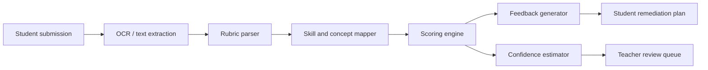

# Lumina AI LMS Blueprint

## 1. North-Star Product

The target product is not “an LMS with some AI features”.

It is:

- one personal AI learning operating system per student
- one AI teaching copilot per teacher
- one governed, explainable intelligence layer for the institution

## 2. Core Product Objects

### Student profile object

Every student should have a profile containing:

- identity and grade level
- goals and target outcomes
- course enrollments
- concept mastery map
- weak topics and misconception clusters
- preferred pace and modality
- tutor interaction history
- assignment performance history
- attention and engagement patterns
- confidence, risk, and recovery signals

### Teacher intervention object

Every teacher-facing alert should have:

- student id
- course id
- topic or concept
- problem type
- evidence
- recommended next action
- confidence score
- urgency
- suggested teacher message

### Course intelligence object

Every course should contain:

- learning outcomes
- concept graph
- module sequence
- lesson resources
- question bank links
- assignment rubric links
- tutor constraints
- PPT/export assets

## 3. Personalization Engine Design

The system should merge these signals into one profile:

- lesson completion and dwell time
- assessment correctness and latency
- assignment score and rubric breakdown
- tutor questions asked
- notes and saved artifacts
- attendance or engagement markers

Recommended pipeline:

1. Collect events in a normalized event schema.
2. Update learner profile aggregates.
3. Update concept mastery.
4. Detect weak topics and possible misconceptions.
5. Generate next best action for student and teacher.
6. Log intervention outcomes back into the profile.

## 4. Assignment Intelligence Design

Assignments should not stop at “score + feedback”.

They should produce:

- rubric scores by criterion
- extracted skills tested
- likely misconception type
- confidence score
- remediation pack suggestion
- teacher review recommendation

Recommended assignment pipeline:

## 5. Question Generation Design

Question generation should be driven by:

- target concept
- current mastery probability
- Bloom level
- difficulty band
- preferred modality
- recent mistakes

Question generator outputs should include:

- question text
- answer options
- correct option
- explanation
- concept ids
- difficulty
- Bloom level
- expected time
- remediation hint

That metadata is required if the question engine is meant to improve student profiles instead of only collecting raw scores.

## 6. AI Tutor Specialization Design

The tutor should not stay a single generic persona.

Recommended specialization layers:

- subject mode:
  - math
  - science
  - coding
  - language
  - humanities
- age or grade mode
- teacher policy mode
- learner support mode:
  - remediation
  - mastery practice
  - enrichment
  - exam prep

The tutor should always know:

- what the student is studying now
- what they recently got wrong
- what the teacher wants emphasized
- which materials are approved for the class

## 7. Teacher-Student Relationship Layer

The product should actively help the teacher manage 100 students without becoming a black box.

Required teacher AI capabilities:

- class heatmap by concept and risk
- student-by-student intervention queue
- auto-drafted feedback that teachers can edit
- weekly summary per student
- grouping suggestions for peer support or remediation
- lesson and assignment recommendations based on class weak areas

Required trust rules:

- AI recommendations must be explainable
- teacher remains the approver for high-stakes actions
- confidence and uncertainty must be visible

## 8. Course and PPT Generation Studio

Course generation and PPT generation should be part of one authoring workspace.

Recommended workflow:

1. Teacher provides topic, level, objectives, duration, and learner type.
2. System generates:
   - course outline
   - concept graph
   - module plan
   - quiz ideas
   - assignment ideas
   - presentation deck
3. Teacher reviews and edits.
4. System publishes directly into the LMS.

## 9. AI Automation Layer

Automation should cover recurring academic work, for example:

- weekly student progress reports
- teacher intervention digests
- assignment remediation generation after grading
- course kickoff setup from source documents
- PPT export before class
- end-of-week mastery snapshots

## 10. Scoring and Trust Design

Every AI-generated score should include:

- score
- explanation
- evidence span or rationale
- confidence
- escalation flag
- teacher override path

High-stakes scoring rules:

- low confidence -> force teacher review
- missing rubric -> block auto-grading
- ambiguous OCR -> request resubmission or manual check

## 11. Suggested Delivery Plan

### Phase 1

- unify learner profile
- fix assessment and assignment event ingestion
- add teacher intervention queue

### Phase 2

- upgrade question generation metadata
- add subject-specialized tutors
- add rubric-aware grading

### Phase 3

- launch automation layer
- add class-level planning copilots
- add outcome analytics and experimentation

## 12. Product KPI Suggestions

- weekly active learners
- concept mastery gain per week
- remediation completion rate
- assignment feedback turnaround time
- teacher time saved
- tutor helpfulness score
- low-confidence grading rate
- intervention success rate
