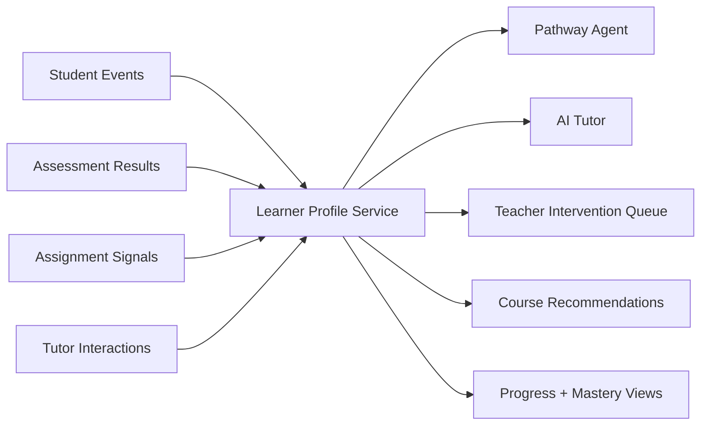

# Lumina Architecture

## 1. System Shape

Lumina is not a single application. It is a multi-surface learning platform with one main operational stack and several supporting prototypes.

### Primary production path

- `frontend/web`: Next.js web LMS for student, teacher, and admin roles
- `backend/app`: FastAPI API, business logic, stores, and services
- `backend/app/assessment`: adaptive assessment engine
- `backend/ai_engine`: tutor orchestration, pathway logic, RAG, prompts, and AI helpers
- `backend/learner_profile`: learner-state and behavior scaffolding

### Secondary or prototype paths

- `frontend/flutter_app`: Flutter mobile concept
- `frontend/mobile_preview`: lightweight mobile preview
- `Handwriting_Analysis_Project`: separate experiment
- `pathway agent`: research and architecture artifacts for the pathway system
- `training`: model training and evaluation scripts

## 2. Layered Architecture

| Layer | Main paths | Responsibility |
| --- | --- | --- |
| Presentation | `frontend/web/src/app`, `frontend/web/src/components` | Student, teacher, admin experiences |
| Client integration | `frontend/web/src/lib/api.ts`, `frontend/web/src/lib/ai-tutor` | API calls, caching, tutor routing |
| API gateway layer | `backend/app/main.py`, `backend/app/routers` | Route registration, auth, middleware, metrics |
| Domain services | `backend/app/store`, `backend/app/services` | Course, student, assignment, grading, OCR, PPT generation |
| Adaptive learning core | `backend/app/assessment`, `backend/app/pathway`, `backend/learner_profile` | Mastery, behavior, next-step logic |
| AI orchestration | `backend/ai_engine` | RAG, tutor prompts, pathway agent, guardrails |
| Persistence | Supabase tables, local JSON fallback stores, uploads, static presentations | Durable data and artifacts |

## 3. Major Product Domains

### Authentication and roles

- backend router: `backend/app/routers/auth.py`
- frontend routes: `/login`, `/student/*`, `/teacher/*`, `/admin/*`
- current model: JWT token in `sessionStorage`
- roles: `student`, `teacher`, `admin`

### Courses and learning content

- backend router: `backend/app/routers/courses.py`
- store: `backend/app/store/course_store.py`
- frontend pages:
  - student course explorer and details
  - teacher course creation and editing
- data structure: course -> modules -> lessons

### Student progress

- router: `backend/app/routers/student.py`
- stores: `student_store.py`, `analytics_store.py`, `user_data_store.py`
- core outputs:
  - enrolled courses
  - lesson completion
  - activity time
  - profile data
  - notes

### Adaptive assessment

- API router: `backend/app/assessment/api/router.py`
- engine:
  - `session_manager.py`
  - `adaptive_logic.py`
  - `knowledge_tracing.py`
  - `weakness_detector.py`
- purpose: start session, issue next question, submit answer, produce report

### AI tutor and pathway

- tutor router: `backend/app/routers/ai.py`
- supporting AI modules:
  - `backend/ai_engine/rag.py`
  - `backend/ai_engine/llm.py`
  - `backend/ai_engine/prompts.py`
  - `backend/ai_engine/swarm/pathway.py`
  - `backend/ai_engine/swarm/guardian.py`
- current personalization signals:
  - learner profile state
  - recent quiz history
  - pathway recommendation
  - course catalog
  - past conversation history

### Assignments and grading

- router: `backend/app/routers/assignments.py`
- worker: `backend/app/worker.py`
- services:
  - `storage.py`
  - `ocr_service.py`
  - `grader_service.py`
- flow: upload -> store submission -> extract text -> score -> persist report

### Teacher intelligence

- dashboard endpoints in `courses.py` and `assessment/api/router.py`
- current teacher value:
  - course list
  - enrolled students
  - aggregate mastery
  - assignment analytics
- missing teacher value:
  - intervention queue
  - recommended next action per student
  - class-level misconception clusters

### Admin and governance

- router: `backend/app/routers/admin.py`
- current focus:
  - user management
  - system status
  - AI/chat logs
- product gap:
  - formal AI policy controls
  - consent and age-policy flows
  - model configuration governance

## 4. How the Sections Connect

| From | To | Why it matters |
| --- | --- | --- |
| Student UI | `frontend/web/src/lib/api.ts` | All learning actions start in the client API layer. |
| Client API layer | FastAPI routers | Routes map UI events into domain actions. |
| Student router | student, analytics, and user-data stores | Progress and profile views are assembled from multiple stores. |
| Assessment router | session manager and knowledge tracing | Assessment creates mastery evidence. |
| Tutor router | learner profile, pathway, RAG, course store, conversation logs | Tutor quality depends on real learner state and content context. |
| Assignment router | storage, worker, OCR, grader | Assignment scoring depends on a background pipeline. |
| Course router | course store and analytics | Teacher authoring and dashboard insights share the same course records. |
| Teacher views | course, assignment, and analytics data | Teacher action depends on joining content and learner evidence. |

## 5. Personal LMS Architecture

The future architecture should treat the learner profile as the shared brain of the platform.

## 6. Current Architecture Risks

- learner profile, tutor memory, and course progress still use different persistence patterns
- several product claims in the README are ahead of what the code currently guarantees
- teacher analytics are still mostly aggregate, not action-oriented
- assessment currently adapts difficulty but not full curriculum sequencing
- assignment scoring is basic semantic grading, not calibrated rubric grading
- frontend still contains some placeholder or mock-era assumptions

## 7. Architectural Direction

To become a full AI LMS, Lumina should converge on these rules:

1. One learner profile service should feed every adaptive system.
2. Every AI action should produce structured evidence, not only plain text.
3. Teacher-facing insights should explain why the system recommends an action.
4. Content generation should write reusable course objects, not only free-form text.
5. Scoring should always include confidence, rationale, and escalation paths for teacher review.
