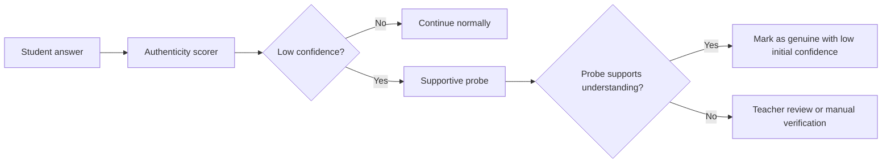

# Authenticity And Originality Engine

Last updated: 2026-03-14

## Purpose

This document defines a non-punitive authenticity system for student responses.

The goal is not surveillance for its own sake.
The goal is to distinguish:

- genuine understanding
- low-confidence guessing
- externally sourced answers
- answers that look strong but cannot be explained

The system should support learners, not trap them.

## Current Repo Reality

Status: `target-state architecture`

What exists today:

- documentation mentions copy-paste and originality ideas in places such as `docs/SCORING_SYSTEM.md`
- assignment, tutor, and assessment systems can conceptually ask follow-up questions

What was **not** found as a live runtime system:

- frontend keystroke telemetry pipeline
- paste event ingestion
- backspace or edit-history scoring
- semantic fingerprint service
- supportive follow-up probe flow wired into grading or assessment

## Design Principle

Authenticity checks should escalate like this:

1. observe unusual signal
2. gather more evidence
3. ask a supportive follow-up probe
4. only then decide whether teacher review is needed

Never:

- auto-fail the learner on one suspicious signal
- penalize assistive technology use
- equate polished writing with cheating

## Signal Families

The screenshots repeatedly show the same six-signal stack. That should remain the canonical first-pass design:

1. keystroke burst pattern
2. vocabulary complexity jump
3. answer-time versus difficulty mismatch
4. zero-backspace or correction anomaly
5. semantic fingerprint drift
6. supportive follow-up probe

## 1. Interaction signals

| Signal | Meaning |
| --- | --- |
| paste burst detected | large answer appears at once |
| typing cadence variance | natural typing usually contains pauses and rhythm |
| backspace ratio | genuine writing often includes corrections |
| revision depth | authentic drafting usually includes edits |

## 2. Timing signals

| Signal | Meaning |
| --- | --- |
| think-time versus difficulty | very hard question answered instantly may need review |
| time-to-first-character | long pause then full text burst can be suspicious |
| answer latency history | compare against learner's own baseline, not global only |

## 3. Linguistic signals

| Signal | Meaning |
| --- | --- |
| vocabulary jump | sudden shift far above learner's normal range |
| semantic fingerprint drift | phrasing style departs strongly from historical patterns |
| concept-explanation mismatch | polished answer but weak understanding on follow-up |

## 4. Probe signals

| Signal | Meaning |
| --- | --- |
| follow-up simplification success | learner can restate in their own words |
| targeted sub-step success | learner can explain one part of the answer |
| contradiction under probing | confident text collapses under small probes |

## Screenshot-Aligned Signal Notes

The screenshots attach especially concrete examples to these signals:

- pasted text often arrives in one burst instead of character-by-character
- hard questions answered unusually fast should be judged against the learner's own baseline
- zero backspaces in a long typed answer is unusual enough to justify a follow-up check
- semantic drift should compare against the learner's historical phrasing profile, not only a global class baseline

## Proposed Event Contract

The engine should emit structured events into the canonical learner-state pipeline.

```json
{
  "event_type": "authenticity_observation",
  "payload": {
    "response_id": "resp-123",
    "paste_detected": true,
    "typing_variance": 0.08,
    "backspace_ratio": 0.00,
    "answer_latency_seconds": 3.1,
    "difficulty": 0.82,
    "vocabulary_jump": 0.77,
    "semantic_fingerprint_drift": 0.64
  }
}
```

## Authenticity Score

This score should be used as a review signal, not as a final grade.

### Proposed formula

```python
authenticity_score = (
    0.20 * typing_rhythm_score
    + 0.15 * edit_pattern_score
    + 0.20 * think_time_fit
    + 0.20 * lexical_consistency
    + 0.15 * semantic_fingerprint_consistency
    + 0.10 * followup_probe_success
)
```

Interpretation:

- `0.75-1.00`: likely genuine
- `0.45-0.74`: mixed evidence, probe recommended
- `< 0.45`: teacher review or supportive probe required

## Supportive Probe Flow

This is the most important part of the system.

When authenticity risk is high, ask a short, respectful follow-up.

### Example probes

- "Explain just one sentence of your answer in simpler words."
- "What made you choose that conclusion?"
- "Can you show the first step only?"
- "Which word in your answer is most important, and why?"

### Flow



## Fairness And Accessibility Guardrails

The authenticity engine must explicitly account for:

- assistive writing tools
- speech-to-text
- motor impairments affecting typing
- multilingual learners
- learners who naturally write tersely or formally

Required rules:

- compare a learner against their own baseline first
- do not infer dishonesty from one signal
- allow teacher override on every flagged case
- store reasons for every flag

## Implementation Targets In This Repo

| Goal | File targets |
| --- | --- |
| client-side answer telemetry capture | `frontend/web/src/app/student/assessment/page.tsx`, tutor chat and assignment response UIs |
| authenticity event ingestion | `backend/app/routers/ai.py`, `backend/app/assessment/api/router.py`, assignment routes |
| authenticity scorer and follow-up probe policy | `backend/app/services/personalization_service.py` or adjacent service |
| teacher review surface | teacher dashboard and submission review pages |

## Definition Of Done

The authenticity engine is ready when:

- suspicious responses generate structured authenticity observations
- the system asks a supportive follow-up probe before high-friction escalation
- teachers can inspect evidence and override flags
- authenticity affects confidence and review routing, not automatic punishment

## Recommended Companion Docs

- `docs/VISION_ALIGNMENT_AUDIT.md`
- `docs/STUDENT_KPI_ENGINE.md`
- `docs/TEACHER_REAL_TIME_DASHBOARD.md`
