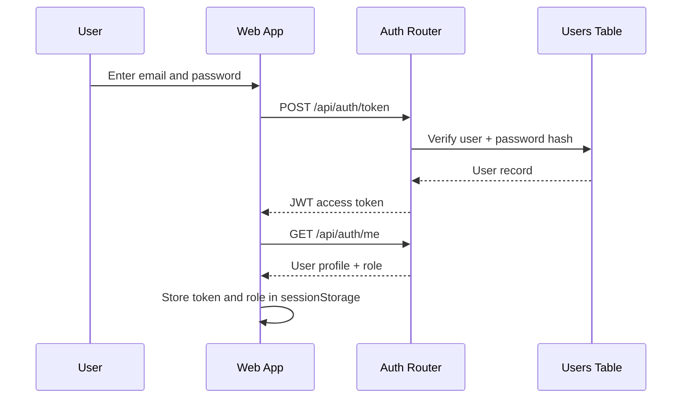
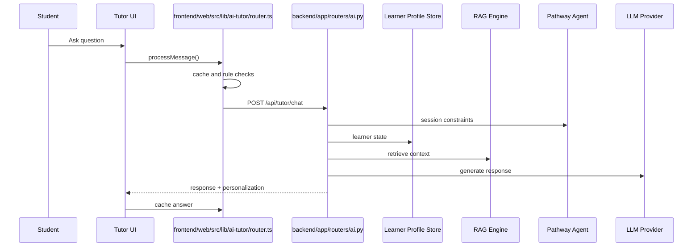
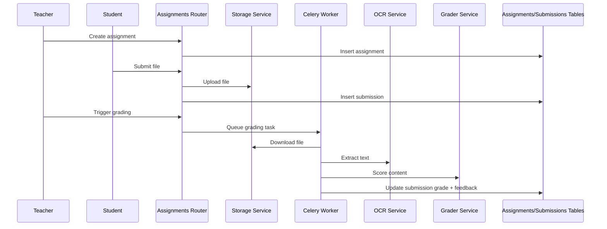
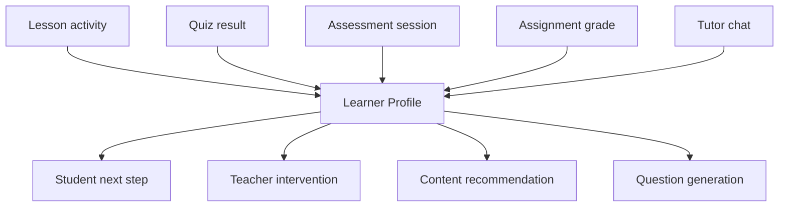

# Lumina Connection Map

This document explains how the main user journeys move through the current system and where the data is stored at each step.

## 1. Source of Truth Map

| Data type | Current source of truth | Used by |
| --- | --- | --- |
| Users and roles | `users` table | auth, student profile, admin |
| Courses | `courses` table | student catalog, teacher authoring, tutor context |
| Enrollments and progress | `progress` table | dashboard, course progress, teacher views |
| User notes and quiz history | `user_data` table | student profile, tutor context, learner bootstrap |
| Assessment sessions | `assessment_sessions` table | assessment reports, mastery views, analytics |
| Assignments | `assignments` table | teacher workflows |
| Submissions | `submissions` table | grading and reports |
| Tutor session memory | `backend/data/tutor_sessions.json` | deduplication and tutor continuity |
| Learner profile fallback | `backend/data/learner_profiles.json` | pathway and personalization fallback |
| Generated presentations | `backend/static/presentations` | teacher or tutor PPT download |

## 2. Authentication Flow

## 3. Student Learning Flow

### Browse and enroll

1. Student opens `/student/courses`.
2. Frontend calls `GET /api/courses`.
3. `CourseStore` returns normalized course records.
4. Student clicks enroll.
5. Frontend calls `POST /api/student/enroll`.
6. `StudentStore` writes a `progress` record.

### Learn and complete lessons

1. Student opens `/student/courses/[courseId]`.
2. Frontend calls `GET /api/courses/{courseId}`.
3. Student opens a lesson.
4. Frontend calls `POST /api/student/complete-lesson`.
5. `StudentStore` appends `completedLessons` and recalculates progress.
6. Frontend also logs time through `POST /api/student/log-activity`.

## 4. AI Tutor Flow

### Important connection details

- tutor personalization currently depends on:
  - learner profile state
  - quiz history summary
  - conversation history
  - pathway recommendation
  - course catalog context
- tutor memory is currently session-based, not a full long-term pedagogical memory
- subject specialization is still a roadmap item, not fully implemented

## 5. Assessment Flow

1. Student starts an assessment from `/student/assessment`.
2. Frontend calls `POST /api/assessment/start`.
3. `session_manager.create_session()` creates an assessment session.
4. Frontend calls `GET /api/assessment/next-question/{session_id}`.
5. Question generator returns the next question at current difficulty.
6. Frontend submits answer to `POST /api/assessment/submit`.
7. Adaptive logic updates session difficulty.
8. Session report is available through `GET /api/assessment/report/{session_id}`.
9. Authenticated mastery view is available through `GET /api/assessment/student/mastery`.

### What is connected today

- assessment sessions persist
- reports are generated
- student mastery can be read

### What still needs tighter connection

- question metadata should always map to concepts
- concept mastery should feed pathway and remediation automatically
- teacher dashboards should surface misconception patterns from assessment data

## 6. Assignment Flow

### Supported extraction path after this pass

- images -> OCR
- PDFs -> text extraction via `pypdf`
- text files -> direct text extraction

## 7. Course Generation and PPT Flow

### AI course generation

1. Teacher or system calls `POST /api/generate-course`.
2. Backend builds a curriculum-design prompt.
3. LLM returns JSON course outline.
4. Frontend can transform the outline into course records.

### Assignment-based course generation

1. Call `POST /api/generate-course-from-assignment`.
2. Backend reads assignment plus optional submission grade.
3. Difficulty is adjusted from performance band.
4. LLM returns a remediation or enrichment course outline.

### PPT generation

1. Frontend or tutor calls `POST /api/tutor/generate-ppt`.
2. Backend generates a JSON slide plan.
3. `PPTGenerator` writes a `.pptx` file.
4. Presentation is stored in `static/presentations`.

## 8. Teacher Monitoring Flow

Current flow:

1. Teacher opens dashboard.
2. Frontend calls `/api/courses/teacher/dashboard`.
3. Backend joins teacher courses with analytics.
4. Teacher opens students list via `/api/courses/teacher/students`.
5. Teacher reviews assignments and grading reports.

Missing flow:

- class-level alerting
- recommended interventions
- “why this student is at risk” explanations
- teacher approval for AI-generated remediation plans

## 9. Target Data Flow for a Personal LMS

The final system should feed every learner event into one shared profile loop:

That is the connection pattern the rest of the roadmap should follow.
