# Lumina: Comprehensive Data Flow Documentation
## Request Processing, State Management, and Real-Time Adaptation

**Version:** 1.0
**Last Updated:** March 2026
**Target Audience:** Backend developers, DevOps engineers, AI researchers

---

## Table of Contents

1. [Overview](#overview)
2. [Authentication Flow](#authentication-flow)
3. [Student Learning Flow](#student-learning-flow)
4. [AI Tutor 3-Tier Response Flow](#ai-tutor-3-tier-response-flow)
5. [Assessment & Knowledge Tracing Flow](#assessment--knowledge-tracing-flow)
6. [Adaptive Pathway Flow](#adaptive-pathway-flow)
7. [Course Generation Flow](#course-generation-flow)
8. [Assignment Grading Flow](#assignment-grading-flow)
9. [PPT Generation Flow](#ppt-generation-flow)
10. [Handwriting Analysis Flow](#handwriting-analysis-flow)
11. [Behavior Tracking & Real-Time Adaptation](#behavior-tracking--real-time-adaptation)
12. [Master Data Flow Diagram](#master-data-flow-diagram)
13. [State Management Architecture](#state-management-architecture)
14. [Error Handling & Resilience](#error-handling--resilience)

---

## Overview

Lumina's data flows connect students, teachers, content, and AI agents in a tightly integrated system. Every interaction generates data that feeds into personalization models, which in turn influence the next interaction.

**Core Principle:** *Closed-loop learning system* - User interaction → Data capture → Analysis → Model update → Personalization → Next interaction

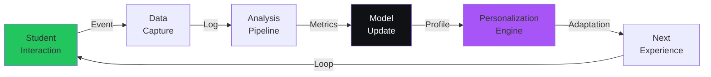

---

## Authentication Flow

### Login / JWT Token Generation

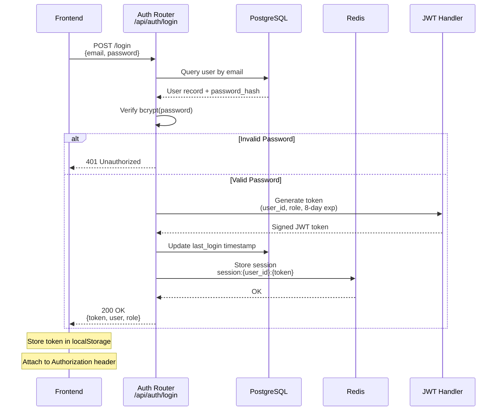

**Key Points:**
- JWT expiry: 8 days
- Token payload includes: `user_id`, `role`, `permissions`, `exp`
- Session stored in Redis for quick validation
- Refresh endpoint allows token renewal without re-login

**Backend Implementation:**

```python
# backend/app/routers/auth.py

@router.post("/login")
async def login(credentials: LoginRequest, db: Session = Depends(get_db)):
    # Find user
    user = db.query(User).filter(User.email == credentials.email).first()

    if not user or not verify_password(credentials.password, user.password_hash):
        raise HTTPException(status_code=401, detail="Invalid credentials")

    # Generate JWT
    token = create_jwt_token(
        user_id=user.id,
        role=user.role,
        expires_in=timedelta(days=8)
    )

    # Store session in Redis
    await redis.set(
        f"session:{user.id}:{token}",
        json.dumps({
            'role': user.role,
            'permissions': get_permissions(user.role),
            'created_at': datetime.now().isoformat()
        }),
        ex=8*24*3600  # 8 days
    )

    # Update last login
    user.last_login = datetime.now()
    db.commit()

    return {
        'token': token,
        'user': user_schema.dump(user),
        'role': user.role
    }
```

### Token Validation & Role-Based Redirect

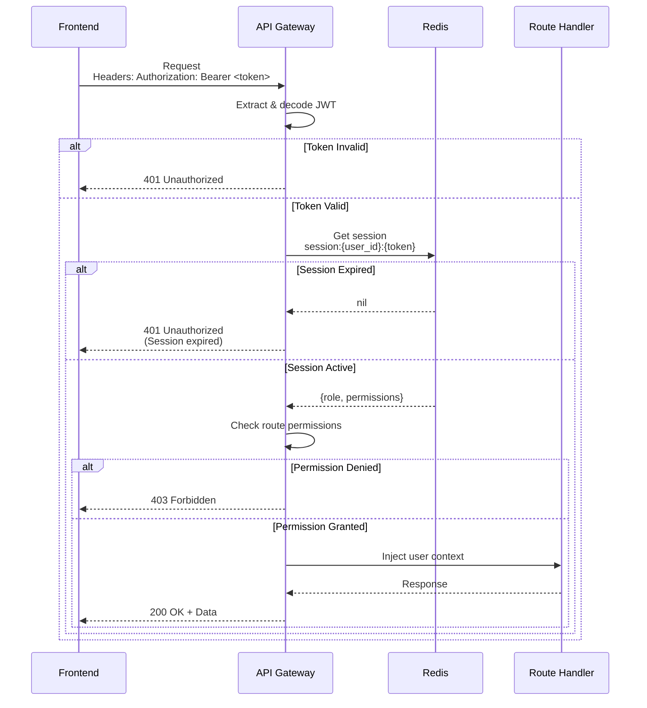

**Frontend Role-Based Redirect:**

```typescript
// frontend/hooks/useAuth.ts

export function useAuth() {
  const router = useRouter()
  const [user, setUser] = useState(null)

  useEffect(() => {
    // Check stored token
    const token = localStorage.getItem('auth_token')

    if (!token) {
      router.push('/login')
      return
    }

    // Verify token still valid
    api.get('/api/auth/me').then(response => {
      const { user } = response.data

      setUser(user)

      // Role-based redirect
      switch (user.role) {
        case 'student':
          router.push('/student/dashboard')
          break
        case 'teacher':
          router.push('/teacher/dashboard')
          break
        case 'admin':
          router.push('/admin/dashboard')
          break
        default:
          router.push('/login')
      }
    }).catch(() => {
      // Token invalid
      localStorage.removeItem('auth_token')
      router.push('/login')
    })
  }, [])

  return { user }
}
```

---

## Student Learning Flow

### Student Opens Lesson → AI Tutor Activated

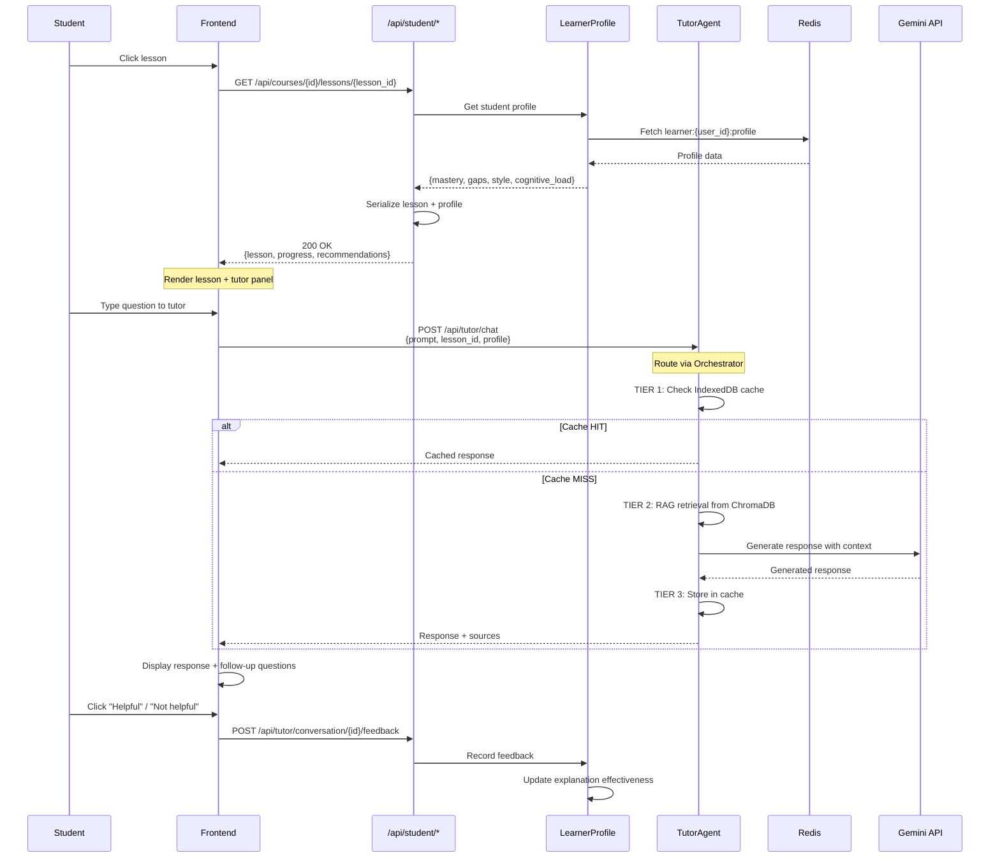

**Key Components:**

1. **Learner Profile Injection:** Every request includes student's learning profile (mastery, gaps, style)
2. **3-Tier Response:** Response generation checks cache, then RAG, then LLM
3. **Feedback Loop:** Student feedback on tutor responses trains personalization

**Response Cache in IndexedDB:**

```typescript
// frontend/lib/cache.ts

export class LuminaCache {
  private db: IDBDatabase

  async getTutorResponse(courseId: string, prompt: string) {
    const hash = hashRequest(courseId, prompt)
    const tx = this.db.transaction('responses', 'readonly')
    const store = tx.objectStore('responses')
    const result = await store.get(hash)

    if (result && !isExpired(result.expiry)) {
      return result.response
    }
    return null
  }

  async cacheTutorResponse(courseId: string, prompt: string, response: any) {
    const hash = hashRequest(courseId, prompt)
    const tx = this.db.transaction('responses', 'readwrite')
    const store = tx.objectStore('responses')

    await store.put({
      hash,
      courseId,
      prompt,
      response,
      expiry: Date.now() + 7 * 24 * 3600 * 1000,  // 7 days
      timestamp: Date.now()
    })
  }
}
```

---

## AI Tutor 3-Tier Response Flow

### Detailed Multi-Tier Response Generation

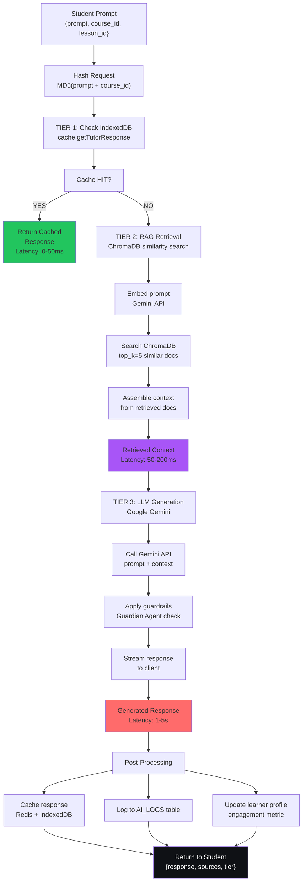

### Tier 1: IndexedDB Cache

```python
# backend/app/services/cache_service.py

class CacheService:
    """3-tier caching strategy"""

    async def get_cached_response(self, request_hash: str) -> Optional[Dict]:
        """Check Redis/IndexedDB for cached response"""
        # First check Redis (backend cache)
        redis_key = f"cache:response:{request_hash}"
        cached = await redis.get(redis_key)

        if cached:
            return json.loads(cached)

        # Client-side IndexedDB check is done on frontend
        return None

    async def cache_response(
        self,
        request_hash: str,
        response: Dict,
        ttl: int = 7 * 24 * 3600  # 7 days
    ):
        """Cache response in Redis"""
        await redis.set(
            f"cache:response:{request_hash}",
            json.dumps(response),
            ex=ttl
        )
```

### Tier 2: RAG Retrieval from ChromaDB

```python
# backend/app/services/rag_service.py

class RAGService:
    """Retrieval-Augmented Generation service"""

    async def retrieve_context(
        self,
        prompt: str,
        course_id: str,
        top_k: int = 5
    ) -> List[Dict]:
        """Retrieve relevant course materials from ChromaDB"""

        # Embed the prompt
        embeddings = await gemini_client.embed(prompt)

        # Search ChromaDB for similar documents
        results = chromadb.query(
            query_embeddings=[embeddings],
            where={"course_id": course_id},
            n_results=top_k
        )

        # Format results
        context = []
        for i, doc_id in enumerate(results['ids'][0]):
            context.append({
                'document': results['documents'][0][i],
                'distance': results['distances'][0][i],
                'source': results['metadatas'][0][i].get('source')
            })

        return context

    def assemble_system_prompt(self, context: List[Dict]) -> str:
        """Create system prompt with context"""

        context_text = "\n\n".join([
            f"Source: {doc['source']}\n{doc['document']}"
            for doc in context
        ])

        return f"""
        You are a dedicated AI tutor for Lumina LMS.
        Use SOCRATIC METHOD: guide students through discovery.

        Student's course materials:
        {context_text}

        Rules:
        1. Ask guiding questions BEFORE giving answers
        2. Adapt to student's learning level
        3. Encourage metacognition (thinking about thinking)
        4. Provide sources for claims
        """
```

### Tier 3: LLM Generation with Streaming

```python
# backend/app/routers/ai.py

@router.post("/tutor/chat")
async def tutor_chat(request: TutorChatRequest):
    """3-tier AI response with streaming"""

    # TIER 1: Cache check
    request_hash = hash_request(request.prompt, request.course_id)
    cached = await cache_service.get_cached_response(request_hash)

    if cached:
        return JSONResponse({
            'response': cached['response'],
            'sources': cached['sources'],
            'tier': 1,
            'latency_ms': 10
        })

    # TIER 2: RAG retrieval
    context = await rag_service.retrieve_context(
        request.prompt,
        request.course_id
    )

    system_prompt = rag_service.assemble_system_prompt(context)

    # TIER 3: LLM generation
    start_time = time.time()

    async def generate():
        async with gemini_client.generate_stream(
            prompt=request.prompt,
            system=system_prompt,
            temperature=0.7
        ) as stream:
            full_response = ""

            async for chunk in stream:
                full_response += chunk
                yield f"data: {json.dumps({'chunk': chunk})}\n\n"

        # Post-processing
        await cache_service.cache_response(request_hash, {
            'response': full_response,
            'sources': [doc['source'] for doc in context]
        })

        # Log interaction
        await ai_log_service.log(
            user_id=request.user_id,
            agent_type='tutor',
            prompt=request.prompt,
            response=full_response,
            latency_ms=time.time() - start_time
        )

        # Update learner profile
        await learner_profile.update_engagement(
            request.user_id,
            event_type='tutor_chat',
            duration=time.time() - start_time
        )

    return StreamingResponse(generate(), media_type="text/event-stream")
```

---

## Assessment & Knowledge Tracing Flow

### Student Takes Quiz → BKT/DKT Update → Mastery Score

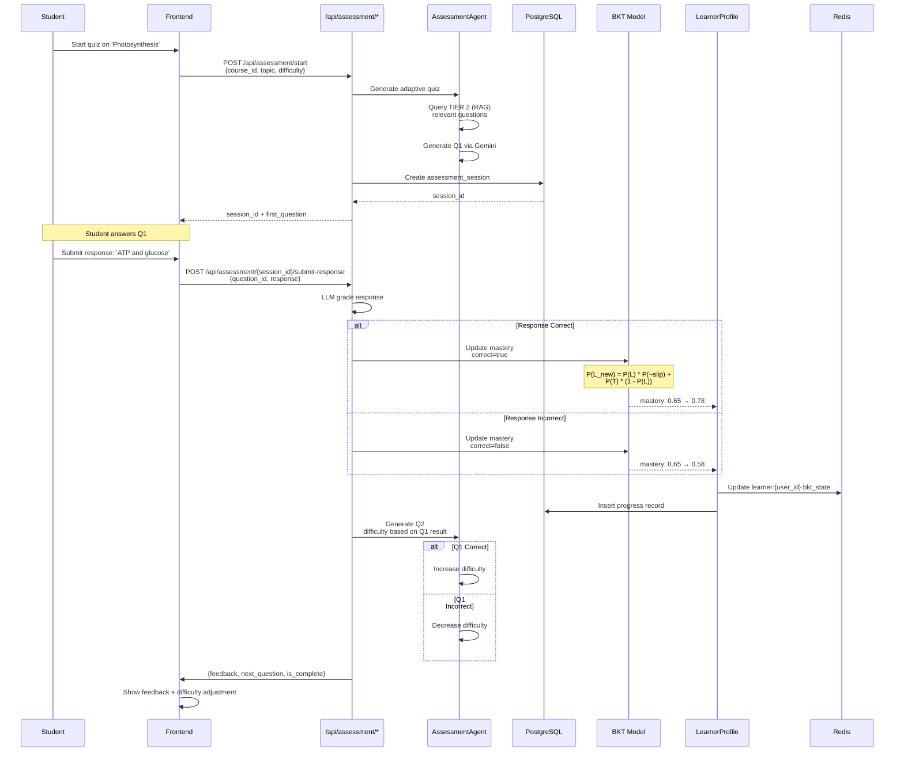

**Full Assessment Session Lifecycle:**

```python
# backend/ai_engine/swarm/assessment.py

class AssessmentAgent:
    """Dynamic quiz generation and adaptive difficulty"""

    async def start_session(
        self,
        user: User,
        course_id: str,
        topic: str,
        difficulty: str = "medium"
    ) -> AssessmentSession:
        """Initiate assessment session"""

        session = AssessmentSession(
            user_id=user.id,
            course_id=course_id,
            topic=topic,
            initial_difficulty=difficulty,
            current_difficulty=difficulty,
            started_at=datetime.now()
        )

        await db.add(session)
        await db.commit()

        return session

    async def submit_response(
        self,
        session: AssessmentSession,
        question_id: str,
        student_response: str
    ) -> SubmissionResult:
        """Process student response and update mastery"""

        # Grade response via LLM
        grading = await self._grade_response(
            question=session.current_question,
            response=student_response
        )

        is_correct = grading['is_correct']
        feedback = grading['feedback']

        # Store response
        response_record = AssessmentResponse(
            session_id=session.id,
            question_id=question_id,
            student_response=student_response,
            is_correct=is_correct,
            feedback=feedback,
            response_time_sec=grading['response_time']
        )

        await db.add(response_record)

        # Update BKT mastery
        concept_id = session.current_question.primary_concept
        new_mastery = await self.bkt_model.update_mastery(
            concept_id=concept_id,
            user_id=session.user_id,
            correct=is_correct
        )

        # Update learner profile
        await learner_profile.update_mastery(
            user_id=session.user_id,
            concept=concept_id,
            mastery=new_mastery
        )

        # Adaptive difficulty
        if is_correct:
            session.current_difficulty = self._increase_difficulty(
                session.current_difficulty
            )
        else:
            session.current_difficulty = self._decrease_difficulty(
                session.current_difficulty
            )

        await db.commit()

        return SubmissionResult(
            is_correct=is_correct,
            feedback=feedback,
            mastery_change=new_mastery - grading['previous_mastery'],
            next_question=await self._generate_next_question(session)
        )

    async def _grade_response(self, question: Question, response: str):
        """LLM-powered response grading"""

        grade_prompt = f"""
        Question: {question.text}
        Answer Key: {question.answer_key}
        Student Response: {response}

        Evaluate the student response:
        1. Is it correct? (true/false)
        2. Provide constructive feedback
        3. Identify misconceptions if present

        Return JSON: {{"is_correct", "feedback", "misconception"}}
        """

        result = await gemini_client.generate(grade_prompt)
        return json.loads(result)
```

### BKT Model Update Deep Dive

```python
# backend/learner_profile/models/bkt.py

class BayesianKnowledgeTracer:
    """BKT implementation with parameter estimation"""

    def __init__(self):
        # Concept-specific parameters
        self.params = {
            'photosynthesis': {
                'p_l0': 0.1,    # Prior knowledge
                'p_t': 0.2,     # Transition (learning rate)
                'p_g': 0.1,     # Guess (lucky correct)
                'p_s': 0.1      # Slip (careless mistake)
            }
        }

    async def update_mastery(
        self,
        concept_id: str,
        user_id: str,
        correct: bool
    ) -> float:
        """
        Bayesian update of mastery probability

        Model state: P(L_t) = probability student learned skill at time t

        Update rule:
        if correct:
            P(L_t) = P(L_t-1 * P(C|L)) / P(C)
            where P(C|L) = 1 - p_s (probability of correct if learned)
                  P(C) = P(L_t-1)(1-p_s) + (1-P(L_t-1))p_g
        """

        # Get current mastery
        current_mastery = await self._get_mastery(concept_id, user_id)

        params = self.params.get(concept_id, {
            'p_l0': 0.1,
            'p_t': 0.2,
            'p_g': 0.1,
            'p_s': 0.1
        })

        p_correct_if_learned = 1 - params['p_s']
        p_correct_if_not_learned = params['p_g']

        # Probability of observing this response
        p_response = (
            current_mastery * (p_correct_if_learned if correct else params['p_s']) +
            (1 - current_mastery) * (p_correct_if_not_learned if correct else 1 - p_correct_if_not_learned)
        )

        # Bayes rule: P(L|response)
        if correct:
            new_mastery = (current_mastery * p_correct_if_learned) / p_response
        else:
            new_mastery = (current_mastery * params['p_s']) / p_response

        # Learning transition: probability of learning from attempt
        new_mastery += params['p_t'] * (1 - new_mastery)

        # Clamp to [0, 1]
        new_mastery = max(0.0, min(1.0, new_mastery))

        # Store updated mastery
        await self._set_mastery(concept_id, user_id, new_mastery)

        return new_mastery

    async def _get_mastery(self, concept_id: str, user_id: str) -> float:
        """Retrieve current mastery estimate"""
        # Check Redis first (hot cache)
        key = f"learner:{user_id}:bkt_state"
        state = await redis.hget(key, concept_id)

        if state:
            return float(state)

        # Fall back to DB
        record = await db.query(Progress).filter(
            Progress.user_id == user_id,
            Progress.concept_id == concept_id
        ).first()

        return record.mastery_score if record else 0.1
```

---

## Adaptive Pathway Flow

### Behavior Signals → Pathway Agent → Next Content Recommendation

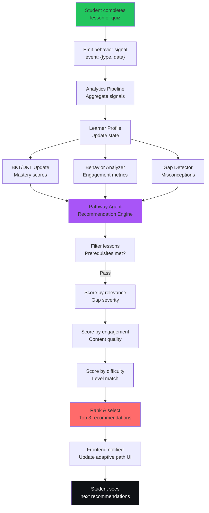

### Detailed Pathway Algorithm

```python
# backend/ai_engine/swarm/pathway.py

class PathwayAgent:
    """Adaptive curriculum recommendation"""

    async def recommend_next_content(
        self,
        user: User,
        num_recommendations: int = 3
    ) -> List[ContentRecommendation]:
        """
        Generate personalized learning pathway

        Algorithm:
        1. Get learner's mastery state (BKT/DKT)
        2. Identify knowledge gaps
        3. Retrieve available lessons
        4. Filter by prerequisites
        5. Score by: gap_relevance, engagement_potential, difficulty_match
        6. Rank and return top N
        """

        # Get learner state
        mastery_data = await learner_profile.get_mastery_all_concepts(user.id)
        gaps = await gap_detector.get_misconceptions(user.id)
        behavior = await behavior_analyzer.get_engagement_profile(user.id)
        cognitive_load = await learner_profile.get_cognitive_load(user.id)

        # Avoid cognitive overload
        if cognitive_load > 80:
            # Recommend easier/shorter content
            difficulty_preference = 'easy'
        elif cognitive_load > 60:
            difficulty_preference = 'medium'
        else:
            difficulty_preference = 'adaptive'

        # Get available lessons
        all_lessons = await db.query(Lesson).all()

        recommendations = []

        for lesson in all_lessons:
            # Filter 1: Prerequisites
            if not self._prerequisites_met(lesson, mastery_data):
                continue

            # Filter 2: Already completed
            if mastery_data.get(lesson.primary_concept, 0) > 0.9:
                continue

            # Score 1: Gap relevance (0-1)
            gap_relevance = self._calculate_gap_relevance(
                lesson.primary_concept,
                gaps,
                mastery_data
            )

            # Score 2: Engagement potential (0-1)
            engagement_score = self._calculate_engagement_potential(
                lesson,
                behavior.learning_style
            )

            # Score 3: Difficulty match (0-1)
            current_mastery = mastery_data.get(lesson.primary_concept, 0.5)
            difficulty_match = 1.0 - abs(current_mastery - 0.5)

            # Composite score
            composite_score = (
                gap_relevance * 0.4 +
                engagement_score * 0.3 +
                difficulty_match * 0.3
            )

            # Cognitive load adjustment
            if cognitive_load > 70 and lesson.estimated_duration > 30:
                composite_score *= 0.7  # Penalize long lessons

            recommendations.append(ContentRecommendation(
                lesson_id=lesson.id,
                lesson_title=lesson.title,
                score=composite_score,
                gap_addresses=gap_relevance > 0.5,
                reason=self._generate_recommendation_reason(
                    gap_relevance,
                    engagement_score,
                    difficulty_match
                )
            ))

        # Sort by score
        recommendations.sort(key=lambda x: x.score, reverse=True)

        # Return top N
        return recommendations[:num_recommendations]

    def _calculate_gap_relevance(
        self,
        concept: str,
        gaps: List[str],
        mastery: Dict[str, float]
    ) -> float:
        """How relevant is this lesson to student's gaps?"""

        if concept not in gaps:
            return 0.0

        # Gap severity = 1 - mastery
        severity = 1 - mastery.get(concept, 0)
        return severity

    def _calculate_engagement_potential(
        self,
        lesson: Lesson,
        learning_style: str
    ) -> float:
        """Based on content type + learning style"""

        style_match = {
            'visual': 0.9 if lesson.has_diagrams else 0.3,
            'auditory': 0.9 if lesson.has_video else 0.3,
            'kinesthetic': 0.9 if lesson.is_interactive else 0.3,
            'reading': 0.9 if lesson.has_text else 0.3
        }

        base_score = style_match.get(learning_style, 0.5)

        # Boost by historical completion rate
        completion_rate = lesson.completion_rate
        return base_score * (0.5 + completion_rate / 2)

    def _generate_recommendation_reason(
        self,
        gap_relevance: float,
        engagement: float,
        difficulty: float
    ) -> str:
        """Human-readable explanation for recommendation"""

        reasons = []

        if gap_relevance > 0.7:
            reasons.append("addresses a key gap")
        if engagement > 0.7:
            reasons.append("matches your learning style")
        if 0.4 < difficulty < 0.6:
            reasons.append("optimal difficulty level")
        elif difficulty < 0.4:
            reasons.append("reinforces basics")
        else:
            reasons.append("pushes you forward")

        return "Recommended because it " + ", ".join(reasons)
```

### Frontend Adaptive Pathway Component

```typescript
// frontend/components/Student/AdaptivePathway.tsx

export function AdaptivePathway() {
  const [recommendations, setRecommendations] = useState<ContentRecommendation[]>([])
  const [loading, setLoading] = useState(false)
  const [cognitiveLoad, setCognitiveLoad] = useState(0)

  useEffect(() => {
    fetchAdaptivePathway()
  }, [])

  const fetchAdaptivePathway = async () => {
    setLoading(true)

    const response = await api.get('/api/student/adaptive-pathway')

    setRecommendations(response.data.recommended_lessons)
    setCognitiveLoad(response.data.cognitive_load)

    setLoading(false)
  }

  return (
    <div className="adaptive-pathway">
      <h2>Your Personalized Learning Path</h2>

      {cognitiveLoad > 70 && (
        <div className="alert alert-info">
          You seem focused right now. Consider a break after the next lesson!
        </div>
      )}

      <div className="recommendations-grid">
        {recommendations.map((rec, idx) => (
          <LessonRecommendationCard
            key={rec.lesson_id}
            lesson={rec}
            rank={idx + 1}
            onClick={() => navigateToLesson(rec.lesson_id)}
          />
        ))}
      </div>

      <button onClick={fetchAdaptivePathway} disabled={loading}>
        Refresh Pathway
      </button>
    </div>
  )
}

interface LessonRecommendationCardProps {
  lesson: ContentRecommendation
  rank: number
}

function LessonRecommendationCard({ lesson, rank }: LessonRecommendationCardProps) {
  return (
    <div className="card recommendation-card">
      <div className="rank-badge">{rank}</div>

      <h3>{lesson.lesson_title}</h3>
      <p className="reason">{lesson.reason}</p>

      {lesson.gap_addresses && (
        <span className="badge badge-warning">Addresses gap</span>
      )}

      <div className="score-meter">
        <div
          className="score-fill"
          style={{ width: `${lesson.score * 100}%` }}
        />
      </div>

      <button className="btn-primary">Start Lesson</button>
    </div>
  )
}
```

---

## Course Generation Flow

### Teacher Uploads PDF → Ingestion → Vectorization → AI Course Structure

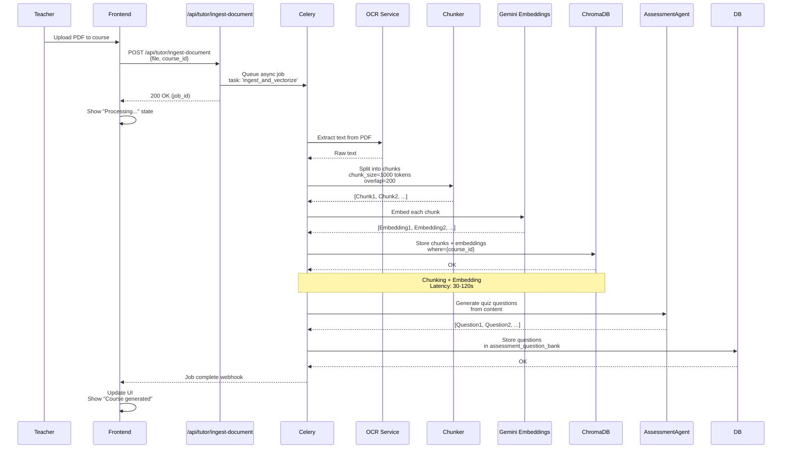

**Detailed Chunking & Embedding:**

```python
# backend/app/services/document_ingestion.py

class DocumentIngestionService:
    """Process course materials into embeddings"""

    async def ingest_document(
        self,
        file_path: str,
        course_id: str
    ) -> IngestResult:
        """Ingest document and vectorize"""

        # Extract text from PDF
        text = await self._extract_text(file_path)

        # Chunk the text
        chunks = await self._chunk_text(text, chunk_size=1000, overlap=200)

        # Embed chunks
        embeddings = await self._embed_chunks(chunks)

        # Store in ChromaDB
        await self._store_in_chromadb(chunks, embeddings, course_id)

        return IngestResult(
            num_chunks=len(chunks),
            total_tokens=sum(len(chunk.split()) for chunk in chunks)
        )

    async def _chunk_text(
        self,
        text: str,
        chunk_size: int = 1000,
        overlap: int = 200
    ) -> List[str]:
        """Split text into overlapping chunks"""

        tokens = text.split()
        chunks = []

        for i in range(0, len(tokens), chunk_size - overlap):
            chunk = " ".join(tokens[i:i + chunk_size])
            chunks.append(chunk)

        return chunks

    async def _embed_chunks(self, chunks: List[str]) -> List[List[float]]:
        """Generate embeddings for each chunk"""

        embeddings = []

        for chunk in chunks:
            embedding = await gemini_client.embed(chunk)
            embeddings.append(embedding)

        return embeddings

    async def _store_in_chromadb(
        self,
        chunks: List[str],
        embeddings: List[List[float]],
        course_id: str
    ):
        """Store in ChromaDB vector database"""

        chromadb.upsert(
            ids=[f"{course_id}:chunk:{i}" for i in range(len(chunks))],
            documents=chunks,
            embeddings=embeddings,
            metadatas=[
                {
                    'course_id': course_id,
                    'chunk_index': i,
                    'source': 'pdf_ingest'
                }
                for i in range(len(chunks))
            ]
        )
```

### Course Structure Generation via AI

```python
# backend/app/routers/tutor.py (teacher use case)

@router.post("/tutor/generate-course")
async def generate_course(request: GenerateCourseRequest):
    """
    Teacher provides topic + level.
    AI generates complete course structure.
    """

    # Step 1: Generate course outline
    outline_prompt = f"""
    Create a detailed course outline for: "{request.topic}"
    Level: {request.level}
    Duration: {request.duration} hours

    Include:
    - Learning objectives
    - Module structure (3-5 modules)
    - Each module's key concepts
    - Assessment strategy

    Return as JSON
    """

    outline = await gemini_client.generate(outline_prompt)
    outline_data = json.loads(outline)

    # Step 2: Generate lesson content for each module
    lessons = []

    for module_idx, module in enumerate(outline_data['modules']):
        for lesson_idx, lesson_title in enumerate(module['lessons']):
            lesson_prompt = f"""
            Generate lesson content for:
            Topic: {lesson_title}
            Module: {module['title']}
            Overall course: {request.topic}

            Include:
            - Lesson objective
            - Introduction (2-3 paragraphs)
            - Main content (5-7 paragraphs)
            - Key concepts (bulleted)
            - Real-world example
            - Summary

            Return as markdown
            """

            lesson_content = await gemini_client.generate(lesson_prompt)

            lessons.append({
                'title': lesson_title,
                'content': lesson_content,
                'module': module['title'],
                'sequence': module_idx * 10 + lesson_idx
            })

    # Step 3: Store in database
    course = Course(
        teacher_id=request.user_id,
        title=outline_data['title'],
        description=outline_data['description'],
        topic=request.topic,
        level=request.level
    )

    await db.add(course)
    await db.flush()

    for lesson_data in lessons:
        lesson = Lesson(
            course_id=course.id,
            title=lesson_data['title'],
            content=lesson_data['content'],
            sequence_order=lesson_data['sequence']
        )
        await db.add(lesson)

    await db.commit()

    return {
        'course_id': course.id,
        'num_lessons': len(lessons),
        'outline': outline_data
    }
```

---

## Assignment Grading Flow

### Student Submits → Celery Task → LLM Grading → Score Stored → Notification

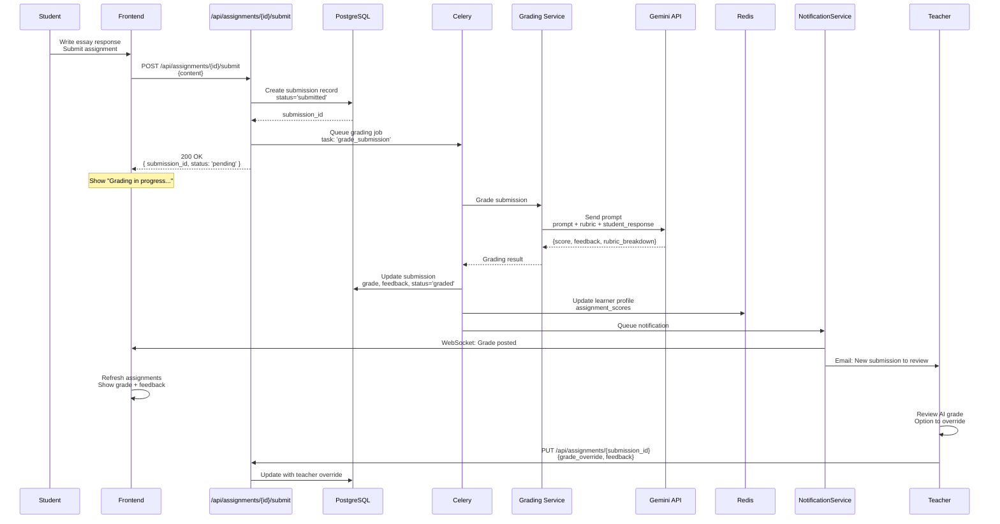

**Grading Service Implementation:**

```python
# backend/app/services/grader_service.py

class GradingService:
    """LLM-powered assignment grading"""

    async def grade_submission(
        self,
        submission: Submission,
        assignment: Assignment,
        rubric: Dict
    ) -> GradingResult:
        """
        Grade using rubric + Gemini

        Rubric format:
        {
            "criteria": [
                {"name": "Accuracy", "max_points": 40},
                {"name": "Clarity", "max_points": 30},
                {"name": "Completeness", "max_points": 30}
            ]
        }
        """

        grading_prompt = self._construct_grading_prompt(
            assignment=assignment,
            submission=submission,
            rubric=rubric
        )

        # Call Gemini
        response = await gemini_client.generate(grading_prompt)

        # Parse structured response
        grading_data = json.loads(response)

        # Validate total score
        total_score = sum(
            item['points'] for item in grading_data['rubric_scores']
        )

        result = GradingResult(
            total_score=total_score,
            max_score=rubric['total_points'],
            percentage=total_score / rubric['total_points'],
            rubric_breakdown=grading_data['rubric_scores'],
            feedback=grading_data['feedback'],
            strengths=grading_data.get('strengths', []),
            improvements=grading_data.get('improvements', [])
        )

        return result

    def _construct_grading_prompt(
        self,
        assignment: Assignment,
        submission: Submission,
        rubric: Dict
    ) -> str:
        """Build comprehensive grading prompt"""

        rubric_text = "\n".join([
            f"- {c['name']}: {c['max_points']} points"
            for c in rubric['criteria']
        ])

        return f"""
        You are an expert academic grader. Grade this submission.

        ASSIGNMENT:
        {assignment.title}
        {assignment.description}

        RUBRIC:
        {rubric_text}

        STUDENT SUBMISSION:
        {submission.content}

        GRADING INSTRUCTIONS:
        1. Evaluate against each rubric criterion
        2. Assign points for each (0 to max)
        3. Provide constructive feedback
        4. Highlight strengths
        5. Suggest improvements

        RESPONSE FORMAT (JSON):
        {{
            "rubric_scores": [
                {{"criterion": "...", "points": X, "comment": "..."}}
            ],
            "feedback": "...",
            "strengths": ["...", "..."],
            "improvements": ["...", "..."]
        }}
        """
```

**Celery Task:**

```python
# backend/app/celery_app.py

@shared_task(bind=True)
def grade_submission_task(self, submission_id: str):
    """Async grading task"""

    try:
        submission = db.query(Submission).filter(
            Submission.id == submission_id
        ).first()

        assignment = submission.assignment
        rubric = assignment.rubric

        # Grade
        grading_result = asyncio.run(
            grading_service.grade_submission(
                submission, assignment, rubric
            )
        )

        # Update DB
        submission.grade = grading_result.total_score
        submission.feedback = grading_result.feedback
        submission.status = 'graded'
        submission.graded_at = datetime.now()

        db.commit()

        # Notify student
        notification_service.send(
            user_id=submission.user_id,
            title=f"Assignment graded: {assignment.title}",
            message=f"Score: {grading_result.percentage:.0%}",
            type='grade_posted'
        )

        # Log for learner profile
        learner_profile.update_assignment_score(
            user_id=submission.user_id,
            assignment_id=assignment.id,
            score=grading_result.total_score,
            max_score=rubric['total_points']
        )

    except Exception as e:
        self.retry(exc=e, countdown=60, max_retries=3)
```

---

## PPT Generation Flow

### Teacher Requests PPT → Content Structuring → python-pptx Creation → Download

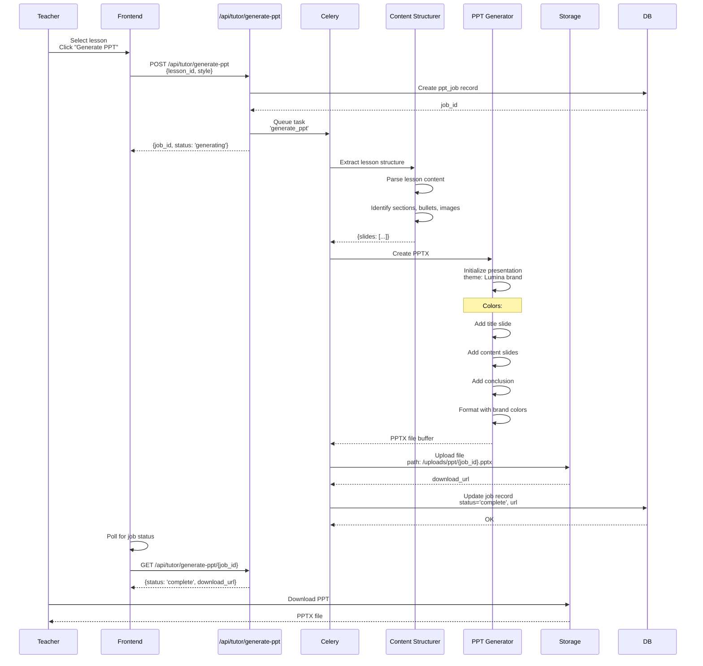

**PPT Generation Service:**

```python
# backend/app/services/ppt_generator.py

from pptx import Presentation
from pptx.util import Inches, Pt
from pptx.enum.text import PP_ALIGN
from pptx.dml.color import RGBColor

class PowerPointGenerator:
    """Generate branded PowerPoint presentations"""

    # Brand colors
    PRIMARY_COLOR = RGBColor(34, 197, 94)      # #22C55E
    SECONDARY_COLOR = RGBColor(168, 85, 247)   # #A855F7
    DARK_BG = RGBColor(15, 17, 21)             # #0F1115
    TEXT_COLOR = RGBColor(255, 255, 255)       # White

    async def generate_ppt(
        self,
        lesson: Lesson,
        style: str = "professional"
    ) -> bytes:
        """Generate PPTX from lesson content"""

        # Create presentation
        prs = Presentation()
        prs.slide_width = Inches(10)
        prs.slide_height = Inches(7.5)

        # Title slide
        self._add_title_slide(prs, lesson)

        # Content slides
        slides_data = self._structure_content(lesson)

        for slide_data in slides_data:
            if slide_data['type'] == 'section_header':
                self._add_section_slide(prs, slide_data)
            elif slide_data['type'] == 'content':
                self._add_content_slide(prs, slide_data)

        # Closing slide
        self._add_closing_slide(prs, lesson)

        # Save to bytes
        return self._save_to_bytes(prs)

    def _add_title_slide(self, prs: Presentation, lesson: Lesson):
        """Add branded title slide"""

        blank_slide_layout = prs.slide_layouts[6]  # Blank
        slide = prs.slides.add_slide(blank_slide_layout)

        background = slide.background
        fill = background.fill
        fill.solid()
        fill.fore_color.rgb = self.DARK_BG

        # Title
        title_box = slide.shapes.add_textbox(
            Inches(0.5), Inches(3), Inches(9), Inches(1)
        )
        title_frame = title_box.text_frame
        title_frame.word_wrap = True
        p = title_frame.paragraphs[0]
        p.text = lesson.title
        p.font.size = Pt(54)
        p.font.bold = True
        p.font.color.rgb = self.PRIMARY_COLOR
        p.alignment = PP_ALIGN.CENTER

        # Subtitle
        subtitle_box = slide.shapes.add_textbox(
            Inches(0.5), Inches(4.5), Inches(9), Inches(1)
        )
        subtitle_frame = subtitle_box.text_frame
        p = subtitle_frame.paragraphs[0]
        p.text = "AI-Powered Learning with Lumina"
        p.font.size = Pt(20)
        p.font.color.rgb = self.SECONDARY_COLOR
        p.alignment = PP_ALIGN.CENTER

    def _add_content_slide(self, prs: Presentation, slide_data: Dict):
        """Add content slide with bullet points"""

        blank_slide_layout = prs.slide_layouts[6]
        slide = prs.slides.add_slide(blank_slide_layout)

        background = slide.background
        fill = background.fill
        fill.solid()
        fill.fore_color.rgb = self.DARK_BG

        # Title bar (accent color)
        accent_bar = slide.shapes.add_shape(
            1,  # Rectangle
            Inches(0), Inches(0),
            Inches(10), Inches(0.8)
        )
        accent_fill = accent_bar.fill
        accent_fill.solid()
        accent_fill.fore_color.rgb = self.PRIMARY_COLOR

        # Slide title
        title_box = slide.shapes.add_textbox(
            Inches(0.5), Inches(0.15), Inches(9), Inches(0.5)
        )
        title_frame = title_box.text_frame
        p = title_frame.paragraphs[0]
        p.text = slide_data['title']
        p.font.size = Pt(32)
        p.font.bold = True
        p.font.color.rgb = self.DARK_BG

        # Content bullets
        content_box = slide.shapes.add_textbox(
            Inches(1), Inches(1.5), Inches(8), Inches(5.5)
        )
        text_frame = content_box.text_frame
        text_frame.word_wrap = True

        for bullet_text in slide_data['bullets']:
            p = text_frame.add_paragraph()
            p.text = bullet_text
            p.level = 0
            p.font.size = Pt(18)
            p.font.color.rgb = self.TEXT_COLOR
            p.space_before = Pt(6)
            p.space_after = Pt(6)

    def _add_closing_slide(self, prs: Presentation, lesson: Lesson):
        """Add closing/summary slide"""

        blank_slide_layout = prs.slide_layouts[6]
        slide = prs.slides.add_slide(blank_slide_layout)

        background = slide.background
        fill = background.fill
        fill.solid()
        fill.fore_color.rgb = self.DARK_BG

        # Centered message
        textbox = slide.shapes.add_textbox(
            Inches(1), Inches(3), Inches(8), Inches(1.5)
        )
        tf = textbox.text_frame
        tf.word_wrap = True

        p = tf.paragraphs[0]
        p.text = "Thank You!"
        p.font.size = Pt(48)
        p.font.bold = True
        p.font.color.rgb = self.SECONDARY_COLOR
        p.alignment = PP_ALIGN.CENTER

        # Subtitle
        p2 = tf.add_paragraph()
        p2.text = "Continue learning with AI-powered personalization"
        p2.font.size = Pt(16)
        p2.font.color.rgb = self.PRIMARY_COLOR
        p2.alignment = PP_ALIGN.CENTER

    def _save_to_bytes(self, prs: Presentation) -> bytes:
        """Convert presentation to bytes"""
        from io import BytesIO

        output = BytesIO()
        prs.save(output)
        output.seek(0)
        return output.getvalue()
```

---

## Handwriting Analysis Flow

### Student Submits Handwritten Image → OCR → Text Extraction → Comparison → Score

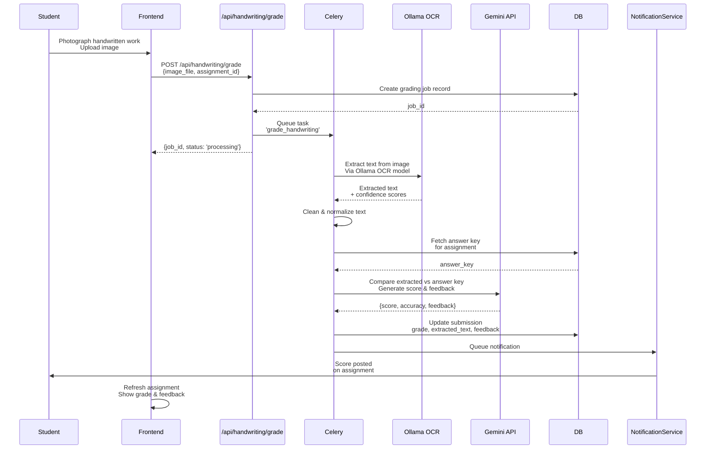

**Handwriting Analysis Service:**

```python
# backend/app/services/ocr_service.py

class HandwritingOCRService:
    """Extract text from handwritten images"""

    async def extract_text(self, image_path: str) -> OCRResult:
        """
        Extract text from handwritten image using Ollama

        Ollama model: paddle-ocr (optimized for handwriting)
        """

        # Load image
        image = cv2.imread(image_path)

        # Call Ollama OCR endpoint
        response = await ollama_client.post(
            '/api/generate',
            json={
                'model': 'paddle-ocr',
                'prompt': f'Extract all text from this handwritten image',
                'images': [self._image_to_base64(image)]
            }
        )

        # Parse response
        extracted_text = response['response']
        confidence = response.get('confidence', 0.85)

        # Post-processing
        cleaned_text = self._clean_ocr_text(extracted_text)

        return OCRResult(
            text=cleaned_text,
            confidence=confidence,
            raw_text=extracted_text
        )

    async def grade_handwritten_submission(
        self,
        image_path: str,
        answer_key: str,
        rubric: Dict
    ) -> HandwritingGradingResult:
        """Grade handwritten submission"""

        # Extract text
        ocr_result = await self.extract_text(image_path)
        extracted_text = ocr_result.text

        # Compare with answer key
        grading_prompt = f"""
        Compare student's handwritten answer with the answer key.

        ANSWER KEY:
        {answer_key}

        STUDENT'S ANSWER (extracted via OCR):
        {extracted_text}

        GRADING RUBRIC:
        {json.dumps(rubric, indent=2)}

        Evaluate:
        1. Accuracy (does it match key concepts?)
        2. Completeness (are all points covered?)
        3. Clarity (is it legible and organized?)

        Return JSON:
        {{
            "score": 85,
            "accuracy_percent": 90,
            "completeness_percent": 80,
            "clarity_percent": 85,
            "feedback": "Good response with minor spacing issues",
            "strengths": [...],
            "improvements": [...]
        }}
        """

        result = await gemini_client.generate(grading_prompt)
        grading_data = json.loads(result)

        return HandwritingGradingResult(
            score=grading_data['score'],
            accuracy=grading_data['accuracy_percent'],
            completeness=grading_data['completeness_percent'],
            clarity=grading_data['clarity_percent'],
            feedback=grading_data['feedback'],
            extracted_text=extracted_text,
            ocr_confidence=ocr_result.confidence
        )
```

---

## Behavior Tracking & Real-Time Adaptation

### Continuous Monitoring → Signal Processing → Cognitive Load Estimation → Intervention

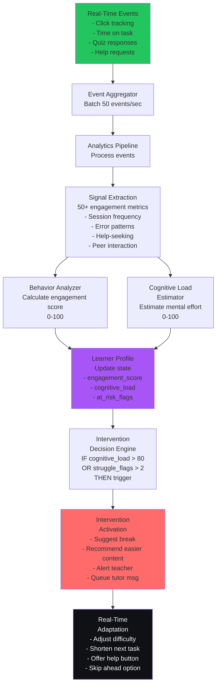

**Behavior Signal Collection:**

```python
# backend/app/services/event_service.py

class EventCollectionService:
    """Collect and process behavioral signals"""

    @router.post("/events")
    async def log_event(event: BehavioralEvent):
        """
        Log behavioral event from frontend

        Event types:
        - page_view: Student navigated to page
        - quiz_started: Student began quiz
        - response_submitted: Student submitted answer
        - help_requested: Student clicked help
        - typing: Student typing in tutor chat
        - pause: Student paused for X seconds
        - etc.
        """

        # Store in Redis stream for real-time processing
        await redis.xadd(
            f"events:{event.user_id}",
            {
                'type': event.event_type,
                'timestamp': event.timestamp.isoformat(),
                'data': json.dumps(event.data),
                'duration': event.duration
            }
        )

        # Batch processing every N events
        event_count = await redis.xlen(f"events:{event.user_id}")

        if event_count % 50 == 0:
            # Trigger analysis
            await analyzer_queue.put(
                AnalyzeUserTask(user_id=event.user_id)
            )
```

**Engagement Scoring:**

```python
# backend/learner_profile/analysis/behavior.py

class BehaviorAnalyzer:
    """Analyze engagement patterns"""

    async def calculate_engagement_score(self, user_id: str) -> float:
        """
        Composite engagement score [0, 100]

        Factors:
        - Session frequency: How often does student engage?
        - Time invested: How long per session?
        - Completion rate: Lessons/assignments finished?
        - Help-seeking: Metacognitive engagement?
        - Collaboration: Peer interaction?
        """

        # Fetch recent events (last 7 days)
        events = await self._get_recent_events(user_id, days=7)

        # Calculate component scores
        frequency_score = self._calculate_frequency_score(events)
        time_invested_score = self._calculate_time_score(events)
        completion_score = self._calculate_completion_score(user_id)
        help_seeking_score = self._calculate_help_seeking_score(events)
        collaboration_score = self._calculate_collaboration_score(events)

        # Weighted composite
        engagement = (
            frequency_score * 0.2 +
            time_invested_score * 0.25 +
            completion_score * 0.25 +
            help_seeking_score * 0.15 +
            collaboration_score * 0.15
        )

        return min(100, max(0, engagement))

    def _calculate_frequency_score(self, events: List[Event]) -> float:
        """Session frequency (0-100)"""

        # Count unique days with activity
        days_active = len(set(event.timestamp.date() for event in events))

        # Ideal: active 5+ days per week
        return (days_active / 7) * 100

    def _calculate_time_score(self, events: List[Event]) -> float:
        """Time invested (0-100)"""

        # Sum durations of all learning events
        total_time = sum(
            event.duration for event in events
            if event.event_type in ['lesson_view', 'quiz', 'tutor_chat']
        )

        # Ideal: 5+ hours per week
        ideal_minutes = 5 * 60
        return min(100, (total_time / ideal_minutes) * 100)

    def _calculate_completion_score(self, user_id: str) -> float:
        """Completion rate (0-100)"""

        total_assignments = await db.query(Assignment).count()
        completed = await db.query(Submission).filter(
            Submission.user_id == user_id,
            Submission.submitted_at.isnot(None)
        ).count()

        return (completed / total_assignments * 100) if total_assignments > 0 else 0
```

**Cognitive Load Estimation:**

```python
# backend/learner_profile/analysis/cognitive_load.py

class CognitiveLoadEstimator:
    """Real-time mental effort estimation"""

    async def estimate_cognitive_load(self, user_id: str) -> float:
        """
        Cognitive Load Index: [0, 100]

        0-30: Underutilized (bored, needs harder content)
        30-70: Optimal zone (goldilocks zone)
        70-100: Overloaded (needs break, easier content)

        Signals:
        - Response latency: Too fast = guessing, too slow = overload
        - Error rate: High errors + slow responses = confusion
        - Help requests: Frequency and timing
        - Session duration: Fatigue increases over time
        """

        # Get last 15 minutes of events
        recent_events = await self._get_recent_events(
            user_id, minutes=15
        )

        if not recent_events:
            return 50  # Default: neutral

        # Response time analysis
        response_times = [
            e.duration for e in recent_events
            if e.event_type == 'response_submitted'
        ]

        if response_times:
            avg_response_time = np.mean(response_times)
            optimal_time = 30  # seconds
            time_load = abs(avg_response_time - optimal_time) / optimal_time

            # Penalize both too fast (guessing) and too slow (confusion)
            time_load = min(1.0, time_load)
        else:
            time_load = 0.5

        # Error pattern analysis
        errors = sum(
            1 for e in recent_events
            if e.event_type == 'quiz_response' and e.data.get('is_correct') == False
        )

        error_rate = errors / max(len(recent_events), 1)
        error_load = error_rate * 0.8  # Max contribution 80%

        # Fatigue analysis (session duration)
        session_duration = (
            recent_events[-1].timestamp - recent_events[0].timestamp
        ).total_seconds() / 60

        fatigue_load = min(1.0, session_duration / 60)  # 60 min = max fatigue

        # Help-seeking pattern
        help_requests = sum(
            1 for e in recent_events
            if e.event_type == 'help_requested'
        )

        help_load = min(1.0, help_requests / 3)  # 3+ requests = max

        # Composite cognitive load
        load = (
            time_load * 0.3 +
            error_load * 0.3 +
            fatigue_load * 0.2 +
            help_load * 0.2
        ) * 100

        return min(100, max(0, load))
```

**Intervention Trigger:**

```python
# backend/ai_engine/swarm/intervention.py

class InterventionAgent:
    """Predictive support and at-risk detection"""

    async def check_intervention_needed(self, user_id: str) -> Optional[Intervention]:
        """
        Monitor for at-risk patterns and trigger support
        """

        # Get current learner state
        profile = await learner_profile.get_profile(user_id)
        cognitive_load = await cognitive_load_estimator.estimate(user_id)
        behavior_flags = await behavior_analyzer.detect_at_risk_patterns(user_id)

        interventions_needed = []

        # Rule 1: Cognitive overload
        if cognitive_load > 80:
            interventions_needed.append({
                'type': 'cognitive_overload',
                'action': 'suggest_break',
                'message': 'You seem focused! Consider a 5-minute break.'
            })

        # Rule 2: Multiple quiz failures
        recent_quiz_score = await self._get_recent_quiz_score(user_id)
        if recent_quiz_score < 0.5 and profile.attempts > 2:
            interventions_needed.append({
                'type': 'high_error_rate',
                'action': 'offer_tutor',
                'message': 'Let\'s review this concept together. Want to chat with your AI tutor?'
            })

        # Rule 3: Low engagement
        if profile.engagement_score < 30:
            interventions_needed.append({
                'type': 'disengagement',
                'action': 'alert_teacher',
                'message_to_teacher': f'Student {user_id} showing low engagement (score: {profile.engagement_score})'
            })

        # Rule 4: At-risk flags
        if 'IRREGULAR_ATTENDANCE' in behavior_flags:
            interventions_needed.append({
                'type': 'irregular_attendance',
                'action': 'send_reminder',
                'message': 'We haven\'t seen you in a while. Come back to continue your learning!'
            })

        if interventions_needed:
            return Intervention(
                user_id=user_id,
                interventions=interventions_needed,
                triggered_at=datetime.now()
            )

        return None
```

---

## Master Data Flow Diagram

### All Data Flows Combined

```mermaid
graph TB
    subgraph "Client Layer"
        STUDENT["👨‍🎓 Student<br/>Desktop/Mobile"]
        TEACHER["👨‍🏫 Teacher<br/>Desktop"]
    end

    subgraph "Frontend"
        AUTH_UI["Auth UI<br/>/login, /register"]
        DASHBOARD["Student Dashboard<br/>- Courses<br/>- Tutor Chat<br/>- Progress"]
        TEACHER_UI["Teacher Dashboard<br/>- Create course<br/>- View grades<br/>- Analytics"]
        CACHE["IndexedDB Cache<br/>Responses, course materials"]
    end

    subgraph "API Layer"
        JWT["JWT Auth<br/>8-day expiry"]
        API_ROUTES["API Routers<br/>- /auth<br/>- /tutor<br/>- /courses<br/>- /student<br/>- /assessment"]
    end

    subgraph "AI Engine"
        ORCHESTRATOR["🤖 Orchestrator<br/>Request router"]
        TUTOR_AG["🎓 Tutor Agent<br/>Socratic method"]
        PATHWAY_AG["🛤️ Pathway Agent<br/>Adaptive curriculum"]
        ASSESS_AG["📝 Assessment Agent<br/>Quiz generation"]
        INTERVENTION_AG["🚨 Intervention Agent<br/>Predictive support"]
        GUARDIAN_AG["🛡️ Guardian Agent<br/>Safety checks"]
        HANDWRITE_AG["✍️ Handwriting Agent<br/>OCR analysis"]
    end

    subgraph "Learner Profile"
        LP_ENGINE["Learner Profile Core<br/>State machine"]
        BKT_MODEL["BKT Model<br/>Knowledge tracing"]
        DKT_MODEL["DKT Model<br/>LSTM based"]
        BEHAVIOR["Behavior Analyzer<br/>Engagement scoring"]
        COGNITIVE["Cognitive Load<br/>Mental effort"]
        GAPS["Gap Detector<br/>Misconceptions"]
    end

    subgraph "Data Stores"
        POSTGRES["PostgreSQL<br/>- Users<br/>- Courses<br/>- Progress<br/>- Submissions"]
        REDIS["Redis<br/>- Sessions<br/>- Hot cache<br/>- Real-time state"]
        CHROMADB["ChromaDB<br/>Course materials<br/>Vectors"]
        TIMESCALE["TimescaleDB<br/>Behavior history<br/>Time-series"]
    end

    subgraph "External Services"
        GEMINI["Google Gemini<br/>LLM API<br/>Response generation<br/>Grading"]
        OLLAMA["Ollama<br/>Local OCR<br/>Handwriting"]
        STORAGE["File Storage<br/>S3/MinIO<br/>Uploads"]
    end

    subgraph "Async Processing"
        CELERY["Celery Task Queue"]
        WORKERS["Workers<br/>- Grade submissions<br/>- Generate PPT<br/>- Process OCR<br/>- Send notifications"]
    end

    subgraph "Supporting Services"
        NOTIF["Notification<br/>Service"]
        ATTENDANCE["Attendance<br/>Tracker"]
        PPT["PPT Generator<br/>python-pptx"]
        GRADER["Grading<br/>Service"]
    end

    STUDENT -->|login| AUTH_UI
    TEACHER -->|login| AUTH_UI
    AUTH_UI -->|POST /auth/login| JWT
    JWT -->|token| CACHE

    STUDENT -->|view dashboard| DASHBOARD
    DASHBOARD -->|GET /student/dashboard| API_ROUTES
    API_ROUTES -->|route| ORCHESTRATOR

    STUDENT -->|ask tutor| DASHBOARD
    DASHBOARD -->|POST /tutor/chat| TUTOR_AG
    TUTOR_AG -->|3-tier response| CACHE
    TUTOR_AG -->|RAG search| CHROMADB
    TUTOR_AG -->|generate| GEMINI

    STUDENT -->|take quiz| DASHBOARD
    DASHBOARD -->|POST /assessment/start| ASSESS_AG
    ASSESS_AG -->|generate questions| GEMINI
    ASSESS_AG -->|submit response| BKT_MODEL
    BKT_MODEL -->|update mastery| LP_ENGINE

    LP_ENGINE -->|profile state| REDIS
    LP_ENGINE -->|history| TIMESCALE
    LP_ENGINE -->|store| POSTGRES

    BEHAVIOR -->|engagement| LP_ENGINE
    COGNITIVE -->|load estimate| LP_ENGINE
    GAPS -->|misconceptions| LP_ENGINE

    LP_ENGINE -->|current state| PATHWAY_AG
    PATHWAY_AG -->|recommendations| STUDENT

    ORCHESTRATOR -->|route tutor| TUTOR_AG
    ORCHESTRATOR -->|route pathway| PATHWAY_AG
    ORCHESTRATOR -->|route quiz| ASSESS_AG
    ORCHESTRATOR -->|check safety| GUARDIAN_AG
    ORCHESTRATOR -->|predict struggle| INTERVENTION_AG
    ORCHESTRATOR -->|analyze handwriting| HANDWRITE_AG

    TEACHER -->|create course| TEACHER_UI
    TEACHER_UI -->|upload PDF| API_ROUTES
    API_ROUTES -->|ingest| CELERY
    CELERY -->|extract + chunk| STORAGE
    CELERY -->|embed| GEMINI
    CELERY -->|store| CHROMADB

    TEACHER -->|request PPT| TEACHER_UI
    TEACHER_UI -->|POST /tutor/generate-ppt| CELERY
    CELERY -->|generate| PPT
    PPT -->|save| STORAGE

    STUDENT -->|submit assignment| DASHBOARD
    DASHBOARD -->|POST /submit| CELERY
    CELERY -->|grade| GRADER
    GRADER -->|LLM grade| GEMINI
    GRADER -->|save| POSTGRES
    GRADER -->|notify| NOTIF
    NOTIF -->|alert| TEACHER

    style STUDENT fill:#22C55E
    style TEACHER fill:#22C55E
    style ORCHESTRATOR fill:#A855F7
    style LP_ENGINE fill:#A855F7
    style POSTGRES fill:#0F1115,color:#fff
    style REDIS fill:#0F1115,color:#fff

```

---

## State Management Architecture

### Redis State vs. Database vs. Cache

```
┌─────────────────────────────────────────────────────────────────┐
│                         Lumina State Layers                       │
├─────────────────────────────────────────────────────────────────┤
│                                                                   │
│  Layer 1: Hot State (Redis)                                      │
│  ├─ Session tokens: session:{user_id}:{token}                    │
│  ├─ Learner profile: learner:{user_id}:profile                   │
│  ├─ BKT state: learner:{user_id}:bkt_state                       │
│  ├─ Current lesson: learner:{user_id}:current_lesson             │
│  └─ TTL: 8 days (session) or varies (profile)                    │
│                                                                   │
│  Layer 2: Current Session Cache (Frontend IndexedDB)             │
│  ├─ Cached responses: { prompt_hash → response, expiry }         │
│  ├─ Course materials: { course_id → materials }                  │
│  └─ TTL: 7 days                                                  │
│                                                                   │
│  Layer 3: Persistent DB (PostgreSQL)                             │
│  ├─ User records: users table                                    │
│  ├─ Course metadata: courses, lessons tables                     │
│  ├─ Progress: progress table                                     │
│  ├─ Submissions: submissions, assignments tables                 │
│  ├─ Conversations: conversations, conversation_messages          │
│  └─ Audit: ai_logs table                                         │
│                                                                   │
│  Layer 4: Semantic Search (ChromaDB)                             │
│  ├─ Vector embeddings of course materials                        │
│  ├─ Indexed for fast similarity search (RAG)                     │
│  └─ Retrieval latency: 50-200ms                                  │
│                                                                   │
│  Layer 5: Time-Series Analytics (TimescaleDB)                    │
│  ├─ Behavior signals: behavior_timeseries hypertable             │
│  ├─ Engagement metrics: time-indexed per user                    │
│  ├─ Compression: Automatic after 7 days                          │
│  └─ Retention: 1+ year historical data                           │
│                                                                   │
└─────────────────────────────────────────────────────────────────┘

              Layer Hierarchy (latency vs. capacity)

                  Redis (microsecs) ← Fastest
                      ↓
              IndexedDB (millisecs)
                      ↓
              PostgreSQL (tens of ms)
                      ↓
              ChromaDB (100+ ms)
                      ↓
            TimescaleDB (bulk ops) ← Slowest but persistent
```

**State Sync Strategy:**

```python
# backend/app/services/state_sync.py

class StateSyncService:
    """Keep state layers in sync"""

    async def sync_learner_profile_to_redis(self, user_id: str):
        """
        After any profile update, sync hot data to Redis

        Called after:
        - BKT mastery update
        - Quiz completion
        - Behavior analysis
        - Assessment completion
        """

        profile = await self._get_current_profile(user_id)

        await redis.set(
            f"learner:{user_id}:profile",
            json.dumps({
                'mastery_scores': profile.mastery_scores,
                'gaps': profile.knowledge_gaps,
                'cognitive_load': profile.cognitive_load,
                'engagement_score': profile.engagement_score,
                'at_risk': profile.at_risk_flags,
                'last_updated': datetime.now().isoformat()
            }),
            ex=8*24*3600  # 8 days TTL
        )

        # Also update to PostgreSQL for persistence
        await db.merge(profile)
        await db.commit()

    async def invalidate_cache_on_update(self, user_id: str, event_type: str):
        """
        Invalidate affected cache entries when data changes

        Examples:
        - User completes quiz → Invalidate current_lesson
        - Course content updated → Invalidate course_materials cache
        - Mastery changes → Invalidate adaptive_pathway
        """

        if event_type == 'quiz_completed':
            await redis.delete(f"learner:{user_id}:current_lesson")
            await redis.delete(f"adaptive_pathway:{user_id}")

        elif event_type == 'course_updated':
            await redis.delete(f"cache:course_materials:*")
            await chromadb.delete_where({'course_id': course_id})

        elif event_type == 'mastery_changed':
            await redis.delete(f"adaptive_pathway:{user_id}")
```

---

## Error Handling & Resilience

### Circuit Breaker Pattern for External APIs

```python
# backend/app/services/circuit_breaker.py

from circuitbreaker import circuit

class ResilientAIService:
    """Resilient calls to external AI APIs"""

    @circuit(failure_threshold=5, recovery_timeout=60)
    async def call_gemini(self, prompt: str) -> str:
        """
        Call Gemini with circuit breaker

        Behavior:
        - CLOSED: Normal operation
        - OPEN: Reject calls, retry after timeout
        - HALF_OPEN: Test single request
        """
        response = await gemini_client.generate(prompt)
        return response

    async def tutor_response_with_fallback(self, prompt: str, user_id: str):
        """
        Multi-tier fallback strategy

        Tier 1: Try Gemini (fast, high-quality)
        Tier 2: Try Ollama (slower, reliable)
        Tier 3: Return cached response
        Tier 4: Return safe default
        """

        try:
            # Try Gemini
            return await self.call_gemini(prompt)

        except CircuitBreakerListener:
            # Gemini circuit open, try Ollama
            try:
                return await ollama_client.generate(prompt)
            except Exception:
                # Ollama failed, try cache
                cached = await cache_service.get_cached_response(prompt)
                if cached:
                    return cached

                # Fallback response
                return "I'm experiencing technical difficulties. Please try again in a moment."
```

### Retry Strategy with Exponential Backoff

```python
# backend/app/celery_app.py

@shared_task(
    bind=True,
    autoretry_for=(Exception,),
    retry_kwargs={'max_retries': 3, 'countdown': 5},
    retry_backoff=True,
    retry_backoff_max=600,
    retry_jitter=True
)
def grade_submission_task(self, submission_id: str):
    """
    Grade with exponential backoff retries

    Retry schedule:
    - Attempt 1: Immediate
    - Attempt 2: 5 seconds
    - Attempt 3: 25 seconds (5 * 2^2 + jitter)
    - Attempt 4: 125 seconds (5 * 2^3 + jitter)
    """

    try:
        submission = db.query(Submission).get(submission_id)
        grading_result = grading_service.grade(submission)
        submission.grade = grading_result.score
        db.commit()

    except GradingAPIException as e:
        # Retry on API errors
        raise self.retry(exc=e)

    except Exception as e:
        # Log unretryable errors
        logger.error(f"Failed to grade {submission_id}: {e}")
        raise
```

### Graceful Degradation

```python
# backend/app/routers/tutor.py

async def tutor_chat_graceful(request: TutorChatRequest):
    """
    Graceful degradation when services unavailable

    Quality tiers:
    1. Full response (Gemini + context)
    2. Cached response
    3. Simple rule-based response
    4. Direction to resources
    """

    try:
        # Try full response
        response = await tutor_agent.full_response(request)
        return response

    except GeminiUnavailable:
        # Try cache
        cached = await cache_service.get(request)
        if cached:
            return {"response": cached, "cached": True}

        # Rule-based fallback
        if "photosynthesis" in request.prompt.lower():
            return {
                "response": "Photosynthesis is the process by which plants convert light to chemical energy. Check your course materials for details.",
                "fallback": True
            }

        # Send to resources
        return {
            "response": "I'm temporarily unavailable. Check the course materials or ask your teacher for help.",
            "recommend_resources": True
        }
```

---

## Conclusion

Lumina's data flows implement a **tightly integrated, real-time learning system** where every user interaction:

1. **Generates data** (events, responses, engagement metrics)
2. **Updates models** (BKT, behavior, cognitive load)
3. **Influences personalization** (adaptive pathway, response generation)
4. **Drives adaptation** (difficulty adjustment, intervention triggers)

This closed-loop architecture ensures that each student's learning experience becomes increasingly personalized and effective over time.

**Key Data Flow Principles:**

- **Cache Hierarchies:** Hot data in Redis, persistent in PostgreSQL, semantic in ChromaDB
- **Async Processing:** Long-running tasks (grading, PPT gen) via Celery
- **Real-Time Signals:** Behavior tracking feeds continuous adaptation
- **Multi-Tier Fallbacks:** Graceful degradation when services unavailable
- **State Coherence:** Redis-to-DB sync ensures consistency across layers

---

**Document Version:** 1.0
**Last Updated:** March 2026
**Next Review:** September 2026

---
