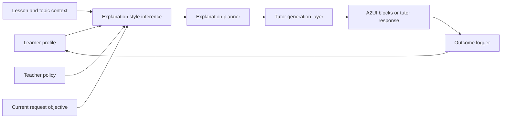

# Explanation Style Engine

Last updated: 2026-03-14

## Purpose

This document defines how Lumina should adapt explanations to each learner.

The target is not a fixed "learning style" label.
The target is an evidence-based explanation planner that continuously learns:

- what depth works
- what pacing works
- what modality works
- what scaffolding works
- what level of Socratic questioning works

This engine should sit between the learner profile and the tutor response generator.

## Why This Needs To Be A First-Class System

The repo already has:

- tutor generation and fallback logic in `backend/ai_engine/swarm/tutor.py`
- learner preferences and behavior storage in `backend/app/personalization/schemas.py`
- mastery, load, and risk updates in `backend/app/services/personalization_service.py`

What is missing is a formal explanation-planning layer that:

- chooses the communication strategy before generation
- logs which strategy was used
- measures whether that strategy worked
- updates future behavior based on evidence

Without this layer, personalization remains descriptive instead of operational.

## Design Principles

1. Treat explanation preference as adaptive and revisable, not fixed.
2. Optimize for learning outcome, not just message polish.
3. Keep teacher policy and curriculum boundaries visible.
4. Favor structured explanation plans over one giant prompt blob.
5. Measure immediate understanding and delayed retention separately.

## System Position



## Inputs

The planner should consider these signals on every tutor turn.

| Input | Example source | Why it matters |
| --- | --- | --- |
| Concept mastery | learner profile | low mastery usually needs more scaffolding |
| Mastery confidence | learner profile | low confidence may require confirmation questions |
| Cognitive load | behavior signals | high load requires simpler chunks and fewer branches |
| Recent error pattern | assessment or tutor events | determines misconception-aware examples |
| Help-seeking pattern | KPI engine | guides how direct the tutor should be |
| Preferred modality | learner preferences | influences text, diagram, example, or quiz balance |
| Grade or level | user profile | controls vocabulary and abstraction |
| Teacher policy | course or teacher config | constrains tone, approved examples, and rigor |
| Current objective | request mode | explain, hint, summarize, quiz, compare, reflect |
| Time budget | session context | controls chunk size and response length |

## Explanation Strategy Dimensions

The engine should choose a plan across several dimensions rather than a single label.

| Dimension | Possible settings |
| --- | --- |
| Depth | very short, concise, standard, deep |
| Vocabulary band | simple, grade-level, advanced |
| Structure | definition-first, example-first, compare-contrast, step-by-step |
| Scaffolding | direct answer, guided steps, Socratic prompts, mixed |
| Modality mix | text, table, diagram, flashcards, mini-quiz |
| Pace | compressed, normal, slow |
| Chunk size | 1 concept, 2-3 concepts, full explanation |
| Motivation style | reassuring, neutral, challenge-oriented |
| Practice follow-up | none, one quick check, short quiz, stretch task |

## Proposed Explanation Profile Contract

Future agents should add a structured explanation profile to the canonical learner profile.

```json
{
  "explanation_profile": {
    "strategy_effectiveness": {
      "worked_example_first": 0.82,
      "step_by_step": 0.88,
      "socratic_prompting": 0.43,
      "compare_contrast": 0.57,
      "visual_analogy": 0.71
    },
    "preferred_modality_scores": {
      "text": 0.62,
      "diagram": 0.79,
      "table": 0.54,
      "quiz": 0.68
    },
    "optimal_chunk_size": 3,
    "optimal_vocabulary_band": "simple",
    "confidence_support_level": "high",
    "last_updated_at": "2026-03-14T12:00:00Z"
  }
}
```

## Explanation Plan Output Contract

The planner should emit a structured plan before text generation.

```json
{
  "plan_id": "exp-plan-123",
  "objective": "explain",
  "topic_id": "quadratic_equations",
  "strategy": "worked_example_first",
  "vocabulary_band": "simple",
  "depth": "concise",
  "pace": "slow",
  "chunk_size": 2,
  "socratic_ratio": 0.2,
  "modalities": ["diagram", "steps", "quick_check"],
  "misconception_targets": ["sign_errors_in_quadratic"],
  "teacher_constraints": ["approved_examples_only"],
  "confidence": 0.74
}
```

This plan should be logged with the tutor turn so later outcomes can be attributed to the strategy used.

## Style Selection Policy

## Step 1: Determine the teaching objective

Possible objectives:

- explain a new concept
- simplify a confusing concept
- hint without giving away the answer
- compare two concepts
- summarize a lesson
- check understanding
- challenge a high-mastery learner

## Step 2: Choose the difficulty band for the explanation

Recommended logic:

```python
if cognitive_load >= 0.75:
    explanation_band = "reduced_load"
elif mastery < 0.40:
    explanation_band = "remediation"
elif mastery < 0.75:
    explanation_band = "guided_practice"
else:
    explanation_band = "challenge"
```

## Step 3: Choose the communication strategy

Recommended initial policy:

```python
if explanation_band == "reduced_load":
    strategy = "step_by_step"
elif misconception_detected:
    strategy = "worked_example_first"
elif mastery >= 0.75 and cognitive_load < 0.50:
    strategy = "socratic_prompting"
else:
    strategy = best_historical_strategy_for(topic_id, objective)
```

## Step 4: Choose modalities

Use evidence, not assumption.

```python
modality_score = (
    0.60 * stated_preference
    + 0.40 * historical_effectiveness
)
```

Pick the top 1-2 modalities, not every modality at once.

## Step 5: Choose pacing and chunking

Suggested rules:

- High load or low mastery: short chunks, one example, one check
- Medium mastery: 2-3 chunks with guided practice
- High mastery: shorter explanation, more challenge, more reflection

## Step 6: Log the explanation plan and outcome

Every tutor response should persist:

- plan id
- selected strategy
- selected modalities
- objective
- related concept
- confidence
- follow-up result

## Strategy Catalog

| Strategy | Best for | Avoid when |
| --- | --- | --- |
| Step-by-step | novice learner, high cognitive load, procedural topics | learner is bored by slow pacing |
| Worked example first | misconception recovery, math, coding, procedural tasks | concept needs intuition before mechanics |
| Concept-first | definitions, theory-heavy subjects, quick clarifications | learner keeps asking "show me one example" |
| Socratic prompting | medium-high mastery, low load, concept transfer | learner is overloaded or frustrated |
| Compare and contrast | frequently confused concepts | learner does not know either concept yet |
| Visual analogy | abstract concepts, visual preference, low prior knowledge | concept requires exact formal wording first |
| Retrieval check | after explanation, to verify transfer | learner has not seen enough of the concept yet |

## Communication Mode Library

The vision screenshots use eight named communication modes. These are a good target-facing library, but they should be treated as selectable output modes inside the broader explanation planner.

| Mode | Best for | Trigger |
| --- | --- | --- |
| Story mode | narrative learners, context seekers | learner responds well to scenario framing |
| Joke or humor mode | disengaged or bored learners | engagement drops and the topic safely allows humor |
| Poem or rhythm mode | mnemonic support, creative learners | rhythm improves retention for this learner |
| Analogy mode | conceptual learners | learner asks "what is it like?" |
| Experiment or try-it mode | science and hands-on learners | learner benefits from observation before formalism |
| Formula or precision mode | logical and exact learners | learner asks for definitions, criteria, or derivations |
| Socratic mode | near-mastery learners | learner is ready to discover rather than receive |
| Real-world scenario mode | transfer and relevance | everyday application improves understanding |

Current accuracy note:

- pieces of this mode library are implied in current tutor behavior
- the weighted, persistent per-student mode-selection engine is still target-state

## Example Policies

## Case 1: Low mastery, high load

Inputs:

- mastery: `0.28`
- cognitive load: `0.82`
- recent confusion: repeated sign errors
- modality evidence: diagrams and worked examples strong

Output:

```json
{
  "strategy": "worked_example_first",
  "vocabulary_band": "simple",
  "depth": "concise",
  "pace": "slow",
  "chunk_size": 1,
  "modalities": ["diagram", "steps"],
  "socratic_ratio": 0.1
}
```

## Case 2: Medium mastery, medium load

Inputs:

- mastery: `0.61`
- cognitive load: `0.52`
- learner keeps asking for a shorter explanation

Output:

```json
{
  "strategy": "step_by_step",
  "vocabulary_band": "grade-level",
  "depth": "concise",
  "pace": "normal",
  "chunk_size": 2,
  "modalities": ["steps", "quick_check"],
  "socratic_ratio": 0.2
}
```

## Case 3: High mastery, low load

Inputs:

- mastery: `0.86`
- cognitive load: `0.31`
- learner wants a challenge

Output:

```json
{
  "strategy": "socratic_prompting",
  "vocabulary_band": "advanced",
  "depth": "concise",
  "pace": "normal",
  "chunk_size": 3,
  "modalities": ["reflection", "challenge_question"],
  "socratic_ratio": 0.7
}
```

## Outcome Logging

The explanation engine is only useful if it learns from outcomes.

### Immediate outcome signals

- next related answer correctness
- need for repeated simplification
- additional help requests
- abandonment after explanation
- explicit helpfulness rating

### Delayed outcome signals

- retention on later retrieval
- reduced misconception frequency
- reduced need for repeated tutor help on same concept

### Suggested explanation outcome record

```json
{
  "plan_id": "exp-plan-123",
  "user_id": "student-123",
  "topic_id": "quadratic_equations",
  "strategy": "worked_example_first",
  "objective": "explain",
  "post_success": true,
  "followup_confusion": 0.2,
  "retention_success": true,
  "helpfulness_rating": 4,
  "created_at": "2026-03-14T12:05:00Z"
}
```

## Evaluation Metrics

The engine should be judged on learning outcomes, not only chat satisfaction.

| Metric | Meaning |
| --- | --- |
| Immediate success rate | percent of explanations followed by correct related response |
| Simplification repeat rate | how often the learner asks for another simpler version |
| Time-to-first-correct | latency from explanation to first demonstrated success |
| Delayed retention rate | percent still correct after spacing interval |
| Strategy win rate by topic | which strategies work best per concept family |
| Frustration escalation rate | percent of explanations followed by overload or abandonment |

## Guardrails

1. Do not hard-code a student as one permanent learning style.
2. Do not over-personalize into a narrow rut; occasionally test alternatives.
3. Do not use challenge-first explanations under high cognitive load.
4. Keep teacher-approved materials and policy constraints in scope.
5. Log uncertainty when a strategy choice is based on weak historical evidence.

## Implementation Targets In This Repo

| Goal | Likely file targets |
| --- | --- |
| Add explanation profile schema | `backend/app/personalization/schemas.py` |
| Compute explanation effectiveness | `backend/app/services/personalization_service.py` |
| Create explanation planner module | `backend/ai_engine/swarm/tutor.py` or adjacent planner file |
| Log tutor plan and outcomes | `backend/app/routers/ai.py`, `backend/app/services/personalization_service.py` |
| Render structured explanation blocks | `frontend/web/src/components/ai/AITutorChat.tsx`, `frontend/web/src/components/advanced/A2UIRenderer.tsx` |

## Definition Of Done

The explanation style engine is ready when:

- every tutor response is generated from a structured explanation plan
- the plan is conditioned on learner state and objective
- explanation outcomes are logged
- future strategy choices use past effectiveness
- teachers can inspect why a certain explanation mode was chosen

## Recommended Companion Docs

- `docs/STUDENT_INTELLIGENCE_LOOP.md`
- `docs/STUDENT_KPI_ENGINE.md`
- `docs/AGENT_BUILD_BACKLOG.md`
