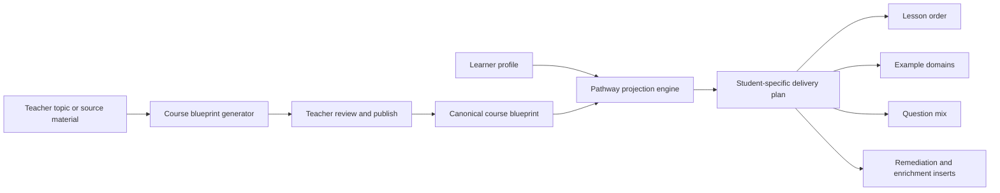

# Personalized Course Architecture

Last updated: 2026-03-14

## Purpose

This document defines how Lumina should personalize course delivery without losing teacher control.

Two students in the same class can legitimately receive:

- different topic sequencing
- different examples
- different pacing
- different question mixes
- different remediation and enrichment paths

But that should happen on top of one canonical teacher-approved course blueprint.

## Current Repo Reality

Status: `implemented generation foundation, missing full per-learner projection layer`

What exists:

- course outline generation in `backend/app/routers/ai.py`
- assignment-based course outline generation in `backend/app/routers/ai.py`
- course CRUD and teacher authoring flows
- pathway recommendation scaffolding in `backend/app/pathway`

What is missing:

- a formal split between course blueprint and learner-specific pathway projection
- persisted per-student personalized course plans
- automatic resequencing after every answer in production
- example-domain personalization stored in learner-course state

## Design Rule

Do not create a separate official course record for every student by default.

Instead use two layers:

1. `Course Blueprint`
2. `Learner Pathway Projection`

## Course Blueprint

Teacher-owned, reviewable, and publishable.

Contains:

- course outcomes
- concept graph
- canonical modules and lessons
- approved assets
- assessment bank
- rubric references
- teacher policy constraints

## Learner Pathway Projection

Student-specific and dynamic.

Contains:

- recommended next lesson order
- remediation inserts
- enrichment branches
- example domains
- pacing targets
- question-format mix
- explanation preferences

## Proposed Architecture



## Personalization Dimensions

| Dimension | Example |
| --- | --- |
| Topic order | skip review vs repeat prerequisite |
| Example domain | cricket, cooking, robotics, finance |
| Question mix | more MCQ early vs more teach-back later |
| Pacing | fast-track, standard, scaffolded |
| Explanation mode | analogy-first vs formula-first |
| Review schedule | more spaced repetition on fragile concepts |

## Example

### Student A

- high prior mastery
- visual examples work well
- strong performance on quick checks

Projection:

- skip foundational review
- use diagrams and challenge problems earlier
- use fewer recall questions and more transfer questions

### Student B

- lower prerequisite mastery
- narrative and real-world examples work better
- retention drops without more review

Projection:

- insert prerequisite review
- use slower pacing
- use more short-answer and worked-example steps

## Generation Workflow

## Stage 1: Blueprint generation

Current repo support:

- topic-based course outline generation
- assignment-based course outline generation

Target upgrade:

- generate structured course objects with concept graph, module objects, assessments, and rubrics

## Stage 2: Teacher review

Teacher approves:

- outcomes
- concept order
- examples allowed
- difficulty policy
- AI constraints

## Stage 3: Learner projection

Projection engine reads:

- mastery
- readiness
- retention risk
- explanation effectiveness
- interests and example-domain preferences

Projection engine emits:

```json
{
  "student_id": "student-123",
  "course_id": "course-123",
  "next_modules": ["module-3", "review-linear-motion", "module-4"],
  "example_domains": ["cricket", "space"],
  "question_mix": {
    "mcq": 0.2,
    "short_answer": 0.4,
    "teach_back": 0.1,
    "worked_example": 0.3
  },
  "pace_band": "fast_track"
}
```

## Stage 4: Continuous adjustment

After new evidence:

- update learner profile
- recompute readiness and retention
- adjust projection

This is where the pathway engine and question diversity engine connect.

## Current Accuracy Notes

The screenshots imply full per-student course divergence in production.

That is not yet the current state of the repo.

Today:

- course generation mostly returns outline JSON
- assignment-based generation maps learner score to a broad level label
- pathway guidance exists, but not yet as a fully persisted learner-course projection system

## Implementation Targets In This Repo

| Goal | File targets |
| --- | --- |
| define course blueprint schema | `backend/app/database/models.py`, course store, course routes |
| define learner-course projection schema | personalization schema and pathway state |
| upgrade AI course generation from outline to structured objects | `backend/app/routers/ai.py` |
| connect pathway engine to course projection | `backend/app/pathway/` |
| surface personalized plan in student UI | student dashboard, course pages, tutor surfaces |

## Definition Of Done

The personalized course architecture is ready when:

- teacher publishes one canonical blueprint
- each learner receives a dynamic pathway projection on top of it
- question mix, example domains, and pacing are stored and explainable
- course generation can produce structured publishable objects, not only outlines

## Recommended Companion Docs

- `docs/VISION_ALIGNMENT_AUDIT.md`
- `docs/QUESTION_DIVERSITY_ENGINE.md`
- `docs/STUDENT_INTELLIGENCE_LOOP.md`
