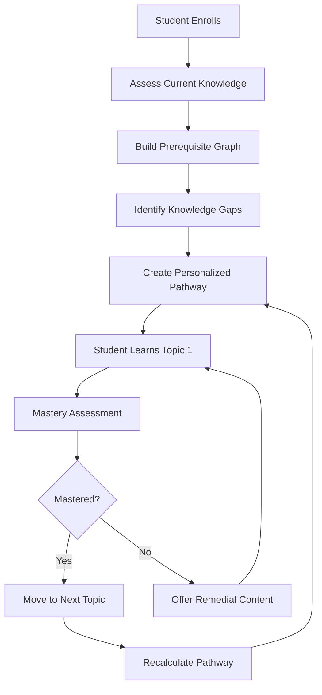

# Personal LMS: Every Student Gets Their Own AI Tutor

## Executive Summary

Lumina solves a fundamental problem in education: **A teacher cannot give personal attention to all 100 students in a class.** Our solution is to build a **Personal Learning Management System for every single student**. Each student receives an AI tutor that:

- Knows their learning style, pace, and preferences
- Understands where they struggle and where they excel
- Adapts content delivery in real-time based on performance
- Creates a unique learning pathway that respects their background and interests
- Remembers every interaction, building a continuously improving mental model
- Nudges them at optimal times to maintain engagement and build study habits

This document explains how Lumina implements a truly personalized learning experience at scale.

---

## 1. The Core Vision: One AI Per Student

### The Problem with Traditional LMS

Traditional Learning Management Systems treat all students the same:
- One curriculum for all learners
- Same pacing for fast and slow learners
- No understanding of individual learning styles
- Teachers overwhelmed with 100+ students
- Students with similar struggles receive identical help
- Engagement drops when content doesn't match learning style

### Lumina's Solution: Personal AI Tutors

Lumina flips the model:
- **Personal Profile**: Every student has a continuously updated AI profile containing their learning data
- **Adaptive Delivery**: Content format (text, video, interactive, visual) adapts to what works best for each student
- **Personal Pace**: The system learns each student's optimal learning speed
- **AI Memory**: Every interaction informs future interactions
- **Predictive Intervention**: The AI predicts when a student will struggle and proactively helps
- **Strength Amplification**: The system identifies and nurtures each student's strengths

### Key Principle

> **"The AI doesn't teach the same lesson to 100 students. The AI teaches a lesson tailored to each of the 100 students."**

---

## 2. Student Profile Architecture

### What Data is Stored Per Student

Each student's profile is a rich data structure that captures their complete learning identity:

```json
{
  "user_id": "student_uuid_001",
  "basic_info": {
    "name": "Alice Johnson",
    "grade_level": 9,
    "language": "en",
    "timezone": "America/New_York",
    "enrollment_date": "2025-09-01"
  },

  "learning_style": {
    "primary_modality": "visual",
    "secondary_modality": "kinesthetic",
    "prefers_video": 0.85,
    "prefers_text": 0.65,
    "prefers_interactive": 0.90,
    "prefers_examples": 0.88,
    "optimal_session_length_minutes": 35,
    "preferred_times": {
      "monday": ["3:00 PM", "4:30 PM"],
      "thursday": ["6:00 PM", "7:30 PM"],
      "saturday": ["10:00 AM", "12:00 PM"]
    }
  },

  "mastery_map": {
    "mathematics": {
      "algebra_basics": 0.92,
      "quadratic_equations": 0.45,
      "geometry_fundamentals": 0.78,
      "trigonometry": 0.12
    },
    "english": {
      "reading_comprehension": 0.88,
      "essay_writing": 0.65,
      "grammar": 0.79,
      "vocabulary": 0.91
    }
  },

  "behavior_history": {
    "total_sessions": 142,
    "total_study_time_hours": 47.5,
    "current_streak_days": 7,
    "longest_streak_days": 23,
    "session_consistency_score": 0.78,
    "dropout_risk_score": 0.12,
    "engagement_trend": "increasing",
    "frustration_incidents": [
      {
        "timestamp": "2025-11-15T14:30:00Z",
        "topic": "quadratic_equations",
        "severity": "medium",
        "resolution": "offered easier prerequisite review"
      }
    ],
    "boredom_incidents": [
      {
        "timestamp": "2025-11-10T15:00:00Z",
        "topic": "basic_algebra",
        "severity": "low",
        "resolution": "advanced content offered instead"
      }
    ]
  },

  "cognitive_state": {
    "current_cognitive_load": "medium",
    "working_memory_capacity_items": 5,
    "preferred_chunk_size_concepts": 3,
    "extraneous_cognitive_load_sensitivity": "high",
    "needs_breaks_every_minutes": 20
  },

  "strengths": [
    {
      "domain": "reading",
      "mastery_level": 0.88,
      "confidence": "high",
      "last_demonstrated": "2025-11-18"
    },
    {
      "domain": "vocabulary",
      "mastery_level": 0.91,
      "confidence": "high",
      "last_demonstrated": "2025-11-17"
    }
  ],

  "weaknesses": [
    {
      "domain": "quadratic_equations",
      "mastery_level": 0.45,
      "confidence": "medium",
      "identified": "2025-10-20",
      "attempts": 12,
      "improvement_trajectory": "slow"
    },
    {
      "domain": "trigonometry",
      "mastery_level": 0.12,
      "confidence": "high",
      "identified": "2025-11-01",
      "attempts": 3,
      "improvement_trajectory": "very_slow"
    }
  ],

  "error_patterns": [
    {
      "pattern": "sign_errors_in_quadratic",
      "frequency": 8,
      "probable_cause": "procedural_misunderstanding",
      "recommended_intervention": "visual_representation"
    },
    {
      "pattern": "confuses_sin_cos",
      "frequency": 5,
      "probable_cause": "insufficient_practice",
      "recommended_intervention": "mnemonics_and_drilling"
    }
  ],

  "interests": [
    "basketball",
    "technology",
    "astronomy",
    "digital_art",
    "music_production"
  ],

  "background": {
    "primary_language": "English",
    "multilingual": false,
    "prior_experience": {
      "programming": "beginner",
      "mathematics": "intermediate"
    },
    "socioeconomic_context": "suburban",
    "learning_disability": "none_identified"
  },

  "progress_metrics": {
    "avg_quiz_score": 0.75,
    "quiz_score_trend": "improving",
    "assignment_submission_rate": 0.92,
    "time_to_mastery_minutes": 180,
    "review_frequency_optimal": true,
    "concept_retention_rate": 0.87
  },

  "ai_model_state": {
    "bkt_params": {
      "p_guess": 0.25,
      "p_slip": 0.10,
      "p_transit": 0.15
    },
    "dkt_hidden_state": [0.12, 0.45, 0.89, 0.34, 0.67],
    "last_profile_update": "2025-11-18T16:30:00Z"
  }
}
```

### Key Profile Components Explained

#### Mastery Map
A hierarchical knowledge structure tracking competency across all topics:
- Leaf nodes: individual concepts (e.g., "quadratic_equations")
- Parent nodes: concept categories (e.g., "algebra")
- Grandparent nodes: subject areas (e.g., "mathematics")
- Values: mastery probability (0.0 to 1.0, where 0.8+ = mastery)

#### Behavior History
Captures both positive and negative engagement patterns:
- **Frustration Incidents**: When student struggles, the AI logs it and learns what intervention works
- **Boredom Incidents**: When content is too easy, the AI learns to provide more challenging material
- **Streak System**: Tracks consecutive days of engagement to build habits
- **Consistency Score**: Measures reliability of study habits (0.0 to 1.0)

#### Error Patterns
ML discovers recurring mistakes:
- **Pattern**: The type of error (e.g., "sign_errors_in_quadratic")
- **Frequency**: How often this error occurs
- **Probable Cause**: Root cause analysis (procedural vs. conceptual)
- **Intervention**: Specific teaching strategy that works best

#### AI Model State
Stores coefficients for machine learning models:
- **BKT (Bayesian Knowledge Tracing)**: Probabilistic model of knowledge state
  - `p_guess`: Probability student guesses correctly without knowledge
  - `p_slip`: Probability student makes careless mistake despite knowing
  - `p_transit`: Probability student learns from a practice problem
- **DKT (Deep Knowledge Tracing)**: Deep learning approach with LSTM hidden states

---

## 3. Adaptive Content Delivery

### Content Format Adaptation

The same concept is delivered in different formats based on student profile:

```
Topic: Quadratic Equations

FOR Visual Learner (Alice):
┌─────────────────────────────────┐
│ Parabola Graph [Interactive]    │
│ ↑ Shows shape, vertex, roots    │
│                                 │
│ → Animation of transformations  │
│ → Color-coded steps            │
│ → Visual comparison: ax²+bx+c  │
└─────────────────────────────────┘

FOR Kinesthetic Learner (Bob):
┌─────────────────────────────────┐
│ Interactive Drag-and-Drop:       │
│ - Drag coefficients on number   │
│   line                          │
│ - See parabola update in real   │
│   time                          │
│ - Complete the square (hands-on)│
└─────────────────────────────────┘

FOR Verbal Learner (Carol):
┌─────────────────────────────────┐
│ Step-by-step written explanation│
│ 1. Factor out common terms      │
│ 2. Apply quadratic formula...   │
│ 3. Simplify radicals           │
│ Plus audio narration available  │
└─────────────────────────────────┘
```

### Delivery Pipeline

```python
# Content Delivery Algorithm
def get_content_for_student(student_id, topic):
    student = get_student_profile(student_id)
    base_content = get_concept_content(topic)

    # Adapt format
    if student.learning_style.primary_modality == "visual":
        content = enhance_with_visualizations(base_content)
    elif student.learning_style.primary_modality == "kinesthetic":
        content = add_interactive_elements(base_content)
    else:
        content = enhance_with_text_examples(base_content)

    # Personalize examples using student interests
    content.examples = [
        generate_example(topic, interest)
        for interest in student.interests[:3]
    ]

    # Adjust difficulty based on mastery
    current_mastery = student.mastery_map[topic]
    if current_mastery < 0.3:
        content = add_foundational_review(content)
    elif current_mastery > 0.85:
        content = add_advanced_extensions(content)

    # Set optimal session length
    content.estimated_time = student.optimal_session_length_minutes

    return content
```

### Example: Interest-Based Learning

For student Alice (interested in basketball, music, tech):

**Traditional**: "A ball is thrown from ground level at 20 m/s..."

**Personalized**: "In basketball, a player shoots from the 3-point line. The initial velocity is 20 m/s at a 45° angle. Using quadratic equations, find when the ball reaches maximum height. (This is how NBA players calculate shots!)"

---

## 4. Personalized Learning Pathways

### How PathwayAgent Creates Unique Sequences

The PathwayAgent creates a custom learning sequence for each student based on:
1. Current mastery state across all topics
2. Prerequisite dependencies
3. Learning pace
4. Identified weaknesses
5. Interests
6. Available time



### Pathway Algorithm Pseudocode

```python
def create_personalized_pathway(student_id, subject):
    student = get_student_profile(student_id)

    # Get knowledge graph (prerequisites)
    graph = get_subject_knowledge_graph(subject)

    # Find topics student hasn't mastered (mastery < 0.8)
    unmastered_topics = [
        t for t in graph.all_topics
        if student.mastery_map.get(t, 0.0) < 0.8
    ]

    # Topological sort: respect prerequisites
    learning_sequence = topological_sort_with_priority(
        unmastered_topics,
        prerequisites=graph.edges,
        priorities=[
            (topic, get_priority_score(student, topic))
            for topic in unmastered_topics
        ]
    )

    # Adapt sequence to student's pace
    paced_sequence = []
    for topic in learning_sequence:
        est_time = estimate_learning_time(
            topic,
            current_mastery=student.mastery_map[topic],
            learning_pace=student.learning_style.pace
        )
        paced_sequence.append({
            "topic": topic,
            "estimated_hours": est_time,
            "difficulty": get_difficulty_level(student, topic)
        })

    return paced_sequence
```

### Example Pathway for Alice

Alice is a 9th grader who needs to learn Algebra II. Her personalized pathway:

1. **Review: Linear Equations** (2 hours) - Quick refresher, she has 0.78 mastery
2. **Learn: Systems of Equations** (4 hours) - Prerequisite for quadratic, she has 0.0 mastery
3. **Learn: Quadratic Equations** (6 hours) - Core topic, she has 0.45 mastery
4. **Interleave: Graphing Parabolas** (3 hours) - Paired with quadratic for visual understanding
5. **Practice: Applications** (4 hours) - Real-world uses in basketball (her interest!)
6. **Learn: Solving Quadratics with Factoring** (3 hours) - Alternative method
7. **Challenge: Complex Quadratics** (2 hours) - Advanced material, optional

**Why this sequence?**
- Respects prerequisites (systems before quadratic)
- Addresses her weakness (quadratic = 0.45)
- Uses her visual strength (graphing parabolas)
- Incorporates her interest (basketball applications)
- Estimated total: 24 hours over 4-6 weeks

---

## 5. Spaced Repetition System

### The Forgetting Curve

Students forget material over time following Ebbinghaus's forgetting curve. Lumina combats this with spaced repetition:

```
Mastery Level
    1.0 |     ╱╲___╱╲___╱╲
    0.8 |    ╱         ╲
    0.6 |___╱
    0.4 |
        └─────────────────── Time
        Day 1, 3, 7, 14, 30 (Review Sessions)
```

### Spacing Algorithm

The system uses a modified SuperMemo (SM-2) algorithm:

```python
def schedule_review(topic, student_id, quality_of_recall):
    """
    quality_of_recall: 0-5 scale
    0 = complete failure
    5 = perfect recall
    """
    history = get_review_history(student_id, topic)

    if not history:
        # First review scheduled after 1 day
        return now() + timedelta(days=1)

    # SM-2 Algorithm
    easiness_factor = max(1.3,
        history.easiness_factor +
        (0.1 - (5 - quality_of_recall) * (0.08 + (5 - quality_of_recall) * 0.02))
    )

    if quality_of_recall >= 4:
        # Recall successful, increase interval
        history.repetitions += 1
        if history.repetitions == 1:
            interval = 1  # day
        elif history.repetitions == 2:
            interval = 3  # days
        else:
            interval = round(history.interval * easiness_factor)
    else:
        # Recall failed, restart
        history.repetitions = 0
        interval = 1

    history.interval = interval
    history.easiness_factor = easiness_factor
    save_history(history)

    return now() + timedelta(days=interval)
```

### Review Scheduling Dashboard

The student sees:

```
YOUR REVIEW SCHEDULE
┌──────────────────────────────────────────┐
│ Today                                    │
│ • Linear Equations (5 min review)       │
│ • Quadratic Formulas (10 min practice)  │
│                                         │
│ Tomorrow                                 │
│ • Trigonometry basics (8 min review)    │
│                                         │
│ In 3 Days                               │
│ • Systems of Equations (12 min)        │
│                                         │
│ In 7 Days                               │
│ • Graphing Parabolas (15 min)          │
└──────────────────────────────────────────┘
```

---

## 6. Interest-Based Examples

### How the AI Personalizes Examples

Generic approach: "A ball is thrown from height h with velocity v..."

Lumina's approach: The AI learns student's interests and generates examples in their domain:

```python
def generate_topic_examples(topic, student_id, num_examples=3):
    student = get_student_profile(student_id)
    interests = student.interests  # ["basketball", "music", "tech", ...]

    examples = []
    for interest in interests[:num_examples]:
        # Prompt Gemini to generate example in this domain
        prompt = f"""
        Generate a realistic educational example for {topic}
        in the context of {interest}.
        Make it engaging, accurate, and appropriate for a 9th grader.
        Include the problem, solution, and explanation.
        """

        example = gemini_api.generate_content(prompt)
        examples.append({
            "interest": interest,
            "problem": example.problem,
            "solution": example.solution,
            "explanation": example.explanation,
            "real_world_relevance": interest
        })

    return examples
```

### Example: Quadratic Equations for Alice

**Her Interests**: Basketball, Music, Technology

**Basketball Example**:
```
Shot Arc Problem:
Alice shoots a basketball from the free-throw line.
The ball's height h(t) = -16t² + 32t + 6.5 (feet, t in seconds)
When does it reach maximum height?
When does it go through the hoop (at h=10 feet)?

Solve using: vertex form, quadratic formula
```

**Music Example**:
```
Sound Wave Frequency:
A musical note's amplitude oscillates according to:
A(t) = -0.5t² + 4t + 3
When is the amplitude maximum?

Solve using: completing the square
```

**Technology Example**:
```
App User Growth:
An app's daily users follows: U(d) = -2d² + 80d + 500
On what day are users maximum?
When will users return to 500 (break-even)?

Solve using: factoring
```

Each example uses the **same mathematical concept** but applies it to something Alice cares about, dramatically improving engagement and retention.

---

## 7. Learning Pace Adaptation

### Identifying Student Pace

The system measures learning pace dynamically:

```python
def calculate_learning_pace(student_id, topic):
    """
    Returns learning pace: 'fast', 'normal', 'slow'
    Based on historical data for this student on similar topics
    """
    history = get_student_history(student_id)

    # Find topics of similar complexity
    similar_topics = find_similar_topics(topic, complexity_range=±1)

    if not similar_topics:
        return "normal"  # Default pace

    # Measure time-to-mastery for similar topics
    times_to_mastery = [
        history[t]['minutes_to_reach_0.8_mastery']
        for t in similar_topics
    ]

    avg_time = statistics.mean(times_to_mastery)
    stdev = statistics.stdev(times_to_mastery)

    # Classify
    if avg_time < (avg_time - stdev):
        return "fast"
    elif avg_time > (avg_time + stdev):
        return "slow"
    else:
        return "normal"
```

### Pacing Strategies

#### Fast Learners
- Provide more content per session
- Less repetition needed
- Challenge with advanced material earlier
- Offer extension problems and projects

```python
# For fast learners
content = {
    "core_lesson": 20_minutes,
    "practice": 10_minutes,
    "extensions": 15_minutes,  # Advanced material
    "total": 45_minutes
}
```

#### Slow Learners
- Provide less content per session (avoid cognitive overload)
- Increase spaced repetition frequency
- Break concepts into smaller chunks
- More concrete examples before abstract

```python
# For slow learners
content = {
    "prerequisite_review": 5_minutes,
    "core_lesson": 15_minutes,
    "guided_practice": 15_minutes,
    "review": 5_minutes,
    "total": 40_minutes,
    "next_session_in_hours": 4  # More frequent review
}
```

#### Normal Learners
- Standard pacing from curriculum
- Moderate repetition
- Mix of theory and practice

---

## 8. Strength vs Weakness Balance

### The Strength Amplification Principle

Lumina balances two educational approaches:

1. **Growth Mindset** (address weaknesses)
   - Struggling with quadratic equations? Practice more!
   - Build grit and persistence

2. **Strength-Based Learning** (amplify strengths)
   - Excel at reading? Dive deeper into literature!
   - Build confidence and intrinsic motivation

Lumina does **both simultaneously**:

```python
def create_session_plan(student_id):
    student = get_student_profile(student_id)

    # 70% session: Address weaknesses
    weakness_topic = get_highest_priority_weakness(student)
    weakness_content = generate_content(weakness_topic, difficulty="appropriate")

    # 30% session: Amplify strengths
    strength_topic = get_primary_strength(student)
    strength_content = generate_content(
        strength_topic,
        difficulty="advanced"  # Challenge at higher level
    )

    return {
        "session": [
            {
                "type": "weakness_target",
                "topic": weakness_topic,
                "duration_minutes": 28,
                "content": weakness_content,
                "goal": "improve mastery from 0.45 to 0.60"
            },
            {
                "type": "strength_extension",
                "topic": strength_topic,
                "duration_minutes": 12,
                "content": strength_content,
                "goal": "deepen expertise and maintain motivation"
            }
        ]
    }
```

### Example: Alice's Session Plan

**Alice's Profile**:
- Weakness: Quadratic Equations (0.45 mastery)
- Strength: Reading Comprehension (0.88 mastery)

**Her Session Today** (40 minutes):

```
PART 1: Addressing Weakness (28 minutes)
├─ Diagnostic: Check what went wrong last time (3 min)
├─ Remedial: Review sign conventions (5 min)
├─ Core: Quadratic formula step-by-step (12 min)
└─ Practice: 5 problems with immediate feedback (8 min)

PART 2: Amplifying Strength (12 minutes)
├─ Challenge: Advanced reading comprehension passage
│   Topic: "The History of Algebra" (advanced reading)
│   Connects to her current learning!
└─ Discuss: Why did mathematicians invent quadratic equations?
```

### Psychological Impact

- **Prevents Discouragement**: Strength work maintains motivation
- **Builds Confidence**: Success breeds success
- **Provides Context**: Understanding *why* a topic matters
- **Holistic Growth**: Academic and emotional development

---

## 9. Student Dashboard Experience

### What Students See

The student dashboard is their personalized learning home:

```
╔════════════════════════════════════════════════════╗
║         LUMINA: YOUR PERSONAL LEARNING SPACE        ║
╠════════════════════════════════════════════════════╣
║                                                    ║
║  ┌──────────────────────────────────────────────┐ ║
║  │  CURRENT STREAK: 7 DAYS 🔥                  │ ║
║  │  Your longest: 23 days! Keep it up!        │ ║
║  └──────────────────────────────────────────────┘ ║
║                                                    ║
║  ┌──────────────────────────────────────────────┐ ║
║  │  YOUR MASTERY MAP                           │ ║
║  │  ┌─────────────────────────────────────────┐│ ║
║  │  │ Mathematics          ████████░░  72%   ││ ║
║  │  │ ├─ Algebra           ████████░░  78%  ││ ║
║  │  │ │  ├─ Linear Eq      █████████░  88%  ││ ║
║  │  │ │  ├─ Quadratic      ████░░░░░░  45%  ││ ║
║  │  │ │  └─ Systems        ██████░░░░  62%  ││ ║
║  │  │ └─ Geometry          ██████░░░░  62%  ││ ║
║  │  │ English              █████████░  87%   ││ ║
║  │  │ ├─ Reading           ████████░░  88%  ││ ║
║  │  │ ├─ Writing           ██████░░░░  65%  ││ ║
║  │  │ └─ Grammar           ███████░░░  79%  ││ ║
║  │  └─────────────────────────────────────────┘│ ║
║  └──────────────────────────────────────────────┘ ║
║                                                    ║
║  ┌──────────────────────────────────────────────┐ ║
║  │  🎯 RECOMMENDED NEXT LESSON                 │ ║
║  │  Topic: Quadratic Equations                │ ║
║  │  Why: You're at 45% mastery, ready for... │ ║
║  │       [Basketball Application Example]     │ ║
║  │  Est. Time: 35 minutes                     │ ║
║  │  [START LEARNING] [SKIP] [PRACTICE INSTEAD]│ ║
║  └──────────────────────────────────────────────┘ ║
║                                                    ║
║  ┌──────────────────────────────────────────────┐ ║
║  │  📋 TODAY'S LEARNING PLAN                   │ ║
║  │  ✓ Completed: Systems of Equations (15min) │ ║
║  │  → Next: Quadratic Equations Lesson (35min)│ ║
║  │  → Then: Review Linear Equations (10min)   │ ║
║  │                                             │ ║
║  │  Total planned: 60 minutes                 │ ║
║  │  Your usual study time: 3:00-4:30 PM       │ ║
║  │  [ADJUST PLAN] [FOLLOW PLAN]               │ ║
║  └──────────────────────────────────────────────┘ ║
║                                                    ║
║  ┌──────────────────────────────────────────────┐ ║
║  │  📊 YOUR PROGRESS STATS                     │ ║
║  │  Topics Mastered: 8/24 (33%)               │ ║
║  │  Topics In Progress: 12/24 (50%)           │ ║
║  │  Topics Not Started: 4/24 (17%)            │ ║
║  │  Avg Time to Mastery: 180 minutes/topic   │ ║
║  │  Engagement Score: 78/100                 │ ║
║  │  [DETAILED ANALYTICS]                      │ ║
║  └──────────────────────────────────────────────┘ ║
║                                                    ║
║  ┌──────────────────────────────────────────────┐ ║
║  │  🏆 BADGES & ACHIEVEMENTS                   │ ║
║  │  ⭐ Week Streak Master: 7 consecutive days │ ║
║  │  ⭐ Quick Learner: Mastered 8 topics      │ ║
║  │  🔜 Coming Soon: Algebra Expert (6 more)   │ ║
║  └──────────────────────────────────────────────┘ ║
║                                                    ║
╚════════════════════════════════════════════════════╝
```

### Dashboard Data Components

```python
# API Endpoint: GET /api/student/{student_id}/dashboard

{
  "student_id": "student_001",
  "current_streak": {
    "days": 7,
    "longest_ever": 23,
    "last_session": "2025-11-18T16:30:00Z"
  },
  "mastery_map": {...},  # Full hierarchy as shown above
  "recommended_next": {
    "topic": "quadratic_equations",
    "current_mastery": 0.45,
    "reason": "next_in_pathway",
    "estimated_minutes": 35,
    "interest_relevance": "basketball"
  },
  "todays_plan": [
    {
      "order": 1,
      "topic": "quadratic_equations",
      "type": "lesson",
      "estimated_minutes": 35,
      "status": "upcoming"
    },
    {
      "order": 2,
      "topic": "linear_equations",
      "type": "review",
      "estimated_minutes": 10,
      "status": "upcoming"
    }
  ],
  "progress_summary": {
    "topics_mastered": 8,
    "topics_in_progress": 12,
    "topics_not_started": 4,
    "total_topics": 24,
    "completion_percentage": 33,
    "avg_time_to_mastery_minutes": 180
  },
  "badges": [
    {
      "badge_id": "week_streak_master",
      "name": "Week Streak Master",
      "earned": "2025-11-18"
    },
    {
      "badge_id": "quick_learner",
      "name": "Quick Learner",
      "earned": "2025-11-10"
    }
  ],
  "learning_velocity": {
    "topics_per_week": 1.5,
    "estimated_completion": "2026-02-15"
  }
}
```

---

## 10. AI Memory Across Sessions

### Continuity of Learning

Every interaction with the AI tutor is logged, enabling perfect continuity:

```
Session 1 (Nov 10, 10am)
└─ Student attempts 5 quadratic problems
   └─ Gets 2/5 correct
   └─ Makes sign errors pattern detected
   └─ Offers alternative explanation
   └─ AI logs: "Sign errors identified, suggest visual approach next"

Session 2 (Nov 11, 3pm)  ← AI remembers!
└─ AI greets: "Hi Alice! Yesterday we worked on quadratic equations.
             I noticed you had trouble with signs. Today let's use a
             visual approach with a number line."
   └─ Student sees interactive diagram
   └─ Practices with immediate feedback
   └─ Gets 4/5 correct
   └─ Mastery increases to 0.52
   └─ AI logs: "Visual approach effective for sign errors"

Session 3 (Nov 14, 4pm)  ← AI refines understanding
└─ Spaced repetition: quadratic review scheduled
   └─ AI recalls: "You struggled with signs. Let me show you a
                  basketball analogy..." (from her interests)
   └─ Student gets 5/5 correct
   └─ Mastery increases to 0.68
```

### Memory Storage Architecture

```python
class StudentMemory:
    """
    Multi-layer memory system tracking all student interactions
    """

    def __init__(self, student_id):
        self.student_id = student_id

    def log_interaction(self, session_data):
        """Immediate: Save to session cache"""
        redis.set(
            f"session:{self.student_id}",
            session_data,
            expire=timedelta(hours=1)
        )

        """Short-term: Save to database"""
        db.conversations.insert({
            "student_id": self.student_id,
            "timestamp": now(),
            "topic": session_data.topic,
            "performance": session_data.score,
            "messages": session_data.chat_history,
            "errors_made": session_data.errors
        })

        """Long-term: Update student profile"""
        profile = get_student_profile(self.student_id)
        profile.update_from_session(session_data)
        profile.save()

        """ML: Update model parameters"""
        self.update_bkt_parameters(session_data)
        self.update_dkt_hidden_state(session_data)

    def recall_student_context(self, topic=None):
        """
        When starting a new session, recall what AI should know
        """
        # Recent sessions (last 7 days)
        recent = db.conversations.find(
            student_id=self.student_id,
            created_after=now() - timedelta(days=7)
        )

        # Historical struggles (topics < 0.6 mastery)
        struggles = [
            t for t, m in get_student_profile(self.student_id).mastery_map.items()
            if m < 0.6
        ]

        # Error patterns (recurring mistakes)
        patterns = identify_error_patterns(recent)

        # Effective interventions (what worked)
        effective = get_successful_interventions(recent)

        return {
            "recent_topics": [s.topic for s in recent],
            "performance_trend": calculate_trend(recent),
            "current_struggles": struggles,
            "error_patterns": patterns,
            "effective_methods": effective,
            "context": f"""
            Alice is a visual learner interested in basketball.
            She struggles with sign errors in quadratic equations.
            Visual representations with number lines work well for her.
            She's been consistent, studying 6/7 days last week.
            """
        }

    def generate_memory_prompt(self, topic):
        """
        Generate a prompt prefix for LLM that includes memory
        """
        context = self.recall_student_context(topic)

        return f"""
        You are tutoring Alice, a 9th grader.

        Student Profile:
        - Learning Style: Visual, kinesthetic
        - Interests: Basketball, music production, tech
        - Current Focus: Algebra II

        Recent Sessions:
        - {context['recent_topics']}
        - Performance trend: {context['performance_trend']}

        Known Struggles:
        {context['current_struggles']}

        Error Patterns Observed:
        {context['error_patterns']}

        What Works for This Student:
        {context['effective_methods']}

        Instructional Style:
        - Use visual representations (number lines, graphs)
        - Connect to basketball whenever possible
        - Provide step-by-step guidance
        - Avoid information overload

        Current Topic: {topic}
        """
```

### Conversation History

Every chat is stored in the `conversations` table:

```
{
  "conversation_id": "conv_001",
  "student_id": "student_001",
  "timestamp": "2025-11-18T16:30:00Z",
  "topic": "quadratic_equations",
  "duration_minutes": 35,
  "messages": [
    {
      "role": "tutor",
      "content": "Hi Alice! Today we're working on quadratic equations. I know you're interested in basketball. Did you know NBA players use quadratic equations to calculate shots?",
      "timestamp": "2025-11-18T16:30:15Z"
    },
    {
      "role": "student",
      "content": "Really? How?",
      "timestamp": "2025-11-18T16:30:45Z"
    },
    {
      "role": "tutor",
      "content": "[Explains parabolic trajectory of basketball]",
      "timestamp": "2025-11-18T16:31:00Z"
    },
    ...
  ],
  "performance": {
    "problems_attempted": 5,
    "problems_correct": 3,
    "errors": [
      {
        "problem_id": "prob_002",
        "student_answer": "-3",
        "correct_answer": "3",
        "error_type": "sign_error",
        "cognitive_area": "procedural"
      }
    ]
  },
  "learning_outcome": {
    "pre_mastery": 0.45,
    "post_mastery": 0.52,
    "improvement": 0.07,
    "confidence_level": "medium"
  }
}
```

---

## 11. Notification Intelligence

### The Notification Paradox

**Problem**: Too many notifications → distracting and ignored
**Lumina's Solution**: Send fewer, smarter notifications

The system uses several decision criteria:

```python
def should_send_notification(student_id, notification_type, context):
    """
    Intelligently decide whether to notify
    """
    student = get_student_profile(student_id)

    # Never interrupt during study time
    if is_currently_studying(student_id):
        return False

    # Respect quiet hours
    if is_quiet_hour(student.timezone):
        return False

    # Check notification fatigue
    notifications_today = count_notifications_today(student_id)
    if notifications_today >= 3:
        return False  # Already notified enough

    # Check relevance score
    relevance = calculate_relevance(notification_type, student)
    if relevance < 0.6:
        return False  # Not relevant to this student

    # Check timing: Is this the right moment?
    if notification_type == "start_review":
        if student.current_streak < 3:
            return True  # Encourage consistency
        if student.engagement_score < 0.5:
            return True  # Boost engagement

    if notification_type == "new_weakness_detected":
        if student.frustration_incidents[-1] < 1_hour_ago:
            return True  # Send while still fresh

    return True
```

### Types of Notifications

#### 1. Motivational Nudges

**Condition**: Student has broken streak
**Message**: "Your 7-day streak ended. Ready to start fresh? Let's go!"
**Timing**: Next optimal study time

#### 2. Weakness Alerts

**Condition**: New weakness pattern detected (3+ errors on a topic)
**Message**: "I noticed you're struggling with quadratic equations. Want a different explanation approach? I have 3 options."
**Timing**: After session, within 1 hour

#### 3. Progress Celebrations

**Condition**: Student reaches milestone (first mastery, 5-day streak, badge earned)
**Message**: "🎉 You've mastered Linear Equations! You're 33% through Algebra. Next up: Quadratic Equations!"
**Timing**: Immediately after achievement

#### 4. Optimal Time Reminders

**Condition**: Student's optimal study time is approaching
**Message**: "Your favorite study time is in 30 minutes (3:00-4:30 PM). Ready for quadratic equations?"
**Timing**: 30 minutes before optimal time

#### 5. Spaced Repetition

**Condition**: A topic is scheduled for review
**Message**: "Time to review Linear Equations! 10-min refresh to keep your 0.88 mastery sharp."
**Timing**: At scheduled review time

#### 6. Peer Progress

**Condition**: Classmate achieves something
**Message**: "Maria just mastered Quadratic Equations! That means you can too. Try the practice set?"
**Timing**: Non-intrusive, only if student opted in

---

## 12. Parent/Guardian Visibility

### What Parents Can See

Parents get regular reports without overwhelming detail:

```
╔════════════════════════════════════════════════════╗
║    PARENT DASHBOARD: ALICE'S LEARNING PROGRESS     ║
╠════════════════════════════════════════════════════╣
║                                                    ║
║  WEEKLY SUMMARY (Nov 12-18)                       ║
║  ┌────────────────────────────────────────────┐  ║
║  │ Study Sessions:     6/7 days (86%)        │  ║
║  │ Total Study Time:   4.5 hours             │  ║
║  │ Topics Completed:   2                     │  ║
║  │ Engagement Score:   78/100 (↑ from 75)   │  ║
║  │ Overall Progress:   33% of Algebra II     │  ║
║  └────────────────────────────────────────────┘  ║
║                                                    ║
║  STRENGTHS THIS WEEK                              ║
║  ✓ Reading Comprehension: 0.88 mastery           ║
║    (Excelling in all practice activities)        ║
║  ✓ Consistency: 6 sessions this week             ║
║    (Great study habit formation!)                │  ║
║                                                    ║
║  AREAS NEEDING SUPPORT                            ║
║  ⚠ Quadratic Equations: 0.45 mastery             ║
║    (3 more practice sessions recommended)        │
║    Suggested Help: Work through basketball       │
║    application examples together                 │
║                                                    ║
║  UPCOMING MILESTONES                              ║
║  → Quadratic Equations (45% → 80% in progress)   │
║  → Expected completion: 1-2 weeks                │
║                                                    ║
║  [MESSAGE TEACHER] [VIEW DETAILED REPORT]        │
║                                                    ║
╚════════════════════════════════════════════════════╝
```

### Privacy-Respecting Data

Parents see progress, not obsessive tracking:

```python
def generate_parent_report(student_id):
    """
    What parents see: High-level insights
    What parents don't see: Every keystroke, every problem, raw error logs
    """
    student = get_student_profile(student_id)

    return {
        # Summary metrics
        "study_time_this_week_hours": sum_study_time(7_days),
        "sessions_completed_this_week": count_sessions(7_days),
        "average_session_duration_minutes": avg_session_length(7_days),

        # Progress on learning goals
        "topics_mastered_this_month": count_mastered_this_month(),
        "overall_progress_percentage": student.overall_progress,
        "estimated_completion_date": estimate_course_completion(),

        # Strengths (celebrate!)
        "top_strengths": get_top_3_strengths(student),
        "positive_trends": identify_positive_trends(student),

        # Areas for support (actionable)
        "areas_for_parent_support": [
            {
                "topic": "quadratic_equations",
                "mastery": 0.45,
                "suggested_help": "Work through basketball applications",
                "time_to_support": "30 min, once per week"
            }
        ],

        # Engagement
        "motivation_trend": "increasing",
        "study_consistency": "strong",
        "attendance_to_scheduled_study": 0.86,

        # Next steps
        "next_topics": student.learning_pathway[:3],
        "recommended_next_week": "Focus on quadratic equations mastery"
    }
```

### Communication Channels

- **Weekly Summary Email**: Every Sunday (opt-in, customizable)
- **Dashboard Access**: Real-time, with weekly highlights
- **Alert System**: Only for urgent items (dropout risk, significant struggle)
- **Report Cards**: Monthly deep-dive reports

---

## 13. Study Habit Formation

### Building Consistent Study Patterns

The system helps students develop self-regulation:

```python
def build_study_habits(student_id):
    """
    Research shows consistent, smaller sessions > cramming
    Lumina encourages healthy habits
    """
    student = get_student_profile(student_id)

    # Week 1: Establish baseline
    if student.total_sessions < 5:
        suggestions = [
            "Try 20-minute sessions to start (not overwhelming)",
            "Pick a consistent time: your brain learns habits through repetition",
            "Turn off phone notifications during study",
            "Join a study group (community feature)"
        ]

    # Week 2-4: Build consistency
    if student.study_consistency_score < 0.7:
        suggestions = [
            "You're on day 3! Keep the momentum going",
            "Studies show 3-week habit formation. You're in it!",
            "Your best study time seems to be 3-4 PM. Schedule then."
        ]

    # Month 2+: Optimize rhythm
    if student.study_consistency_score > 0.7:
        suggestions = [
            "You're developing a strong habit! Here's a study rhythm that works for you:",
            "Monday-Thursday: Learn new concepts (35 min)",
            "Friday: Deep practice (45 min)",
            "Saturday-Sunday: Review & consolidate (20 min)",
            "This pattern matches your optimal times and learning style"
        ]

        return generate_custom_study_schedule(student)

    return suggestions
```

### Habit Tracking Dashboard

```
YOUR STUDY HABIT FORMATION
Week 1 ▮▯▯▯▯ (20%) - Building baseline
Week 2 ▮▮▮▯▯ (60%) - Consistency emerging
Week 3 ▮▮▮▯▯ (65%) - Keep going!
Week 4 ▮▮▮▮▯ (85%) - Strong habit forming!
Week 5 ▮▮▮▮▮ (100%) - Habit locked in! 🎉

Your Study Pattern:
Mon ✓✓✓ | Tue ✓✓ | Wed ✓✓✓ | Thu ✓ | Fri ✓✓ | Sat ✗ | Sun ✓
```

---

## 14. Emotional Intelligence

### Detecting Frustration and Boredom

The system monitors emotional states through multiple signals:

```python
def detect_emotional_state(student_id, session_data):
    """
    Detect frustration and boredom from behavior signals
    """
    signals = []

    # Frustration signals
    if session_data.error_rate > 0.6:
        signals.append("high_error_rate")
    if session_data.avg_time_per_problem < 15_seconds:
        signals.append("rushing")  # Giving up
    if session_data.request_help_count > 3:
        signals.append("seeking_help")
    if session_data.session_abandoned:
        signals.append("gave_up")

    # Boredom signals
    if session_data.avg_time_per_problem > 2_minutes:
        signals.append("slow_pacing")  # Too easy
    if session_data.accuracy == 1.0 and session_data.attempt_count == 1:
        signals.append("too_easy")  # No struggle
    if session_data.session_completed_early:
        signals.append("finished_early")  # Wanted more

    # Classify
    if "gave_up" in signals or ("high_error_rate" and "rushing"):
        return {
            "state": "frustrated",
            "severity": "high",
            "action": "offer_easier_content_or_help"
        }

    if "too_easy" in signals or "finished_early" in signals:
        return {
            "state": "bored",
            "severity": "medium",
            "action": "offer_advanced_content"
        }

    if "high_error_rate" in signals:
        return {
            "state": "struggling",
            "severity": "medium",
            "action": "offer_different_explanation"
        }

    return {"state": "engaged", "severity": 0, "action": "continue"}
```

### Adaptive Responses

**When Frustration Detected**:
```
Student makes 4 errors in a row on quadratic equations

AI Response:
"Hey, let's pause here. You're doing something right,
but I notice some sign errors.

Let me show you a visual trick that works for lots of students:
[Shows number line visual approach instead of formulas]

Want to try again with this method? No pressure."
```

**When Boredom Detected**:
```
Student gets 10/10 on basic problems in 10 minutes

AI Response:
"Wow, you're crushing this! I can see you're ready
for something more challenging.

Here's an advanced problem that applies quadratic equations
to drone trajectories (cool tech application!)"
```

---

## 15. Long-Term Retention

### The Forgetting Curve in Practice

```
Initial Learning (Day 1)
Review 1 (Day 3) - "Stabilize"
Review 2 (Day 7) - "Deepen"
Review 3 (Day 30) - "Consolidate"
Review 4 (Day 90) - "Integrate"

After 90 days of strategic review:
Student goes from 0.45 → 0.90 mastery
AND retains at 0.85+ mastery for months
```

### Retrieval Practice Strategy

Instead of just re-reading, Lumina uses active retrieval:

```python
def create_review_session(student_id, topic):
    """
    Research-backed retrieval practice
    """

    # Pre-test (before review)
    # Retrieval attempt activates memory
    pretests = [
        "Solve: x² + 5x - 6 = 0",  # Direct
        "A projectile reaches max height at t = 2s. What's the equation?",  # Apply
        "Why is the quadratic formula useful?",  # Explain
    ]

    # Study
    materials = generate_varied_materials(topic)  # Different formats

    # Post-test (retrieval practice)
    posttests = [
        "Solve: 2x² - 8x + 6 = 0",  # Slightly different
        "Compare factoring vs quadratic formula",  # Contrast
        "Teach this concept to a friend",  # Elaboration
    ]

    # Spacing algorithm determines next review
    calculate_next_review_date(student_id, topic, performance)
```

### Retention Monitoring

```python
def monitor_long_term_retention(student_id, topic):
    """
    Track what student remembers months later
    """
    # If last studied 30 days ago
    days_since_study = (now() - last_study_date).days

    if days_since_study > 30:
        # Retention check: ask a problem without warning
        retention_problem = generate_problem(topic, difficulty="similar_to_original")

        current_performance = get_student_answer(retention_problem)
        original_mastery = get_historical_mastery(student_id, topic, days_since_study)

        retention_rate = current_performance / original_mastery

        if retention_rate < 0.7:
            # Schedule urgent review
            schedule_review(student_id, topic, priority="high")

        return {
            "topic": topic,
            "original_mastery": original_mastery,
            "current_performance": current_performance,
            "retention_rate": retention_rate,
            "days_since_study": days_since_study
        }
```

---

## 16. Complete Student Profile JSON Schema

```json
{
  "$schema": "http://json-schema.org/draft-07/schema#",
  "title": "Student Profile Schema - Lumina LMS",
  "type": "object",
  "properties": {
    "student_id": {
      "type": "string",
      "description": "Unique student identifier (UUID)"
    },
    "basic_info": {
      "type": "object",
      "properties": {
        "name": { "type": "string" },
        "email": { "type": "string", "format": "email" },
        "grade_level": { "type": "integer", "minimum": 1, "maximum": 12 },
        "school": { "type": "string" },
        "language": { "type": "string", "enum": ["en", "es", "fr", "de", "zh", "ja"] },
        "timezone": { "type": "string" },
        "enrollment_date": { "type": "string", "format": "date-time" },
        "birth_year": { "type": "integer" }
      },
      "required": ["name", "email", "grade_level", "timezone", "enrollment_date"]
    },
    "learning_style": {
      "type": "object",
      "properties": {
        "primary_modality": {
          "type": "string",
          "enum": ["visual", "auditory", "reading", "kinesthetic"]
        },
        "secondary_modality": {
          "type": "string",
          "enum": ["visual", "auditory", "reading", "kinesthetic"]
        },
        "prefers_video": { "type": "number", "minimum": 0, "maximum": 1 },
        "prefers_text": { "type": "number", "minimum": 0, "maximum": 1 },
        "prefers_interactive": { "type": "number", "minimum": 0, "maximum": 1 },
        "prefers_examples": { "type": "number", "minimum": 0, "maximum": 1 },
        "optimal_session_length_minutes": { "type": "integer" },
        "preferred_times": {
          "type": "object",
          "properties": {
            "monday": { "type": "array", "items": { "type": "string" } },
            "tuesday": { "type": "array", "items": { "type": "string" } },
            "wednesday": { "type": "array", "items": { "type": "string" } },
            "thursday": { "type": "array", "items": { "type": "string" } },
            "friday": { "type": "array", "items": { "type": "string" } },
            "saturday": { "type": "array", "items": { "type": "string" } },
            "sunday": { "type": "array", "items": { "type": "string" } }
          }
        }
      }
    },
    "mastery_map": {
      "type": "object",
      "description": "Hierarchical knowledge map with mastery scores",
      "additionalProperties": {
        "type": ["object", "number"]
      }
    },
    "behavior_history": {
      "type": "object",
      "properties": {
        "total_sessions": { "type": "integer" },
        "total_study_time_hours": { "type": "number" },
        "current_streak_days": { "type": "integer" },
        "longest_streak_days": { "type": "integer" },
        "session_consistency_score": { "type": "number", "minimum": 0, "maximum": 1 },
        "dropout_risk_score": { "type": "number", "minimum": 0, "maximum": 1 },
        "engagement_trend": { "type": "string", "enum": ["increasing", "stable", "decreasing"] },
        "frustration_incidents": {
          "type": "array",
          "items": {
            "type": "object",
            "properties": {
              "timestamp": { "type": "string", "format": "date-time" },
              "topic": { "type": "string" },
              "severity": { "type": "string", "enum": ["low", "medium", "high"] },
              "resolution": { "type": "string" }
            }
          }
        }
      }
    },
    "cognitive_state": {
      "type": "object",
      "properties": {
        "current_cognitive_load": { "type": "string", "enum": ["low", "medium", "high"] },
        "working_memory_capacity_items": { "type": "integer" },
        "preferred_chunk_size_concepts": { "type": "integer" },
        "extraneous_cognitive_load_sensitivity": { "type": "string", "enum": ["low", "medium", "high"] },
        "needs_breaks_every_minutes": { "type": "integer" }
      }
    },
    "interests": {
      "type": "array",
      "items": { "type": "string" },
      "maxItems": 10
    },
    "ai_model_state": {
      "type": "object",
      "properties": {
        "bkt_params": {
          "type": "object",
          "properties": {
            "p_guess": { "type": "number" },
            "p_slip": { "type": "number" },
            "p_transit": { "type": "number" }
          }
        },
        "dkt_hidden_state": {
          "type": "array",
          "items": { "type": "number" }
        },
        "last_profile_update": { "type": "string", "format": "date-time" }
      }
    }
  },
  "required": ["student_id", "basic_info", "learning_style"]
}
```

---

## Summary: The Personal LMS Advantage

By implementing these 16 components, Lumina delivers:

✅ **Personalized Learning**: Each student's content, pace, and style
✅ **Adaptive Pathways**: Unique sequences respecting prerequisites and pace
✅ **Emotional Support**: Detecting and responding to frustration and boredom
✅ **Long-term Retention**: Spaced repetition backed by cognitive science
✅ **Engagement**: Interest-based examples and strength amplification
✅ **Memory**: AI remembers every student interaction
✅ **Transparency**: Parents understand progress without invasiveness
✅ **Habit Formation**: Building healthy study patterns
✅ **Scalability**: One AI per 100 students (instead of one teacher)

The result: **Each student gets the attention and personalization previously only possible with a private tutor—at scale.**
