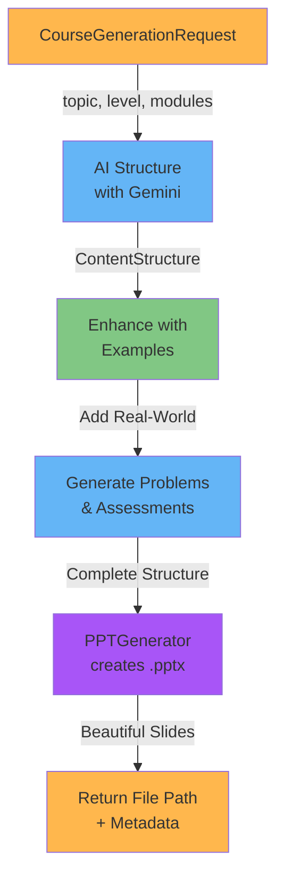

# PPT Course Generation: Creating Beautiful, AI-Powered Presentations

## Executive Summary

Lumina's PPT generation system transforms educational content into visually stunning, professionally-designed presentations. Teachers can:

1. **Generate from Scratch**: AI creates a complete course from a topic
2. **Generate from PDF**: Upload teaching materials; AI converts to interactive course
3. **Personalize Courses**: For individual students based on their submissions
4. **Customize Everything**: Teachers can edit, refine, and brand

All presentations use Lumina's distinctive visual design: **green #22C55E and purple #A855F7 on dark background #0F1115**.

---

## 1. PPT Generation Overview

### Three Generation Modes

```
Mode 1: Topic-Based Generation
┌─────────────────────────────────────────┐
│ Teacher: "Generate a course on          │
│           Quadratic Equations"          │
│                                         │
│ Lumina: Creates 4-6 modules with        │
│         15-20 slides each               │
│         + practice problems             │
│         + assessments                   │
└─────────────────────────────────────────┘

Mode 2: PDF-Based Generation
┌─────────────────────────────────────────┐
│ Teacher: Uploads 47-page PDF of notes   │
│                                         │
│ Lumina: Extracts concepts, structures   │
│         into modules, creates engaging  │
│         presentation                    │
└─────────────────────────────────────────┘

Mode 3: Student-Personalized Generation
┌─────────────────────────────────────────┐
│ Teacher: "Generate remedial course      │
│           based on Alice's quiz errors" │
│                                         │
│ Lumina: Analyzes her 3 wrong answers,   │
│         creates focused course on       │
│         those specific gaps             │
└─────────────────────────────────────────┘
```

---

## 2. Brand Design System

### Color Palette

```
PRIMARY COLOR (Green)
─────────────────────────────────────────
Color Name: Lumina Green
Hex: #22C55E
RGB: RGBColor(34, 197, 94)
Usage: Headers, highlights, call-to-action elements, key concepts
Accessibility: 7.2:1 contrast on dark background (WCAG AAA)

SECONDARY COLOR (Purple)
─────────────────────────────────────────
Color Name: Lumina Purple
Hex: #A855F7
RGB: RGBColor(168, 85, 247)
Usage: Emphasis, examples, alternative paths, decorative
Accessibility: 5.8:1 contrast on dark background (WCAG AA)

BACKGROUND COLOR (Dark)
─────────────────────────────────────────
Color Name: Lumina Dark
Hex: #0F1115
RGB: RGBColor(15, 17, 21)
Usage: All slide backgrounds
Benefits:
  • Reduces eye strain during extended learning
  • Creates high contrast for text readability
  • Modern, professional appearance
  • Supports focus on content

ACCENT COLORS
─────────────────────────────────────────
Light Gray (Text): #E5E7EB (RGB 229, 231, 235)
Light Gray (Secondary Text): #D1D5DB (RGB 209, 213, 219)
Success Green: #10B981 (RGB 16, 185, 129)
Warning Orange: #F59E0B (RGB 245, 158, 11)
Error Red: #EF4444 (RGB 239, 68, 68)
```

### Typography

```
Primary Font: Inter (sans-serif)
  • Modern, highly readable
  • Excellent on-screen performance
  • Professional appearance
  • Free and open-source

Font Sizes & Weights:
─────────────────────────────────────────
Title Slide:        72pt, Bold (#22C55E)
Section Headers:    54pt, Bold (#22C55E)
Slide Titles:       44pt, Bold (#E5E7EB)
Bullet Points:      28pt, Regular (#D1D5DB)
Sub-bullets:        24pt, Regular (#D1D5DB)
Captions:           20pt, Regular (#D1D5DB)
Footer:             16pt, Regular (#A855F7)

Line Height: 1.6 (for readability)
Letter Spacing: 0.5px (for clarity)
```

### Layout Grid

```
Slide Dimensions: 10" × 7.5" (aspect ratio 4:3)
Margin: 0.5" on all sides
Content Area: 9" × 6.5"

Grid System: 12-column grid
  Column Width: 0.75"
  Gutter: 0.1"

Spacing Scale (in inches):
  XS: 0.1"  | S: 0.25" | M: 0.5" | L: 0.75" | XL: 1"

Standard Slide Layout:
┌─────────────────────────────────────────┐
│ [Title]          [0.5" top margin]      │
│                                         │
│ [Content Area]                          │
│                                         │
│                                         │
│                                         │
│ [Footer] ──────────────────────────    │
│                [0.5" bottom margin]     │
└─────────────────────────────────────────┘
```

---

## 3. Content Structure Schema

The AI structures courses using a consistent schema:

```python
class ContentStructure(BaseModel):
    """
    Defines the structure of a course/presentation
    """
    title: str                  # Course title
    subtitle: str               # Course subtitle/tagline
    learning_objectives: List[str]  # What students will learn

    modules: List[Module]       # Course modules

class Module(BaseModel):
    """
    A major topic grouping
    """
    module_id: str
    title: str                  # e.g., "Module 1: Linear Equations"
    description: str            # Brief overview
    learning_outcomes: List[str]  # Specific outcomes for this module
    lessons: List[Lesson]       # Lessons within module
    estimated_hours: float      # Time to complete

class Lesson(BaseModel):
    """
    A single lesson within a module
    """
    lesson_id: str
    title: str                  # e.g., "Lesson 1.1: Solving 1-Step Equations"
    description: str
    slides: List[Slide]
    practice_problems: List[Problem]
    estimated_minutes: int

class Slide(BaseModel):
    """
    A single slide in the presentation
    """
    slide_id: str
    type: str                   # "title", "content", "example", "practice", "summary"
    title: str
    content: str                # Main text content
    bullets: List[str]          # Bullet points
    visual_elements: List[str]  # "graph", "diagram", "image", "animation"
    notes: str                  # Speaker notes
    layout: str                 # "title_slide", "title_content", "two_column", etc

class Problem(BaseModel):
    """
    A practice problem
    """
    problem_id: str
    problem_text: str
    difficulty: str             # "easy", "medium", "hard"
    solution: str
    explanation: str
    hints: List[str]
```

### Example Content Structure (JSON)

```json
{
  "title": "Quadratic Equations: From Concept to Application",
  "subtitle": "Master solving equations in standard form",
  "learning_objectives": [
    "Understand what makes an equation quadratic",
    "Solve quadratic equations using multiple methods",
    "Apply quadratic equations to real-world problems",
    "Interpret solutions in context"
  ],
  "modules": [
    {
      "module_id": "quadratic_1",
      "title": "Module 1: Foundations of Quadratic Equations",
      "description": "Understand what quadratic equations are and why they matter",
      "learning_outcomes": [
        "Identify quadratic equations in standard form",
        "Understand the components (a, b, c)",
        "Graph parabolas and identify key features"
      ],
      "lessons": [
        {
          "lesson_id": "quadratic_1_1",
          "title": "Lesson 1.1: What is a Quadratic Equation?",
          "description": "Introduction to quadratic equations",
          "estimated_minutes": 15,
          "slides": [
            {
              "slide_id": "slide_001",
              "type": "title",
              "title": "What is a Quadratic Equation?",
              "content": "A quadratic equation is an equation of the form ax² + bx + c = 0 where a ≠ 0",
              "visual_elements": ["standard_form_graphic"],
              "layout": "title_slide"
            },
            {
              "slide_id": "slide_002",
              "type": "content",
              "title": "Standard Form: ax² + bx + c = 0",
              "bullets": [
                "a is the coefficient of x² (must not be 0)",
                "b is the coefficient of x",
                "c is the constant term",
                "All terms must be on one side, = 0 on the other"
              ],
              "visual_elements": ["labeled_equation_diagram"],
              "layout": "title_content"
            },
            {
              "slide_id": "slide_003",
              "type": "example",
              "title": "Examples of Quadratic Equations",
              "bullets": [
                "x² + 5x + 6 = 0 (where a=1, b=5, c=6)",
                "2x² - 3x + 1 = 0 (where a=2, b=-3, c=1)",
                "-x² + 4 = 0 (where a=-1, b=0, c=4)",
                "x² = 9 can be rewritten as x² - 9 = 0"
              ],
              "visual_elements": ["equation_breakdown"],
              "layout": "title_content"
            }
          ],
          "practice_problems": [
            {
              "problem_id": "prob_1",
              "problem_text": "Is 3x + 2 = 5 a quadratic equation? Why or why not?",
              "difficulty": "easy",
              "solution": "No, because there is no x² term",
              "explanation": "Quadratic equations must have an x² term where a ≠ 0"
            }
          ]
        }
      ]
    }
  ]
}
```

---

## 4. Title Slide Design

### Slide 1: Title Slide

```
╔════════════════════════════════════════════════════════╗
║                                                        ║
║                                                        ║
║     ███╗   ███╗ █████╗ ████████╗██╗  ██╗███████╗      ║
║     ████╗ ████║██╔══██╗╚══██╔══╝██║  ██║██╔════╝      ║
║     ██╔████╔██║███████║   ██║   ███████║█████╗        ║
║     ██║╚██╔╝██║██╔══██║   ██║   ██╔══██║██╔══╝        ║
║     ██║ ╚═╝ ██║██║  ██║   ██║   ██║  ██║███████╗      ║
║     ╚═╝     ╚═╝╚═╝  ╚═╝   ╚═╝   ╚═╝  ╚═╝╚══════╝      ║
║                                                        ║
║                                                        ║
║        QUADRATIC EQUATIONS: MASTERING THE BASICS      ║
║                                                        ║
║        From Understanding to Application              ║
║                                                        ║
║                                                        ║
║                                                        ║
║              LUMINA LEARNING PLATFORM                ║
║                  November 2025                        ║
║                                                        ║
╚════════════════════════════════════════════════════════╝

Colors:
  • Background: #0F1115 (Dark)
  • Title: #22C55E (Lumina Green)
  • Subtitle: #D1D5DB (Light Gray)
  • Footer: #A855F7 (Lumina Purple)

Layout:
  • Title centered, 72pt bold
  • Subtitle centered, 28pt regular
  • Logo/branding in bottom right
  • Decorative line elements in accent colors
```

### Title Slide Code

```python
def create_title_slide(prs, content_structure):
    """
    Create the title slide
    """
    slide_layout = prs.slide_layouts[6]  # Blank layout
    slide = prs.slides.add_slide(slide_layout)

    # Set background
    background = slide.background
    fill = background.fill
    fill.solid()
    fill.fore_color.rgb = RGBColor(15, 17, 21)  # Dark background

    # Add title (centered, large)
    title_box = slide.shapes.add_textbox(
        Inches(0.5), Inches(2),
        Inches(9), Inches(1.5)
    )
    title_frame = title_box.text_frame
    title_frame.word_wrap = True
    p = title_frame.paragraphs[0]
    p.text = content_structure.title
    p.font.size = Pt(72)
    p.font.bold = True
    p.font.color.rgb = RGBColor(34, 197, 94)  # Lumina Green
    p.alignment = PP_ALIGN.CENTER

    # Add subtitle
    subtitle_box = slide.shapes.add_textbox(
        Inches(0.5), Inches(3.8),
        Inches(9), Inches(1)
    )
    subtitle_frame = subtitle_box.text_frame
    p = subtitle_frame.paragraphs[0]
    p.text = content_structure.subtitle
    p.font.size = Pt(28)
    p.font.color.rgb = RGBColor(209, 213, 219)  # Light Gray
    p.alignment = PP_ALIGN.CENTER

    # Add footer
    footer_box = slide.shapes.add_textbox(
        Inches(0.5), Inches(6.8),
        Inches(9), Inches(0.5)
    )
    footer_frame = footer_box.text_frame
    p = footer_frame.paragraphs[0]
    p.text = "LUMINA LEARNING PLATFORM"
    p.font.size = Pt(16)
    p.font.color.rgb = RGBColor(168, 85, 247)  # Lumina Purple
    p.alignment = PP_ALIGN.CENTER

    return slide
```

---

## 5. Content Slide Design

### Standard Slide Layout

```
╔════════════════════════════════════════════════════════╗
║  SOLVING QUADRATIC EQUATIONS                          ║ (Title)
║  ════════════════════════════════════════════════════  ║ (Green line)
║                                                        ║
║  • The quadratic formula is a universal tool that     ║
║    works for all quadratic equations                  ║
║                                                        ║
║  • Formula: x = (-b ± √(b² - 4ac)) / 2a               ║
║                                                        ║
║  • The discriminant (b² - 4ac) tells us:              ║
║    - If positive: 2 real solutions                    ║
║    - If zero: 1 real solution                         ║
║    - If negative: no real solutions                   ║
║                                                        ║
║  • The ± symbol means two separate solutions          ║
║                                                        ║
║                                                        ║
║                                                        ║
║                                                        ║
║  [Visual: Interactive quadratic formula diagram]      ║
║  [with labeled components]                            ║
║                                                        ║
║────────────────────────────────────────────────────── ║
║  Lesson 1.2: Solving with the Quadratic Formula       ║ (Footer)
╚════════════════════════════════════════════════════════╝

Colors:
  • Background: #0F1115 (Dark)
  • Title: #22C55E (Lumina Green)
  • Title underline: #A855F7 (Lumina Purple)
  • Bullet text: #D1D5DB (Light Gray)
  • Key formula: #22C55E (Lumina Green)
  • Footer: #A855F7 (Lumina Purple)
```

### Content Slide Code

```python
def create_content_slide(prs, slide_content):
    """
    Create a standard content slide with title and bullets
    """
    slide_layout = prs.slide_layouts[6]  # Blank
    slide = prs.slides.add_slide(slide_layout)

    # Background
    background = slide.background
    fill = background.fill
    fill.solid()
    fill.fore_color.rgb = RGBColor(15, 17, 21)

    # Title
    title_box = slide.shapes.add_textbox(
        Inches(0.5), Inches(0.5),
        Inches(9), Inches(0.6)
    )
    title_frame = title_box.text_frame
    p = title_frame.paragraphs[0]
    p.text = slide_content.title
    p.font.size = Pt(44)
    p.font.bold = True
    p.font.color.rgb = RGBColor(34, 197, 94)  # Green

    # Title underline
    line = slide.shapes.add_shape(
        MSO_SHAPE.RECTANGLE,
        Inches(0.5), Inches(1.15),
        Inches(2), Inches(0.05)
    )
    line.fill.solid()
    line.fill.fore_color.rgb = RGBColor(168, 85, 247)  # Purple
    line.line.color.rgb = RGBColor(168, 85, 247)

    # Content bullets
    content_box = slide.shapes.add_textbox(
        Inches(0.75), Inches(1.4),
        Inches(8.5), Inches(4.5)
    )
    text_frame = content_box.text_frame
    text_frame.word_wrap = True

    for i, bullet in enumerate(slide_content.bullets):
        if i == 0:
            p = text_frame.paragraphs[0]
        else:
            p = text_frame.add_paragraph()

        p.text = bullet
        p.level = 0
        p.font.size = Pt(28)
        p.font.color.rgb = RGBColor(209, 213, 219)  # Light gray
        p.space_before = Pt(12)
        p.space_after = Pt(12)
        p.line_spacing = 1.4

        # Add bullet point (green dot)
        p.bullet = True
        p.bullet_format.bullet_char = "●"
        p.bullet_format.font.color.rgb = RGBColor(34, 197, 94)

    # Footer
    footer_box = slide.shapes.add_textbox(
        Inches(0.5), Inches(6.9),
        Inches(9), Inches(0.4)
    )
    footer_frame = footer_box.text_frame
    p = footer_frame.paragraphs[0]
    p.text = slide_content.footer_text
    p.font.size = Pt(16)
    p.font.color.rgb = RGBColor(168, 85, 247)
    p.alignment = PP_ALIGN.CENTER

    return slide
```

---

## 6. PPTGenerator Service

### Class Implementation

```python
from pptx import Presentation
from pptx.util import Inches, Pt
from pptx.enum.text import PP_ALIGN
from pptx.dml.color import RGBColor
import os
from pathlib import Path

class PPTGenerator:
    """
    Generate professional presentations with Lumina branding
    """

    # Brand colors
    BRAND_PRIMARY = RGBColor(34, 197, 94)      # #22C55E Green
    BRAND_SECONDARY = RGBColor(168, 85, 247)  # #A855F7 Purple
    DARK_BG = RGBColor(15, 17, 21)             # #0F1115 Dark
    TEXT_PRIMARY = RGBColor(229, 231, 235)    # Light gray for text
    TEXT_SECONDARY = RGBColor(209, 213, 219)  # Darker gray for secondary

    # Slide dimensions
    SLIDE_WIDTH = Inches(10)
    SLIDE_HEIGHT = Inches(7.5)

    def __init__(self, output_dir: str = "./presentations"):
        self.output_dir = Path(output_dir)
        self.output_dir.mkdir(exist_ok=True)

    def create_presentation(self, topic: str, content_structure: dict) -> str:
        """
        Create a complete presentation from a content structure

        Args:
            topic: Name of the topic
            content_structure: Dict with {title, subtitle, modules: [{...}]}

        Returns:
            Path to generated .pptx file
        """
        # Create presentation
        prs = Presentation()
        prs.slide_width = self.SLIDE_WIDTH
        prs.slide_height = self.SLIDE_HEIGHT

        # Slide 1: Title slide
        self._add_title_slide(prs, content_structure)

        # Slide 2: Table of contents
        self._add_table_of_contents(prs, content_structure)

        # Generate slides for each module
        slide_num = 3
        for module in content_structure['modules']:
            slide_num = self._add_module_slides(prs, module, slide_num)

        # Final slide: Thank you
        self._add_closing_slide(prs, topic)

        # Save presentation
        filename = f"{topic.replace(' ', '_').lower()}_{pd.Timestamp.now().strftime('%Y%m%d_%H%M%S')}.pptx"
        filepath = self.output_dir / filename

        prs.save(str(filepath))
        return str(filepath)

    def _add_title_slide(self, prs, content_structure):
        """Add title slide"""
        slide = prs.slides.add_slide(prs.slide_layouts[6])  # Blank layout

        # Dark background
        background = slide.background
        fill = background.fill
        fill.solid()
        fill.fore_color.rgb = self.DARK_BG

        # Title
        title_box = slide.shapes.add_textbox(
            Inches(0.5), Inches(2.5), Inches(9), Inches(1.5)
        )
        title_frame = title_box.text_frame
        title_frame.word_wrap = True
        p = title_frame.paragraphs[0]
        p.text = content_structure['title']
        p.font.size = Pt(72)
        p.font.bold = True
        p.font.color.rgb = self.BRAND_PRIMARY
        p.alignment = PP_ALIGN.CENTER

        # Subtitle
        subtitle_box = slide.shapes.add_textbox(
            Inches(0.5), Inches(4), Inches(9), Inches(1)
        )
        subtitle_frame = subtitle_box.text_frame
        p = subtitle_frame.paragraphs[0]
        p.text = content_structure['subtitle']
        p.font.size = Pt(28)
        p.font.color.rgb = self.TEXT_SECONDARY
        p.alignment = PP_ALIGN.CENTER

        return slide

    def _add_table_of_contents(self, prs, content_structure):
        """Add table of contents slide"""
        slide = prs.slides.add_slide(prs.slide_layouts[6])

        # Dark background
        background = slide.background
        fill = background.fill
        fill.solid()
        fill.fore_color.rgb = self.DARK_BG

        # Title
        title_box = slide.shapes.add_textbox(
            Inches(0.5), Inches(0.5), Inches(9), Inches(0.6)
        )
        p = title_box.text_frame.paragraphs[0]
        p.text = "Course Outline"
        p.font.size = Pt(44)
        p.font.bold = True
        p.font.color.rgb = self.BRAND_PRIMARY

        # Content
        content_box = slide.shapes.add_textbox(
            Inches(1), Inches(1.5), Inches(8), Inches(5.5)
        )
        text_frame = content_box.text_frame
        text_frame.word_wrap = True

        for i, module in enumerate(content_structure['modules']):
            p = text_frame.add_paragraph() if i > 0 else text_frame.paragraphs[0]
            p.text = f"{i+1}. {module['title']}"
            p.level = 0
            p.font.size = Pt(24)
            p.font.color.rgb = self.TEXT_PRIMARY
            p.space_before = Pt(10)
            p.space_after = Pt(10)
            p.bullet = True

        return slide

    def _add_module_slides(self, prs, module, start_slide_num):
        """Add slides for a module"""
        # Module intro slide
        slide = prs.slides.add_slide(prs.slide_layouts[6])
        self._set_dark_background(slide)

        # Module title
        title_box = slide.shapes.add_textbox(
            Inches(0.5), Inches(2), Inches(9), Inches(2)
        )
        title_frame = title_box.text_frame
        title_frame.word_wrap = True
        p = title_frame.paragraphs[0]
        p.text = module['title']
        p.font.size = Pt(54)
        p.font.bold = True
        p.font.color.rgb = self.BRAND_PRIMARY
        p.alignment = PP_ALIGN.CENTER

        # Module description
        desc_box = slide.shapes.add_textbox(
            Inches(1), Inches(4.5), Inches(8), Inches(2)
        )
        p = desc_box.text_frame.paragraphs[0]
        p.text = module['description']
        p.font.size = Pt(24)
        p.font.color.rgb = self.TEXT_SECONDARY
        p.alignment = PP_ALIGN.CENTER

        slide_num = start_slide_num + 1

        # Add lessons in this module
        for lesson in module['lessons']:
            slide_num = self._add_lesson_slides(prs, lesson, slide_num)

        return slide_num

    def _add_lesson_slides(self, prs, lesson, start_slide_num):
        """Add slides for individual lessons"""
        for slide_content in lesson['slides']:
            if slide_content['type'] == 'title':
                self._add_content_slide(prs, slide_content)
            elif slide_content['type'] == 'content':
                self._add_content_slide(prs, slide_content)
            elif slide_content['type'] == 'example':
                self._add_example_slide(prs, slide_content)

        return start_slide_num + len(lesson['slides'])

    def _add_content_slide(self, prs, slide_content):
        """Add a standard content slide"""
        slide = prs.slides.add_slide(prs.slide_layouts[6])
        self._set_dark_background(slide)

        # Title
        title_box = slide.shapes.add_textbox(
            Inches(0.5), Inches(0.4), Inches(9), Inches(0.7)
        )
        p = title_box.text_frame.paragraphs[0]
        p.text = slide_content['title']
        p.font.size = Pt(44)
        p.font.bold = True
        p.font.color.rgb = self.BRAND_PRIMARY

        # Title underline
        line = slide.shapes.add_shape(
            1,  # Rectangle
            Inches(0.5), Inches(1.1), Inches(2), Inches(0.05)
        )
        line.fill.solid()
        line.fill.fore_color.rgb = self.BRAND_SECONDARY
        line.line.color.rgb = self.BRAND_SECONDARY

        # Bullets
        if slide_content.get('bullets'):
            bullet_box = slide.shapes.add_textbox(
                Inches(0.75), Inches(1.4), Inches(8.5), Inches(4.8)
            )
            text_frame = bullet_box.text_frame
            text_frame.word_wrap = True

            for i, bullet in enumerate(slide_content['bullets']):
                p = text_frame.add_paragraph() if i > 0 else text_frame.paragraphs[0]
                p.text = bullet
                p.level = 0
                p.font.size = Pt(24)
                p.font.color.rgb = self.TEXT_PRIMARY
                p.space_before = Pt(8)
                p.space_after = Pt(8)
                p.bullet = True
                p.bullet_format.font.color.rgb = self.BRAND_PRIMARY

        return slide

    def _add_example_slide(self, prs, slide_content):
        """Add an example/highlighted slide"""
        slide = prs.slides.add_slide(prs.slide_layouts[6])
        self._set_dark_background(slide)

        # Add colored background box for emphasis
        example_box = slide.shapes.add_shape(
            1,  # Rectangle
            Inches(0.3), Inches(0.3), Inches(9.4), Inches(6.9)
        )
        example_box.fill.solid()
        example_box.fill.fore_color.rgb = RGBColor(25, 25, 35)  # Slightly lighter dark
        example_box.line.color.rgb = self.BRAND_SECONDARY
        example_box.line.width = Pt(2)

        # Title
        title_box = slide.shapes.add_textbox(
            Inches(0.6), Inches(0.6), Inches(8.8), Inches(0.6)
        )
        p = title_box.text_frame.paragraphs[0]
        p.text = f"Example: {slide_content['title']}"
        p.font.size = Pt(32)
        p.font.bold = True
        p.font.color.rgb = self.BRAND_SECONDARY

        # Content
        content_box = slide.shapes.add_textbox(
            Inches(0.9), Inches(1.4), Inches(8.2), Inches(5.3)
        )
        text_frame = content_box.text_frame
        text_frame.word_wrap = True

        for i, bullet in enumerate(slide_content.get('bullets', [])):
            p = text_frame.add_paragraph() if i > 0 else text_frame.paragraphs[0]
            p.text = bullet
            p.font.size = Pt(22)
            p.font.color.rgb = self.TEXT_PRIMARY
            p.space_before = Pt(6)
            p.space_after = Pt(6)
            p.bullet = True
            p.bullet_format.font.color.rgb = self.BRAND_SECONDARY

        return slide

    def _add_closing_slide(self, prs, topic):
        """Add closing/thank you slide"""
        slide = prs.slides.add_slide(prs.slide_layouts[6])
        self._set_dark_background(slide)

        # Main message
        title_box = slide.shapes.add_textbox(
            Inches(0.5), Inches(2.5), Inches(9), Inches(1.5)
        )
        p = title_box.text_frame.paragraphs[0]
        p.text = "Great Work!"
        p.font.size = Pt(72)
        p.font.bold = True
        p.font.color.rgb = self.BRAND_PRIMARY
        p.alignment = PP_ALIGN.CENTER

        # Subtitle
        subtitle_box = slide.shapes.add_textbox(
            Inches(0.5), Inches(4.2), Inches(9), Inches(1)
        )
        p = subtitle_box.text_frame.paragraphs[0]
        p.text = f"You've completed {topic}"
        p.font.size = Pt(28)
        p.font.color.rgb = self.TEXT_SECONDARY
        p.alignment = PP_ALIGN.CENTER

        # Footer
        footer_box = slide.shapes.add_textbox(
            Inches(0.5), Inches(6.5), Inches(9), Inches(0.7)
        )
        p = footer_box.text_frame.paragraphs[0]
        p.text = "Keep learning and growing with Lumina!"
        p.font.size = Pt(20)
        p.font.color.rgb = self.BRAND_SECONDARY
        p.alignment = PP_ALIGN.CENTER

        return slide

    def _set_dark_background(self, slide):
        """Set dark background for a slide"""
        background = slide.background
        fill = background.fill
        fill.solid()
        fill.fore_color.rgb = self.DARK_BG
```

---

## 7. AI Content Structuring

### LLM-Powered Organization

```python
async def structure_content_with_ai(topic: str, difficulty: str, num_modules: int):
    """
    Use Google Gemini to structure a topic into a course
    """

    prompt = f"""
    Create a detailed course structure for teaching "{topic}" at {difficulty} level.

    Requirements:
    - Generate {num_modules} modules
    - Each module has 2-3 lessons
    - Each lesson has 5-7 slides plus practice problems
    - Structure must follow the ContentStructure schema

    Output ONLY valid JSON matching this schema:
    {{
      "title": "...",
      "subtitle": "...",
      "learning_objectives": ["..."],
      "modules": [
        {{
          "module_id": "...",
          "title": "...",
          "description": "...",
          "learning_outcomes": ["..."],
          "lessons": [...]
        }}
      ]
    }}

    Focus on:
    • Logical progression from simple to complex
    • Clear learning objectives
    • Real-world connections
    • Active learning opportunities
    """

    response = await gemini.generate_content(prompt)

    # Parse JSON response
    import json
    content_structure = json.loads(response)

    return content_structure
```

---

## 8. Course Generation Pipeline

### From Request to Presentation



### API Request Structure

```python
class CourseGenerationRequest(BaseModel):
    """
    Generate a complete course from scratch
    """
    topic: str                          # e.g., "Quadratic Equations"
    level: str = "Beginning"            # Beginning/Intermediate/Advanced
    modules: int = 4                    # Number of modules to create
    include_practice: bool = True       # Include problem sets
    include_assessments: bool = True    # Include quizzes
    visual_style: str = "modern"        # Design style (modern, minimal, colorful)

class CourseGenerationResponse(BaseModel):
    """
    Response with generated course
    """
    course_id: str
    pptx_file_path: str
    pptx_download_url: str
    content_structure: dict
    num_slides: int
    estimated_hours: float
    status: str  # "success" or "error"
```

### Example Request/Response

```json
REQUEST:
POST /api/tutor/generate-course
{
  "topic": "Quadratic Equations",
  "level": "Intermediate",
  "modules": 4,
  "include_practice": true,
  "include_assessments": true
}

RESPONSE:
{
  "course_id": "course_quad_eq_20251118",
  "pptx_file_path": "/presentations/quadratic_equations_20251118_143022.pptx",
  "pptx_download_url": "/api/tutor/download-ppt/course_quad_eq_20251118",
  "content_structure": {
    "title": "Quadratic Equations: Complete Mastery",
    "modules": 4,
    "lessons": 12,
    "slides": 67
  },
  "num_slides": 67,
  "estimated_hours": 6.5,
  "status": "success"
}
```

---

## 9. Module/Lesson Structure

### How AI Breaks Topics Down

```
TOPIC: Quadratic Equations
│
├─ MODULE 1: Foundations & Understanding (6 hours)
│  ├─ Lesson 1.1: What Are Quadratic Equations? (20 min)
│  ├─ Lesson 1.2: Components (a, b, c) (20 min)
│  ├─ Lesson 1.3: Graphing Parabolas (25 min)
│  ├─ Lesson 1.4: Vertex and Roots (25 min)
│  └─ Lesson 1.5: Practice & Review (30 min)
│
├─ MODULE 2: Solving Methods (5 hours)
│  ├─ Lesson 2.1: Factoring Method (30 min)
│  ├─ Lesson 2.2: Completing the Square (30 min)
│  ├─ Lesson 2.3: Quadratic Formula (25 min)
│  ├─ Lesson 2.4: Comparing Methods (20 min)
│  └─ Lesson 2.5: Problem-Solving (25 min)
│
├─ MODULE 3: Applications (4 hours)
│  ├─ Lesson 3.1: Real-World Problems (25 min)
│  ├─ Lesson 3.2: Physics Applications (25 min)
│  ├─ Lesson 3.3: Business Problems (25 min)
│  └─ Lesson 3.4: Projects (45 min)
│
└─ MODULE 4: Mastery & Extensions (3 hours)
   ├─ Lesson 4.1: Advanced Problems (30 min)
   ├─ Lesson 4.2: Connections to Other Topics (30 min)
   └─ Lesson 4.3: Assessment & Review (30 min)

TOTAL: 18 hours of content
```

---

## 10. Difficulty Levels

### Content Adaptation by Level

```
TOPIC: Solving Quadratic Equations

BEGINNING LEVEL:
• Focus: Understanding what quadratic equations are
• Methods: Factoring (simple cases only)
• Problems: x² + 5x + 6 = 0
• Time: 8 hours

INTERMEDIATE LEVEL:
• Focus: Multiple solving methods
• Methods: Factoring, completing square, formula
• Problems: Mix of all types, some with fractions
• Time: 12 hours

ADVANCED LEVEL:
• Focus: Mastery and applications
• Methods: All methods plus discriminant analysis
• Problems: Complex, real-world, theoretical
• Time: 18 hours

Example Problem Comparison:
─────────────────────────────────────────
BEGINNING:  x² + 4x + 3 = 0
            (Simple factoring)

INTERMEDIATE: 2x² - 5x + 3 = 0
             (Requires multiple methods)

ADVANCED: A projectile's height is h(t) = -16t² + 64t + 80
          Find when it hits the ground and max height.
          (Real-world, requires full analysis)
```

---

## 11. Assignment-Personalized Courses

### Remedial Course Generation

```python
class AssignmentCourseRequest(BaseModel):
    """
    Generate a personalized remedial course based on
    a student's assignment/quiz performance
    """
    assignment_id: str                  # The assignment student struggled with
    submission_id: Optional[str] = None  # Their submission (if available)
    student_id: Optional[str] = None     # Student profile (for personalization)
    modules: int = 4                     # Depth of remedial course

async def generate_assignment_course(request: AssignmentCourseRequest):
    """
    Generate course focused on student's specific gaps
    """
    # Step 1: Analyze student's mistakes
    submission = get_submission(request.submission_id)
    mistakes = analyze_mistakes(submission)
    # mistakes = [
    #   {"error": "sign_error", "count": 3, "topic": "quadratic_formula"},
    #   {"error": "conceptual_misunderstanding", "count": 2, "topic": "discriminant"}
    # ]

    # Step 2: Identify root causes
    root_causes = identify_root_causes(mistakes, student_id=request.student_id)
    # root_causes = [
    #   "Weak understanding of negative numbers in operations",
    #   "Skipped the discriminant lesson",
    #   "Needs more practice with formula substitution"
    # ]

    # Step 3: Create focused course addressing these
    prompt = f"""
    Create a remedial course for a student who made these mistakes:
    {mistakes}

    Root causes to address:
    {root_causes}

    Generate a {request.modules}-module course that:
    • Reviews prerequisite concepts they're missing
    • Provides extra practice on error types
    • Uses different explanations than original
    • Includes confidence-building problems
    • Focuses on understanding, not just process

    Output JSON matching ContentStructure schema.
    """

    content_structure = await gemini.generate_content(prompt)

    # Step 4: Generate presentation
    pptx_path = ppt_gen.create_presentation(
        topic=f"Remedial: {submission.assignment.topic}",
        content_structure=content_structure
    )

    return {
        "course_id": f"remedial_{submission.assignment.topic}_{request.student_id}",
        "pptx_path": pptx_path,
        "focused_on": root_causes,
        "target_student": request.student_id
    }
```

### Example: Student's Mistakes → Personalized Course

```
STUDENT: David Chen

ORIGINAL QUIZ RESULTS:
✗ Problem 1: Quadratic formula, got wrong answer
✗ Problem 2: Discriminant, misunderstood negative value
✓ Problem 3: Factoring, got right (guessed?)
✗ Problem 4: Real-world application, setup wrong
────────────────────────────────────────────

ERROR ANALYSIS:
• Sign errors in formula application (3 instances)
• Doesn't understand what discriminant means
• Struggles with negative number operations
• Can't translate word problems to equations

GENERATED REMEDIAL COURSE:

Module 1: Review Negative Numbers (90 min)
├─ Why negative numbers matter in algebra
├─ Operations with negatives
├─ Order of operations with negatives
└─ Practice problems emphasizing signs

Module 2: Quadratic Formula Deep Dive (120 min)
├─ Each component of the formula explained
├─ Step-by-step substitution
├─ Common sign errors and how to avoid them
└─ Problems designed to prevent David's specific errors

Module 3: Understanding the Discriminant (90 min)
├─ What discriminant tells us
├─ Positive, zero, negative cases
├─ Interpreting results
└─ Application to real problems

Module 4: Word Problems to Equations (90 min)
├─ How to set up quadratic equations
├─ Identifying a, b, c from context
├─ Solving and interpreting
└─ Real-world practice with feedback

TOTAL: 6 hours of targeted remediation
```

---

## 12. PDF Ingestion → Course

### Teachers Can Upload PDFs

```python
async def ingest_pdf_and_generate_course(pdf_file: UploadFile):
    """
    Extract content from PDF and generate interactive course
    """

    # Step 1: Extract text from PDF
    pdf_text = extract_text_from_pdf(pdf_file)
    # Returns: Complete text content + page structure

    # Step 2: Identify structure
    sections = identify_document_structure(pdf_text)
    # Returns: Detected chapters, sections, key concepts

    # Step 3: Extract key concepts
    concepts = extract_key_concepts(pdf_text, use_nlp=True)
    # Returns: List of main ideas, ordered by importance

    # Step 4: Create learning objectives
    learning_objectives = gemini.infer_learning_objectives(
        text=pdf_text,
        concepts=concepts
    )

    # Step 5: Generate course structure
    content_structure = await structure_content_with_ai(
        topic=pdf_file.filename.replace('.pdf', ''),
        source_text=pdf_text,
        difficulty="Intermediate",
        num_modules=len(sections)
    )

    # Step 6: Enhance with original PDF content
    # Weave in direct quotes and examples from PDF
    for module in content_structure['modules']:
        for lesson in module['lessons']:
            for slide in lesson['slides']:
                relevant_excerpt = find_relevant_pdf_excerpt(
                    slide['content'],
                    pdf_text
                )
                if relevant_excerpt:
                    slide['notes'] += f"\nSource: PDF p. {relevant_excerpt['page']}"

    # Step 7: Generate presentation
    pptx_path = ppt_gen.create_presentation(
        topic=pdf_file.filename.replace('.pdf', ''),
        content_structure=content_structure
    )

    return {
        "source_file": pdf_file.filename,
        "pptx_path": pptx_path,
        "extracted_concepts": concepts,
        "num_modules": len(content_structure['modules']),
        "estimated_hours": sum(m['estimated_hours'] for m in content_structure['modules'])
    }
```

---

## 13. Course Storage

### Database Schema

```sql
CREATE TABLE courses (
  id UUID PRIMARY KEY,
  teacher_id UUID NOT NULL REFERENCES users(id),
  course_name VARCHAR(255),
  subject VARCHAR(100),
  created_at TIMESTAMP DEFAULT NOW(),
  updated_at TIMESTAMP,

  -- Content storage as JSONB
  modules JSONB,  -- Full ContentStructure

  -- PPT generation tracking
  pptx_file_path VARCHAR(500),
  pptx_generated_at TIMESTAMP,

  -- Metadata
  num_modules INT,
  num_slides INT,
  estimated_hours FLOAT,
  difficulty_level VARCHAR(20),

  -- AI-generated metadata
  ai_generated BOOLEAN DEFAULT TRUE,
  ai_model_used VARCHAR(50),

  -- Status
  status VARCHAR(20)  -- 'draft', 'published', 'archived'
);

-- Example query:
SELECT id, course_name, num_slides, pptx_file_path
FROM courses
WHERE teacher_id = $1
AND status = 'published'
ORDER BY created_at DESC;
```

---

## 14. Teacher AI Generator UI

### `/teacher/ai-generator` Workflow

```
╔════════════════════════════════════════════════════════╗
║        LUMINA AI COURSE GENERATOR                      ║
╠════════════════════════════════════════════════════════╣
║                                                        ║
║  STEP 1: Choose Generation Type                        ║
║  ┌─────────────────────────────────────────────────┐  ║
║  │ ◯ Generate from Topic                          │  ║
║  │   "I have a topic in mind"                     │  ║
║  │                                                 │  ║
║  │ ◯ Generate from PDF                            │  ║
║  │   "I have teaching materials"                  │  ║
║  │                                                 │  ║
║  │ ◯ Generate from Student Mistakes               │  ║
║  │   "A student struggled; create remedial"       │  ║
║  └─────────────────────────────────────────────────┘  ║
║                                                        ║
║  STEP 2: Configure Course (if Topic)                  ║
║  ┌─────────────────────────────────────────────────┐  ║
║  │ Topic: [Quadratic Equations          ]         │  ║
║  │                                                 │  ║
║  │ Difficulty:                                    │  ║
║  │ ◯ Beginning  ◯ Intermediate  ● Advanced      │  ║
║  │                                                 │  ║
║  │ Number of Modules: [4]                         │  ║
║  │                                                 │  ║
║  │ Duration: Approximately 6-7 hours              │  ║
║  └─────────────────────────────────────────────────┘  ║
║                                                        ║
║  STEP 3: Upload or Confirm                            ║
║  ┌─────────────────────────────────────────────────┐  ║
║  │ Ready to generate!                             │  ║
║  │                                                 │  ║
║  │ This will create:                              │  ║
║  │ • 4 modules with ~15 slides each              │  ║
║  │ • Interactive examples and practice problems   │  ║
║  │ • Beautiful Lumina-branded presentation       │  ║
║  │                                                 │  ║
║  │ Estimated generation time: 2-3 minutes        │  ║
║  │                                                 │  ║
║  │ [GENERATE COURSE] [CANCEL]                    │  ║
║  └─────────────────────────────────────────────────┘  ║
║                                                        ║
║  Processing... [████████░░] 45% complete              ║
║  Currently: Generating Module 2 content...            ║
║                                                        ║
╚════════════════════════════════════════════════════════╝
```

### Customization After Generation

Once generated, teacher can:

```
EDIT GENERATED COURSE: Quadratic Equations

[PREVIEW] [DOWNLOAD] [CUSTOMIZE] [PUBLISH]

CUSTOMIZATION OPTIONS:
├─ Edit slide content
├─ Add/remove slides
├─ Upload custom images
├─ Adjust difficulty levels
├─ Add school-specific examples
├─ Change colors/branding
├─ Modify learning objectives
└─ Attach rubrics and assessments
```

---

## 15. File Download

### Downloading PPTX Files

```python
@app.get("/api/tutor/download-ppt/{course_id}")
async def download_ppt(course_id: str, current_user: User = Depends(get_current_user)):
    """
    Download the generated PPTX file
    """

    # Verify ownership
    course = db.courses.find_one({"id": course_id})
    if course['teacher_id'] != current_user.id:
        raise PermissionError("Cannot download course you didn't create")

    # Get file path
    pptx_path = course['pptx_file_path']

    # Return file
    return FileResponse(
        path=pptx_path,
        media_type="application/vnd.openxmlformats-officedocument.presentationml.presentation",
        filename=f"{course['course_name']}.pptx"
    )

# Example usage:
# Teacher clicks "Download" button
# → Browser downloads: "Quadratic_Equations.pptx"
# → Opens in PowerPoint/Google Slides
# → Ready to edit or present
```

---

## Complete Example: End-to-End Generation

### Request to Presentation

```
TEACHER ACTION:
"Generate a course on Quadratic Equations
 at Intermediate level with 4 modules"

┌──────────────────────────────────────┐
│  1. API receives request             │
│     CourseGenerationRequest          │
│     topic: "Quadratic Equations"     │
│     level: "Intermediate"            │
│     modules: 4                       │
└──────────────────────────────────────┘
           ↓
┌──────────────────────────────────────┐
│  2. AI structures content            │
│     Google Gemini generates          │
│     ContentStructure JSON            │
│     with 4 modules, 12 lessons       │
└──────────────────────────────────────┘
           ↓
┌──────────────────────────────────────┐
│  3. Generate slides                  │
│     PPTGenerator creates slides:     │
│     • Title slide                    │
│     • 4 module intro slides          │
│     • 12 lesson slides (67 total)    │
│     • Closing slide                  │
└──────────────────────────────────────┘
           ↓
┌──────────────────────────────────────┐
│  4. Save & respond                   │
│     Save PPTX to /presentations/     │
│     Return download URL              │
└──────────────────────────────────────┘
           ↓
OUTPUT:
{
  "status": "success",
  "pptx_file": "quadratic_eqs_20251118.pptx",
  "download_url": "/download/course_123",
  "slides": 67,
  "modules": 4,
  "estimated_hours": 6.5
}
```

---

## Summary: Beautiful, AI-Powered Presentations

Lumina's PPT generation system provides:

✅ **Beautiful Design**: Consistent Lumina branding (green, purple, dark)
✅ **AI-Powered Content**: Google Gemini structures courses automatically
✅ **Multiple Inputs**: Generate from topics, PDFs, or student mistakes
✅ **Customizable**: Teachers edit and refine easily
✅ **Professional Quality**: Publication-ready slides
✅ **Time-Saving**: Hours of work done in minutes
✅ **Scalable**: Generate hundreds of courses instantly

The result: **High-quality, visually stunning educational presentations generated by AI in minutes, not hours.**
