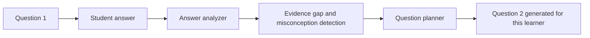

# Question Diversity Engine

Last updated: 2026-03-14

## Purpose

This document defines how Lumina should move from "adaptive difficulty" to "adaptive evidence collection."

Different question formats reveal different kinds of understanding.

The engine should choose a question format based on:

- mastery level
- confidence
- misconception pattern
- cognitive load
- explanation effectiveness history
- what kind of evidence the system still lacks

## Current Repo Reality

Current implementation status:

- adaptive difficulty exists
- concept metadata exists in the schema
- next-question selection exists
- generated questions are effectively MCQ-oriented today

Code anchors:

- `backend/app/assessment/models/schemas.py`
- `backend/app/assessment/question/selector.py`
- `backend/app/assessment/engine/session_manager.py`
- `backend/app/assessment/llm/gemini_generator.py`

Important accuracy note:

- the current generator does **not** yet create question `#2` from the specific semantics of answer `#1`
- the current generator does **not** yet support all six question types shown in the vision images

## Why This System Matters

If Lumina only uses MCQ, it mostly measures recognition.

To estimate real understanding, it needs multiple evidence types:

- recognition
- recall
- explanation
- transfer
- generation
- self-correction

## Target Question Type Library

| Type | Best for | Evidence collected |
| --- | --- | --- |
| MCQ | low-confidence early checks | recognition, misconception screening |
| Fill-in-the-blank | precise recall | exact concept retrieval |
| Short answer | mid-level understanding | semantic grasp in own words |
| Long explanation | deeper synthesis | structure, reasoning, evidence quality |
| Try-answer / open exploration | creativity and hypothesis | reasoning style and intuition |
| Teach-back | high mastery confirmation | transfer and simplification ability |

## Screenshot-Aligned Trigger Notes

The screenshots make several trigger rules explicit. Keep them visible here:

- use more MCQ when mastery is below roughly `0.40` and the system still needs confidence-building recognition checks
- use fill-in-the-blank after an MCQ success when the system wants to verify recall instead of recognition
- unlock long explanation or essay only after the learner shows enough mastery to support structured reasoning
- use teach-back near high mastery to confirm transfer, simplification ability, and remaining misconception residue

## Proposed Question Contract

The current `Question` model should evolve into a multi-format union.

```json
{
  "id": "q-123",
  "format": "short_answer",
  "topic": "photosynthesis",
  "prompt": "You said plants make food. What ingredient does sunlight provide in that process?",
  "difficulty": 0.46,
  "metadata": {
    "concepts": ["photosynthesis_input_energy"],
    "misconception_targets": ["food_vs_energy_confusion"],
    "blooms_level": "application",
    "expected_time_seconds": 35,
    "evidence_goal": "mechanism_explanation"
  },
  "rubric": {
    "key_points": ["sunlight provides energy", "plants use that energy to build glucose"],
    "partial_credit_rules": []
  }
}
```

## Selection Policy

Question selection should optimize for evidence gain, not random variety.

### Inputs

- concept mastery
- mastery confidence
- recent answer history
- current cognitive load
- recent question formats seen
- known misconception cluster
- explanation mode that most recently helped

### Format policy by mastery band

| Mastery band | Default formats | Avoid |
| --- | --- | --- |
| `< 0.40` | MCQ, fill-blank, guided short answer | long-form essay |
| `0.40-0.65` | short answer, fill-blank, worked-example completion | repeated easy MCQ only |
| `0.65-0.80` | short answer, compare, Socratic probe, try-answer | rote-only formats |
| `> 0.80` | teach-back, long explanation, transfer task | recognition-only checks |

### Evidence-gap policy

Use the next question to target the weakest missing evidence:

```python
if recognition_is_high and recall_is_low:
    format = "fill_blank"
elif recall_is_high and explanation_is_low:
    format = "short_answer"
elif explanation_is_high and transfer_is_low:
    format = "try_answer"
elif mastery_high and confidence_high:
    format = "teach_back"
```

## Answer-Conditioned Follow-Up Generation

This is the main target-state capability from the vision screenshots.

### Desired flow



### Required analyzer outputs

```json
{
  "correctness": 0.52,
  "concepts_demonstrated": ["photosynthesis_food_output"],
  "concepts_missing": ["photosynthesis_input_energy"],
  "misconceptions": ["plants_make_food_without_energy_source"],
  "answer_style": "brief_guess",
  "confidence_estimate": 0.38
}
```

### Example

If the learner answers:

> "plants make food"

The next question should not just be another random medium-difficulty question.

It should target the missing mechanism:

> "You said plants make food. What ingredient does sunlight provide in that process?"

## Diversity Constraints

The engine should prevent stale format loops.

### Proposed constraints

- do not repeat the same format more than 2 times in a row unless cognitive load is high
- ensure at least 2 evidence types are sampled before mastery is considered stable
- require teach-back or transfer evidence before high-confidence mastery promotion

### Novelty score

```python
novelty_bonus = 1.0 - recent_format_frequency(format_type)
```

## Response-Style Archetypes

These are derived working labels, not permanent identities.

| Archetype | Indicators | Good formats |
| --- | --- | --- |
| Systematic thinker | ordered answers, careful pacing, strong step structure | stepwise short answer, derivation, teach-back |
| Intuitive guesser | fast answers, mixed accuracy, weak explanation | fill-blank, short answer, Socratic probe |
| Careful verifier | slow, low error, frequent rereads | medium-depth short answer, compare-and-contrast |
| Pattern matcher | strong MCQ, weak open-ended generation | short answer, try-answer, teach-back |

These labels should be inferred from evidence and updated over time.

## Scoring Model Per Format

The current repo already leans toward correctness and difficulty.
The target engine should score richer evidence.

### Proposed four-dimensional score

```python
answer_score = (
    0.40 * correctness
    + 0.30 * understanding_depth
    + 0.20 * effort_signals
    + 0.10 * growth_delta
)
```

Format-specific rubric examples:

- MCQ: correctness, distractor analysis, latency
- fill-blank: precision, cue independence
- short answer: concept coverage, vocabulary fit, reasoning coherence
- long-form: thesis, evidence, structure, transfer
- try-answer: reasoning quality, hypothesis quality
- teach-back: simplification quality, transfer, misconception residue

## Implementation Targets In This Repo

| Goal | File targets |
| --- | --- |
| extend question schema to multi-format unions | `backend/app/assessment/models/schemas.py` |
| add answer analyzer and evidence-gap detector | `backend/app/assessment/engine/` |
| replace topic-only generation with answer-conditioned planning | `backend/app/assessment/engine/session_manager.py`, `backend/app/assessment/llm/gemini_generator.py` |
| update selector for evidence gain and diversity rules | `backend/app/assessment/question/selector.py` |
| support richer rendering in student UI | `frontend/web/src/app/student/assessment/page.tsx` |

## Definition Of Done

The question diversity engine is ready when:

- multiple question formats are supported by the schema and UI
- next-question generation can depend on the previous answer analysis
- mastery is driven by multiple evidence types, not only recognition
- diversity and non-repetition rules are enforced

## Recommended Companion Docs

- `docs/VISION_ALIGNMENT_AUDIT.md`
- `docs/STUDENT_KPI_ENGINE.md`
- `docs/EXPLANATION_STYLE_ENGINE.md`
