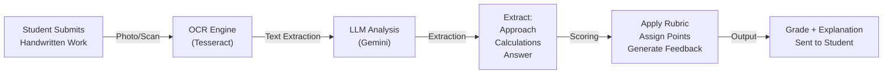
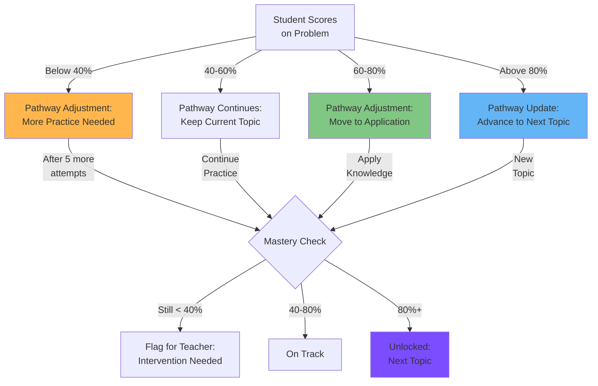

# Scoring System: Comprehensive Assessment Architecture

## Executive Summary

Lumina's scoring system goes far beyond simple "right/wrong" grading. It measures learning across multiple dimensions: correctness, understanding, effort, growth, and persistence. This multi-faceted approach provides a complete picture of each student's progress while motivating sustained effort.

---

## 1. Scoring Philosophy

### Beyond Right/Wrong

Traditional education uses binary scoring:
- Answer correct → point
- Answer wrong → no point
- Result: Limited information about understanding

Lumina's Philosophy:
```
Score = Correctness × Understanding × Effort × Growth

Where:
• Correctness: Is the answer right?
• Understanding: Can they explain the concept?
• Effort: Did they persist and try multiple approaches?
• Growth: Are they improving over time?
```

### The Four Dimensions

```
Dimension          Weight    Measurement
═══════════════════════════════════════════════════════════
Correctness        40%       Answer accuracy, solution validity
Understanding      30%       Explanation quality, concept mastery
Effort             20%       Attempt count, time invested, persistence
Growth             10%       Improvement trend, delta from previous
═══════════════════════════════════════════════════════════
```

### Example: Two Students, Same Score?

**Student A**: Solves quadratic equation perfectly on first try
- Correctness: 100%
- Understanding: 95% (clear explanation)
- Effort: 60% (solved too quickly, may not have struggled)
- Growth: 50% (was already good at this)
- **Total Score: 85%**

**Student B**: Solves quadratic equation after 3 attempts
- Correctness: 100%
- Understanding: 95% (clear explanation, learned from mistakes)
- Effort: 95% (persisted through difficulties)
- Growth: 95% (significant improvement from previous struggles)
- **Total Score: 96%**

Both got the right answer, but Student B's **score reflects their greater learning**.

---

## 2. Quiz Score Calculation

### Multiple Choice Scoring

```python
def score_multiple_choice_quiz(answers, response_key):
    """
    Basic MCQ scoring
    """
    correct = sum(1 for a, r in zip(answers, response_key) if a == r)
    total = len(response_key)
    return correct / total  # 0.0 to 1.0
```

### Partial Credit System

Not all questions are worth equal credit. Harder questions give more:

```python
def score_quiz_with_partial_credit(quiz_submission):
    """
    Some MCQ are harder (worth more) than others
    """
    total_points = 0
    max_points = 0

    for question, student_answer in quiz_submission.answers.items():
        q_data = get_question_metadata(question)

        max_points += q_data.point_value  # Difficulty-based weighting

        if student_answer == q_data.correct_answer:
            total_points += q_data.point_value
        elif is_partial_credit_eligible(question):
            # Partial credit for close answers
            partial = q_data.point_value * 0.5
            total_points += partial

    return total_points / max_points  # Normalized 0.0 to 1.0
```

### Question Difficulty Weighting

```
Question 1: "What is a quadratic equation?"
├─ Type: Definition (easy)
├─ Difficulty Score: 1
└─ Point Value: 1 point

Question 5: "Apply quadratic formula to solve and interpret in context"
├─ Type: Application + Interpretation (hard)
├─ Difficulty Score: 3
└─ Point Value: 3 points

Quiz Total:
   Easy questions: 5 points
   Medium questions: 10 points
   Hard questions: 6 points
   ─────────────────────
   Total: 21 points
```

---

## 3. Assignment Scoring

### The OCR-to-LLM Pipeline



### Assignment Scoring Function

```python
def grade_assignment_submission(submission):
    """
    Complete assignment grading pipeline
    """
    # Step 1: Extract from various formats
    if submission.format == "handwritten":
        text, confidence = ocr_extract(submission.image)
        if confidence < 0.7:
            return {"status": "needs_teacher_review", "reason": "OCR confidence low"}

    elif submission.format == "typed":
        text = submission.text

    # Step 2: Understand the problem
    problem = get_problem_metadata(submission.problem_id)
    rubric = problem.rubric

    # Step 3: Use LLM to evaluate
    llm_evaluation = evaluate_with_gemini(
        problem=problem.statement,
        student_work=text,
        rubric=rubric
    )

    # Step 4: Apply rubric-based scoring
    points_earned = 0
    max_points = sum(c['points'] for c in rubric['criteria'])

    feedback = []

    for criterion in rubric['criteria']:
        name = criterion['name']
        possible_points = criterion['points']
        description = criterion['description']

        # Determine if criterion met
        criterion_met = evaluate_criterion(
            name=name,
            student_work=text,
            criterion_description=description,
            llm_analysis=llm_evaluation
        )

        if criterion_met == "fully":
            points_earned += possible_points
            feedback.append(f"✓ {name}: {possible_points}/{possible_points} points")
        elif criterion_met == "partially":
            points = possible_points * 0.5
            points_earned += points
            feedback.append(f"◐ {name}: {points}/{possible_points} points")
        else:
            feedback.append(f"✗ {name}: 0/{possible_points} points")

    # Step 5: Apply bonuses/penalties
    bonus = 0
    if llm_evaluation['clear_work_shown']:
        bonus += 0.5
    if llm_evaluation['work_is_neat_organized']:
        bonus += 0.25

    points_earned += bonus

    # Step 6: Normalize to 0-1
    score = min(1.0, points_earned / max_points)

    return {
        "score": score,
        "points_earned": points_earned,
        "max_points": max_points,
        "percentage": score * 100,
        "letter_grade": score_to_letter(score),
        "feedback": feedback,
        "confidence": llm_evaluation['confidence']
    }
```

### Example Rubric

```json
{
  "assignment_id": "problem_set_4",
  "problem": "Solve 2x² + 5x - 3 = 0 and check your work",
  "max_points": 10,
  "rubric": {
    "criteria": [
      {
        "name": "Correct Method Selected",
        "points": 2,
        "description": "Student uses factoring, quadratic formula, or completing the square"
      },
      {
        "name": "Accurate Arithmetic",
        "points": 4,
        "description": "All calculations are correct, no computational errors"
      },
      {
        "name": "Correct Answer",
        "points": 2,
        "description": "Final solutions are x = 1/2 and x = -3"
      },
      {
        "name": "Shows Work",
        "points": 1,
        "description": "All steps are shown, work is organized and easy to follow"
      },
      {
        "name": "Verification",
        "points": 1,
        "description": "Student checks answer by plugging back into original equation"
      }
    ]
  }
}
```

### Scoring Example

```
Student's Handwritten Work:
───────────────────────────
Problem: Solve 2x² + 5x - 3 = 0

Method: Quadratic formula
a=2, b=5, c=-3

x = (-5 ± √(25+24))/4
x = (-5 ± √49)/4
x = (-5 ± 7)/4

x₁ = 2/4 = 1/2 ✓
x₂ = -12/4 = -3 ✓

Check: 2(1/2)² + 5(1/2) - 3 = 1/2 + 5/2 - 3 = 0 ✓
───────────────────────────

AI GRADING RESULT:
✓ Correct Method Selected (2/2)
✓ Accurate Arithmetic (4/4)
✓ Correct Answer (2/2)
✓ Shows Work (1/1)
✓ Verification (1/1)

Total: 10/10 = 100% = A+

Feedback:
"Perfect work! You selected the quadratic formula appropriately,
executed the calculations accurately, and verified your solutions.
The work is clear and well-organized. Great job!"
```

---

## 4. Mastery Score

### Bayesian Knowledge Tracing (BKT)

Mastery is calculated using BKT, a probabilistic model:

```
Mastery = P(student knows concept | all prior interactions)

Where:
• P(L₀) = Prior probability student knows it = 0.2
• P(T) = Probability of learning from practice = 0.15
• P(G) = Probability of guessing correctly = 0.25
• P(S) = Probability of careless slip despite knowing = 0.10
```

### BKT Algorithm

```python
def update_mastery_bkt(student_id, topic, problem_result):
    """
    Bayesian update after each practice problem
    """
    params = get_bkt_parameters(topic)
    p_l0 = params['p_l0']    # Prior knowledge
    p_t = params['p_t']      # Learning probability
    p_g = params['p_g']      # Guess probability
    p_s = params['p_s']      # Slip probability

    # Get previous state
    prev_mastery = get_mastery(student_id, topic)

    # Update based on observation
    if problem_result == "correct":
        # Two ways to be correct: know or guess
        p_correct_given_know = 1 - p_s  # Correct if know
        p_correct_given_not_know = p_g  # Correct if guess

        # Probability of knowing given correct answer (Bayes)
        new_mastery = (
            p_correct_given_know * prev_mastery
        ) / (
            p_correct_given_know * prev_mastery +
            p_correct_given_not_know * (1 - prev_mastery)
        )

    elif problem_result == "incorrect":
        # Likely doesn't know
        p_incorrect_given_know = p_s      # Incorrect if knows (slip)
        p_incorrect_given_not_know = 1 - p_g  # Incorrect if doesn't know

        new_mastery = (
            p_incorrect_given_know * prev_mastery
        ) / (
            p_incorrect_given_know * prev_mastery +
            p_incorrect_given_not_know * (1 - prev_mastery)
        )

    # After problem, probability they learned
    learned = p_t * (1 - prev_mastery)
    new_mastery_after_learning = new_mastery + learned * (1 - new_mastery)

    return new_mastery_after_learning
```

### Mastery Level Thresholds

```
Level           Threshold    Meaning
════════════════════════════════════════════════════════
Not Started     0.0 - 0.1    Never attempted
Emerging        0.1 - 0.4    Trying but not ready
Developing      0.4 - 0.6    Making progress
Proficient      0.6 - 0.8    Good understanding
Mastered        0.8 - 1.0    Ready for application
```

### Mastery Progression Example

```
Day 1: First attempt on quadratic equations
├─ Pre-test score: 30% (guessed some)
├─ BKT Update: Prior 0.2 → Post 0.35 (learned from test)
└─ Status: Emerging (0.35)

Day 3: Second attempt (spaced repetition)
├─ Problem set score: 60% (some errors, some correct)
├─ Correct problems: BKT up
├─ Incorrect problems: BKT down slightly
└─ Status: Developing (0.52)

Day 7: Third attempt
├─ Quiz score: 85% (few errors)
├─ Strong BKT updates
└─ Status: Proficient (0.78)

Day 21: Final assessment
├─ Comprehensive test: 88% (confident)
├─ BKT reaches threshold
└─ Status: MASTERED (0.82) ✓
```

---

## 5. Engagement Score

### Multi-Signal Engagement Formula

Engagement is calculated from 50+ signals collected during learning:

```python
def calculate_engagement_score(student_id, topic):
    """
    Engagement Score =
    (Session Duration × Consistency × Attempt Rate × Recency)^(1/4)
    Multiplied by engagement signals
    """

    # Signal 1: Time Investment
    total_minutes = get_total_study_time(student_id, topic)
    time_score = min(1.0, total_minutes / 120)  # Cap at 2 hours

    # Signal 2: Consistency
    sessions_this_week = count_sessions(student_id, days=7)
    consistency_score = min(1.0, sessions_this_week / 4)  # 4+ times/week = perfect

    # Signal 3: Attempt Rate (how hard did they try?)
    total_problems = count_problems_attempted(student_id, topic)
    avg_attempts_per_problem = get_avg_attempts(student_id, topic)
    attempt_score = min(1.0, avg_attempts_per_problem / 2.5)  # 2.5+ attempts ideal

    # Signal 4: Recency (recent activity matters more)
    days_since_last_session = (now() - get_last_session_time(student_id)).days
    recency_score = max(0.0, 1.0 - (days_since_last_session / 7))  # Decay over week

    # Core engagement metric (geometric mean)
    core_engagement = (
        time_score * consistency_score * attempt_score * recency_score
    ) ** 0.25

    # Bonus signals (add to core)
    signals = {
        "asked_for_help": get_help_requests(student_id, topic) > 0,
        "explained_to_peer": count_peer_explanations(student_id, topic) > 0,
        "used_hints": count_hint_uses(student_id, topic) > 0,
        "reviewed_material": count_reviews(student_id, topic) > 2,
        "positive_sentiment": analyze_chat_sentiment(student_id) == "positive",
        "frustration_handled": frustration_detected_but_persisted(student_id)
    }

    bonus = sum(0.05 for v in signals.values() if v)  # +5% per signal, max 30%

    return min(1.0, core_engagement + bonus)
```

### The 50+ Engagement Signals

Lumina tracks all of these:

**Behavioral Signals**:
- Session count per day/week
- Time spent per session
- Problems attempted
- Attempts per problem
- Hint usage
- Help requests
- Review count

**Cognitive Signals**:
- Error correction (student notices and fixes)
- Self-explanation (student explains their thinking)
- Question asking (quality of questions)
- Help seeking strategy (strategic vs random)
- Problem elaboration (extended thinking)

**Emotional Signals**:
- Chat sentiment (happy, frustrated, bored)
- Persistence after errors
- Recovery from frustration
- Peak flow state (deeply engaged)
- Boredom indicators

**Social Signals**:
- Peer help given
- Peer help received
- Community participation
- Study group engagement
- Peer explanation quality

**Temporal Signals**:
- Time of day preference
- Session regularity
- Break patterns
- Study habit consistency
- Responsiveness to notifications

### Engagement Score Visualization

```
Student Engagement Tracker
═════════════════════════════════════════

Overall Engagement: 78/100

Time Investment:         ████████░░  80%
└─ 145 min on topic (Good - above average)

Consistency:             ███████░░░  70%
└─ 4 sessions this week (On track)

Attempt Rate:            █████████░  85%
└─ 2.3 attempts/problem (Shows persistence)

Recency:                 ██░░░░░░░░  20%
└─ Last session 5 days ago (Could use nudge)

Bonus Signals:           ███████░░░  60%
└─ Asked for help ✓
└─ Used hints ✓
└─ Reviewed material ✓
└─ Positive sentiment ✓
└─ Persisted through frustration ✓
└─ Explained to peer ✓

Trend:                   IMPROVING ↑
```

---

## 6. Overall Progress Score

### Weighted Combination

```python
def calculate_overall_progress_score(student_id, course_id):
    """
    Comprehensive score combining all dimensions
    """

    quiz_score = get_latest_quiz_score(student_id, course_id)
    assignment_score = get_avg_assignment_score(student_id, course_id)
    mastery_score = get_avg_mastery(student_id, course_id)
    engagement_score = calculate_engagement_score(student_id, course_id)

    # Weighted average
    overall = (
        0.25 * quiz_score +      # 25% - Knowledge assessment
        0.25 * assignment_score + # 25% - Application
        0.35 * mastery_score +    # 35% - Mastery (BKT)
        0.15 * engagement_score   # 15% - Effort & persistence
    )

    return overall  # 0.0 to 1.0
```

### Grade Computation

```
Overall Progress Score: 0.82

Converted to:
├─ Percentage: 82%
├─ Letter Grade: B
├─ GPA: 3.0
├─ Descriptor: Good progress, meeting standards
└─ Status: On track for mastery
```

---

## 7. Difficulty-Adjusted Scoring

### Harder Questions = More Credit

Not all questions are created equal. A student solving an advanced problem deserves more credit:

```python
def score_with_difficulty_adjustment(problem, student_answer):
    """
    Question difficulty affects point value
    """

    base_points = 10

    # Difficulty multiplier
    if problem.difficulty == "easy":
        multiplier = 0.5      # Basic questions worth less
    elif problem.difficulty == "medium":
        multiplier = 1.0      # Standard weight
    elif problem.difficulty == "hard":
        multiplier = 1.5      # Challenging questions worth more
    elif problem.difficulty == "advanced":
        multiplier = 2.0      # Mastery-level questions worth double

    points_possible = base_points * multiplier

    if student_answer == problem.correct_answer:
        points_earned = points_possible
    elif is_close(student_answer, problem.correct_answer):
        points_earned = points_possible * 0.6
    else:
        points_earned = 0

    return points_earned, points_possible
```

### Score Normalization

```
Raw Points:        75/80
From:
  Easy (5×5):      5/5
  Medium (10×10):  10/10
  Hard (15×20):    20/30
  Advanced (5×40): 40/35 (Extra credit!)

Normalized Score: 75/80 = 93.75% = A
```

---

## 8. Grade Levels: A-F Mapping

### GPA-Aligned Grading

```
Letter  Range     GPA    Descriptor           Progress
══════════════════════════════════════════════════════════════
A       90-100%  4.0    Excellent            Exceeding standards
A-      87-89%   3.7    Excellent            Exceeding standards
B+      84-86%   3.3    Good                 Above standards
B       80-83%   3.0    Good                 Meeting standards
B-      77-79%   2.7    Good                 Meeting standards
C+      74-76%   2.3    Satisfactory         Approaching standards
C       70-73%   2.0    Satisfactory         Approaching standards
C-      67-69%   1.7    Satisfactory         Approaching standards
D+      64-66%   1.3    Passing              Below standards
D       60-63%   1.0    Passing              Below standards
F       <60%     0.0    Failing              Well below standards
```

### Pass/Fail Thresholds

**For Mastery-Based Pathways**:
- Pass/Fail determined by mastery > 0.70 (70%)
- Letter grades still apply for additional distinction

**For Standards-Based Systems**:
- Students must achieve minimum standards
- Multiple attempts allowed until mastery

---

## 9. Streak System

### Daily Streak Tracking

```python
def update_streak(student_id):
    """
    Track consecutive days of engagement
    """
    last_session = get_last_session(student_id)
    days_since = (now() - last_session).days

    if days_since == 0:
        # Session today: continue streak
        current_streak = get_current_streak(student_id)
        return current_streak + 1

    elif days_since == 1:
        # Session yesterday: continue streak
        current_streak = get_current_streak(student_id)
        return current_streak + 1

    else:
        # Streak broken
        record_streak_end(student_id, get_current_streak(student_id))
        return 1  # Start new streak
```

### Streak Milestones & Rewards

```
3-Day Streak 🔥
├─ Unlocks badge: "Consistency"
├─ Notification: "You're building a habit!"
└─ Reward: +5 XP

7-Day Streak 🔥🔥
├─ Unlocks badge: "Week Master"
├─ Notification: "Amazing consistency!"
├─ Reward: +10 XP
└─ Student profile shows prominent badge

14-Day Streak 🔥🔥🔥
├─ Unlocks badge: "Two Weeks Strong"
├─ Notification: "Your study habit is locked in!"
├─ Reward: +25 XP
└─ Parent notification sent

30-Day Streak 🔥🔥🔥🔥
├─ Unlocks badge: "Monthly Champion"
├─ Major milestone notification
├─ Reward: +50 XP
├─ Certificate option
└─ Announcement to class
```

### Streak Visualization

```
YOUR STREAKS
═════════════════════════════════════════

Current Streak: 7 days 🔥🔥🔥🔥🔥🔥🔥

Mon ✓ | Tue ✓ | Wed ✓ | Thu ✓ | Fri ✓ | Sat ✓ | Sun ✓

Longest Ever: 23 days (Sept 2025)

Next Milestone: 14 days (7 more to go!)
```

---

## 10. Badge System

### Achievement Badges

```python
BADGES = {
    "first_problem": {
        "name": "First Step",
        "description": "Solve your first problem",
        "icon": "👣",
        "rarity": "common"
    },
    "week_master": {
        "name": "Week Master",
        "description": "Maintain 7-day study streak",
        "icon": "🔥",
        "rarity": "common"
    },
    "quick_learner": {
        "name": "Quick Learner",
        "description": "Master 5 topics in one month",
        "icon": "⚡",
        "rarity": "uncommon"
    },
    "problem_solver": {
        "name": "Problem Solver",
        "description": "Solve 50 problems correctly",
        "icon": "🧩",
        "rarity": "uncommon"
    },
    "perseverance": {
        "name": "Perseverance",
        "description": "Overcome frustration and achieve mastery on challenging topic",
        "icon": "💪",
        "rarity": "rare"
    },
    "peer_mentor": {
        "name": "Peer Mentor",
        "description": "Help 10 classmates with questions",
        "icon": "🤝",
        "rarity": "rare"
    },
    "perfectionist": {
        "name": "Perfectionist",
        "description": "Score 100% on 5 assignments",
        "icon": "⭐",
        "rarity": "rare"
    },
    "algebra_expert": {
        "name": "Algebra Expert",
        "description": "Master all algebra topics",
        "icon": "🎓",
        "rarity": "epic"
    },
    "comeback_kid": {
        "name": "Comeback Kid",
        "description": "Go from below 50% to above 80% mastery",
        "icon": "🚀",
        "rarity": "epic"
    }
}
```

### Badge Earning Logic

```python
def check_and_award_badges(student_id, event):
    """
    After each event, check if student earned new badges
    """
    new_badges = []

    # Check all badge conditions
    for badge_id, badge_config in BADGES.items():
        if is_badge_already_earned(student_id, badge_id):
            continue

        if badge_id == "first_problem" and event.type == "problem_completed":
            new_badges.append(badge_id)

        elif badge_id == "week_master":
            if get_current_streak(student_id) >= 7:
                new_badges.append(badge_id)

        elif badge_id == "quick_learner":
            if count_mastered_topics(student_id) >= 5:
                if days_since_enrollment(student_id) <= 30:
                    new_badges.append(badge_id)

        elif badge_id == "perseverance":
            if was_frustrated_then_mastered(student_id, event.topic):
                new_badges.append(badge_id)

    # Award and notify
    for badge in new_badges:
        award_badge(student_id, badge)
        notify_student(student_id, f"You earned: {BADGES[badge]['name']} 🎉")

    return new_badges
```

---

## 11. Certificate Criteria

### Mastery-Based Certification

Student earns certificate when:
1. **Overall Mastery**: ≥ 0.80 (80%) in topic
2. **Quiz Score**: ≥ 0.75 (75%) on unit test
3. **Assignments**: Completed ≥ 80% of assignments
4. **Consistency**: Studied consistently over 2+ weeks
5. **Transfer**: Applied knowledge in real-world context

```python
def can_award_certificate(student_id, topic):
    """
    Check if student meets all certificate criteria
    """

    mastery = get_mastery(student_id, topic)
    if mastery < 0.80:
        return False, "Not yet at mastery level"

    quiz_score = get_latest_quiz_score(student_id, topic)
    if quiz_score < 0.75:
        return False, "Quiz score below threshold"

    completion_rate = get_assignment_completion(student_id, topic)
    if completion_rate < 0.80:
        return False, "Assignment completion below 80%"

    study_duration = get_study_duration_days(student_id, topic)
    if study_duration < 14:
        return False, "Insufficient study time (< 2 weeks)"

    # All criteria met
    return True, "Certificate earned!"
```

### Certificate Display

```
╔════════════════════════════════════════════════════════════════════╗
║                                                                    ║
║                   LUMINA CERTIFICATE OF ACHIEVEMENT                ║
║                                                                    ║
║  This certifies that                                              ║
║                                                                    ║
║               ██████╗ ███████╗██╗  ██╗███████╗███████╗             ║
║              ██╔═══██╗██╔════╝██║  ██║██╔════╝██╔════╝             ║
║              ██║   ██║█████╗  ███████║█████╗  ███████╗             ║
║              ██║   ██║██╔══╝  ██╔══██║██╔══╝  ╚════██║             ║
║              ╚██████╔╝███████╗██║  ██║███████╗███████║             ║
║               ╚═════╝ ╚══════╝╚═╝  ╚═╝╚══════╝╚══════╝             ║
║                                                                    ║
║  has demonstrated mastery in                                     ║
║                                                                    ║
║           QUADRATIC EQUATIONS                                     ║
║                                                                    ║
║  with a mastery score of 0.87 and completion of all criteria     ║
║                                                                    ║
║  Awarded by: Lumina Learning Management System                   ║
║  Date: November 20, 2025                                         ║
║  Certificate ID: CERT-2025-11-20-001                             ║
║                                                                    ║
║  This certificate recognizes achievement and readiness to        ║
║  progress to advanced topics in mathematics.                     ║
║                                                                    ║
║                     [DIGITAL BADGE] [SHARE] [PRINT]              ║
║                                                                    ║
╚════════════════════════════════════════════════════════════════════╝
```

---

## 12. Leaderboard (Optional, Configurable)

### Class Leaderboard

Teacher can enable opt-in leaderboards:

```
CLASS LEADERBOARD - ALGEBRA II (Optional)
═════════════════════════════════════════════════════════════════

Rank  Name             Mastery  Streak  Topics Mastered
────  ─────────────────────────────────────────────────────
 1.   Maria Chen       0.92     12d     8 topics
 2.   Alex Rodriguez   0.89     7d      7 topics
 3.   Sarah Johnson    0.87     23d     6 topics
 4.   David Smith      0.84     3d      6 topics
 5.   Emma Wilson      0.82     5d      5 topics
 6.   Marcus Brown     0.78     14d     5 topics
...

Note: Leaderboard is opt-in and focuses on MASTERY,
      not just speed. Students struggling are supported,
      not shamed.
```

### Privacy & Positivity Settings

```python
# Teacher can configure leaderboard behavior

{
  "leaderboard_enabled": True,
  "leaderboard_scope": "mastery_only",  # Not speed
  "leaderboard_opt_in": True,           # Students choose
  "show_bottom_performers": False,      # Don't shame
  "focus": "improvement_not_absolute"   # Show progress
}
```

---

## 13. Score History & Tracking

### Grade Book View

```
GRADE BOOK - ALICE JOHNSON - ALGEBRA II
═════════════════════════════════════════════════════════════════

Assignment/Quiz          Date      Score  Trend  Notes
────────────────────────────────────────────────────────────────
Problem Set 1            Oct 28    78%    ↑     Shows work
Problem Set 2            Nov 01    85%    ↑     Good progress
Quiz 1 - Linear Eqs      Nov 05    82%    ↑     Understanding mastery
Problem Set 3            Nov 08    90%    ↑     Excellent!
Problem Set 4            Nov 15    84%    ↓     Struggling with signs
Quiz 2 - Systems         Nov 12    75%    ↓     Some gaps
Problem Set 5            Nov 18    88%    ↑     Recovery!
Current Grade (Weighted) Now       84%    ↑     B+ on track for A-

Trend Analysis:
Overall: IMPROVING
Recent: Mixed (some struggle with new concept, recovering)
Prediction: Will achieve B+ final grade if trend continues

[DETAILED HISTORY] [EXPORT] [STUDENT VIEW]
```

### Historical Mastery Tracking

```python
def get_mastery_history(student_id, topic, lookback_days=90):
    """
    Show how mastery has evolved over time
    """
    history = db.mastery_history.find(
        student_id=student_id,
        topic=topic,
        date_gte=now() - timedelta(days=lookback_days)
    ).sort('date')

    return [
        {
            "date": h.date,
            "mastery": h.mastery,
            "event": h.triggering_event,  # Problem attempted, quiz taken, etc
            "attempts": h.attempt_count
        }
        for h in history
    ]

# Result:
# [
#   {"date": "Oct 28", "mastery": 0.25, "event": "First quiz", "attempts": 1},
#   {"date": "Oct 29", "mastery": 0.35, "event": "Problem set", "attempts": 4},
#   {"date": "Oct 30", "mastery": 0.42, "event": "Problem set", "attempts": 6},
#   ...
#   {"date": "Nov 18", "mastery": 0.87, "event": "Unit test", "attempts": 45}
# ]
```

---

## 14. Score → Pathway Feedback Loop

### Dynamic Pathway Recalculation

When scores change, the learning pathway updates:



### Adaptation Algorithm

```python
def adapt_pathway_from_scores(student_id, topic, latest_score):
    """
    Dynamically adjust pathway based on performance
    """
    current_pathway = get_current_pathway(student_id)

    # Score-based decision
    if latest_score < 0.4:
        # Struggling: Add remedial content
        current_pathway.insert_remedial(topic)
        current_pathway.increase_practice_count(5)
        return notify_teacher(f"{student.name} struggling with {topic}")

    elif latest_score < 0.6:
        # Developing: Keep current
        current_pathway.keep_current_topic()
        return notify_student(f"Keep practicing {topic}")

    elif latest_score < 0.8:
        # Proficient: Move toward application
        current_pathway.add_application_problems(topic)
        return notify_student(f"Ready to apply {topic}!")

    else:
        # Mastered: Advance
        next_topic = current_pathway.get_next_topic(topic)
        current_pathway.advance_to(next_topic)
        return notify_student(f"Mastered! Moving to {next_topic}")
```

---

## 15. Anti-Gaming Measures

### Detecting Score Manipulation

```python
def detect_suspicious_scoring(student_id, submission):
    """
    Detect and flag potential gaming/cheating
    """
    red_flags = []

    # Flag 1: Perfect score after consistent struggle
    prev_mastery = get_mastery_before(student_id, submission.topic, days=7)
    if submission.score == 1.0 and prev_mastery < 0.3:
        red_flags.append("Perfect score after low mastery")

    # Flag 2: Identical submissions from multiple students
    submission_text = submission.content
    similar = find_similar_submissions(submission_text, exclude=student_id)
    if len(similar) > 1:
        red_flags.append("Similar submissions from other students")

    # Flag 3: Submission too fast after problem assigned
    assignment_assigned = submission.assignment.created_at
    submission_time = submission.submitted_at
    if (submission_time - assignment_assigned).seconds < 60:
        red_flags.append("Submitted suspiciously fast")

    # Flag 4: Copy-paste from known sources
    plagiarism_score = check_plagiarism(submission.content)
    if plagiarism_score > 0.8:
        red_flags.append("High plagiarism similarity")

    # Flag 5: Cheating signature patterns
    if detect_cheat_pattern(submission, student_id):
        red_flags.append("Pattern matches known cheat methods")

    if red_flags:
        return {
            "status": "flagged_for_review",
            "red_flags": red_flags,
            "confidence": calculate_cheat_confidence(red_flags),
            "action": "teacher_review_required"
        }

    return {"status": "accepted"}
```

### Honest Verification

The system emphasizes honest learning:

```python
def promote_honest_learning(student_id):
    """
    Incentivize and reward honest effort
    """

    # Show effort, not just score
    profile.show_attempt_count()      # "Took 5 attempts to master"
    profile.show_time_invested()       # "Spent 2 hours on this"
    profile.show_struggle_narrative()  # "Started at 20%, now at 87%"

    # Reward improvement
    badge.award_if_earned("Comeback Kid")  # From 40% to 80%
    badge.award_if_earned("Perseverance")  # Struggled then succeeded

    # Normalize multiple attempts
    message = "Taking multiple attempts is GOOD. It means you're learning."

    # Don't penalize errors
    # Errors are learning opportunities, not failures
```

---

## 16. Score Export & Reporting

### Teacher Grade Export

```python
def export_grades(course_id, format="csv"):
    """
    Export grades for records, transcripts, or LMS sync
    """
    grades = get_all_grades(course_id)

    if format == "csv":
        return generate_csv(
            grades,
            columns=[
                "student_name",
                "student_id",
                "overall_grade",
                "mastery_avg",
                "engagement_score",
                "assignment_avg",
                "quiz_avg",
                "final_grade",
                "letter_grade",
                "comments"
            ]
        )

    elif format == "json":
        return grades.to_json()

    elif format == "google_sheets":
        return push_to_google_sheets(grades)

    elif format == "canvas":
        return sync_to_canvas_lms(grades)
```

### Sample Export

```
Student Name,ID,Overall Grade,Mastery Avg,Engagement,Assignments,Quizzes,Final Grade,Letter Grade,Comments
Alice Johnson,STU001,87,0.87,0.78,0.90,0.82,B+,3.3,Excellent work; some sign errors detected
David Chen,STU002,72,0.62,0.72,0.75,0.68,C,2.0,Needs support with quadratic formula
Maria Rodriguez,STU003,94,0.94,0.85,0.98,0.91,A,4.0,Exceptional; ready for advanced topics
...
```

---

## Complete Scoring Dashboard

### Student View

```
MY GRADES & PROGRESS
═════════════════════════════════════════════════════════════════

CURRENT GRADE: B+ (87%)
├─ Mastery: 87% (Average across all topics)
├─ Engagement: 78%
├─ Assignments: 90%
└─ Quizzes: 82%

RECENT SCORES:
│
├─ Problem Set 5 ..................... 88/100 (Nov 18)
├─ Quadratic Formula Quiz ........... 82/100 (Nov 12)
├─ Problem Set 4 ..................... 84/100 (Nov 15)
└─ Application Project .............. 92/100 (Nov 08)

BREAKDOWN BY TOPIC:
│
├─ Linear Equations ........... 0.88 Mastered ✓
├─ Systems of Equations ...... 0.62 Developing
├─ Quadratic Equations ....... 0.45 In Progress
├─ Graphing Parabolas ........ 0.00 Not Started
└─ Real-World Applications ... 0.35 Emerging

YOUR BADGES:
│
├─ 🔥 Week Master (7-day streak)
├─ ⚡ Quick Learner (5 topics mastered)
├─ 🤝 Peer Mentor (helped 3 classmates)
└─ 💪 Perseverance (overcame struggle to master)

IMPROVEMENT TREND:
This unit: ↑ +0.15 (improving!)
Last unit: ↓ -0.05
Overall trend: STRONG UPWARD

[VIEW DETAILED HISTORY] [SHARE WITH PARENTS] [EXPORT TRANSCRIPT]
```

---

## Scoring Formula Summary

```
Overall Grade = (0.25 × Quiz Score) +
                (0.25 × Assignment Score) +
                (0.35 × Mastery Score) +
                (0.15 × Engagement Score) +
                (Bonus Multipliers)

Where:
• Quiz Score = Difficulty-adjusted performance
• Assignment Score = Rubric-based, OCR-graded
• Mastery Score = BKT probability
• Engagement Score = 50+ signal composite
• Bonus = Streak × Difficulty × Growth
```

---

## Summary: Fair, Multidimensional Scoring

Lumina's scoring system solves traditional grading problems:

✅ **Comprehensiveness**: Measures understanding, not just correctness
✅ **Fairness**: Difficulty-adjusted; growth-oriented; effort-rewarding
✅ **Transparency**: Students see exactly why they earned their score
✅ **Motivation**: Streaks, badges, and certificates incentivize consistency
✅ **Adaptivity**: Scores drive pathway adjustments
✅ **Honesty**: Anti-gaming; rewards genuine effort
✅ **Feedback**: Detailed, actionable, immediate

The result: **A grading system that measures true learning and motivates students to grow.**
