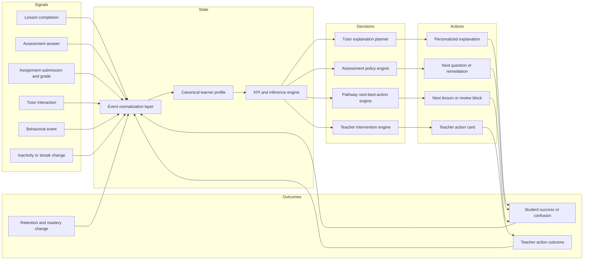

# Student Intelligence Loop

Last updated: 2026-03-14

## Purpose

This document defines the closed-loop intelligence system Lumina should use for every learner.

It turns a broad product idea into an implementation contract:

- what signals enter the system
- where the shared learner state lives
- which components read from it
- which components write back into it
- how decisions become personalized actions for students and teachers

The goal is not "more AI features."

The goal is one reliable loop where every meaningful student interaction improves the next recommendation, explanation, question, and intervention.

## Current Code Anchors

The repository already contains most of the primitives needed for this loop:

- Canonical profile writer: `backend/app/services/personalization_service.py`
- Canonical profile schema: `backend/app/personalization/schemas.py`
- Compatibility learner-model engine: `backend/learner_profile/engine.py`
- Adaptive assessment policy engine: `backend/app/assessment/engine/policy_engine.py`
- Pathway orchestration: `backend/app/pathway/orchestrator.py`
- Tutor runtime and degraded fallback: `backend/ai_engine/swarm/tutor.py`

Current truth for future agents:

- `PersonalizationService` should become the primary source of truth for learner state.
- `LearnerProfileEngine` should be treated as a compatibility layer until its useful logic is merged into the shared profile service.
- The tutor, assessment engine, and pathway engine should all read from the same learner profile projection rather than building parallel per-feature memory.

## North-Star Loop



## Core Design Rule

Every new major feature should participate in this loop:

1. observe a student event
2. update the learner state
3. recompute actionable intelligence
4. deliver a personalized action
5. measure whether the action helped

If a feature cannot point to its event input, learner-state write path, and measurable outcome, it is not yet part of Lumina's core intelligence system.

## Shared Learner State Contract

The canonical learner profile should be a single object with stable projections for student, tutor, teacher, and pathway use cases.

The current schema already provides a strong base in `backend/app/personalization/schemas.py`.

### Required profile domains

| Domain | Current support | What it should contain |
| --- | --- | --- |
| Identity and goals | Partial | user id, grade level, goals, course context |
| Preferences | Partial | modality preferences, pacing, accessibility needs, session length |
| Mastery state | Implemented foundation | concept mastery, confidence, attempts, successes, last assessed source |
| Weakness and misconceptions | Partial | weak topics, probable misconception tags, recovery status |
| Engagement | Implemented foundation | total minutes, streak, last activity, lesson completions, tutor use |
| Performance | Implemented foundation | recent average, quiz average, assessment average, assignment average |
| Risk | Implemented foundation | risk level, score, reasons, evaluation time |
| Tutor memory | Partial | recent questions, unresolved confusion, preferred explanation patterns |
| Assignment and assessment summaries | Partial | recent submissions, score trends, review flags, remediation history |
| Explanation profile | Missing formal contract | what explanation style worked for which topic, load state, and objective |
| Intervention history | Partial | recommendation issued, teacher action taken, impact after intervention |

### Proposed learner profile additions

Future agents should add these fields rather than creating side stores:

```json
{
  "explanation_profile": {
    "preferred_patterns": {
      "worked_example_first": 0.78,
      "socratic_prompting": 0.41,
      "visual_analogy": 0.66,
      "step_by_step": 0.84
    },
    "effective_chunk_size": 3,
    "effective_vocabulary_band": "simple",
    "recent_explanation_outcomes": []
  },
  "kpi_snapshot": {
    "engagement_quality": 0.71,
    "persistence": 0.63,
    "help_seeking_calibration": 0.54,
    "retention_risk": 0.29,
    "readiness_score": 0.58
  },
  "intervention_history": []
}
```

## Event Contract

The current `LearningEventRecord` is the right starting point and should remain the normalized envelope:

```json
{
  "id": "uuid",
  "user_id": "student-123",
  "event_type": "assessment_answer",
  "source": "assessment_api",
  "course_id": "course-456",
  "topic_id": "quadratic_equations",
  "session_id": "sess-789",
  "payload": {},
  "created_at": "2026-03-14T10:30:00Z"
}
```

### Event categories that must feed the loop

| Event type | Status | Minimum payload |
| --- | --- | --- |
| `lesson_completed` | Supported | lesson id, topic id, minutes spent |
| `activity_logged` | Supported | page, dwell time, action metadata |
| `quiz_result` | Supported | topic, score, attempts |
| `assessment_answer` | Supported | concept/topic, correctness, response time |
| `assessment_completed` | Supported | score, concept breakdown, completion duration |
| `assignment_submitted` | Supported | assignment id, topic ids, artifact metadata |
| `assignment_graded` | Supported | score, rubric breakdown, confidence |
| `tutor_interaction` | Supported | objective, prompt type, confusion markers, outcome |
| `note_added` | Supported | lesson/topic linkage |
| `profile_updated` | Supported | changed preference fields |

### Event categories still missing or incomplete

These should be added to the same event model instead of building custom pipelines:

- explanation-rendered
- explanation-feedback
- hint-requested
- practice-generated
- intervention-acknowledged
- intervention-resolved
- review-completed
- retention-check-completed

## Control Loops

## 1. Student learning loop

This is the primary loop:

1. Student studies, asks, answers, submits, or pauses.
2. The system records structured events.
3. The learner profile updates mastery, engagement, behavior, and risk.
4. The KPI engine computes readiness, strain, persistence, and explanation effectiveness.
5. The system chooses one next best action:
   - a simpler explanation
   - a targeted question
   - a review block
   - a challenge task
   - a teacher alert
6. The student outcome is logged back into the profile.

## 2. Tutor adaptation loop

The tutor should not only answer correctly. It should learn which form of explanation works.

Loop:

1. Read current mastery, load, preferences, and recent confusion.
2. Select an explanation plan.
3. Render the explanation in A2UI blocks or tutor text.
4. Observe what happened after the explanation:
   - did the student answer correctly
   - did they ask for simplification
   - did they abandon
   - did latency spike
   - did they retain the concept later
5. Update the explanation profile.

## 3. Teacher intervention loop

Teachers should receive action objects, not raw charts.

Loop:

1. The risk engine detects a material issue.
2. A structured intervention recommendation is created.
3. The teacher approves, modifies, dismisses, or completes the action.
4. The system tracks whether the student improved afterward.
5. That outcome becomes evidence for future interventions.

## 4. Pathway optimization loop

The pathway engine should use the same learner state as the tutor and assessment engine.

Loop:

1. Read mastery, readiness, retention risk, and engagement context.
2. Choose whether to advance, review, remediate, or rest.
3. Explain the recommendation with evidence.
4. Measure whether the recommendation improved completion, comprehension, or retention.

## Read and Write Responsibilities

| Component | Reads | Writes |
| --- | --- | --- |
| Personalization service | normalized events, current profile | profile updates, interventions, KPI snapshot |
| Assessment engine | mastery state, difficulty history | assessment answers, mastery updates, weakness signals |
| Tutor runtime | mastery, load, preferences, recent mistakes | tutor interaction events, explanation outcomes |
| Pathway orchestrator | mastery, risk, readiness, retention | pathway decisions and reasoning |
| Teacher dashboard | intervention queue, weak topics, confidence | teacher action outcomes, note follow-up |
| Analytics layer | event stream, KPI snapshots | longitudinal reports, evaluation metrics |

## Update Cadence

| Cadence | What happens |
| --- | --- |
| Per interaction | append event, update core profile state, recompute lightweight KPIs |
| Per session | summarize success, confusion, abandoned steps, explanation outcomes |
| Daily | recalculate trend metrics, retention risk, intervention priority |
| Weekly | produce teacher digest, mastery drift, explanation effectiveness reports |

## Current Gaps In This Repository

The repo is close enough that future work should be integration-heavy rather than invention-heavy.

### Gap 1: Two learner-state paths

- `backend/app/services/personalization_service.py` is the stronger canonical model.
- `backend/learner_profile/engine.py` still maintains parallel state logic.

Direction:

- keep compatibility reads if needed
- stop inventing new learner-state stores
- fold useful DKT and cognitive-load logic into the canonical service

### Gap 2: KPI engine is implicit, not formalized

Some signals are already computed:

- mastery
- performance averages
- weak topics
- risk score
- cognitive load

What is missing is a formal, documented KPI engine with stable formulas, thresholds, and consumers.

### Gap 3: Explanation adaptation is scattered

The tutor can answer and degrade gracefully, but there is no first-class explanation strategy controller that:

- chooses a communication mode
- logs whether it worked
- updates explanation effectiveness history

### Gap 4: Teacher actions are not yet a closed loop

Intervention recommendations can be created, but the full approve-act-measure cycle is not fully productized.

## Definition Of Done

Lumina should consider the student intelligence loop operational when all of the following are true:

- every major student interaction becomes a normalized event
- there is one canonical learner profile per student
- tutor, assessment, pathway, and teacher systems read the same profile projection
- explanation effectiveness is measured, not assumed
- intervention outcomes are written back into learner state
- next best actions are explainable and evidence-backed

## Recommended Companion Docs

- `docs/STUDENT_KPI_ENGINE.md`
- `docs/EXPLANATION_STYLE_ENGINE.md`
- `docs/AGENT_BUILD_BACKLOG.md`
