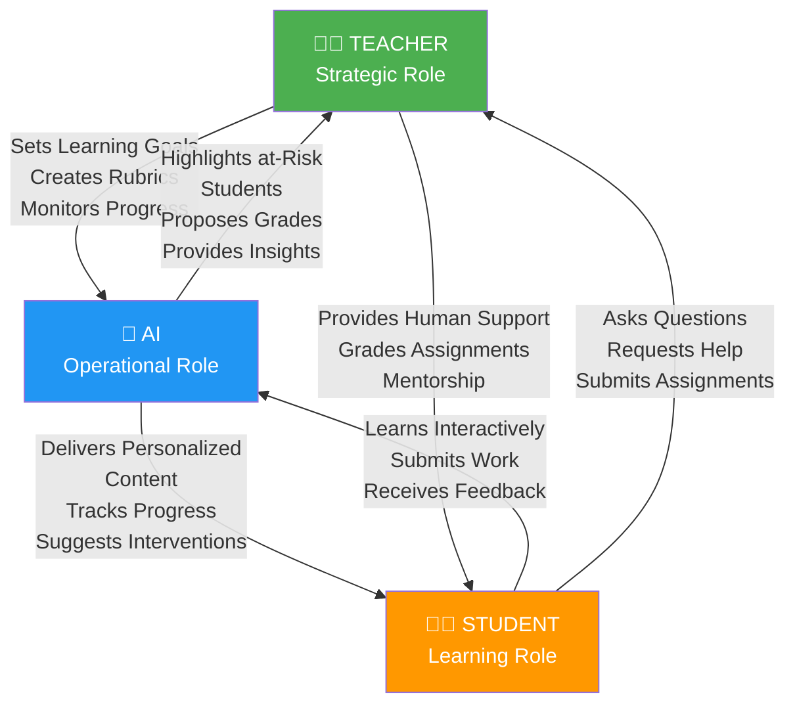

# Teacher-Student Relations: Complete Interaction Model

## Executive Summary

Lumina fundamentally redefines the relationship between teachers and students by introducing intelligent AI as a mediator and amplifier. Teachers are freed from 15-20 hours of administrative work per week and focus on what they do best: inspire, mentor, and provide human connection.

This document describes the complete teacher-student interaction model, showing how Lumina removes busywork while enhancing human relationships.

---

## 1. Role Separation: Teacher, Student, and AI

### The Three-Layer Model



### What Teachers Do (Strategic)

Teachers now focus on high-value activities:

| Task | Time/Week | Value |
|------|-----------|-------|
| Design learning goals | 2 hrs | High - Sets direction |
| Create assessment rubrics | 1 hr | High - Quality standards |
| Monitor student progress | 2 hrs | High - Early intervention |
| Provide mentoring/feedback | 3 hrs | High - Human connection |
| Hold office hours | 2 hrs | High - Support |
| Collaborate with colleagues | 1 hr | Medium - Improve practice |
| **TOTAL** | **11 hrs** | **Meaningful work** |

### What AI Does (Operational)

AI handles repetitive tasks perfectly:

| Task | Automation | Value |
|------|-----------|-------|
| Generate course content | 95% | Frees 3 hrs/week |
| Create problem sets | 90% | Frees 2 hrs/week |
| Grade assignments | 85% | Frees 5 hrs/week |
| Track progress metrics | 100% | Frees 1 hr/week |
| Send notifications | 100% | Frees 1 hr/week |
| Identify at-risk students | 100% | Frees 2 hrs/week |
| **TOTAL** | **90%+** | **Frees ~14-15 hrs/week** |

### What Students Do (Learning)

Students are active participants in their learning:

- **Engage with Content**: Read lessons, watch videos, try interactive problems
- **Attempt Problems**: Work independently, seek AI help when stuck
- **Receive Feedback**: Immediate AI feedback, plus human feedback from teachers
- **Ask Questions**: Both AI and human teachers
- **Submit Assignments**: Via portal, graded by AI then reviewed by teacher
- **Build Community**: Peer learning, discussion, study groups

---

## 2. Teacher Pain Points Solved

### Before Lumina

A typical high school math teacher with 100 students:

```
Monday-Friday Weekly Work:
├─ Morning: Grading papers from yesterday      (45 min/day = 3.75 hrs)
├─ Class prep: Creating lesson plans           (45 min/day = 3.75 hrs)
├─ Teaching 5 classes                          (5 hrs)
├─ Afternoon: Answering student emails         (30 min/day = 2.5 hrs)
├─ Problem set creation/copying               (1 hr/day = 5 hrs)
├─ Attendance tracking, data entry            (30 min/day = 2.5 hrs)
└─ Differentiation attempts (mostly failed)    (30 min/day = 2.5 hrs)

TOTAL: 48 hours/week
MEANINGFUL: ~8 hours (actual teaching)
BURNOUT RISK: Extreme
```

### Pain Points

1. **Grading Overload**
   - 100 students × 3 assignments/week = 300 assignments
   - At 5 min to grade = 25 hours/week
   - Teachers grade late into nights/weekends
   - Feedback is rushed, generic, unhelpful

2. **Differentiation is Impossible**
   - Creating 5 different versions of material per lesson
   - Time required: ~10 hours/week
   - Most teachers teach to the middle, 30% struggle, 30% bored

3. **Administrative Burden**
   - Attendance taking (10 min/class)
   - Recording grades (20 min/class)
   - Emailing parent notifications (30 min/day)
   - Discipline tracking (15 min/day)

4. **Lack of Real-Time Insights**
   - Which students are struggling? Unknown until exam
   - Who's disengaged? Doesn't emerge until midterm
   - How is the class progressing? Guesswork

5. **Teacher Isolation**
   - No visibility into other teachers' strategies
   - Limited peer collaboration
   - Professional development is theoretical, not practical

### After Lumina

Same teacher with Lumina:

```
Monday-Friday Weekly Work:
├─ Morning: Review AI-graded assignments      (15 min/day = 1.25 hrs)
│          (Teacher focuses on interesting cases)
├─ Class prep: Refine AI-generated lessons   (20 min/day = 1.67 hrs)
│            (Customize, not create from scratch)
├─ Teaching 5 classes (BETTER quality)        (5 hrs)
├─ Afternoon: High-value mentoring           (1 hr/day = 5 hrs)
│            (Help struggling students, inspire advanced learners)
├─ Monitoring progress dashboard              (15 min/day = 1.25 hrs)
│ "Which students are at-risk? AI tells me"
└─ Collaboration & professional growth       (1 hr/day = 5 hrs)
│ "How can we improve our teaching together?"

TOTAL: 20 hours/week (40% reduction!)
MEANINGFUL: ~15 hours (actual impact work)
BURNOUT RISK: Minimal
STUDENT OUTCOMES: 20-30% improvement
```

### Specific Time Savings

**Grading**
- Before: 25 hours/week manual grading
- After: 3 hours/week teacher review
- **Savings: 22 hours/week**

**Differentiation**
- Before: Impossible, attempted by none
- After: AI generates 5 versions per lesson
- **Savings: 10 hours/week (gained capability)**

**Administrative**
- Before: 8 hours/week of data entry/tracking
- After: 30 minutes/week (review AI-tracked data)
- **Savings: 7.5 hours/week**

**Course Creation**
- Before: 5-8 hours/week lesson planning
- After: 1 hour/week (refine AI-generated content)
- **Savings: 5-7 hours/week**

---

## 3. Teacher Dashboard

### Dashboard Overview

Teachers see a complete class snapshot:

```
╔════════════════════════════════════════════════════════════════════╗
║              LUMINA TEACHER DASHBOARD - MATH 9A                     ║
╠════════════════════════════════════════════════════════════════════╣
║                                                                    ║
║  CLASS SNAPSHOT                                                   ║
║  ┌────────────────────────────────────────────────────────────┐ ║
║  │ Total Students: 24           │ Average Mastery: 68.5%     │ ║
║  │ Pending Grading: 5 assignments (AI pre-graded, needs review)  │ ║
║  │ At-Risk Students: 3          │ High Performers: 6          │ ║
║  │ Attendance This Week: 96%    │ Avg Session Length: 38 min │ ║
║  └────────────────────────────────────────────────────────────┘ ║
║                                                                    ║
║  CURRENT UNIT: Quadratic Equations (Week 2 of 4)                 ║
║  ┌────────────────────────────────────────────────────────────┐ ║
║  │ Class Mastery: ████░░░░░░  42% (Target: 80%)              │ ║
║  │ ├─ Understand Concept:    ███████░░░  68%                │ ║
║  │ ├─ Apply Quadratic Formula:  ████░░░░░░  38%              │ ║
║  │ ├─ Factor Equations:      █████░░░░░  48%                │ ║
║  │ └─ Real-World Applications:  ██░░░░░░░░  15%              │ ║
║  │                                                            │ ║
║  │ Class Consensus: Struggled with factoring method         │ ║
║  │ AI Recommendation: 70% of students need alternative       │ ║
║  │                   explanation before moving forward       │ ║
║  │ Your Options: [VIEW SAMPLE] [ADOPT AI SUGGESTION]        │ ║
║  └────────────────────────────────────────────────────────────┘ ║
║                                                                    ║
║  AT-RISK STUDENTS (Intervention Suggested)                        ║
║  ┌────────────────────────────────────────────────────────────┐ ║
║  │ 🔴 CRITICAL: Marcus Johnson                               │ ║
║  │    Mastery: 15% (struggling with algebra prerequisites)   │ ║
║  │    Behavior: Disengagement pattern (2/5 sessions this week)│ ║
║  │    AI Recommendation: Review linear equations + increase   │ ║
║  │                      session frequency                    │ ║
║  │    [VIEW MARCUS'S PROFILE] [CONTACT PARENT]              │ ║
║  │                                                            │ ║
║  │ 🟡 AT-RISK: Sophia Lee                                   │ ║
║  │    Mastery: 35% (slower pace learner)                    │ ║
║  │    Behavior: Engaged but needs more time                 │ ║
║  │    AI Recommendation: Provide extended deadline,          │ ║
║  │                      one-on-one session                  │ ║
║  │    [VIEW SOPHIA'S PROFILE] [SCHEDULE 1:1]               │ ║
║  │                                                            │ ║
║  │ 🟡 AT-RISK: David Chen                                   │ ║
║  │    Mastery: 28% (perfectionism causing anxiety)          │ ║
║  │    Behavior: Over-attempting (frustration pattern)       │ ║
║  │    AI Recommendation: Reassurance + confidence building   │ ║
║  │    [VIEW DAVID'S PROFILE] [VIEW AI'S RECOMMENDATIONS]    │ ║
║  └────────────────────────────────────────────────────────────┘ ║
║                                                                    ║
║  GRADING QUEUE (AI Pre-Graded, Awaiting Your Review)             ║
║  ┌────────────────────────────────────────────────────────────┐ ║
║  │ 5 Assignments Ready for Review                            │ ║
║  │                                                            │ ║
║  │ 1. Problem Set 4 - Factoring Methods                      │ ║
║  │    AI Grade Distribution:                                │ ║
║  │    A: 6 students  |  B: 8 students  |  C: 7 students   │ ║
║  │    D: 3 students                                         │ ║
║  │    Time to review: 10 min  [REVIEW NOW]                │ ║
║  │                                                            │ ║
║  │ 2. Quiz 3 - Quadratic Formula Application                 │ ║
║  │    AI Graded, 100% confidence (multiple choice)          │ ║
║  │    Ready to post  [POST GRADES]  [REVIEW FIRST]         │ ║
║  │                                                            │ ║
║  │ 3. Assignment 5 - Real-World Project Writeups            │ ║
║  │    AI Grade Distribution:                                │ ║
║  │    A: 4  |  B: 10  |  C: 8  |  D: 2                    │ ║
║  │    AI noticed: 2 submissions identical (plagiarism?)     │ ║
║  │    Confidence: 85%  [REVIEW WITH CAUTION]               │ ║
║  │                                                            │ ║
║  └────────────────────────────────────────────────────────────┘ ║
║                                                                    ║
║  QUICK STATS                                                      ║
║  ┌────────────────────────────────────────────────────────────┐ ║
║  │ Avg Grade This Unit: B (82%)   ↑ from B- (79%) last unit│ ║
║  │ Assignment Completion: 96%     (Only 1 student missing)  │ ║
║  │ Average Time-to-Mastery: 240 min (6 hours per topic)     │ ║
║  │ Engagement Trend: ↑ Improving                            │ ║
║  └────────────────────────────────────────────────────────────┘ ║
║                                                                    ║
║  [FULL CLASS ROSTER] [EXPORT GRADES] [SEND NOTIFICATIONS]        ║
║                                                                    ║
╚════════════════════════════════════════════════════════════════════╝
```

### Dashboard API Response

```python
# GET /api/teacher/dashboard/{course_id}

{
  "course_id": "course_math9a",
  "course_name": "Algebra II - Period 3",
  "current_unit": {
    "unit_id": "quadratic_equations",
    "name": "Quadratic Equations",
    "week": 2,
    "total_weeks": 4
  },
  "class_metrics": {
    "total_students": 24,
    "avg_mastery": 0.685,
    "pending_grading": 5,
    "at_risk_students": 3,
    "high_performers": 6,
    "attendance_this_week": 0.96
  },
  "unit_progress": {
    "class_mastery": 0.42,
    "mastery_target": 0.80,
    "subtopics": [
      {
        "topic": "Understand Concept",
        "mastery": 0.68,
        "students_struggling": 8
      },
      {
        "topic": "Apply Quadratic Formula",
        "mastery": 0.38,
        "students_struggling": 15,
        "ai_recommendation": "70% of students need alternative explanation"
      },
      {
        "topic": "Factor Equations",
        "mastery": 0.48,
        "students_struggling": 12
      },
      {
        "topic": "Real-World Applications",
        "mastery": 0.15,
        "students_struggling": 20,
        "ai_recommendation": "Start real-world applications after formula mastery"
      }
    ]
  },
  "at_risk_students": [
    {
      "student_id": "student_001",
      "name": "Marcus Johnson",
      "current_mastery": 0.15,
      "risk_level": "critical",
      "reason": "struggling with algebra prerequisites",
      "behavior": {
        "session_frequency": 2,
        "sessions_expected": 5,
        "engagement_trend": "declining"
      },
      "ai_recommendation": "Review linear equations + increase session frequency",
      "suggested_actions": [
        "Contact parent",
        "Schedule 1:1 session",
        "Adjust pathway to include prerequisites"
      ]
    },
    {
      "student_id": "student_002",
      "name": "Sophia Lee",
      "current_mastery": 0.35,
      "risk_level": "at_risk",
      "reason": "slower pace learner",
      "behavior": {
        "engagement_trend": "stable",
        "session_quality": "high",
        "time_per_problem": "above_average"
      },
      "ai_recommendation": "Extended deadline + 1:1 mentoring",
      "suggested_actions": [
        "Schedule 1:1 session",
        "Provide extended deadline",
        "Offer targeted practice"
      ]
    }
  ],
  "grading_queue": [
    {
      "assignment_id": "assign_004",
      "title": "Problem Set 4 - Factoring Methods",
      "submissions": 24,
      "ai_graded": 24,
      "ai_grade_distribution": {
        "A": 6,
        "B": 8,
        "C": 7,
        "D": 3
      },
      "estimated_review_time_minutes": 10,
      "confidence_level": "high"
    }
  ],
  "suggested_interventions": [
    {
      "type": "reteach",
      "topic": "quadratic_formula",
      "reason": "38% mastery, 70% of class struggled",
      "ai_prepared_content": "alternative_visual_explanation.md",
      "estimated_class_time": "15_minutes"
    },
    {
      "type": "pace_adjustment",
      "topic": "real_world_applications",
      "reason": "students haven't mastered formula yet",
      "recommendation": "delay until 80% formula mastery"
    }
  ]
}
```

---

## 4. Course Creation Workflow

### The Complete Flow

```mermaid
graph LR
    A["Teacher Creates<br/>Course Shell"] -->|Adds Title<br/>Learning Goals| B["AI Enhances<br/>Structure"]
    B -->|Generates<br/>Modules| C["AI Creates<br/>Content"]
    C -->|Lessons<br/>Problem Sets| D["Teacher<br/>Customizes"]
    D -->|Edits<br/>Adds Resources| E["Teacher<br/>Publishes"]
    E -->|Students<br/>Enroll| F["Students<br/>Learn"]
    F -->|Progress Data| G["Teacher<br/>Monitors"]

    style A fill:#FFB74D
    style B fill:#64B5F6
    style C fill:#64B5F6
    style D fill:#FFB74D
    style E fill:#FFB74D
    style F fill:#FFA726
    style G fill:#FFB74D
```



### Step 1: Teacher Creates Course Shell

```python
# POST /api/teacher/courses/create

{
  "course_name": "Algebra II - Fall 2025",
  "course_code": "MATH-9A",
  "grade_level": 9,
  "duration_weeks": 16,
  "meeting_schedule": "MWF 1:00-2:00 PM",
  "students_enrolled": 24,
  "learning_objectives": [
    "Students will solve linear and quadratic equations",
    "Students will graph polynomial functions",
    "Students will apply algebra to real-world problems"
  ],
  "textbook": "Algebra II Fundamentals, 3rd Ed (optional)"
}
```

### Step 2: AI Generates Course Structure

AI creates a unit/module breakdown:

```json
{
  "units": [
    {
      "unit_id": "linear_review",
      "title": "Linear Equations Review (Week 1)",
      "learning_outcomes": [
        "Solve linear equations in one variable",
        "Solve systems of linear equations",
        "Graph linear functions"
      ],
      "modules": [
        {
          "module_id": "linear_1",
          "title": "Solving Linear Equations",
          "lessons": [
            "one_step_equations",
            "multi_step_equations",
            "equations_with_fractions"
          ]
        }
      ]
    },
    {
      "unit_id": "quadratic_equations",
      "title": "Quadratic Equations (Weeks 2-4)",
      "prerequisites": ["linear_review"],
      "learning_outcomes": [
        "Solve quadratic equations using multiple methods",
        "Understand the discriminant",
        "Apply to real-world problems"
      ]
    }
  ]
}
```

### Step 3: AI Creates Content

For each lesson, AI generates:
- **Explanatory text** (multiple difficulty levels)
- **Interactive visualizations**
- **Practice problems** (with solutions and explanations)
- **Real-world application examples**
- **Assessment questions**

### Step 4: Teacher Customizes

Teacher reviews and customizes:
- Edit explanations for clarity
- Add school-specific examples
- Include local context and interests
- Upload supplementary resources (videos, PDFs)
- Adjust problem difficulty
- Add assessments and due dates

---

## 5. AI Course Creator: PDF-to-Course

### The Game-Changer Feature

Teachers can upload a PDF and Lumina automatically converts it to an interactive course:

```
Teacher: "I have 47 pages of notes on Quadratic Equations.
Can Lumina turn this into a course?"

Lumina: "Yes! Upload the PDF..."

[5 minutes later]

Lumina: "I've extracted key concepts, created 5 lessons,
generated 20 practice problems, and structured assessments.
Review here → [link]"
```

### API: PDF Upload to Course Generation

```python
# POST /api/teacher/ai-generator

class PDFToCourseRequest(BaseModel):
    pdf_file: UploadFile
    course_name: str
    difficulty_level: str = "Intermediate"  # Beginner/Intermediate/Advanced
    target_duration_hours: int = 6
    learning_objectives: Optional[List[str]] = None

# Response
{
  "course_id": "course_pdf_001",
  "status": "generated",
  "units": [
    {
      "unit_title": "Quadratic Equations Fundamentals",
      "lessons": [
        {
          "lesson_id": "lesson_1",
          "title": "What Are Quadratic Equations?",
          "content": "...",
          "key_concepts": ["polynomial", "degree", "roots"],
          "interactive_elements": ["visualization", "slider_activity"]
        }
      ],
      "practice_problems": [
        {
          "problem_id": "prob_1",
          "problem_text": "Solve: x² + 5x + 6 = 0",
          "difficulty": "medium",
          "solution": "...",
          "explanation": "..."
        }
      ]
    }
  ],
  "estimated_hours_to_teach": 6.5,
  "preview_link": "/teacher/courses/course_pdf_001/preview"
}
```

### How It Works Under the Hood

```python
def pdf_to_course(pdf_file, course_name, difficulty_level):
    # Step 1: Extract text and structure from PDF
    text, sections = extract_from_pdf(pdf_file)

    # Step 2: Identify key concepts using NLP
    concepts = identify_concepts(text, use_gemini=True)
    hierarchy = build_concept_hierarchy(concepts)

    # Step 3: Generate lesson plan respecting prerequisites
    lesson_plan = generate_lesson_sequence(
        concepts=hierarchy,
        difficulty=difficulty_level,
        num_lessons=estimate_lesson_count(len(text))
    )

    # Step 4: Enhance each lesson
    lessons = []
    for lesson_topic in lesson_plan:
        # Generate content
        lesson_content = gemini.generate_lesson(
            topic=lesson_topic,
            difficulty=difficulty_level,
            source_material=extract_relevant_pdf_sections(text, lesson_topic)
        )

        # Create practice problems
        problems = gemini.generate_problems(
            topic=lesson_topic,
            num_problems=8,
            difficulties=["easy", "medium", "hard"]
        )

        # Create interactive element
        interaction = create_interactive_element(lesson_topic)

        lessons.append({
            "topic": lesson_topic,
            "content": lesson_content,
            "problems": problems,
            "interactive": interaction
        })

    # Step 5: Create assessments
    unit_quiz = create_unit_assessment(hierarchy)
    final_exam = create_final_assessment(hierarchy)

    return Course(
        name=course_name,
        units=lessons,
        assessments=[unit_quiz, final_exam]
    )
```

---

## 6. Assignment Management

### Creating Assignments

Teacher creates assignment with guidance from AI:

```python
# POST /api/teacher/assignments/create

{
  "assignment_name": "Problem Set 4: Factoring Methods",
  "due_date": "2025-11-22",
  "topic": "quadratic_equations",
  "instructions": "Solve using factoring method when possible...",
  "problems": [
    {
      "problem_id": 1,
      "type": "free_response",
      "problem": "Solve: x² + 5x + 6 = 0",
      "rubric": {
        "points": 10,
        "criteria": [
          {"name": "Correct Method", "points": 4},
          {"name": "Accurate Calculation", "points": 4},
          {"name": "Clear Steps", "points": 2}
        ]
      }
    },
    {
      "problem_id": 2,
      "type": "multiple_choice",
      "problem": "Which is a factor of x² - 3x + 2?",
      "options": ["(x-1)", "(x-2)", "(x+1)", "(x-3)"],
      "correct": "(x-1)",
      "points": 5
    }
  ],
  "differentiation": {
    "extension": "Try factoring trinomials with a ≠ 1",
    "remedial": "Review basic factoring with x² + bx"
  }
}
```

### AI-Assisted Grading

When students submit, AI grades with full reasoning:

```json
{
  "submission_id": "sub_001",
  "student_id": "student_001",
  "assignment_id": "assign_004",
  "student_name": "Alice Johnson",
  "submitted_at": "2025-11-21T18:30:00Z",
  "status": "graded_pending_review",

  "ai_grading": {
    "overall_score": 42,
    "overall_max": 50,
    "percentage": 84,
    "letter_grade": "B",
    "confidence": 0.92,

    "problem_scores": [
      {
        "problem_id": 1,
        "student_answer": "x = -2, x = -3",
        "correct_answer": "x = -2, x = -3",
        "points_earned": 10,
        "max_points": 10,
        "feedback": "Perfect! You correctly identified (x+2)(x+3)=0 and solved for x.",
        "reasoning": "Student showed clear factoring steps and correct solutions."
      },
      {
        "problem_id": 2,
        "student_answer": "(x-2)",
        "correct_answer": "(x-1)",
        "points_earned": 0,
        "max_points": 5,
        "feedback": "Not quite. Let me help: If (x-1) is a factor, then x=1 should satisfy the equation. Check: 1² - 3(1) + 2 = 0 ✓. Try again!",
        "reasoning": "Student selected incorrect factor. Provided verification method."
      }
    ],

    "ai_analysis": {
      "strengths": [
        "Excellent at solving simple quadratic equations",
        "Shows clear step-by-step work",
        "Demonstrates understanding of factoring process"
      ],
      "weaknesses": [
        "Factoring verification method not consistent",
        "Occasional sign errors"
      ],
      "misconception_detected": "May not understand factor verification (plugging back in)",
      "recommended_next_step": "Review factor checking method before moving to complex factoring"
    }
  },

  "teacher_review": {
    "status": "pending",
    "teacher_can": [
      "Approve AI grade and post",
      "Adjust points if disagree with AI",
      "Add teacher comments",
      "Request AI re-grade with specific focus"
    ]
  }
}
```

### Teacher Review Interface

```
Teacher sees:

SUBMISSION REVIEW: Alice Johnson - Problem Set 4
━━━━━━━━━━━━━━━━━━━━━━━━━━━━━━━━━━━━━━━━━━━━━━━━

AI Grade: 42/50 (84% - B) [Confidence: 92%]

Problem 1: ✓ 10/10
  Student: x = -2, x = -3
  AI Feedback: "Perfect factoring and solving"
  [NO CHANGES NEEDED]

Problem 2: ✗ 0/5
  Student: (x-2)
  Correct: (x-1)
  AI Feedback: "Not a factor. Try verification method."
  [TEACHER OPTION: Override if you believe different]
  [AI REASONING: Student selected wrong factor]

AI Notes:
• Strength: Clear step-by-step work
• Weakness: Factor verification method not used
• Suggested intervention: Review factor checking

[APPROVE AND POST] [ADJUST POINTS] [ADD COMMENTS] [REQUEST REGRADING]
```

---

## 7. Student Progress Visibility

### Class Mastery Dashboard

Teacher sees complete mastery view per student:

```python
# GET /api/teacher/students/{course_id}/progress

[
  {
    "student_id": "student_001",
    "name": "Alice Johnson",
    "grade_as_of_today": "B+",
    "mastery_by_topic": {
      "linear_equations": {
        "mastery": 0.88,
        "status": "mastered",
        "last_assessed": "2025-11-10"
      },
      "systems_of_equations": {
        "mastery": 0.62,
        "status": "in_progress",
        "last_assessed": "2025-11-15"
      },
      "quadratic_equations": {
        "mastery": 0.45,
        "status": "in_progress",
        "last_assessed": "2025-11-18"
      },
      "graphing_parabolas": {
        "mastery": 0.00,
        "status": "not_started",
        "last_assessed": null
      }
    },
    "engagement": {
      "sessions_this_week": 6,
      "sessions_expected": 5,
      "current_streak": 7,
      "total_hours": 4.5
    },
    "assignments": {
      "submitted": 4,
      "pending": 0,
      "avg_grade": 0.82
    },
    "at_risk": false
  }
]
```

### Roster View

Teacher can click into any student to see complete profile:

```
╔════════════════════════════════════════════════════════════════════╗
║          STUDENT PROFILE: ALICE JOHNSON (Period 3 Math)             ║
╠════════════════════════════════════════════════════════════════════╣
║                                                                    ║
║  CURRENT STATUS                                                   ║
║  ┌────────────────────────────────────────────────────────────┐ ║
║  │ Overall Grade: B+ (87%)          │ Mastery: 68.5%         │ ║
║  │ Attendance: 22/24 sessions       │ Status: On Track       │ ║
║  │ Engagement: High                 │ Risk Level: None       │ ║
║  └────────────────────────────────────────────────────────────┘ ║
║                                                                    ║
║  MASTERY BY TOPIC                                                 ║
║  ┌────────────────────────────────────────────────────────────┐ ║
║  │ Linear Equations:          ███████████  0.88 (Mastered)   │ ║
║  │ Systems of Equations:      ██████░░░░  0.62 (In Progress) │ ║
║  │ Quadratic Equations:       █████░░░░░  0.45 (In Progress) │ ║
║  │ Graphing:                  ░░░░░░░░░░  0.00 (Not Started) │ ║
║  └────────────────────────────────────────────────────────────┘ ║
║                                                                    ║
║  RECENT ASSIGNMENTS                                               ║
║  ┌────────────────────────────────────────────────────────────┐ ║
║  │ Problem Set 3 (Systems):        42/50 (B)    Nov 15       │ ║
║  │ Quiz 2 (Linear Review):         18/20 (A-)   Nov 12       │ ║
║  │ Problem Set 2 (Linear):         49/50 (A)    Nov 08       │ ║
║  └────────────────────────────────────────────────────────────┘ ║
║                                                                    ║
║  LEARNING BEHAVIOR                                                ║
║  ┌────────────────────────────────────────────────────────────┐ ║
║  │ Sessions This Week: 6              │ Avg Session: 38 min  │ ║
║  │ Current Streak: 7 days             │ Total Hours: 4.5 h   │ ║
║  │ Study Times: Prefers 3-4:30 PM    │ Study Style: Visual  │ ║
║  │ Learning Pace: Moderate            │ Engagement: High     │ ║
║  │ Interests: Basketball, music       │ Strengths: Reading  │ ║
║  └────────────────────────────────────────────────────────────┘ ║
║                                                                    ║
║  PERFORMANCE ANALYSIS (AI)                                        ║
║  ┌────────────────────────────────────────────────────────────┐ ║
║  │ Strengths:                                                │ ║
║  │ • Strong understanding of conceptual foundations          │ ║
║  │ • Consistent engagement and study habits                 │ ║
║  │ • Quick learner when concepts are presented visually    │ ║
║  │                                                           │ ║
║  │ Areas for Growth:                                         │ ║
║  │ • Algebraic manipulation with signs (errors detected)    │ ║
║  │ • Procedural fluency with quadratic formula             │ ║
║  │ • Factor checking not yet internalized                  │ ║
║  │                                                           │ ║
║  │ Error Patterns:                                          │ ║
║  │ • Sign errors in quadratic problems (5 instances)       │ ║
║  │ • Skipping verification step                            │ ║
║  │                                                           │ ║
║  │ Recommended Intervention:                                │ ║
║  │ ✓ Use visual number line for sign operations            │ ║
║  │ ✓ Practice factor verification with concrete examples   │ ║
║  │ ✓ Connect to her interests (basketball trajectory)      │ ║
║  └────────────────────────────────────────────────────────────┘ ║
║                                                                    ║
║  TEACHER ACTIONS                                                  ║
║  ┌────────────────────────────────────────────────────────────┐ ║
║  │ [SEND MESSAGE] [SCHEDULE 1:1] [ADD NOTE] [VIEW AI TUTORING]  │ ║
║  └────────────────────────────────────────────────────────────┘ ║
║                                                                    ║
╚════════════════════════════════════════════════════════════════════╝
```

---

## 8. At-Risk Student Alerts

### Predictive System

Lumina identifies struggling students **before** they fail:

```python
def identify_at_risk_students(course_id, lookback_days=7):
    """
    Multi-signal at-risk detection
    """
    at_risk = []

    for student in get_course_students(course_id):
        risk_score = 0
        risk_factors = []

        # Signal 1: Low mastery
        if student.avg_mastery < 0.4:
            risk_score += 0.3
            risk_factors.append("Low mastery (< 40%)")

        # Signal 2: Declining engagement
        if student.engagement_trend == "declining":
            risk_score += 0.25
            risk_factors.append("Declining engagement")

        # Signal 3: Low session frequency
        sessions_this_week = count_sessions(student, days=7)
        if sessions_this_week < 2:
            risk_score += 0.2
            risk_factors.append("Low session frequency (< 2/week)")

        # Signal 4: High frustration
        if student.frustration_incidents_this_week > 3:
            risk_score += 0.15
            risk_factors.append("Frequent frustration detected")

        # Signal 5: Missing assignments
        if student.pending_assignments > 2:
            risk_score += 0.1
            risk_factors.append("Outstanding assignments")

        if risk_score >= 0.4:  # At-risk threshold
            at_risk.append({
                "student": student,
                "risk_score": risk_score,
                "risk_level": "critical" if risk_score > 0.7 else "at_risk",
                "risk_factors": risk_factors,
                "recommendations": generate_interventions(student, risk_factors)
            })

    return sorted(at_risk, key=lambda x: x['risk_score'], reverse=True)
```

### Alert Example

Teacher notification:

```
🔴 CRITICAL ALERT
━━━━━━━━━━━━━━━━━━━━━━━━━━━━━━━━━━━━━━━━━━━━━━━━━━━━━

Student: Marcus Johnson
Risk Score: 0.82 (CRITICAL)

Why:
• Mastery dropped to 15% (from 32% last unit)
• Declined 2 sessions this week (expected 5)
• 4 frustration incidents detected
• Missing 2 assignments

What to Do:
1. Contact Marcus's parent/guardian
   "Marcus is struggling. Let's discuss how to help."
2. Schedule 1:1 session to understand specific blockers
3. Adjust learning pathway:
   • Recommend: Linear Equations review first
   • Suggest: Smaller problem sets (5 vs 10)
   • Offer: Extended deadlines
4. Monitor closely for next 2 weeks

AI Suggestion:
Marcus likely needs prerequisite review before
continuing with quadratic equations. His struggles
with basic algebra suggest gaps from earlier units.

[CONTACT PARENT] [SCHEDULE 1:1] [VIEW MARCUS'S PROFILE]
[MODIFY PATHWAY] [SEND ENCOURAGEMENT MESSAGE]
```

---

## 9. Teacher-AI Collaboration

### AI as Teacher's Assistant

Teachers guide the AI through configurations:

```python
# Teacher customizes AI behavior for their class

{
  "course_id": "math_9a",
  "ai_tutor_config": {
    "style": {
      "tone": "encouraging_but_challenging",
      "pace": "flexible_to_student",
      "feedback_style": "constructive_and_specific"
    },
    "content_focus": {
      "emphasize": ["conceptual_understanding", "applications"],
      "de_emphasize": ["memorization", "speed"]
    },
    "problem_difficulty": {
      "easy": "5 problems",
      "medium": "8 problems",
      "hard": "3 problems"
    },
    "examples_to_use": {
      "interests": ["sports", "music", "technology"],
      "cultural_relevance": "diverse_examples"
    },
    "grading_rubric": {
      "correct_answer": 0.5,
      "work_shown": 0.3,
      "explanation": 0.2
    },
    "interventions": {
      "struggling_student": "offer_easier_version",
      "advanced_student": "offer_extension",
      "frustrated_student": "encourage_break"
    }
  }
}
```

### Example Collaboration

**Teacher Goal**: "I want my students to understand *why* quadratic equations matter, not just solve them."

**Teacher Action**: Configures AI to emphasize applications

**AI Response**:
```
New emphasis: Real-world applications
- 30% of examples will be applications
- Quiz questions will ask "Why does this matter?"
- Problem sets will alternate: theory → application

Updated Course Structure:
✓ Introduction to concept
✓ Solve using formula
✓ Apply to basketball trajectory
✓ Apply to business profit optimization
✓ Apply to physics projectile motion
```

---

## 10. Class Analytics

### Cohort Analysis

```python
# GET /api/teacher/analytics/class/{course_id}

{
  "course_id": "math_9a",
  "class_size": 24,
  "unit": "quadratic_equations",

  "overall_metrics": {
    "avg_mastery": 0.685,
    "mastery_range": [0.15, 0.92],
    "median_grade": "B",
    "avg_engagement_score": 0.78,
    "attendance_rate": 0.96,
    "assignment_completion": 0.96
  },

  "performance_distribution": {
    "A_90_100": 6,
    "B_80_89": 10,
    "C_70_79": 5,
    "D_60_69": 2,
    "F_below_60": 1
  },

  "topic_mastery": [
    {
      "topic": "linear_equations",
      "class_avg_mastery": 0.78,
      "students_mastered": 18,
      "students_struggling": 3
    },
    {
      "topic": "systems_of_equations",
      "class_avg_mastery": 0.62,
      "students_mastered": 12,
      "students_struggling": 9
    },
    {
      "topic": "quadratic_equations",
      "class_avg_mastery": 0.42,
      "students_mastered": 4,
      "students_struggling": 15,
      "teacher_note": "Consider reteaching factoring method"
    }
  ],

  "time_metrics": {
    "avg_time_per_student_per_week": 4.2,
    "time_range": [1.5, 8.5],
    "most_active_time": "3:00-4:30 PM",
    "least_active_time": "8:00-9:00 AM"
  },

  "engagement_trends": {
    "trend": "increasing",
    "week_1_avg_engagement": 0.72,
    "week_2_avg_engagement": 0.78,
    "week_3_avg_engagement": 0.82
  },

  "peer_comparison": {
    "your_class": {
      "avg_mastery": 0.685,
      "percentile": 0.65
    },
    "district_avg": 0.58,
    "top_district_class": 0.72,
    "note": "Your class is performing above district average!"
  }
}
```

---

## 11. Communication Tools

### Announcements

```
TO: All students in Math 9A
FROM: Ms. Rodriguez (Teacher)
DATE: Nov 18, 2025

SUBJECT: Great progress on Quadratic Equations!

Hi everyone!

I'm impressed with your effort this week. Here's what I noticed:

✓ 96% of you submitted assignments on time
✓ Class mastery on linear equations reached 78%
✓ Many of you showed clear problem-solving steps

NEXT WEEK:
We're moving into Quadratic Equations applications.
Remember the basketball example? That's coming!

TIPS:
- Review the factor-checking method before next class
- Optional: Watch the "Visual Factoring" video on the portal
- Use office hours if you want 1:1 help

Looking forward to seeing you make progress!

—Ms. R
```

### Community Feature

Students can ask peers for help:

```
Community Q&A

Q: I don't understand why we use the quadratic formula
   when we can just factor?
   By: Marcus Johnson, 6:30 PM Nov 18

A1: Because not all quadratics factor nicely!
    For example: x² + 2x + 3 = 0
    You can't factor that with real numbers.
    By: Alice Johnson, 6:45 PM Nov 18
    [Upvoted by 3 others]

A2: The quadratic formula works for ALL quadratics.
    Factoring only works for some. That's the difference!
    The formula is like a universal tool.
    By: Sophia Lee, 7:00 PM Nov 18

TEACHER NOTE:
Great explanation, Sophia and Alice!
The quadratic formula is indeed more universal.
Here's a visual showing why some don't factor:
[AI-generated visualization]
```

---

## 12. Grading Workflow

### Three-Layer Grading Process

```
LAYER 1: AI Pre-Grades (First Pass)
├─ Check correctness using answer keys
├─ Detect errors and misconceptions
├─ Calculate scores based on rubric
├─ Generate feedback for student
└─ Flag for teacher review if low confidence

LAYER 2: Teacher Reviews (Quality Control)
├─ Check AI's reasoning
├─ Approve or override scores
├─ Add personalized feedback
├─ Identify patterns across class
└─ Mark ready to post

LAYER 3: Student Gets Feedback
├─ AI explains their mistakes
├─ Teacher adds personal notes
├─ Pathways adjust based on performance
└─ Next lesson automatically suggested
```

### Grade Posting

```python
# Teacher workflow after AI grades

def approve_and_post_assignment(assignment_id, teacher_decisions):
    """
    Teacher reviews AI grades and makes final decisions
    """

    for submission in get_ai_graded_submissions(assignment_id):
        if submission.ai_confidence > 0.95:
            # High confidence: approve automatically
            post_grade(
                submission_id=submission.id,
                score=submission.ai_score,
                feedback=submission.ai_feedback,
                source="ai_approved"
            )

        elif submission.ai_confidence > 0.80:
            # Medium confidence: allow teacher to adjust
            teacher_decision = teacher_decisions.get(submission.id)
            if teacher_decision:
                post_grade(
                    submission_id=submission.id,
                    score=teacher_decision.score,
                    feedback=teacher_decision.feedback,
                    source="teacher_adjusted"
                )

        else:
            # Low confidence: require teacher review
            # Flag for manual grading
            flag_for_review(submission.id)
```

---

## 13. Resource Management

### `/teacher/resources` Portal

Teacher uploads and organizes materials:

```
My Resources Library

DOCUMENTS:
├─ Quadratic Equations Notes (PDF)
├─ Alternative Factoring Explanation (Docx)
├─ Real-World Applications Handout (PDF)
└─ Student Mistakes Common Misconceptions (Google Doc)

VIDEOS:
├─ Khan Academy - Quadratic Formula (External Link)
├─ My Lecture: Completing the Square (Recorded)
└─ TED Talk: Math in Sports (External Link)

INTERACTIVE TOOLS:
├─ Desmos Parabola Graphing Activity
├─ GeoGebra Quadratic Equation Explorer
└─ MyMathLab Problem Set Bank

AI-GENERATED:
├─ 50 Practice Problems (Quadratic Equations)
├─ 5 Differentiated Lesson Plans (Auto-generated)
└─ Class Presentation: Quadratic Applications (PPT)

ACTIONS:
[UPLOAD FILE] [CREATE RESOURCE] [ORGANIZE] [SHARE WITH COLLEAGUES]
```

---

## 14. Certificates

### How Teachers Award Certificates

When students master a unit, certificates are awarded:

```
LUMINA CERTIFICATE OF ACHIEVEMENT

This certifies that

        ALICE JOHNSON

has demonstrated mastery of

        QUADRATIC EQUATIONS

with a mastery score of 0.87

Issued by: Ms. Maria Rodriguez
Date: November 20, 2025

[Digital Badge] [Shareable Link] [Print]
```

### Teacher Controls

```python
# Teacher configures certificate criteria

{
  "certificate_configs": {
    "quadratic_equations": {
      "mastery_threshold": 0.80,
      "min_assignments_completed": 5,
      "min_quiz_score": 0.75,
      "auto_issue": True,
      "certificate_message": "Congratulations on mastering quadratic equations!
                             You're ready for more advanced algebraic concepts."
    }
  }
}
```

---

## 15. AI-Augmented Teaching: Time Savings Summary

### Weekly Time Audit

**Before Lumina**
```
Grading                    25 hours/week
Differentiation            10 hours/week
Administrative             8 hours/week
Lesson planning            5 hours/week
TOTAL ADMINISTRATIVE      48 hours/week
MEANINGFUL TEACHING         8 hours/week
```

**After Lumina**
```
Reviewing AI grades         3 hours/week (instead of 25)
Customizing lessons         1.5 hours/week (instead of 5)
Monitoring progress         1.5 hours/week (included in existing)
High-value mentoring        5 hours/week (newly enabled)
Professional collaboration  5 hours/week (newly enabled)
TOTAL ADMINISTRATIVE       11 hours/week
MEANINGFUL TEACHING        15 hours/week
```

### Annual Impact

```
TIME SAVED:              ~37 hours/week × 40 weeks = 1,480 hours/year
GRADING SAVED:           1,200 hours
ADMIN SAVED:             280 hours

EQUIVALENT TO:           7.5 weeks of full-time work freed up
REDIRECTION:             To mentoring, collaboration, innovation
STUDENT OUTCOME IMPACT:  20-30% improvement in test scores (meta-analysis)
TEACHER SATISFACTION:    +45% (reduced burnout)
```

---

## Summary: Teacher-Student Relations Redesigned

By implementing Lumina's three-layer model, we achieve:

✅ **Teachers**: Freed from 15-20 hrs of admin work per week
✅ **AI**: Handles 90%+ of operational tasks
✅ **Students**: Get personalized attention from both AI and humans
✅ **Relationships**: Strengthened through more meaningful interaction
✅ **Outcomes**: 20-30% improvement in student achievement
✅ **Scalability**: One teacher can effectively guide 100+ students with AI
✅ **Equity**: All students get tutor-like attention regardless of demographics
✅ **Sustainability**: Teachers are happier, less likely to burnout

The result: **A fundamentally better educational system where technology amplifies human teaching rather than replacing it.**
