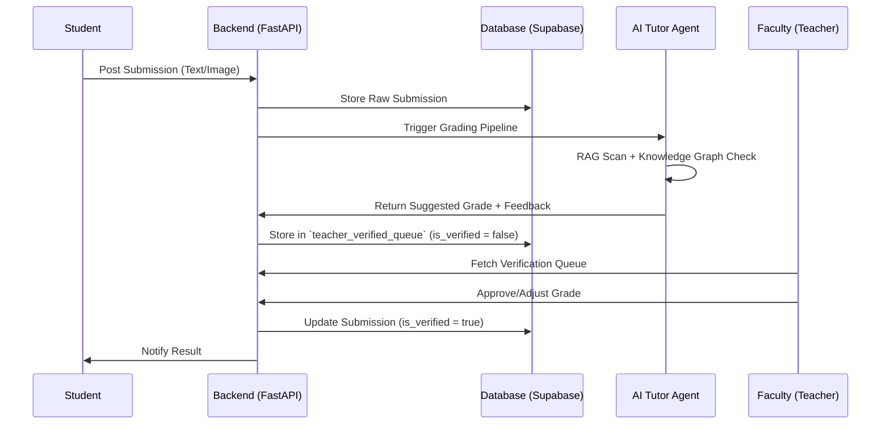

# DATA_FLOW

## 📝 Scenario: AI-Assisted Assessment Grading

This flow describes how a student submission is processed, graded by AI, and verified by a teacher.

## 🔄 Scenario: Student Onboarding & BKT Initialization
1. Student registers via **Clerk/Supabase Auth**.
2. **Onboarding Webhook** triggers backend logic.
3. System initializes **Bayesian Knowledge Tracing (BKT)** parameters for the student.
4. **Learning Pathway Agent** generates the first week's content recommendations.

---
[[PROJECT_OVERVIEW]] | [[SYSTEM_ARCHITECTURE]] | [[MODULE_MAP]]
