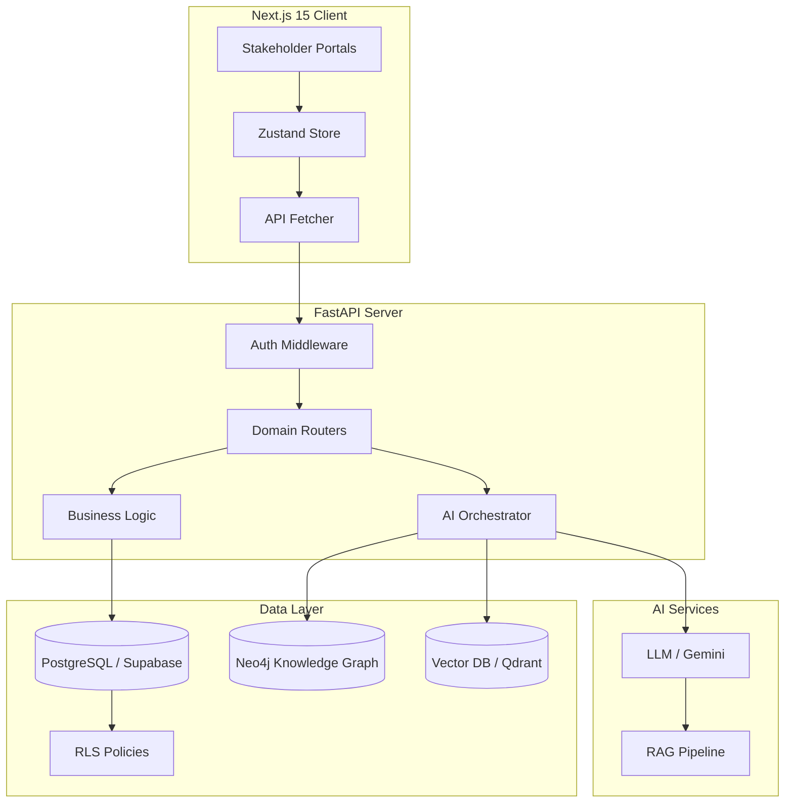

# SYSTEM_ARCHITECTURE

## 🗺 System Overview

## 🔌 API Interaction Map
- **REST API**: Standard CRUD operations via FastAPI.
- **WebSocket**: Real-time tutor interactions and grading notifications.
- **MCP (Model Context Protocol)**: Specialized protocol for agent-to-system communication.

## 🛡 Security Layer
- **Identity**: Supabase Auth (JWT).
- **Authorization**: Row Level Security (RLS) + Custom Python Middleware.
- **Verification**: Teacher-in-the-loop for all AI-generated content.

---
[[PROJECT_OVERVIEW]] | [[DATA_FLOW]] | [[MODULE_MAP]]
