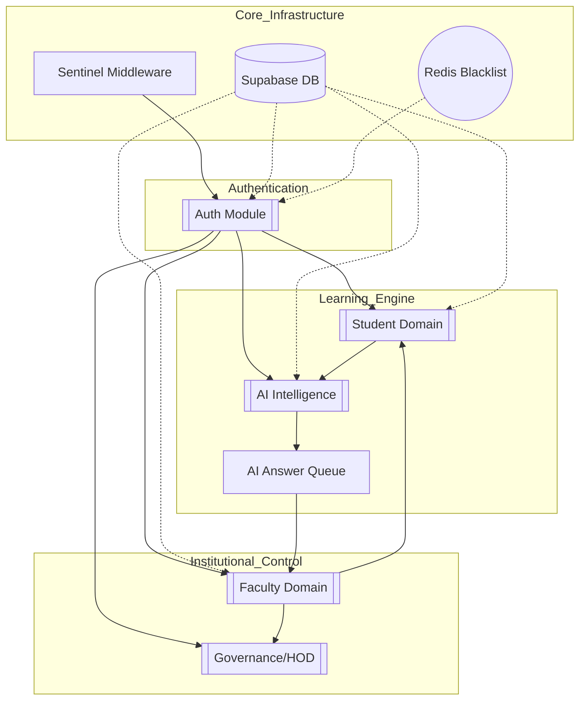

# System Dependency Map

This map identifies critical paths and functional dependencies across the Lumina ecosystem. Use this to identify single points of failure.

## 🕸 Dependency Graph

## 🚨 Critical Nodes (High Risk)

| Component | Why it is Critical | Impact Radius |
| :--- | :--- | :--- |
| **Sentinel Middleware** | Every request passes through here (L5 Security). Failure blocks all users. | System-wide |
| **Supabase Client** | Primary data persistence. Client failure drops all stateful operations. | System-wide |
| **AI Answer Queue** | Bridge between student queries and teacher verification. Loop errors break AI flow. | AI, Faculty |
| **JWT Blacklist (Redis)** | Required for secure logouts. If Redis fails, tokens cannot be revoked. | Security |

## 🔄 Flow-Critical Paths
1. **User Auth Path**: UI -> Core Middleware -> Auth Router -> User Store -> Supabase.
2. **AI Tutoring Path**: Student Dashboard -> AI Router -> ai_answer_queue -> Background Runner -> Teacher Dashboard.
3. **Approval Cascade**: Teacher Grading -> HOD Verification -> Admin Resolution -> Student Dashboard.

---
[[START_HERE]] | [[IMPACT]] | [[DECISION_FLOW]]
