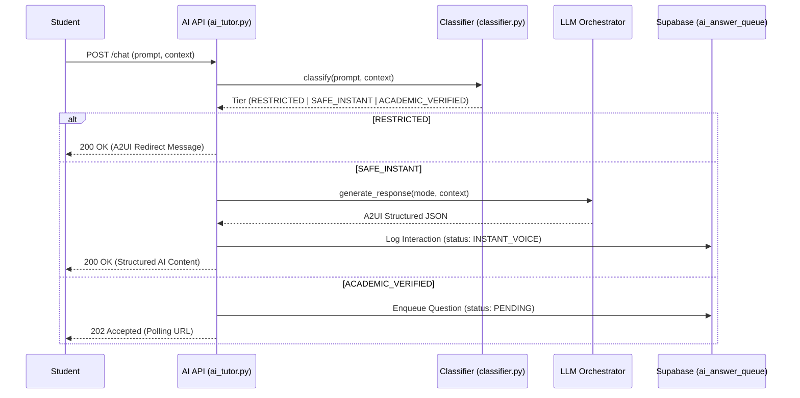

# AI: System Flow & A2UI Protocol

The AI interaction flow is governed by the A2UI (Agent-to-UI) protocol, ensuring consistent structured outputs across different learning modes.

## 🔄 AI Orchestration & Routing Flow

## 🛤 Full System Traceability

| Feature | Component | Implementation Reference |
| :--- | :--- | :--- |
| **Input Analysis** | Tier Routing | `classifier.py -> classify` |
| **AI Strategy** | Explanation Mode | `ai_tutor_store.py -> get_response` |
| **Protocol** | A2UI Exchange | `ai_tutor.py -> _ensure_serialized_response` |
| **Mastery Tracking** | Logic Persistence | `academic_store.py -> update_mastery` |
| **Governance** | Audit Trail | `ai_tutor.py -> build_tutor_response_payload (L186)` |

## ⚙️ A2UI Protocol Verification
- **A2UI Schema**: Every AI response MUST contain a `flow` array and a `meta` object.
- **Mastery Integrity**: `mastery_gain` in `meta` must be between `1.0` and `5.0`.
- **Traceable Check**: Verified in `ai_tutor.py` through `_extract_meta()` call logic.
