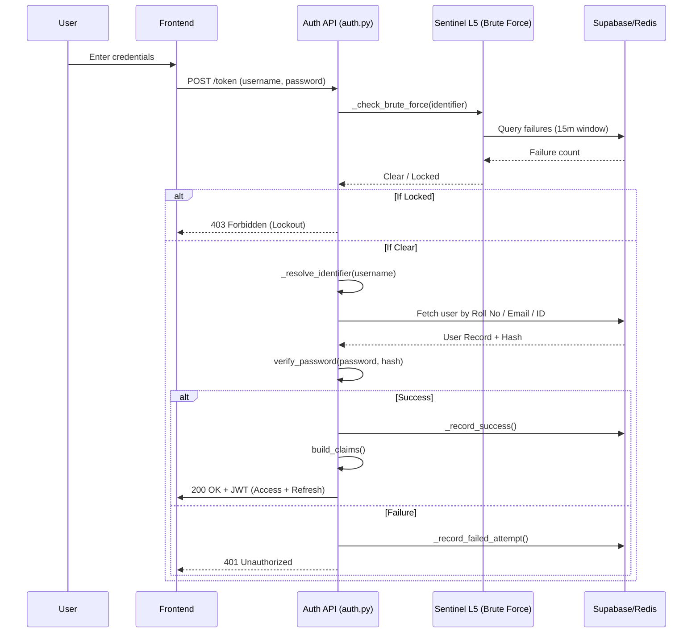

# Auth: System Flow & Lifecycle

The authentication lifecycle follows a strictly traceable sequence from the UI to the database, ensuring state integrity across the login and onboarding phases.

## 🔄 Login & Token Issuance Flow

## 🛤 Full System Traceability

| Step | Component | Implementation Reference |
| :--- | :--- | :--- |
| **1. Request** | UI / Frontend | `AuthForm.tsx` (calls `/api/token`) |
| **2. Protection** | Sentinel L5 | `auth.py -> _check_brute_force` |
| **3. Resolution** | Identifier Logic | `auth.py -> _resolve_identifier` |
| **4. Verification** | Password Logic | `auth.py -> verify_password` |
| **5. Claim Set** | JWT Logic | `auth.py -> build_claims` |
| **6. Persistence** | Database | `users` & `login_attempts` tables |

## 📈 State Machine: Onboarding
The `onboarding_status` endpoint returns a state object that the frontend uses to drive the UI:

1. **STATE_NEW**: Profile exists but no steps completed.
2. **STATE_PENDING**: Intermediate steps (1-4) completed, but not finalized.
3. **STATE_ADAPTIVE**: Core onboarding done; waiting for Initial Adaptive Assessment (Student only).
4. **STATE_READY**: Full dashboard access granted.

## 🛡 Brute-Force Sequence (Sentinel L5)
1.  **Failure Event**: User fails login.
2.  **Audit**: Backend execution of `_record_failed_attempt`.
3.  **Threshold Enforcement**: 
    - `> 5 attempts`: Warn and require cooling period (Check [auth.py:L142](file:///Users/chepuriharikiran/Desktop/github/lumina-ai-learning/backend/app/routers/auth.py#L142)).
    - `> 12 attempts`: Hard lockout for 1 hour.
4.  **Flow Block**: `_check_brute_force` returns `True`, triggering a 403 response before any password verification occurs.
