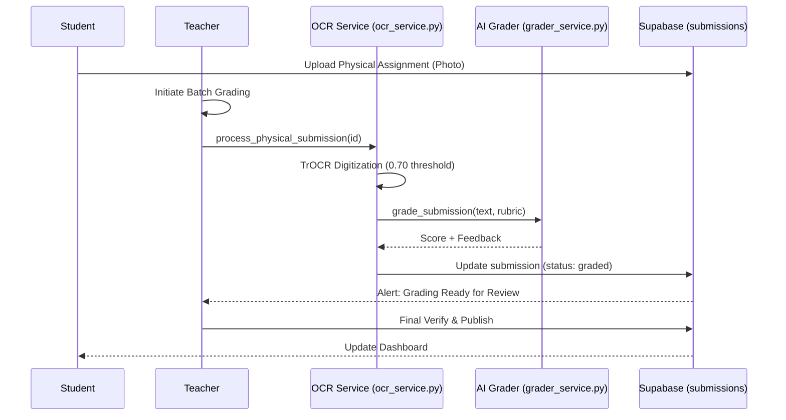

# Faculty: System Flow & Oversight

The faculty flow ensures that AI-automated grading and student monitoring are always subject to human verification and intervention.

## 🔄 OCR Assignment & Grading Flow

## 🛤 Full System Traceability

| Feature | Component | Implementation Reference |
| :--- | :--- | :--- |
| **Digitization** | TrOCR Logic | `ocr_service.py -> digitize_image` |
| **Assessment** | AI Evaluation | `grader_service.py -> grade_submission` |
| **Orchestration** | Batch Processing | `teacher.py -> process_physical_submission` |
| **RBAC** | Role Verification | `teacher.py -> check_teacher_role` |
| **Intervention** | Risk Alerts | `teacher.py -> get_teacher_dashboard (active_alerts)` |

## ⚙️ Live Intervention Protocol
- **Detection**: Student profile mastery falls below the "urgent" threshold (45%).
- **Signal**: `personalization.get_interventions` identifies the gap.
- **Action**: Dashboard generates a "warning" alert linked to [teacher.py:L131](file:///Users/chepuriharikiran/Desktop/github/lumina-ai-learning/backend/app/routers/teacher.py#L131).
- **Resolution**: Teacher updates intervention status via `PATCH /api/teacher/interventions/{id}`.
