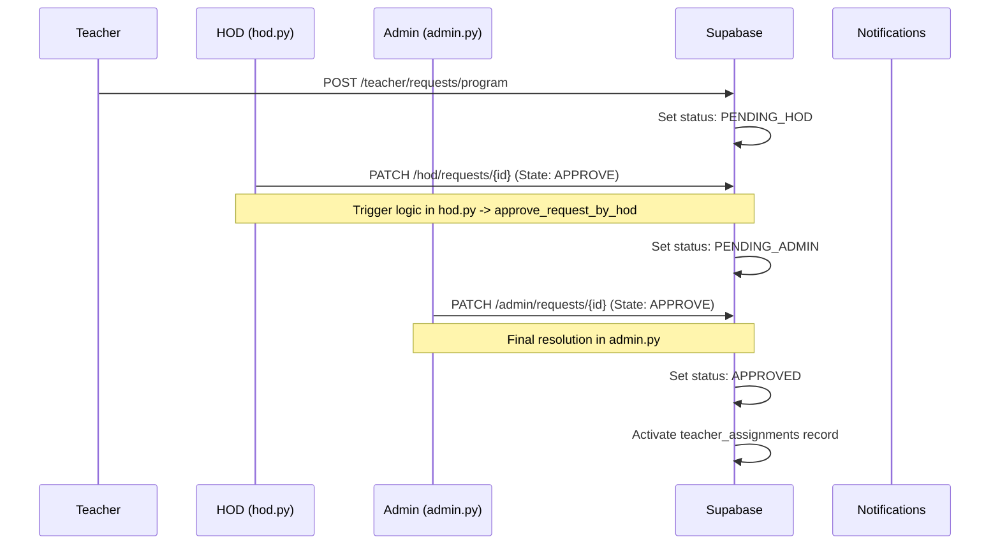

# Academic Governance: Resource Approval Flow

The governance flow ensures that high-impact academic changes (e.g. teacher assignments) are subject to a verifiable multi-stage approval audit trail.

## 🔄 Approval Cascade Flow

## 🛤 Full System Traceability

| Stage | Component | Implementation Reference |
| :--- | :--- | :--- |
| **Request** | Teacher Store | `teacher_store.py -> create_assignment_request` |
| **HOD Gate** | HOD Router | `hod.py -> approve_request_by_hod` |
| **Admin Gate** | Admin Router | `admin.py -> finalize_assignment` |
| **Validation** | RBAC Logic | `hod.py -> check_hod_role` |
| **Persistence** | State Sync | `teacher_requests` table updates |

## ⚙️ Governance Verification
- **Test Command**: `pytest tests/test_governance_flows.py` (Verify that an Admin cannot approve a request that hasn't passed the HOD gate).
- **Manual Verification**: Observe the `status` column in the `teacher_requests` table transition from `PENDING_HOD` -> `PENDING_ADMIN` -> `APPROVED`.
