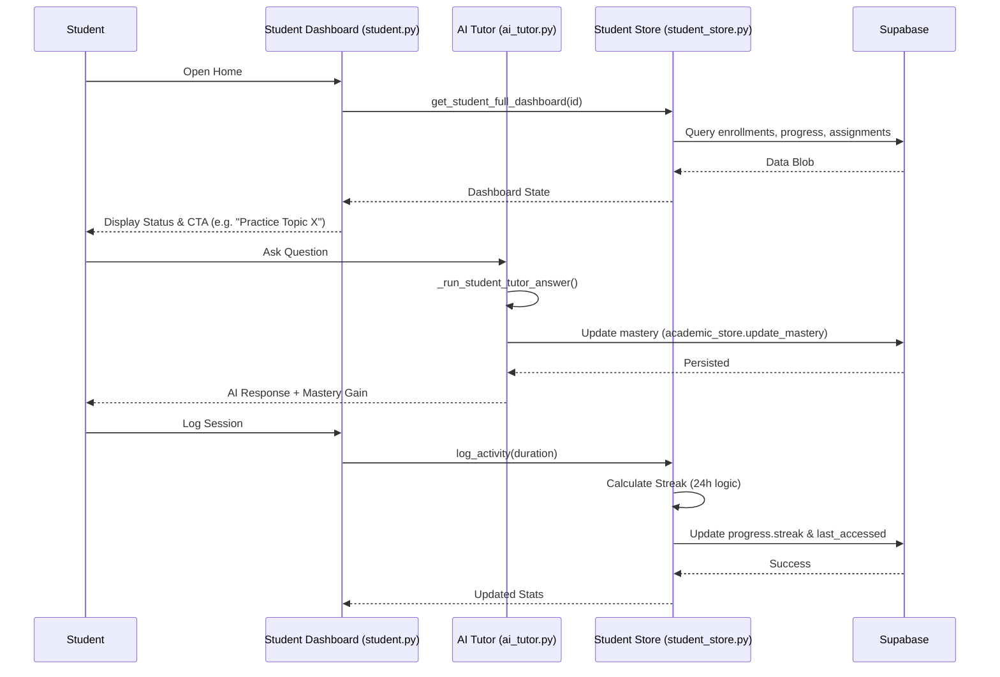

# Student: System Flow & Learning Loop

The student learning lifecycle is a closed-loop system where activity drives personalization and AI intervention.

## 🔄 Daily Learning Lifecycle

## 🛤 Full System Traceability

| Stage | Feature | Implementation Reference |
| :--- | :--- | :--- |
| **Discovery** | Dashboard | `student.py -> get_student_dashboard` |
| **Action** | Tutoring | `student.py -> ask_tutor` |
| **Logic** | AI Orchestration | `student.py -> _run_student_tutor_answer` |
| **Persistence** | Data Layer | `student_store.py -> log_activity` |
| **Reward** | Achievements | `student.py -> _build_achievement_summary` |

## ⚙️ Streak Logic Verification
- **Test Command**: `pytest tests/test_student_store.py` (Verify `delta` boundary conditions: same-day, next-day, and gap-day).
- **Manual Verification**: Check `last_accessed` date in Supabase `enrollments` table after activity logging.
