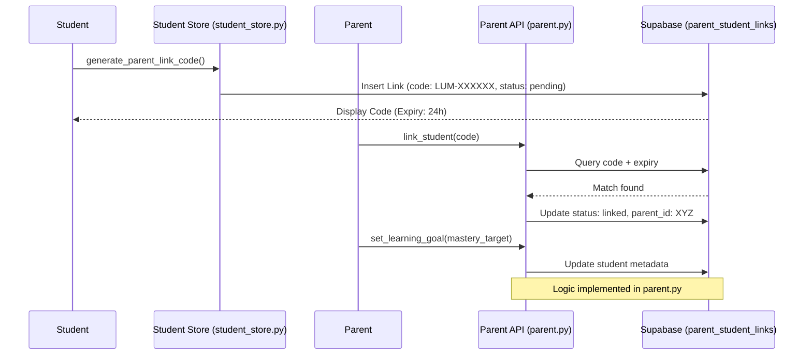

# Student Support: System Flow & Advocacy

The support flow centers on the parent-student linking protocol, enabling external oversite and goal-oriented learning.

## 🔄 Parent Linking & Goal Support Flow

## 🛤 Full System Traceability

| Feature | Component | Implementation Reference |
| :--- | :--- | :--- |
| **Generation** | Code Logic | `student_store.py -> generate_parent_link_code` |
| **Activation** | Linking Logic | `parent.py -> link_student` |
| **Advocacy** | Goal Setting | `parent.py -> set_learning_goal` |
| **Persistence** | Data Layer | `parent_student_links` & `users.metadata` |

## ⚙️ Support Integrity
- **Code Security**: Link codes use a high-entropy 6-character alphanumeric generator found in [student_store.py:L219](file:///Users/chepuriharikiran/Desktop/github/lumina-ai-learning/backend/app/store/student_store.py#L219).
- **Verification**: `parent.py` enforces that a parent can only set goals for students they are explicitly linked to.
