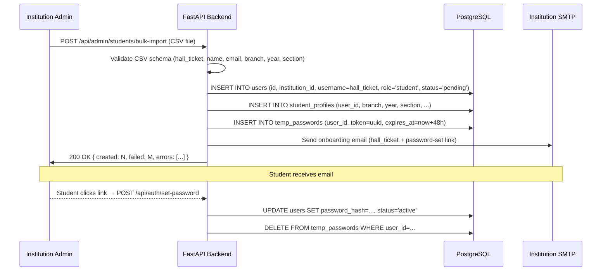

# User Registration Flow

> **File:** `04-data-flow/01-user-registration-flow.md`
> **Related:** [[04-data-flow/00-data-flow-master]], [[06-auth/01-auth-overview]], [[02-roles/02-institution-admin]]
> **Last Updated:** 2026-04-15

How new user accounts are created, verified, and activated across all roles.

---

## Actors

Institution Admin (creates accounts), Super Admin (creates IA accounts), user (sets password on first login)

## Preconditions

- Institution already exists in `institutions` table
- For students: department and academic year are configured

## Student Bulk Import Flow



## Single Account Creation (Teacher / HOD / Faculty)

1. IA or HOD → Admin Panel → "Add User"
2. Fill: name, email, role, department (for Teacher/Faculty/HOD)
3. `POST /api/admin/users` — creates user with `status = 'pending'`
4. Activation email sent with password-set link (48h TTL)
5. User clicks link → `POST /api/auth/set-password` → account active

## Input Data

| Field | Source | Validation |
|---|---|---|
| `institution_id` | JWT (extracted by dependency) | Must exist in `institutions` |
| `username` | hall_ticket (student) or email prefix (staff) | Unique within institution |
| `email` | CSV or form | Valid format; unique within institution |
| `role` | Form dropdown | Must be a valid role for the creating user's authority |
| `department_id` | Form dropdown | Must belong to same institution |
| `year` | CSV | Integer 1–4 |
| `branch` | CSV | Must match configured branches |

## Output Data

On successful creation, the route returns:
```json
{
  "user_id": "uuid",
  "username": "string",
  "email": "string",
  "role": "string",
  "status": "pending",
  "activation_link_expires_at": "datetime"
}
```

## Error Paths

| Error | HTTP code | Handling |
|---|---|---|
| Duplicate username within institution | 409 | Skip row in bulk import; include in error list |
| Duplicate email within institution | 409 | Skip row; include in error list |
| Invalid role for creating user's authority | 403 | Reject entire request |
| CSV malformed | 400 | Reject with row-level error details |
| SMTP send failure | 500 | Account created; re-send email queued for retry |

## Data Transformations

- `password` is never stored in plaintext; bcrypt hash (cost=12) stored in `users.password_hash`
- `hall_ticket` is normalised to uppercase before storage
- `email` is lowercased before storage and uniqueness check
