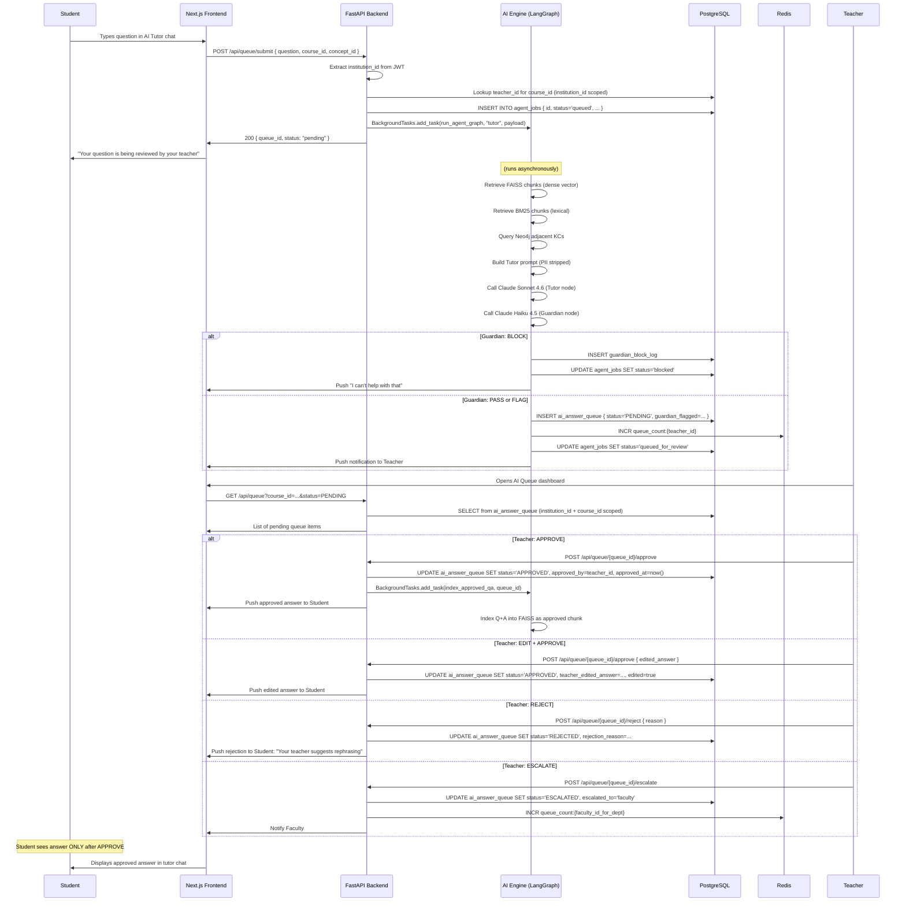

# AI Agent Job Flow (TILA Pattern)

> **File:** `04-data-flow/04-ai-agent-job-flow.md`
> **Related:** [[03-agents/02-tutor-agent]], [[03-agents/06-agent-orchestration]], [[08-features/04-ai-tutor]]
> **Last Updated:** 2026-04-15

The full data flow for the Teacher-Initiated LLM Approval (TILA) pattern — Lumina's defining architectural feature.

---

## Summary

A student asks a question. The AI generates an answer. The answer waits in a queue. A Teacher reviews and approves. Only on approval does the student see the answer. This is the TILA pattern. It is non-negotiable.

## Actors

Student, FastAPI Backend, AI Engine (LangGraph), Teacher, PostgreSQL, Redis, FAISS/BM25/Neo4j

## Preconditions

- Student is enrolled in the course
- Course has a Teacher assigned (`course_teacher_assignments` row exists)
- Course content is indexed in FAISS and Neo4j

## Step-by-Step Flow



## Database State Machine

```
PENDING → APPROVED   (Teacher/Faculty/HOD action)
PENDING → REJECTED   (Teacher/Faculty/HOD action)
PENDING → ESCALATED  (Teacher action → moves to Faculty)
ESCALATED → APPROVED (Faculty/HOD action)
ESCALATED → REJECTED (Faculty/HOD action)
ESCALATED → ESCALATED (Faculty action → moves to HOD)
* → FAILED           (AI Engine error)
* → BLOCKED          (Guardian blocks; never enters queue)
```

## Redis Usage

`queue_count:{user_id}` is an integer key tracking how many PENDING items are in each Teacher's/Faculty's queue. It is used only for the badge count on the dashboard. Actual queue data is always read from PostgreSQL, never from Redis.

## Post-Approval Indexing

When an answer is approved, the Q+A pair is indexed into FAISS as an approved knowledge chunk. The next student who asks a similar question will retrieve this approved answer as RAG context, improving the Tutor Agent's response quality over time. This is the mechanism by which Lumina's knowledge base grows organically.

## Key Constraint

There is no bypass for the TILA queue. No configuration flag, no "trusted AI" mode, no admin override. The queue exists in the database schema enforced at the SQL layer. The only way an answer reaches a student is through a row with `status = 'APPROVED'` set by a human user with Teacher, Faculty, or HOD role. This is not a UI restriction — it is a data model constraint.
