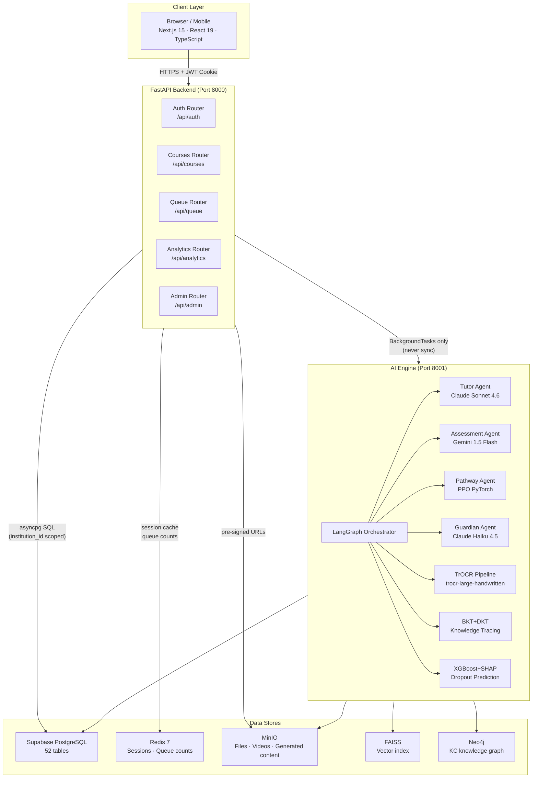
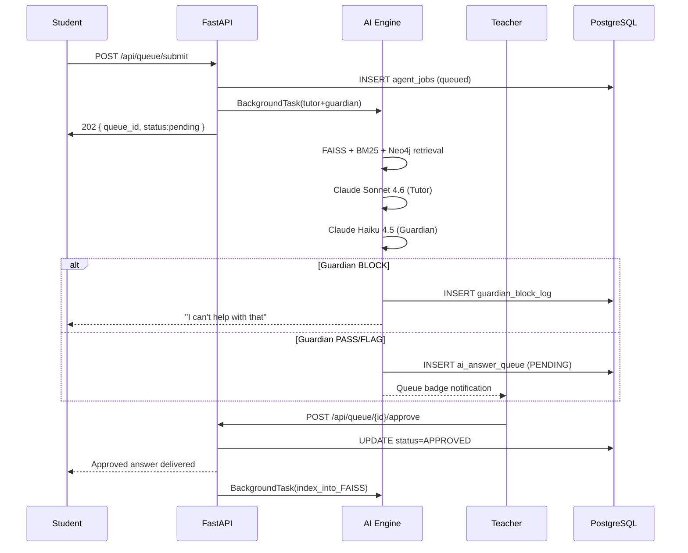

# System Overview Diagram

> **File:** `10-diagrams/01-system-overview.md`
> **Related:** [[01-architecture/01-system-architecture]], [[01-architecture/02-component-map]]
> **Last Updated:** 2026-04-15

Full system diagram for Lumina LMS in Mermaid format.

---

---

## TILA Queue Flow Diagram

