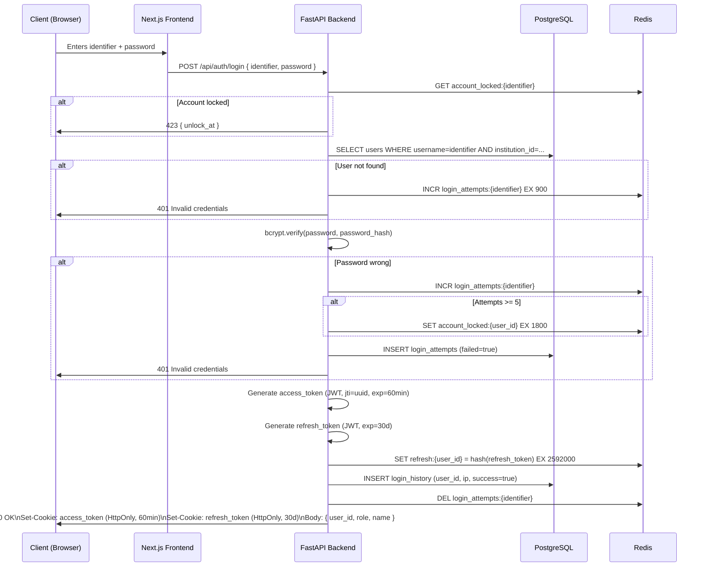
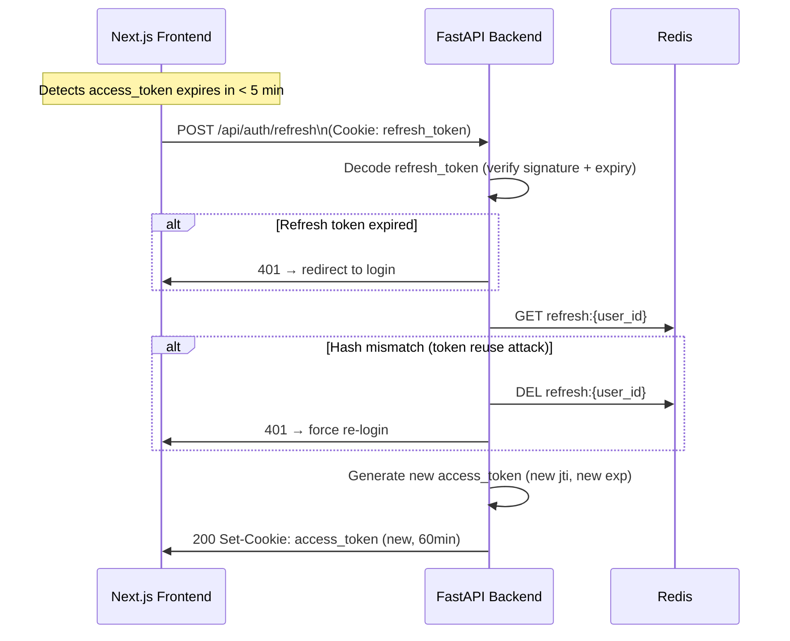
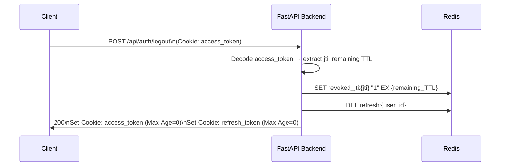
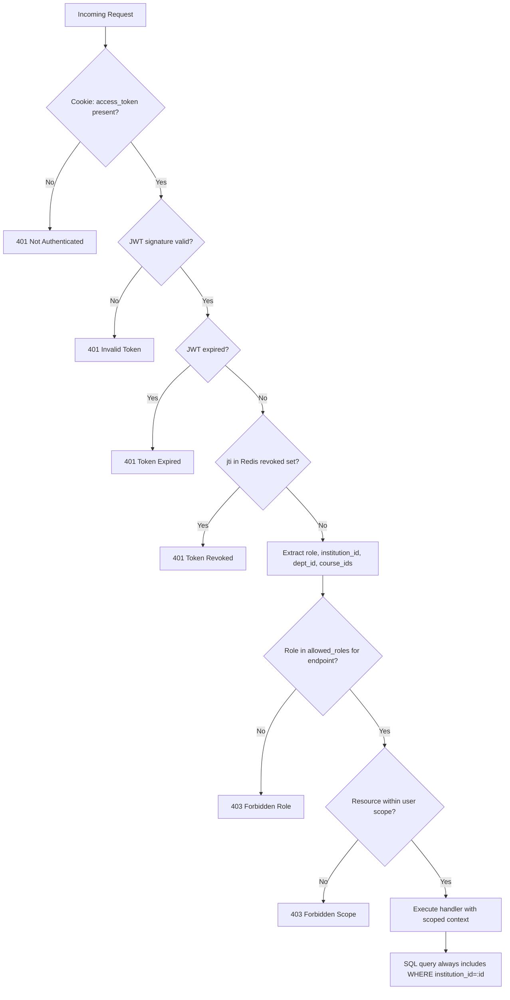

# Auth Flow Diagram

> **File:** `10-diagrams/02-auth-flow.md`
> **Related:** [[06-auth/03-jwt-flow]], [[06-auth/04-session-management]]
> **Last Updated:** 2026-04-15

Mermaid sequence diagrams for the complete authentication lifecycle.

---

## Login Flow

---

## Token Refresh Flow

---

## Logout Flow

---

## Role-Scoped Request Validation

