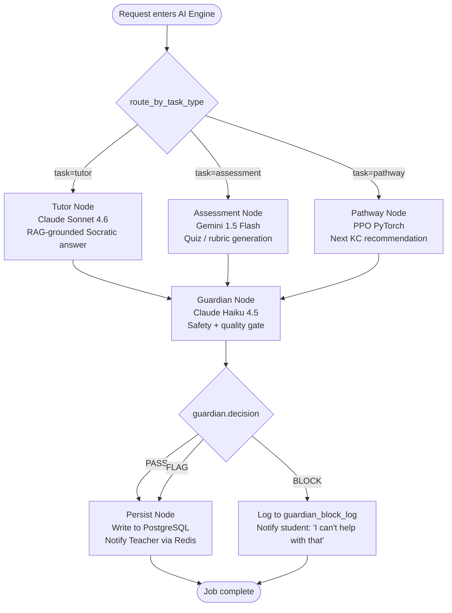
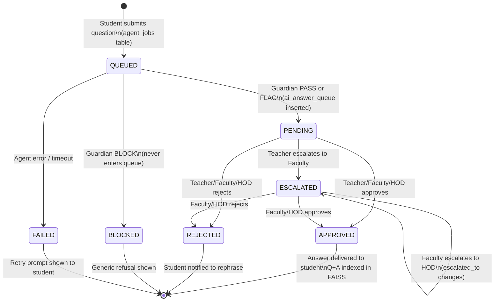
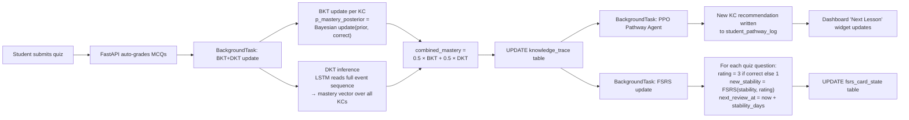
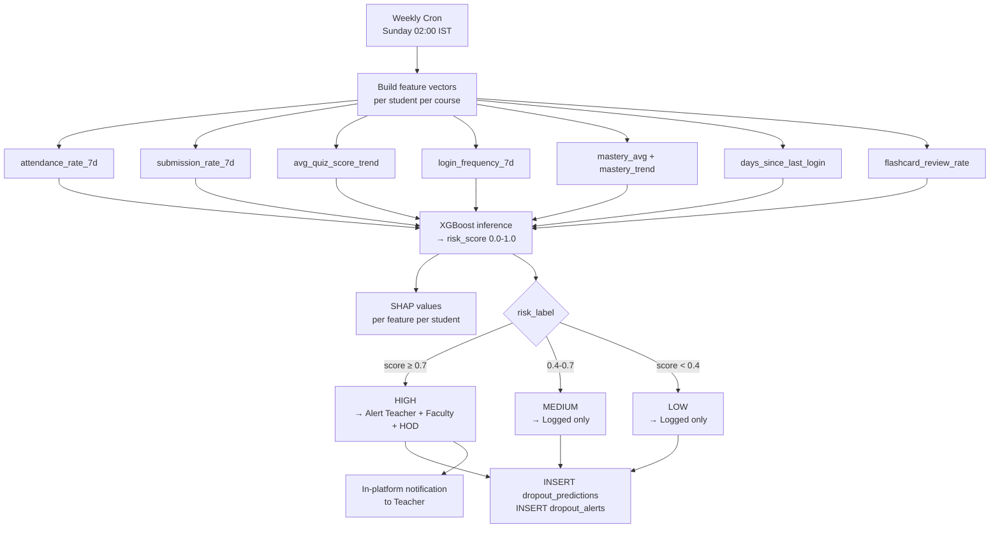

# Agent Job Flow Diagram

> **File:** `10-diagrams/03-agent-job-flow.md`
> **Related:** [[03-agents/06-agent-orchestration]], [[04-data-flow/04-ai-agent-job-flow]]
> **Last Updated:** 2026-04-15

Mermaid diagrams for the LangGraph agent graph and the full TILA queue state machine.

---

## LangGraph Agent Graph

---

## AI Queue State Machine

---

## BKT+DKT Knowledge Trace Update

---

## Dropout Prediction Pipeline

