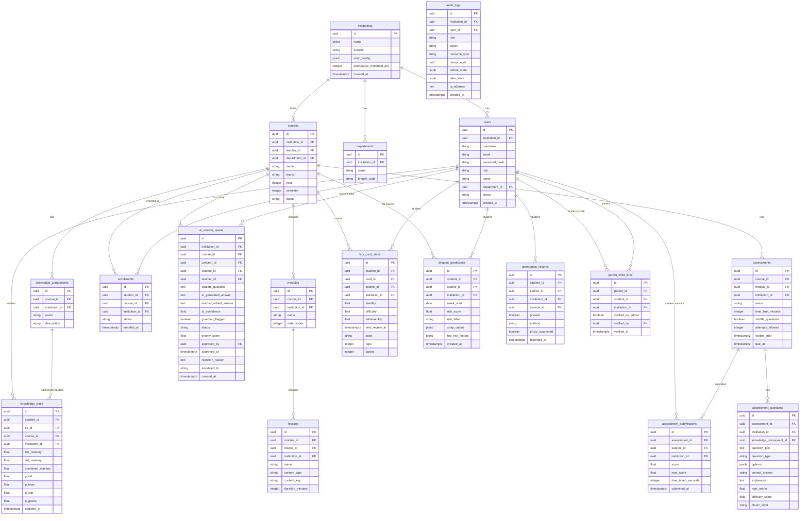

# Data Model Diagram

> **File:** `10-diagrams/04-data-model.md`
> **Related:** [[01-architecture/01-system-architecture]], [[01-architecture/03-infrastructure]]
> **Last Updated:** 2026-04-15

Entity-relationship diagram for the core tables in Lumina's 52-table PostgreSQL schema. Only primary relationships shown — all tables carry `institution_id` as a scoping foreign key.

---

## Core ERD

---

## Key Relationship Notes

**Every table has `institution_id`** — the schema enforces multi-tenancy at the table level, not just the application level.

**`ai_answer_queue.status` is the TILA gatekeeper** — student can only see the row contents when `status = 'APPROVED'`. The API layer enforces this: `GET /api/tutor/history` only returns rows where `status = 'APPROVED' AND student_id = :current_student_id`.

**`audit_logs` has no `UPDATE` or `DELETE` path** — enforced by PostgreSQL RLS. It is append-only by design.

**`parent_child_links.verified_by_admin` must be `TRUE`** — any parent query that joins to student data first checks this condition. The API `GET /api/parent/child/{id}` fails with 403 if the link is unverified.

**`knowledge_trace` has one row per (student, kc, course)** — this is the central data structure for the entire adaptive learning system. BKT updates modify `bkt_mastery`; DKT updates modify `dkt_mastery`; `combined_mastery` is recomputed on every update.
